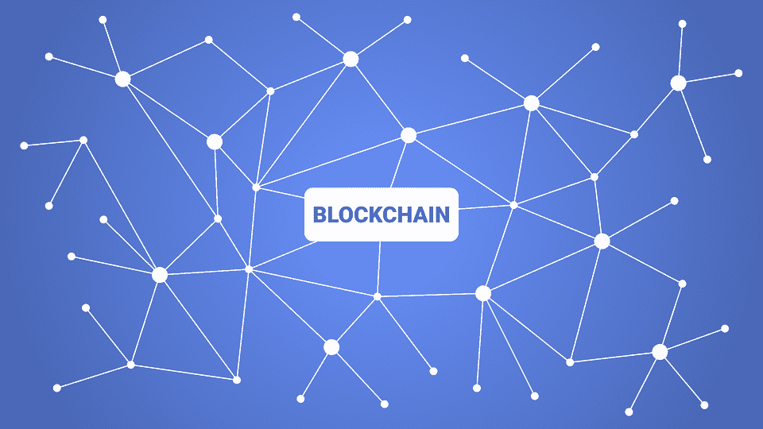

# 区块链:通往天堂的阶梯还是通往地狱的高速公路？

> 原文：<https://medium.com/hackernoon/blockchain-stairway-to-heaven-or-highway-to-hell-6e1eae22be6>

> 这篇文章是由我们的客座作家尼尔什·阿加瓦尔写的。

区块链是一个简单的概念，但实施起来很困难。它有可能从根本上改善治理、资金、农业和几乎所有其他方面，尤其是在发展中国家。

## 当人们谈论区块链时，有五点基本上需要理解:

*   这是一个由经济交易组成的数字分类账，可以通过编程记录任何有价值的东西，而不仅仅是金融交易。
*   区块链是不可变的，也就是说，要侵入区块链网络，需要巨大的计算能力。
*   它是共识驱动的，网络上发生的每一笔交易都是真实的，所有参与者对分类账的状态达成共识。工作证明、股权证明和能力证明是区块链中使用的一些共识算法。
*   在这个系统中存在一个分散的出处，这意味着，如果一个汽车制造系统被转换成像区块链一样的账本，实际上就有可能追踪到车辆的生产日期、制造商和批次的细节。
*   区块链将在未来 25 年中以与互联网在过去 25 年中相同的方式影响我们。

每一项新技术的出现都会产生和消除一些困境。互联网确实解决了与信息、分配和交流有关的问题，但还不能解决与信任和中介有关的问题。

让我们来谈谈区块链如何围绕银行业解决这些问题。钱是什么？经济学家没有把钱定义为有形资产，而是分类账上的一个条目。

你的钱是银行资产负债表上的债务。现在银行是一个中介，是一个中央集权的机构。作为一个中央集权机构，他们有权利篡改资产负债表吗？一些审计员不允许系统中出现造假，然而我们经历了雷曼危机或华盛顿互惠银行的倒闭或最近的 PNB 骗局。使用区块链的加密货币可以充当用数学取代信任的阶梯。

# 声称区块链是一项完美、无故障的技术是不公平的，因为:

*   涉及比特币的交易，即使完全去中心化也很难规模化，速度也不如银行设计的一些电子钱包。
*   在[以太坊](https://blog.bankofhodlers.com/ethereum-smart-contracts-makes-trading-efficient/)区块链，智能合约一旦在以太坊网络上激活就不能修改。
*   要使用 Ripple Consensus Network **，**公司必须遵守许多监管义务，只有大型金融机构或企业才能做到这一点。

如果我们权衡像区块链这样的技术的利弊，无疑前者更重要。

*Jaspreet Bindra****，*** (马恒达集团前首席数字官)先生对区块链将带来一个“诚实善良，点对点经济”充满信心

就我而言，这是向全球所有银行家、监管者和政府发出的呼吁

”*非常认真地听，*

*曲子终会来到你身边*

*区块链当然是通往天堂的阶梯，而不是通往地狱的高速公路*

*本文原载于 2018 年 9 月 20 日*[*blog.bankofhodlers.com*](https://blog.bankofhodlers.com/5-points-that-are-necessary-to-understand-blockchain/)*。*

# 关于霍德勒银行

**霍德勒银行**是一家基于区块链的公司，提供确保安全防范加密盗窃的服务，提供加密信用卡和加密支持贷款。

我们即将发布我们的产品。 [*访问我们的网站成为密码世界下一个大事件的一部分*](https://www.bankofhodlers.com/) *或* [*加入我们的电报社区获取每日更新*](https://t.me/BankofHodlers) *。*