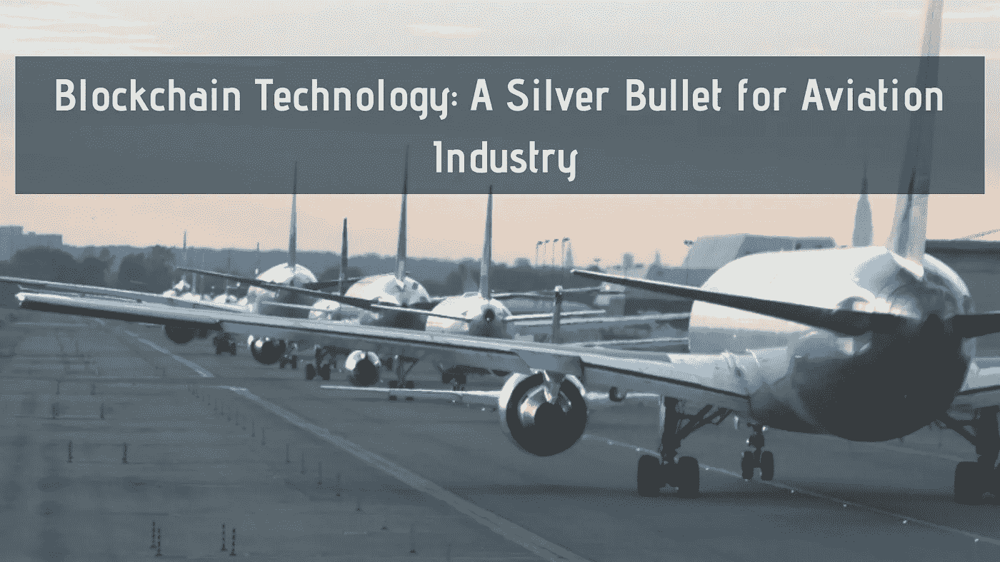

# 区块链技术:航空业的银弹

> 原文：<https://medium.com/hackernoon/blockchain-technology-a-silver-bullet-for-aviation-industry-cdc8161fd048>

工业和制造业的增长都是关于现代和先进技术的实施。服务行业正面临着客户需求的缺乏和不断增长，以及在现代技术的需求和供应之间建立平衡的需要，因此，这导致了区块链等先进技术方法的使用。好吧，如果你认为区块链只围绕交易，那么这是给你的消息。

航空业的区块链技术是这一系列的最新补充。这项技术尽管还处于起步阶段，但已经在医疗保健、制造、供应链管理、银行和金融服务等许多领域引发了一场革命。现在是航空业摩拳擦掌，用区块链技术系好安全带的时候了。区块链不能被操纵或黑客攻击，它作为一个中立的信息文档系统。

**为什么** [**区块链开发**](https://www.mobiwebtech.com/blockchain-development-services/) **服务一定是航空业所需？**

区块链技术是一种数字账本，以去中心化的方式存储信息的数字记录。这些记录可用于包含财务信息以及任何其他有价值的信息。

用于航空业的区块链技术具有多种应用能力。由于其分散化的能力，区块链将数据保存在高级记录中的特性使其在航空航天工业中非常受欢迎和安全。除此之外，客户数据、预订、支付、机场安全、移民、酒店等其他重要信息也可以存储在区块链上。

**区块链技术在航空业的用例**

**身份管理:**区块链技术可以与生物识别和移动设备一起使用，以验证乘客的身份。与在多个检查站验证物理 id 相比，这可以为乘客带来更平滑和更好的体验。

**供应链跟踪:**区块链技术可能对整个航空供应链产生有益的影响。区块链提供的共享数据库将使跟踪产品和部件从制造到实施的质量和合规性变得更加容易。

**数据安全:**区块链技术可以极大地帮助解决航空业的网络安全和隐私问题。这项技术还可以通过存储关于无人机及其操作员的信息并安全地将其分发给所有相关方，来帮助规范和管理无人机的合理使用。乘客记录以及航空公司的机组人员信息可以很容易地保持安全，以避免任何事故和身份的滥用。

**通过令牌化办理登机手续:**目前，飞机票有电子版和纸质版。随着区块链技术的实施，纸质门票的需求可以完全取消，电子门票的令牌化将通过智能合同成为可能。

**削减维护成本:**区块链技术有可能彻底改变航空公司的维护流程。从维护到修理和大修供应商到飞行操作性能监控。它还可以降低飞机维护的巨额成本。此外，航空公司可以避免浪费工作。