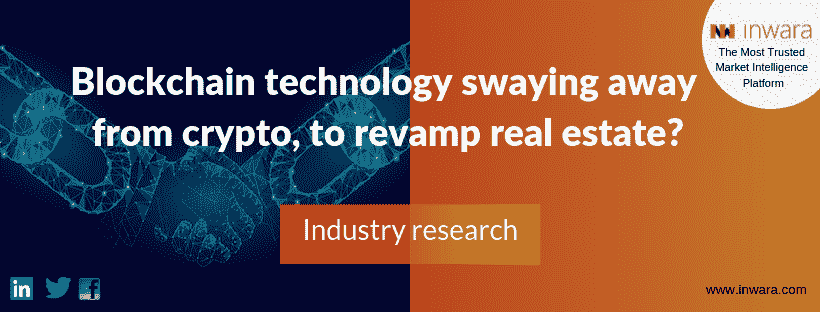
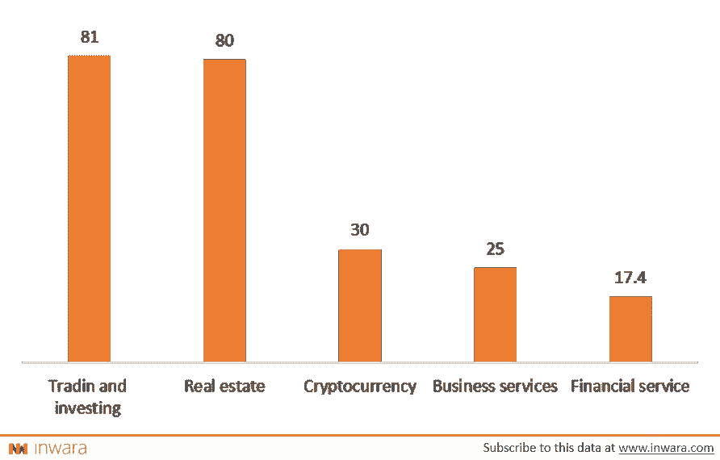

# 区块链技术摆脱加密，改造房地产？

> 原文：<https://medium.com/hackernoon/blockchain-technology-swaying-away-from-crypto-to-revamp-real-estate-b1dcd0e395f>

免责声明:这不是财务建议。文章灵感来自 [*InWara*](http://www.inwara.com/?utm_source=tzerohacker&utm_medium=tzerohacker&utm_campaign=tzerohacker) *。有关更多详情，请访问* [*条款和条件。*](https://www.inwara.com/disclaimer)

区块链与其应用之一加密货币有着广泛的联系，但这并不是这项技术的唯一用例。区块链本质上是一个数字账本，数据存储在计算机网络或所谓的节点上。这个网络上的计算机系统地检查数据，确保数据没有被篡改。区块链网络本质上为系统带来了安全性和透明性，因此可用于缺乏这些特性的部门。

## **房地产 2.0**

房地产是众多即将受到区块链技术影响的行业中最新的一个。类似于许多受低效率困扰的古老行业，房地产市场也可以受益于区块链技术固有的优势。

区块链可以实现双方之间的直接资产转移，而不需要可信的中介。在房地产领域实施区块链技术还有其他几个潜在的好处，我们已经在[上一篇文章](https://www.inwara.com/blockchain-real-estate/)中详细讨论过。

简而言之，区块链可以通过以下方式影响房地产市场

*   消除了对可信中介的需求
*   促进买方和卖方之间直接交易的平台
*   增加交易流量和交易的一般访问权限
*   消除繁琐的手续和程序
*   使交易更加安全和透明
*   消除不必要的管理费用等，从而帮助双方节省资金。

这些好处有的是固有的，有的是可编程到区块链网络中的。一些有望在未来实现的功能是真实世界资产的令牌化，以及使用智能合同促进房地产交易。

## **企业关注现实世界的应用**

企业家和开发人员通常将区块链的应用局限于加密货币，但在过去几个月里，企业带来了具有现实影响的想法。这一趋势可以从房地产、贸易和投资领域的初创企业获得的资金中观察到。2019 年 1 月，房地产区块链企业已经取代了金融服务、金融科技和加密货币等行业，目前在筹集的资金方面排名第二。

## 【2019 年 1 月各行业募集资金

[Source: InWara’s monthly report: January 2019](https://www.inwara.com?utm_source=realestatehacker&utm_medium=realestatehacker&utm_campaign=realestatehacker)

尽管市场情绪普遍低迷，但房地产初创公司筹集了令人印象深刻的 8000 万美元。仅次于融资 8100 万美元的交易和投资初创公司。有趣的是，加拿大初创公司[谢勒币](https://www.chellecoin.com/)单枪匹马在房地产领域筹集了全部 8000 万美元资本。在房地产领域的数十家初创公司中，Propy 最近实现了一个重要的里程碑，可以让人们一窥房地产交易的未来。

## [Propy](https://propy.com/)

Propy 是一家总部位于美国的区块链房地产企业，它最近成为头条新闻，因为它在以太坊智能合约的帮助下，在区块链平台上完成了第一笔住宅交易。根据 InWara 的 ICO+STO 数据库，该公司在 2017 年结束的代币销售中成功筹集了约 1300 万美元。

[福布斯](https://www.forbes.com/sites/rachelwolfson/2019/02/07/global-real-estate-platform-completes-sale-of-1m-california-home-using-blockchain-technology/#19b86efc3a92)最近发布了一份关于该房产详细信息的报告，根据该报告，该房地产资产以大约 100 万美元的价格出售，并通过智能合同进行了交易。 [Natalia Karayaneva](https://www.linkedin.com/in/karayaneva) **，**Propy 的首席执行官认为，尽管区块链令人讨厌，但它仍然是简化购买房地产的最佳解决方案。娜塔莉亚说:“在过去的二十年里，硅谷已经成为世界上最热门的房地产市场之一，这是一个完美的例子，表明在这个市场中，交易过程中的高度信任和透明度是至关重要的。

虽然仍被认为是一项新兴技术，但利用区块链是简化漫长且不透明的购房流程的最佳可靠方式。我们期待在不久的将来促成数百宗此类交易，简化所有相关方的购房过程，”这标志着该公司启动房地产交易范式转变的雄心勃勃的计划。

Propy 完成了第一笔完全使用比特币的房产交易。这笔交易尽管具有革命性，但却将该公司描绘成只涉足使用加密货币的房地产交易。该公司现在正试图通过发布一个 [crypto 认证代理程序](https://blog.propy.com/how-to-become-a-crypto-certified-agent-da535eeb3d73)来教育代理人买家如何利用区块链，该程序允许代理人获得 cryptos 认证。尽管有这些令人难以置信的发展，区块链驱动的房地产市场仍然需要跨越一个监管雷区，才能成为普遍采用。

还有一些人认为区块链无法兑现其所有承诺，如数字资产交易平台**[*【VALR.com】*](https://www.valr.com/)*的联合创始人兼首席执行官法尔扎姆·埃萨尼。* Farzam 认为，始终需要一个可信的中介来“验证”数字令牌是否真的如令牌分销商所声称的那样由高价值物理资产支持**

****