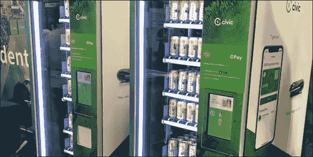

# 区块链:未来在召唤

> 原文：<https://medium.com/hackernoon/blockchain-the-future-is-calling-5c5249fd0614>

现在是 2019 年，每个人都在谈论区块链技术。称它为[时尚](https://www.forbes.com/sites/toddhixon/2018/09/17/dont-bet-the-farm-on-blockchain-its-looking-like-a-venture-fad/#5ee6000367a0)或[未来派](https://www.forbes.com/sites/geraldfenech/2018/12/15/interview-the-future-is-now-blockchain-and-beyond/#76a8fe5413ff)，区块链是这十年的流行语之一。[研究](https://thenextweb.com/hardfork/2018/09/14/juniper-research-blockchain-deployment/)显示，超过 1 万名员工的企业中有 65%正在考虑采用或已经在使用这项技术。由于媒体对比特币价格过山车的密切关注，区块链和加密货币现在成了日常对话的一部分。现在还为时尚早，像任何其他新兴技术一样，区块链正在经历繁荣和萧条周期。Gartner [表示](https://www.gartner.com/smarterwithgartner/the-irrational-exuberance-that-is-blockchain/)大多数公司仍然不能破坏性地利用 it，因为他们当前的遗留系统是集中式的。因此，较小的公司将比较大的规避风险的组织更能推动破坏性的发展。以下是我们对区块链未来的看法，以及区块链将如何影响未来。

Unbounded Registry: The blockchain equivalent of “Yellow Pages” as on 1-May-2019 ([source](https://unbounded.network/))

**区块链互通**

SE2 的 Thiru Sivasubramanian [指出](https://www.forbes.com/sites/forbestechcouncil/2018/09/06/what-does-the-future-of-blockchain-hold-10-predictions-from-tech-experts/#ee12903301ad)不同链之间的“互操作性标准化”是不可避免的。虽然将继续有多个区块链，每个都有自己的用例及目的，但最终将有一个标准协议供不同的链协作。[互操作性](https://static1.squarespace.com/static/55f73743e4b051cfcc0b02cf/t/5886800ecd0f68de303349b1/1485209617040/Chain+Interoperability.pdf)对于区块链的采用至关重要。否则，连锁店将继续各自为政，交易结算将需要第三方介入。由于 SMTP 和 HTTP 等通用协议，电子邮件和互联网被证明是颠覆性的技术。同样，区块链的变革力量也需要得到广泛应用。欧盟已经意识到了这个问题，并且[已经要求](https://drive.google.com/file/d/16_IrzddZR84hOsEV6j911gMyO6R1RQpu/view)制定一个跨链协作的标准化协议。许多项目也已经开始寻找合适的解决方案。

**代码即法律(智能合同的广泛使用)**

自然语言契约的执行是一个乏味的过程。智能合同使整个过程自动化，并确保遵守条款和条件。自从 Nick Szabo 在 1994 年首次提出智能合约以来，我们已经走过了漫长的道路。今天的智能合同[可以对实时数据做出反应](https://www.technologyreview.com/s/612443/blockchain-smart-contracts-can-finally-have-a-real-world-impact/)来执行协议条款，而不需要人工中介的干预。然而，在违反合同的情况下可能涉及仲裁，这可能使整个过程复杂化。像 [Kleros](https://kleros.io/) 这样的项目已经在智能合同上引入了争议解决层，以促进仲裁程序，从而使法律技术的未来去中心化。虽然我们距离完全取代自然语言合约还很远，但银行的[实验](https://www.coindesk.com/russias-sberbank-uses-smart-contract-to-settle-three-way-repo-deal)、[创业投资](https://www.coindesk.com/japanese-bank-nomura-invests-in-smart-contract-auditing-startup-quantstamp)和[监管举措](https://www.coindesk.com/connecticut-lawmakers-seek-to-legalize-blockchain-smart-contracts)表明，我们正朝着更广泛使用智能合约的方向发展。

**集中的 DLT 项目和许可链**

不管你喜不喜欢，大型组织和政府机构更喜欢私人区块链，在那里他们可以执行规章制度并限制公众进入。穆迪[指出](https://www.coindesk.com/bond-rating-agency-moodys-warns-on-risks-of-private-blockchains)在集中链中存在许多风险，包括更高的欺诈风险敞口。然而，这种趋势可能会持续到未来，集中的结构更倾向于集中的链。令人鼓舞的一点是，T4 政府正对区块链的好处趋之若鹜。例如，迪拜[计划](https://www.forbes.com/sites/suparnadutt/2017/12/18/dubai-sets-sights-on-becoming-the-worlds-first-blockchain-powered-government/#a6aaf2c454ba)移动所有政府流程(签证申请、账单支付等)。)到区块链。像 [IBM](https://www.ibm.com/in-en/blockchain) 、[微软](https://azure.microsoft.com/en-us/features/blockchain-workbench/)、[亚马逊](https://aws.amazon.com/managed-blockchain/)和[埃森哲](https://www.accenture.com/us-en/services/blockchain-index)这样的科技巨头已经开始为大企业和行政系统创建解决方案，以过渡到许可链。

**区块链身份**

互联网时代的一个副作用是身份安全的恶化。因此，身份盗窃和欺诈案件现在司空见惯。2017 年，[据报道](https://www.iii.org/fact-statistic/facts-statistics-identity-theft-and-cybercrime)美国有 1670 万人成为身份欺诈的受害者，168 亿美元通过身份盗窃被盗。非区块链服务使用密码和生物识别技术作为安全措施，将信息存储在易受黑客攻击的中央系统上(T2)。区块链技术对数据欺诈的弹性使其成为身份认证和验证系统的合适候选。在区块链领域，没有可供窃取的中央数据仓库。相反，安全协议会创建一个唯一的标识，并在链上进行索引。索引是一种元数据，允许用户证明他们的身份，从而保护个人信息的完整性。这一领域的机构采用已经开始成为新闻。例如，跨国企业集团江森自控[与思域](https://www.forbes.com/sites/darrynpollock/2018/12/13/vinny-lingham-we-need-real-blockchain-use-cases-as-civic-partners-with-johnson-controls/#6b3372075047)合作，试图利用区块链技术控制他们建筑中的门禁管理系统。

Blockchain-secured Beer Vending Machine by Civic ([source](https://www.coindesk.com/you-can-now-pre-order-this-15000-crypto-powered-beer-vending-machine))

**房地产和资产证券化**

令牌化是通过拥有基于区块链的令牌来拥有资产的所有权。它增加了资产的流动性，允许任何地方的任何人投资。此外，由于通过区块链系统跟踪资产历史，这在很大程度上降低了欺诈风险。[房地产](/@aXpire/tokenizing-real-estate-an-overview-39ddca7c0390)是一个很有前景的领域，可以有效地应用记号化。[研究](https://www.alta.org/press/TitleInsuranceOverview.pdf)显示 25%的标题报告存在缺陷。标记化将减少这些缺陷的实例，并使[标题搜索](https://www.forbes.com/sites/forbesrealestatecouncil/2018/06/22/will-the-power-of-blockchain-mean-the-end-of-title-insurance-companies-in-20-years/#19ae805d342a)更容易。然而，除了通常的技术挑战之外，它还涉及法律问题、税收和审计方面的复杂性。为房地产业主和潜在投资者提供不同方面的咨询。继 Propy 公司开创了区块链房地产交易的先例之后，佛蒙特州通过了一项法律，要求对区块链技术用于维护土地和公共记录进行可行性研究。这仅仅是这一领域更多事物的开始。

**改进的供应链管理**

区块链带来的最大影响之一将是物流和供应链领域。从追踪[奢侈品](https://www.coindesk.com/louis-vuitton-owner-lvmh-is-launching-a-blockchain-to-track-luxury-goods)的真伪，到追踪[婴儿食品](https://blogs.wsj.com/cio/2018/08/01/farm-to-cradle-nestle-experiments-with-tracking-gerber-baby-food-on-the-blockchain/)的篡改，再到识别[假药](https://thenextweb.com/hardfork/2019/01/18/saps-new-blockchain-project-helps-weed-out-counterfeit-drugs/)——区块链的采用已经开始加速产品可追踪能力的应用。除此之外，当产品在供应链中转手时，审计追踪有助于[在多个层面上防止腐败](https://www.weforum.org/agenda/2019/04/3-ways-blockchain-global-supply-chains/)。DHL [指出](https://www.logistics.dhl/content/dam/dhl/global/core/documents/pdf/glo-core-blockchain-trend-report.pdf)区块链通过“提高供应链透明度和自动化管理运作”来增加物流的价值。分析师[估计](https://www.marketwatch.com/story/blockchain-bitcoins-underlying-technology-could-next-disrupt-the-transportation-sector-2017-12-01)区块链在货运领域提供了 5000 亿美元的收入机会。

**金融服务革命**

Gartner 的 Ray Valdes 说:“重建一个生态系统并取代现有的参与者是创新颠覆的经典模式”。这就是区块链目前正在做的事情——通过积极的创新来破坏当前的金融服务基础设施。Franklin templet on Fixed Income Group 的数据科学家 Austin Trombley[同意](https://seekingalpha.com/article/4245581-podcast-technology-finance-future-blockchain-technology-cryptocurrencies)区块链技术将通过降低交易和结算的成本和速度来提高银行模式的效率。Ripple 的 xRapid 跨境支付解决方案已经在 12 家银行和支付服务中使用。

中本聪将比特币概念化为一种去中心化、无边界、无信任的支付解决方案。区块链技术就是为了实现从支付系统中消除第三方中介和地理边界的愿景。虽然现在接受比特币的商家不多，但接受比特币的商家数量一直在稳步增长。甚至领先的中央银行也在[试验](http://www3.weforum.org/docs/WEF_Central_Bank_Activity_in_Blockchain_DLT.pdf)区块链和数字货币。随着区块链的采用率创下历史新高，金融科技的未来将是快速而廉价的。

下一代区块链技术的开发和采用已经在进行中，这种开发更多地是在更深的协议层，而不是面向前端消费者的层面。[北岛公司的董事长格伦·哈钦斯指出](https://www.cnbc.com/2019/01/23/bitcoin-price-going-to-zero-davos-future-of-blockchain-tech-.html)“当你今天发出一封电子邮件时，你不会想到你正在使用的底层技术。”这是因为它工作得非常好。类似地，在未来，我们甚至不会意识到某个合同的成功执行或某笔交易的顺利进行是因为底层的区块链技术。这将是区块链变革力量的精髓。*无声的破坏*。

*关于作者:*

[*Rohit chatter JEE*](/@rohitchatterjee_6181)*是德州仪器公司的模拟设计工程师。* [*阿比乔伊·萨卡尔*](/@SarkarAbhijoy) *是一位银行家出身的企业家。他们是多年前失去联系的高中好友。他们在 2018 年初通过 crypto 重聚，并通过相互研究和共享知识进行投资。两人都是*[*aXpire*](http://AXPR.io)*的社区成员，并通过*[*matchbx . io*](http://matchbx.io)以自由职业者的身份撰写了这篇文章