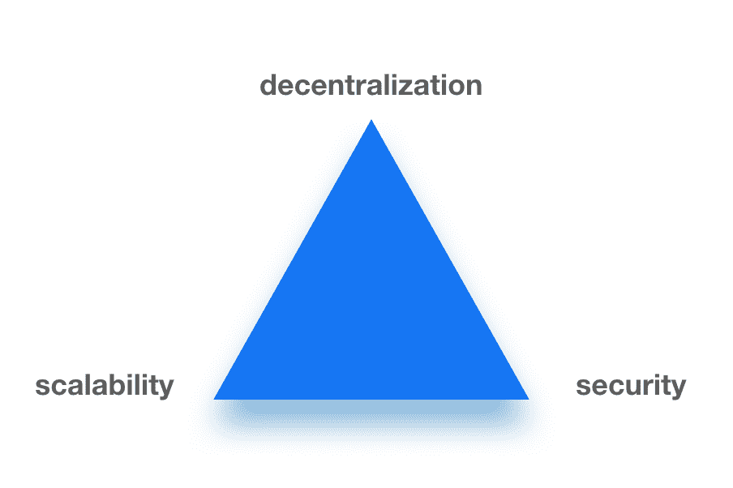

# 2019 年区块链趋势#1:弱者死亡，强者进化

> 原文：<https://medium.com/hackernoon/blockchain-trend-in-2019-1-the-weak-died-the-strong-evolved-2b4e8075f8b4>

# 1.1 区块链技术的三个核心特征至关重要

2018 年见证了区块链的清理，价格下跌，过度宣传的项目关闭或诉诸法院——这是我们长期以来等待的。但与此同时，EOS、Hyperledger、Corda 和 Stellar 等平台的务实开发者继续构建重要的东西。

2019 年，他们对领先地位的争夺将会加剧，并将重点放在适用性、互操作性和创新上。因此，我们期望这些领域的改进和最大限度地符合市场要求成为区块链技术的新趋势。

# 1.2 企业就绪型基础设施正在形成

区块链财团是第一个也是最明显的在私人机构中应用 DLT 技术的方式。在区块链之前，企业的劳动选择非常有限。他们过去常常分享关于某些市场趋势的月度/年度报告，这是非常浪费时间的。另一种选择是为 API 访问他们的企业基础设施和数据构建定制集成。这种方法总是引起人们对隐私、安全、数据泄漏和违规的担忧。因此，企业经常与封闭保守的环境联系在一起。

[另一方面，私有区块链](https://blockchain.intellectsoft.net/blog/public-vs-private-blockchain/)可以在参与者之间安全地共享必要的数据，同时避免对敏感数据安全边界的潜在危害。最近的用例包括 [We.trade](https://blockchain.intellectsoft.net/blog/roberto-mancone-at-rethink-trust/) 、BITA、MOBI 和食物链。

几乎不可避免地，区块链财团导致了专门的区块链基础设施解决方案的繁荣:AWS、Azure、IBM、Oracle、Google 等等。这一步通常被称为区块链即服务，为企业区块链基础设施、安全性、弹性和维护建立了标准。因此，随着这些标准的广泛普及，入学门槛降低了。在一系列此类发布之后，企业对区块链的特定技术解决方案大加赞赏。

最新的区块链趋势表明，BaaS 将在 2019 年继续演变，从事特定任务的新机构将会出现。我们希望即插即用模板能够解决典型的业务问题，例如:

*   个人数据管理
*   供应链跟踪
*   安全交易存储
*   和许多其他人

我们相信，这将为大规模采用提供新的动力。

因此，我们将见证区块链平台的进一步竞争、标准化和相关商业应用。不同的去中心化平台究竟是如何相互竞争的？目前，成功的标准在于针对特定目标群体的区块链三难困境的成功解决方案。

# 2019 年区块链趋势#2:解决三难问题

区块链世界的三难困境意味着在给定的三个变量——可伸缩性、去中心化和安全性——中，任何两个总是以第三个为代价取得成功。因此，与其在这个三难问题上绞尽脑汁，不如选择最佳的系统。

# 2.1 可伸缩性不再是一个问题

可伸缩性是系统在不降低其事务速度的情况下增长的能力。例如，这不是以太坊的优势之一，因为智能合约是由拥有大量用户的整个系统执行的。因此，它不能显著增加容量。竞争者试图用不同的方式解决这个问题。例如，网络可以依赖预先选择的“合格处理者”，只有当他们拥有所需的最低计算能力和良好的连接时，他们才被允许处理智能合同。EOS 以去中心化为代价增加了它的可伸缩性。

# 2.2 分权似乎是一种公平的交易

分权代表“参与[共识](https://blockchain.intellectsoft.net/blog/consensus-protocols-that-serve-different-business-needs-part-2/)的人数”各种参与者对决策机制的接触越多，破坏或滥用的可能性就越小。EOS 牺牲了它的去中心化，通过[委托利益证明](https://blockchain.intellectsoft.net/blog/consensus-protocols-that-meet-different-business-demands/)获得了更好的可伸缩性。结果，一小部分人获得了大部分权力，更容易同意对他们更有利的决策。这已经[实实在在的发生了](https://cointelegraph.com/news/eos-developer-acknowledges-claims-of-collusion-and-mutual-voting-between-nodes)。争议得到了解决，但该系统的可信度受到了严重损害。

# 2.3 安全性仍然是开发人员关注的焦点

所以，[以太坊](https://blockchain.intellectsoft.net/blog/ethereum-will-only-get-stronger-here-is-why/)依然坐在链条的顶端。作为 [Dapps](http://blockchain.intellectsoft.net/blog/blockchain-dictionary-from-a-to-z/#Dapp) 的第一个公共平台，它已经建立了一个活跃的社区，构建了一个丰富的生态系统，并且仍然是众多分散项目的蓝图。尽管许多人一直期待该项目的改进，但它并没有在三难问题的第三个参数上妥协，即安全性。[黑客偷钱](https://www.coindesk.com/2018-a-record-breaking-year-for-crypto-exchange-hacks)是不可接受的，然而却是经常发生的。无论是关注集中式加密交换还是智能合约中的错误，安全性都必须始终是 DLT 系统的重中之重。

私有区块链具有指定已知参与者的优势，这显著提高了吞吐量。它允许他们提高安全性，因为验证交易所需的识别信息是通过系统存储和处理的。这可以通过各种技术手段实现:确认手机号码、指纹扫描仪、身份证和照片识别，但这会降低公共链的可扩展性。

# 2019 年区块链技术趋势#3:创新但合规

# 3.1 我们将看到区块链应用的持续增长

2019 年对我们来说意味着什么？按照区块链科技目前的趋势，炒作会少很多，更有价值的成长会更多。该行业已经从虚幻的梦想中醒来，拂去了 ICO 的灰尘。由于区块链潜力的强行推销，公众开始厌倦这个词(甚至一家饮料公司用这个词操纵投资者！).随着区块链形象的改善，DLT 领域与加密货币的分离将逐渐扩大。

# 3.2 金融科技仍然是最热门的领域

相反，金融科技有一个明显的趋势:stablecoins 和区块链托管服务充斥着市场。闪电网络(Lightning Network)和其他侧链倡议大幅削减了交易成本，同时让更多人分享到全球经济蛋糕。它将让比特币再次变得伟大，并扩大一个真正全球化、快速和可靠的金融基础设施。随着对区块链发展的持续投资，物流和供应链也紧随其后。

# 3.3 仍然受到法律限制

此外，对区块链公司的立法压力越来越大，这反过来可能危及权力下放。一项众所周知的[【GDPR】](https://blockchain.intellectsoft.net/blog/gdpr-is-coming-but-dont-worry-weve-got-your-back/)立法保护个人数据，并规定了处理个人数据的道德准则。在这个公约下，如果一家公司试图滥用客户的数据，那么他可以联系执法机构进行调查。原来，在国外数据中心处理数据时，使用欧洲的服务而不违规是不可能的。谷歌已经因相关违法行为被罚款 5000 万欧元，但法律也对使用公共区块链进行数据处理的企业施加压力。

例如，如果您的公司使用以太坊智能合约来处理个人数据，这将被视为违反 GDPR。[分片算法](https://blockchain.intellectsoft.net/blog/sharding-technology-essentials-and-its-role-in-blockchain-for-smbs/)说明了避免这种情况的原理。独立的节点在主网络之外执行特定的交易，之后只将结果发送到区块链。

# 关于关键区块链趋势的结论

主要区块链平台和框架之间的竞争加剧了，并提供了可靠的基础设施、更好的界面和新的功能。这一区块链趋势将在 2019 年进一步推进标准化和互操作性。政府将从探索过渡到部分部署 DLT。此外，随着区块链基础设施的改善，以及服务和现成的架构模板等更多解决方案的出现，区块链的采用将保持增长。