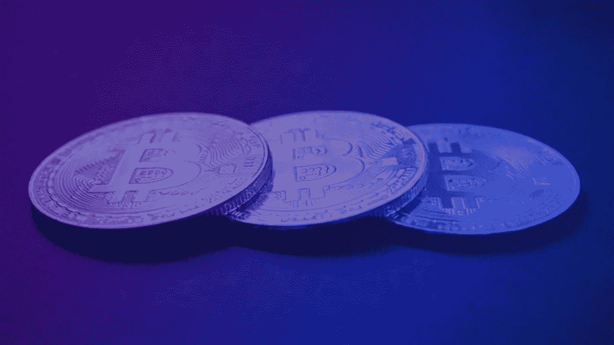
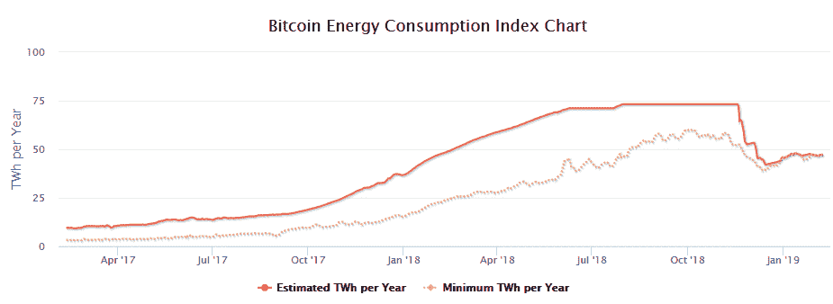
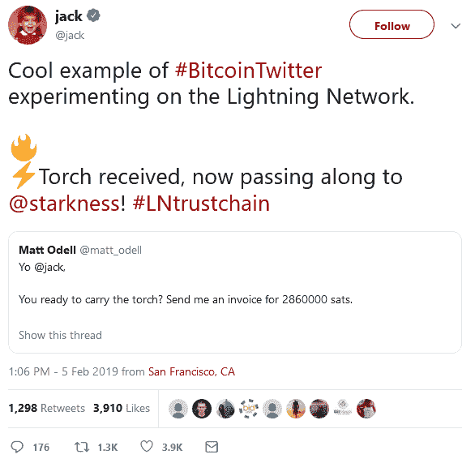

# 2019 年区块链趋势

> 原文：<https://medium.com/hackernoon/blockchain-trends-for-2019-641cedcd755a>

Find out more at www.aXpire.io

自 2019 年开始以来，时间刚刚过去，但我们已经有机会观察一些最重要的区块链趋势将如何在未来一年重塑这个空间。

2019 年可能会成为区块链历史上的“对抗”年，“战斗卡”当然很有趣。通过这篇文章，我们来看看正在讨论的几个热点话题。其中一些包括:

1.  **一个区块链统治一切 vs. 一个各具特色的区块链组合。**
2.  **PoW(工作证明)vs. PoS(利益证明)。**
3.  **可扩展性&速度与去中心化。**
4.  **STOs vs ICOs。**
5.  **Bakkt &加密货币衍生品与反机构情绪。**

对于正在快速发展的年轻行业来说，在他们的路线图中有广泛的选择是很典型的。这些迹象表明，环境是积极的和前瞻性的，它将以某种方式进行自我调整，并找到最佳做法和工作方法的标准。

你可以把它想象成一个迷宫，每一条可能的路径都代表着一种潜力；一项技术或方法，例如“我应该使用 PoW 还是 PoS？”就像迷宫一样，只有一条或有限的几条路会通向成功。事后看来，这条或那几条道路将成为不言而喻的，是解决区块链行业所呈现问题的唯一有力答案。

## *1。一个区块链统治一切* ***vs*** *利用不同特点的区块链组合。*

在这个问题上基本上有两个阵营。首先，有“最大化主义者”,他们认为所有的交易、dApps 等最终都将在一个单一的区块链上执行——这始终是他们的首选标准，例如比特币、以太坊、EOS 等。在过道的另一边，有人认为不同的任务和收养需要不同类型的区块链。这些人通常被称为“另类投资者”，支持一个或多个区块链，不一定被认为是“领先”平台。

很难说谁会赢，但事实是已经有大量的项目在不同的区块链进行。我们个人的信念是，竞争总是存在的，这最终对所有人都有利。一些区块链以绝对的分散化为中心，而另一些则专注于在特定行业内使用的公私混合。

区块链项目的范围如此之广，以至于很难就术语“区块链”的具体定义达成一致。

## 2.PoW(工作证明) **vs** PoS(利害关系证明)。

Isaac Newton’s third law: “For every action, there is an equal and opposite reaction.”

正如您可能已经知道的，在区块链空间中最有争议的话题之一是 PoW vs. PoS 这是优越的共识算法。在这场对抗中，两个领先的区块链是比特币和以太坊，BTC 利用 PoW，ETH 寻求转移到 PoS。

PoW 的支持者声称，他们的算法是真正保护网络免受恶意行为者攻击的唯一方法，能源消耗是保护网络的代价。在另一个阵营中，PoS 支持者的目标是扩展他们的区块链并限制其能耗，引用他们喜欢的算法作为实现这些目标同时保持安全性的方法。

Image Rights: [Digiconomics](https://digiconomist.net/bitcoin-energy-consumption)

以太坊市值 129 亿美元，是市值仅次于比特币的第二大区块链，它正试图从目前的 PoW 模式转向 PoS，以扩大其网络规模，并提供相当于目前每秒网络处理交易量的数倍，约为 7。

开发人员的第一步是实现君士坦丁堡分叉，为 PoS 添加重要的先决条件更改。由于发现了一个安全漏洞，这个分叉在 2019 年 1 月中旬被延迟，但很快就会再次发生。

以太坊和其他试图摆脱 PoW 的项目——或者已经摆脱 PoW 的项目——会成功吗？我们最好的选择是保持我们的眼睛和耳朵去皮，但是，我们相信牛顿第三定律，以及一个以上的共识算法的市场，具有不同的好处和缺点。每个区块链都可以专注于一个特定的目的。很有可能不会出现决定性的赢家。

## 3.可扩展性和速度 **vs** 分散化。

区块链需要扩展以适应现实世界。

如何做到这一点的想法非常不同，一些批评者声称，大多数具有高 TPS 的项目能够以网络分散化为代价扩大到那个水平，在此过程中失去了区块链的根本目的。

实现并执行的另一个想法是用第 2 层离链事务在两者之间保持平衡。认识照明网络(Lighting Network)，这是一个由 Lightning Labs 牵头的解决方案，在 2018 年花了很多个月的时间进行测试后，现在正越来越多地被采用。

LN 甚至从更广泛的加密社区之外的人那里找到了很多支持，例如 Twitter 的创始人(尽管通过 Square 参与了加密)，就在几天前，他收到了通过第二层网络发送的付款:

以太坊在碎片化、等离子体等领域有自己的扩展解决方案，但赢家尚未揭晓。

总而言之，可伸缩性、速度、去中心化和链外交易是目前整个领域最热门的话题，不仅从技术的角度来看它们很重要，而且它们对定义区块链技术的全部能力也很重要。我们很想看看这一切是如何发展的；我们自己，像大多数人一样，首先支持领养。

## 4.STOs vs ICOs

注册证券与未注册代币发行的战争可能会以没有赢家或者双方都赢而告终。

虽然越来越明显的是，证券将在区块链找到自己的位置，以降低资本成本，增加中小企业和其他经济行为体进入金融市场的机会，但 ico 可以有一个未来，也可以是围绕特定资产或平台创建完整生态系统的一种手段。

[***aXpire***](http://www.axpr.io)***在这个不断发展的科技领域进展迅速，提供广泛的产品来拦截未来的资本流动。***

我们的产品之一 CoinBX 是专为使非加密个人更容易在区块链上发行他们自己的证券或令牌而设计的，它通过提供具体的价值主张加快了整个过程并帮助了整个行业。

## **5。针对加密和反机构情绪的衍生品。**

一些纯粹主义者不希望机构投资者进入衍生产品领域，如 ETF、Bakkt 和其他产品。他们的理由包括，机构的介入会以散户投资者为代价，给股市带来更多波动。其他人欢呼的事实是，通过这些产品，人们可能更容易进入市场，允许空间更快地发展。

这两种观点背后都有合理的理由，然而，我们个人认为机构参与有利于行业的成熟和进一步发展。像其他话题一样，我们很想知道接下来会发生什么。

## 当你有机会阅读这篇文章时，有许多趋势可能会在 2019 年重新定义区块链。你认为哪个是最重要的，你支持哪个观点？让我们知道。