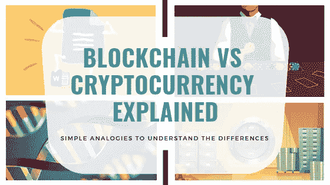
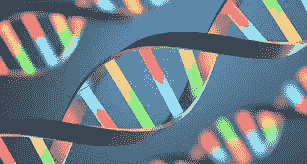

# 用 4 个简单的类比解释区块链与加密货币

> 原文：<https://medium.com/hackernoon/blockchain-vs-cryptocurrency-explained-using-4-simple-analogies-7642548af2cf>

> 如果你用过**谷歌文档**，去过**赌场**，看过一部关于**银行劫案**的好莱坞电影，或者了解过 **DNA** ，你就能了解区块链和加密货币。这些简单的类比解释了两者之间的根本区别。

公众，甚至专业人士，倾向于误解加密货币和区块链是一样的。虽然这两个小众术语在过去的一年中可能已经获得了关注，但大多数公众仍然认为它们是同义词。事实上，营销努力在很大程度上导致了该术语具体定义的松动，给那些不熟悉行业语言的人造成了更多的困惑。

这两者之间有一个根本的区别，它会直接影响到企业是否应该参与这项技术。

为了用最简单的形式突出两者之间的巨大差异，让我们来看看这些独特的区块链类比。每一种都迎合不同的人群:学生、赌徒、财务规划师，甚至生物学家。

## 谷歌文档

Image courtesy by Natalie Matthews-Ramo

解释区块链系统机制的一个简单例子是通过查看 Google Docs 的核心功能(所有功劳归于提出这个比喻的商业区块链的作者 [William Mougayar](https://www.coindesk.com/understand-google-docs-can-understand-blockchain) )。

谷歌文档的吸引力在于其高效的协作功能，允许多个用户同时查看和编辑一个文档。它减少了等待对方接收、查看、编辑和发回文件的准备时间。通常，使用的软件是微软 Word。当今世界上的大多数数据库仍然像 Microsoft Word 一样工作:一次只能由一个人访问和编辑，而其他人都被锁在外面。像谷歌文档一样，区块链通过实时更新任何变化让每个人都能看到来解决这个问题。

基于这一比喻，您可以将区块链简单地视为一种技术，一种帮助业务运营功能高效协作的强大工具。例如，在银行机构中应用区块链技术将允许在两端同时验证任何资金转移。

## 赌城风云

Image courtesy by 10bet

Ajit Kulkarni 的另一个有用的比喻向初学者解释了区块链和加密货币之间的根本区别，那就是想象自己在一个赌场里。这一过程始于将现金兑换成只能在赌场用于赌博的筹码或代币。在大楼之外，这些芯片没有合法的购买力。

在这个例子中，娱乐场筹码是加密货币硬币，娱乐场是为玩家提供参与交换和交易过程的生态系统的区块链网络。

## 保险箱库

Image courtesy by freepik

来自 CoinDesk 的 Fabricio Santos 提出了一个玻璃盒子类比来说明加密货币的透明性&去中心化特征。这种透明性是由区块链系统提供的，该系统为钱包的公共地址创建私钥。

让我们想象一个银行的巨大金库。金库里堆满了一排排没有标签的保管箱。然而，每个存款箱都有一个玻璃门面，每个人都可以看到里面的东西，但不能访问它。当一个人打开一个新的保管箱时，他会收到一把该保管箱独有的钥匙。复制钥匙不会复制盒子里的东西。同样的，即使你有钥匙，盒子也不是你的。你只能接触到里面的东西。

整个保险箱就是区块链系统，操作和显示人们将内容从一个保险箱存储和转移到另一个保险箱的活动。另一方面，加密钱包由金库中的每个保管箱示出，其内容例示了加密货币。这根本上就是基于区块链的加密货币概念。任何人都可以看到所有其他地址的内容和交易。

## 脱氧核糖核酸

Image courtesy by ScienceNews

生物学家和自然科学家也可以通过研究 DNA 在生物体中的作用来理解区块链记录和更新每一次交易的功能。[罗宾·兰吉特](/@rchauhan/the-bitcoin-blockchain-dna-metaphor-e9500333ca9f)提供了区块链和 DNA 之间的深刻关联。

像 DNA 一样，它是随着生命在地球上的扩展而传播的遗传交易和突变的记录，区块链也是交易的记录，随着越来越多的人使用加密货币，交易在互联网上传播。随着时间的推移，随着我们 DNA 的进化和新的区块被添加到区块链中，两者都变得更加复杂。

每一个区块链(比特币、以太、涟漪)都像是一个独特的物种(人类、黑猩猩等)。).区块链也可以被分叉(就像比特币现金一样)来创造一种竞争性货币，就像两个不同的物种可以拥有共同的祖先一样。

此外，就像 DNA 的变化不容易发生一样——科学家认为基因突变需要大约一百万年才能发生——建造一个区块链也不容易。进化和自然选择的过程有点像采矿，一系列复杂的步骤创造出不可思议的东西。

## 从所有这些隐喻中，大多数人经常误解的区块链和加密货币之间的明显区别是:

> 区块链是一种技术，而加密货币是它的应用

因为比特币和其他加密货币是区块链的第一个用例，人们认为它们是可以互换的。事实上，不同的硬币只是区块链技术的一种应用。这一事实应该成为公众意识，尤其是对不同行业的企业。尽管动荡的加密市场占据了中心舞台，区块链实际上可能是我们这个时代最强大的技术。像区块链这样拥有巨大增长机会的技术不应该被错过。

然而，在今天的比特币崩溃和加密寒冬中，企业还应该相信区块链吗？遵循这些[的 3 个商业关键步骤](https://pstrategic.com/what-does-crypto-winter-mean-to-businesses/)，深入当前的加密天气。

## 关于主要战略

我们是一家区块链精英商务咨询公司，专门从事 360°区块链营销服务。

在 [**主要战略**](https://pstrategic.com/services/) ，我们谈论、讨论、头脑风暴并执行营销区块链项目的创新想法。我们对区块链的广泛了解和对您业务增长的优先考虑，使我们能够为您提供量身定制的创新解决方案，推动您的业务超越这些障碍。我们专门与革命性的企业合作，如 [Tokenize Xchange](https://tokenize.exchange/) 和[世界旅行新加坡](https://wtxt.io/)。查看我们有趣的区块链项目和教育博客。

我们在社交媒体上发布区块链新闻和资源的每日更新。关注我们:
脸书|[LinkedIn](http://linkedin.com/company/principal-strategic-pte-ltd/)|[insta gram](https://www.instagram.com/principal_strategic/)|[Telegram](https://t.me/pscryptosphere)|[Twitter](http://twitter.com/LtdPrincipal)|[Youtube](https://www.youtube.com/channel/UCGI7uNK4mh6FosHYCFTOegQ/featured)

# 参考资料:

Chauhan，R. R. S. (2014 年 7 月 22 日)。比特币区块链/DNA 隐喻。*中等*。检索于 2019 年 2 月 7 日，来自[https://medium . com/@ rchauhan/the-bit coin-区块链-dna-metaphor-e9500333ca9f](/@rchauhan/the-bitcoin-blockchain-dna-metaphor-e9500333ca9f)

Kulkarni，A. (2018 年 11 月 20 日)。区块链与加密货币:两者如何相互关联。*中等*。检索于 2019 年 2 月 7 日，来自[https://medium . com/datadriveninvestor/区块链-vs-cryptocurrency-how-the-two-relate-to-other-EDF 7632 Fe 9 de](/datadriveninvestor/blockchain-vs-cryptocurrency-how-the-two-relate-to-each-other-edf7632fe9de)

LUN 平台。(2018 年 2 月 11 日)。向外行人解释区块链:玻璃盒子的类比。*中等*。检索于 2019 年 2 月 7 日，来自[https://medium . com/@ lunes . platform/explaining-区块链-11695afee9c0](/@lunes.platform/explaining-blockchain-11695afee9c0)

西穆加亚尔(2016 年 9 月 9 日)。如果你懂 Google Docs，你就能理解区块链——coin desk。 *CoinDesk* 。检索于 2019 年 2 月 7 日，来自[https://www . coin desk . com/understand-Google-docs-can-understand-区块链](https://www.coindesk.com/understand-google-docs-can-understand-blockchain)