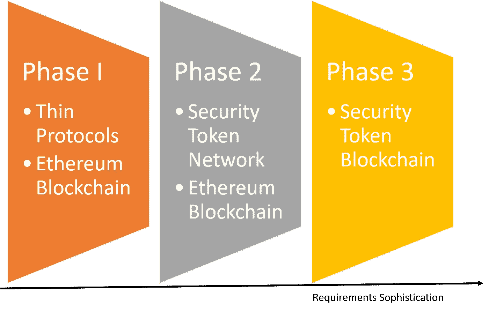
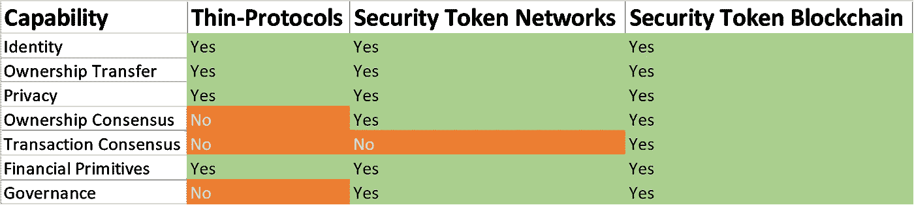

# 安全令牌中的区块链、网络、协议或幻想:第一部分

> 原文：<https://medium.com/hackernoon/blockchains-networks-protocols-or-fantasies-in-security-tokens-part-i-fa398947d8c5>

昨天，在纽约共识会议的第一天， [Polymath 宣布他们打算为数字证券](https://www.coindesk.com/polymath-teams-up-with-charles-hoskinson-to-build-a-blockchain-just-for-security-tokens)开发第一层区块链。可以说，这一宣布代表着从头开始构建针对数字证券优化的基础设施的最雄心勃勃的步骤之一。几乎从一开始我就知道这个项目，在最近的一次会议上，我提到我希望在安全令牌领域看到更多这样的努力，但我担心时机。几个月前，我发表了一篇关于这个话题的三部分文章([第一部分](https://hackernoon.com/do-security-tokens-need-a-new-blockchain-benefits-challenges-part-i-48f281f5101e)、[第二部分](https://hackernoon.com/do-security-tokens-need-a-new-blockchain-benefits-and-challenges-part-ii-de480e54c12a)、[第三部分](https://hackernoon.com/do-security-tokens-need-a-new-blockchain-benefits-challenges-part-i-48f281f5101e))，但显然，从那以后，我的想法和市场都发生了变化。虽然乍看之下，专注于安全令牌的区块链的价值主张似乎有道理，但当深入研究技术和业务层时，这一图景很快开始变得模糊。今天，我将深入探讨支持和反对安全令牌第一层区块链的论点，并在该领域的潜在发展背景下将其与替代方法相关联。

专门研究安全令牌的区块链的想法旨在消除对以太坊等分散运行时的任何基础设施依赖。区块链运行时的许多功能，如分散共识或半匿名、基于计算的信任，在新一代数字证券中强加了非常不灵活的依赖性。然而，在我们几乎不了解数字证券要求的市场中，将这些限制与新一级区块链的需求联系起来似乎有点牵强。在软件技术的历史上，最成功的基础设施趋势是那些与新的应用程序需求紧密结合的趋势。有时基础架构领先于应用程序，有时应用程序驱动基础架构，但这两种趋势彼此相对接近。在安全令牌的情况下，当前一代的加密证券几乎没有突破以太坊区块链的界限，我认为我们还不知道在这一点之后需要什么样的能力。

# 瘦协议、网络和区块链

在当前的数字证券生态系统中，有三种处理基础设施功能的基本方法:

**瘦协议:**第二层协议，在顶级区块链运行时上处理诸如合规性、身份或金融原语等功能。

**网络:**最近的努力，如出处或共生体正在寻求建立第二层网络，专门在区块链运行时之上运行的数字证券。

**区块链:** Tier1 区块链运行时，专门从事安全令牌。

从进化的角度来看，这三个不同的思想流派之间的关系可以在下图中看到。

最重要的问题是每个基础设施层可以处理数字证券的哪些功能。快速分析如下所示:

如您所见，数字证券的大多数关键基础设施构建模块都可以通过第二层网络或侧链模型来解决。如果是这样，那么第 1 层安全令牌区块链的真正要求是什么呢？在我看来，这可以归结为两个基本能力:

**共识协议:**基于身份的新共识模型，说明资产的合法转移或所有权。

**奖励:**根据网络中不同节点在安全令牌生命周期中的参与程度对其进行奖励的模型。

# 安全令牌需要新的共识吗？

这是关于安全令牌是否需要一个新区块链的争论的核心问题。诸如工作证明(PoW)或利益证明(PoS)等已建立的区块链协议依赖于昂贵的机器计算来断言特定加密资产的所有权转移。鉴于安全令牌交易在参与者身份已知的生态系统中运行，你可以证明第一层共识是过度的，它们无法实现资产所有权的合法转移。然而，你也可以用第二层区块链协议来处理这些方面。

# 安全令牌需要新的激励模式吗？

当前的安全令牌生态系统缺少强大的激励模型，因此缺乏任何长期的网络效应。安全令牌网络和区块链都可以包含奖励网络中不同参与者的激励机制。虽然激励价值主张似乎微不足道，但我们不应该低估其实施的挑战。激励模型只在规模适当的网络中起作用，否则，它们也可能成为安全攻击的主要工具。

# 从历史中学习:NOSQL 数据库运动

应用程序和基础设施之间的过渡一直是技术市场的摩擦点。dynamics 最近的一个趋势与安全令牌领域非常相似，那就是 NOSQL 和大数据趋势的发展。自 20 世纪 70 年代以来，数据库被基于行和列的关系范式所统治。在 20 世纪 90 年代和 21 世纪初，曾多次尝试引入针对键值、图表或文档等其他存储模型优化的新型数据库。这些尝试都不太成功，因为市场需求太小，公司只能在关系数据库上适应这些需求。直到最近十年，大型互联网公司面临着存储大量半结构化和非结构化数据的需求，关系数据库才遇到了瓶颈。这一转折点是 NOSQL 数据库或大数据堆栈等趋势的起源，这些趋势已成为现代技术架构的相关组件。

NOSQL 行业告诉我们的是，新的需求可以在遗留基础设施之上进行调整，直到它们变得如此相关，以至于值得创建新的基础设施。用以太坊代替关系数据库，用安全令牌区块链代替 NOSQL 数据库，你就会明白我的意思了😉

对安全令牌区块链的需求可能是数字证券市场中最热门的争论领域之一。虽然概念上的需求似乎微不足道，但市场和技术可行性并不十分明显。在以后的文章中，我将深入探讨安全令牌区块链模型的一些细节。