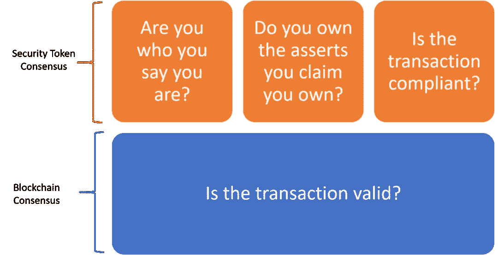
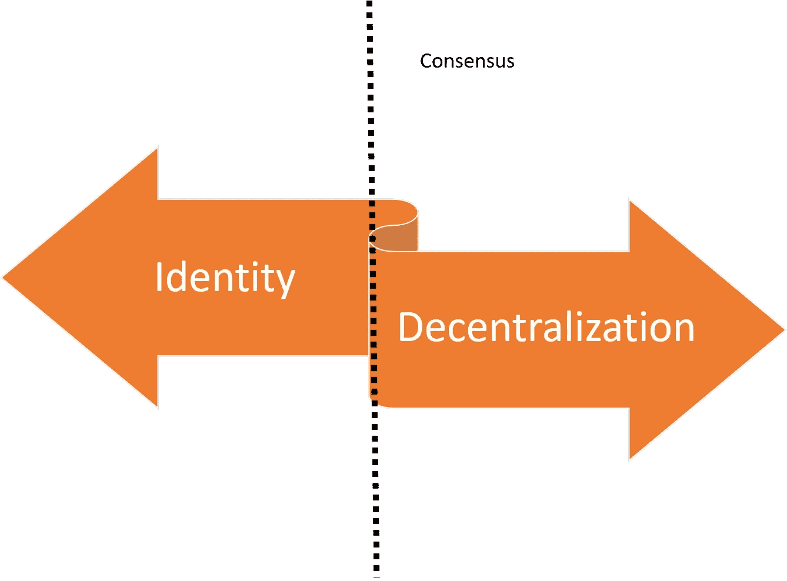
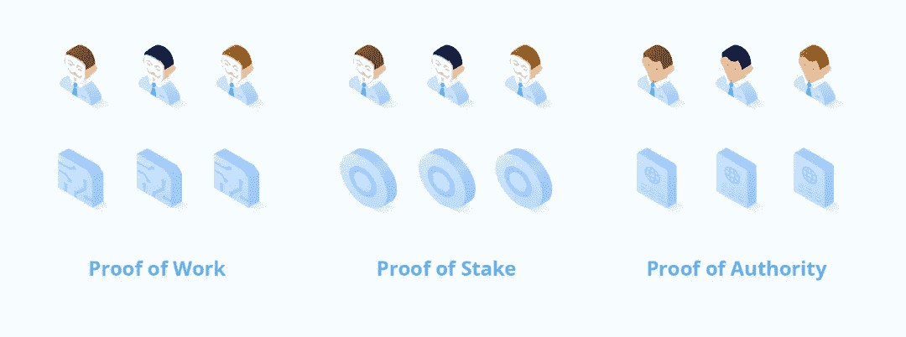

# 安全令牌中的区块链、网络、协议或幻想第二部分:共识、身份和难题

> 原文：<https://medium.com/hackernoon/blockchains-networks-protocols-or-fantasies-in-security-tokens-part-ii-consensus-identity-and-2b1a2089f7d6>

这是一篇文章的第二部分，探讨了专门研究安全令牌的一级区块链的主题。[在第一部分](https://hackernoon.com/blockchains-networks-protocols-or-fantasies-in-security-tokens-part-i-fa398947d8c5)，我们讨论了加密证券区块链相对于二级安全令牌网络或仅仅基于安全令牌协议的框架的可行性。

今天，我将深入探讨安全令牌区块链理论核心的一些生存困境，并提出该领域任何技术平台都需要解决的一系列难题。

在这一点上，很明显，安全令牌市场将会出现以太坊主网之外的新网络。像 Ownera、出处、共生体和最近宣布的 Polymesh 这样的项目已经涉足这一领域。

问题是，这些模型中的任何一个是否会发展成为第一层区块链，或者仍然是现有区块链运行时之上的第二层框架。从我的角度来看，这种区别基本上是基于安全令牌是否需要一个新的第 1 层共识协议来提交事务。

# 共识困境

探索安全令牌第一层共识的可行性是区块链论文的中心。我个人发现，许多支持和反对安全令牌共识协议的观点都缺乏一点技术和财务上的严谨性。

为了恰当地表达这一观点，让我们尝试将安全令牌共识机制分解为一系列原子原语。在双方之间的证券交易中，共识机制需要坚持四个基本步骤，以确保交易的有效性:

**身份:**你是你所说的那个人吗？

**资产所有权:**你拥有你声称拥有的东西吗？

**合规:**交易在当前监管环境下是否有效？

**有效的所有权转移:**一个记账单位能否在双方之间进行原子化安全转移？

在典型的安全令牌架构中，底层区块链层将解决交易的财务验证的一致性，而安全令牌层应在身份、资产所有权和合规性方面达成一致。

在上图中，第二层(橙色)概述的功能可以清楚地建模为针对安全令牌优化的新共识协议的一部分。我们需要回答的问题是，第一级(蓝色)是否也是该共识协议的一部分，或者仍然是底层区块链运行时的一部分。

这个问题的答案基于区块链协议的另一个生存困境:身份与权力下放。

# 身份分散的困境

现有区块链运行时中的共识协议依赖于昂贵的数学计算，以确保交易的有效性，而不依赖于中央权威机构。该模型允许用计算来代替身份，以便对事务做出断言。

如果我们从网络参与者身份的角度考虑共识协议，我们可以得出一些有趣的结论:

***命题 1:*** *在一个足够分散的系统中，关于一个主体的身份断言可以基于不同方的共识而不是基于目标主体来验证。*

前一个论题的推论告诉我们，认同和去中心化在共识模式中是对立的力量。换句话说:

***论题二:*** *在一个去中心化的网络中，共识的需求随着参与者身份数量的增加而线性下降。*

与主流区块链交互相比，安全令牌交易的一个重要区别在于，在前者中，参与者的身份是众所周知的。拥有身份层简化了安全令牌级别的一致性机制，并且在某些情况下，消除了对计算成本高昂的一致性机制的需求。

因此，我认为安全令牌区块链的支持者正在走一条非常微妙的路线。如果我们生活在一个生态系统中，所有参与者的身份都是已知的，那么你可以证明我们不需要任何形式的分散共识，如果是这样的话，我们真的需要区块链吗，或者只是某种形式的不可变账本？从政治家的角度来看，我认为答案在中间。

***论文 3:*** *安全令牌网络应该依赖于验证者之间的分散一致协议，验证者的身份是众所周知的，并且他们的信誉可以在网络中得到验证。*

[授权证明(PoA)](https://en.wikipedia.org/wiki/Proof-of-authority) 是一种依赖于一等公民身份的共识机制。在 PoA 网络中，共识是通过引用一系列验证者(当它们与物理实体相关联时称为权威)来实现的。验证者是一组被允许参与共识的账户/节点；他们验证交易和冻结。PoA 不需要解决计算量大的难题来提交事务。取而代之的是，交易只需由大多数验证人签字，在这种情况下，它将成为永久记录的一部分。

PoA 的一个变体结合了前面讨论的四个原语:身份、资产所有权、遵从性和所有权转移验证，这可能是安全令牌网络的一个好选择。然而，无论怎么想象，这都不是一个明确的答案。

尽管 PoA 共识协议有很多优点，但是它们不依赖于大型的分散网络，因此非常容易受到博弈论攻击。在安全令牌的环境中，这些漏洞甚至更加严重。

# 关于安全令牌区块链的一些棘手问题

市场是否需要专门从事安全令牌的区块链的答案与共识和身份分散困境有关。然而，还有其他非常困难的问题也需要考虑。在很大程度上，我并不声称对这些有很多明确的答案，但我认为它们应该是一个更深入辩论的主题。

1.安全令牌需要新的共识协议吗？这个我尽力回答了😉

2.**安全令牌网络需要新的激励模式吗？我倾向于说是的。**

3.**安全令牌网络有什么功能？**所有权证明共识、隐私、加密金融协议、治理、托管…

4.安全令牌区块链的最终目标是什么？我会说链上的第一个数字证券，没有链外的对等物。

5.**随着以太坊越来越好，是否可以在以太坊之上建立安全令牌网络？可能是……**

6.现有的区块链不会推出数字证券框架吗？我们应该为那场混乱做好准备…

7.**区块链财团的模型到现在还没起作用，为什么我们认为安全令牌网会起作用？**非理性乐观……

8.**构建安全令牌网络的最佳运行时间是什么？** Quorum 具有可编程性和与以太坊的兼容性，Hyperledger Fabric 在金融领域的渗透也是需要的。

9.我们有足够的知识来构建一个健壮的安全令牌区块链吗？由于市场上只有五种安全令牌在活跃交易，我更希望首先看到更好的 tier2 安全令牌网络模型，但我真的不知道。

10.**如果大型金融公司推出安全令牌网络/区块链，会发生什么？我们很可能会说这是一个坏主意😉**

区块链专注于安全令牌的想法无疑是在推动该领域的创新。尽管价值定位还远未明确，但这些项目的出现将揭示出我们目前甚至没有想到的市场的方方面面。