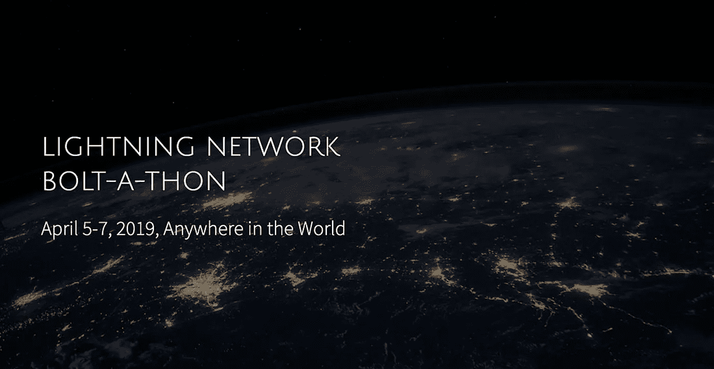
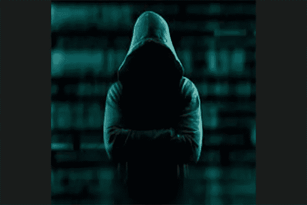
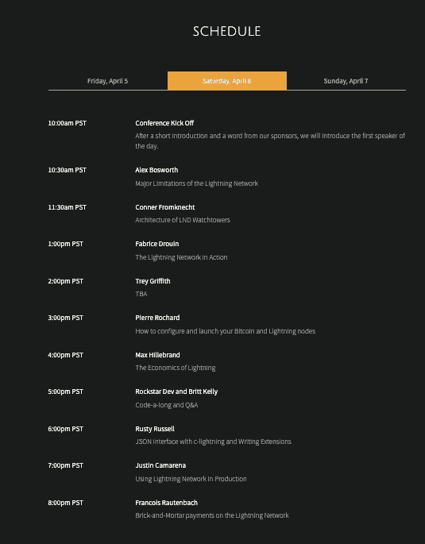

# 闪电马拉松:世界上第一个在线闪电网络会议和黑客马拉松

> 原文：<https://medium.com/hackernoon/bolt-a-thon-worlds-first-online-lightning-network-conference-and-hackathon-83782960f65>

[wwww.boltathon.com](https://boltathon.com/)

闪电网络是围绕金融包容性的理念建立的。任何人都可以购买，而且应该能够以假名购买。如果会议和黑客马拉松是围绕这些相同的核心原则构建的，会怎么样？作为世界上第一个在线闪电网络会议和黑客马拉松，这正是 [Bolt-A-Thon](https://boltathon.com/) 的设计目的。通过在线举办活动，Bolt-A-Thon 覆盖了全球社区，设定了令人难以置信的票价，并将所有支付处理为闪电比特币。

# 黑客马拉松

马拉松的第一部分是为我们的黑客准备的。黑客马拉松将于 4 月 5 日下午 6 点开始，一直持续到 4 月 7 日下午 2 点。黑客将提供一个建议的主题，并将有两天半的时间来建立他们的项目，然后在他们的同行和我们的评委面前展示。第一、二、三名获奖者将分别获得 **0.3 BTC、0.2 BTC、0.1 BTC** 。Blockstack PBC 公司还将为用 Blockstack 建造的最佳项目提供额外的奖金**1000 美元**。

# 正式会议

马拉松的第二部分是会议。我们出色的阵容包括来自所有三个主要闪电网络实施的代表:【Blockstream 的 Rusty Russell 、Lightning Labs 的 Conner Fromknecht 和 ACINQ 的 Fabrice 德鲁因。这确保了当前和未来的开发人员能够覆盖不同的客户。

不是编码员？别担心。Bolt-A-Thon 还提供了其他主题，如与 Pierre Rochard 的节点发布会，甚至与 Alex Bosworth 的关于闪电网络局限性的严肃讨论。

# 投票

我们网站的一个独特之处是，它允许人们提交帖子，成为螺栓马拉松的潜在演讲者。它还允许来自社区的人们用 satoshis 投票表决他们最喜欢的主题提案。排名靠前的人将获得在会上发言的机会。

# 票价

因此，加入这场席卷比特币的闪电革命吧。[门票](https://boltathon.com/sessions/)为**每届 25 万名 satoshis** (约 10 美元) **100 名 satoshis** 注册参加黑客马拉松。如果你没有闪电钱包，你可以通过海底互换用比特币或莱特币进行链上支付。

[Buy Your Tickets Today!](https://boltathon.com/sessions/)