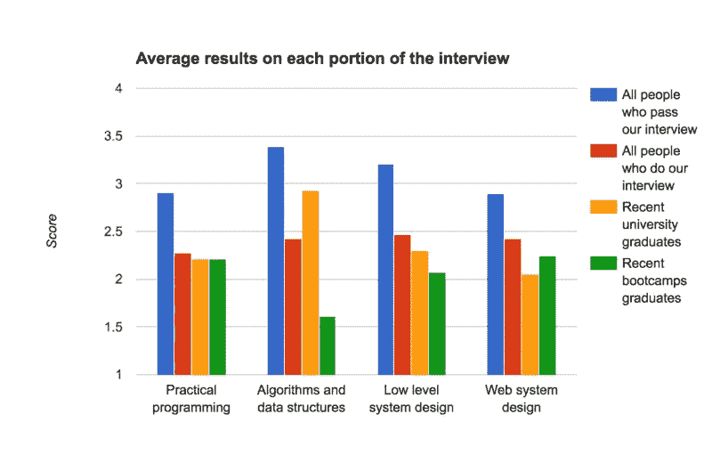

# 训练营对大学

> 原文：<https://medium.com/hackernoon/bootcamps-vs-college-11dd76a4d127>

## 来自一家科技招聘公司的数据

编程训练营似乎是一个不可能的主张。他们说，你可以在三个月的项目中学习如何成为一名软件工程师，而不是在大学里度过四年。从表面上看，这听起来更像是特朗普大学的广告，而不是一种看似合理的教育模式。

但这不是我们在 Triplebyte 发现的。我们对工程师进行面试，并将他们与适合他们的创业公司匹配。各公司对技能的要求千差万别，通过描绘这些差异，我们能够帮助工程师通过更多的面试，找到他们自己找不到的工作。在过去的一年里，我们与大约 100 名训练营的毕业生一起工作，许多人已经在大公司找到了工作。我们盲目地进行面试，不知道候选人的背景，我们经常通过面试，并给候选人非常积极的分数，结果却惊讶地发现候选人只做了 6 个月的编程。

训练营的毕业生是初级程序员。他们有很多东西要学，这代表着雇佣他们的公司的一项投资。也就是说，这也适用于应届大学毕业生。我们发现 bootcamp 的毕业生作为一个群体在网络编程和编写简洁的模块化代码方面比大学毕业生更好，但在算法和理解计算机如何工作方面更差。总而言之，我们在与这两个团队的合作中取得了**大致相当的成功。**

在这篇文章中，我将试着阐明这是如何实现的。我将深入挖掘我们看到的两组之间的差异，并希望解释一些人如何在不到一年的时间里成为有竞争力的初级程序员。

# 分析

我们在 Triplebyte 的技术面试大约两个半小时，分为四个主要部分，重点是实用编程、web 架构、底层系统理解和算法理解。不是每个工程师都完成每个问题(我们让程序员关注他们的优势)，但是这个过程给了我们一个很好的衡量每个工程师在这些领域的相对优势的方法。

为了更好地了解训练营的毕业生和大学毕业生的比较，我绘制了两组在这些领域的平均表现。y 轴是每个问题的分数(其中 1 =强否，2 =弱否，3 =弱是，4 =强是)。作为参考，我还包括了所有申请人，以及所有通过面试的工程师。

关于这个图表，首先要注意的是，bootcamp 的毕业生在实际编程和 web 系统设计方面与大学毕业生做得一样好，甚至更好，而在算法和低级系统方面做得更差。我们的实际编程问题并不容易。他们需要理解一个问题，提出解决问题的抽象概念，然后用代码表达出来。如果有的话，我们的实际编程问题比我们的算法问题需要更多的现场思考。然而，他们不需要学术计算机或数学，或任何特定的知识。这是问题的症结所在。训练营的毕业生在实践技能上与大学毕业生不相上下，但在深度知识上却输了。

类似的模式也适用于设计问题。Bootcamp 的毕业生在涉及网络服务器、数据库和负载平衡器的网络问题上做得更好。大学毕业生在涉及位/字节、线程、内存分配和理解计算机实际工作方式的低级设计问题上做得更好。

Triplebyte 认为训练营毕业生和大学毕业生的样本存在偏差。我们通过在线编程测试进行背景盲筛选，只面试通过测试的工程师。因此，我们没有办法知道在我们的过程中早期失败的训练营毕业生和大学毕业生的百分比，上面的图表只反映了通过我们测试的人。尽管如此，还是有相当数量的训练营毕业生通过了我们的测试，并在我们的面试中表现得和大学毕业生一样好。

我想特别提请注意大学毕业生在算法问题上的表现。他们不仅比新兵训练营的毕业生更好，他们更优秀。他们明显比参加我们面试的普通程序员更优秀(他们中的大多数都有 2 年以上的经验)，几乎和我们通过的普通工程师一样优秀。这很有意思。它支持了这样一种断言，即大多数程序员在工作中并不使用算法技能，并且随着时间的推移算法技能会萎缩。

# 这怎么可能呢？

撇开我们的数据不谈，似乎仍然很难相信 3 个月能与 4 年制大学学位竞争。时标好像变了。首先要注意的是，授课时间的差异并没有看起来那么大。训练营很紧张。学生每天完成 8 小时的工作，许多人熬夜工作到周末(一个受欢迎的训练营每周运行 6 天)。助教在整个过程中都在和学生一起工作。训练营缺乏的持续时间也许可以通过强度来弥补。

第二点是训练营教授实用技能。传统的 CS 程序员花费大量的时间在 NP 完全性和 Scheme 编程等概念上。现在，我绝没有贬低这种材料的意思。我喜欢学术 CS(和库克-莱文定理)。这是美丽的，迷人的东西，我学到了很多。但是并不能直接适用于大多数程序员大部分时间做的事情。训练营能够通过坚持不懈地专注于实用技能来展示巨大的成果。训练营的助教会不断地批评每个学生的编码风格。他们教测试。他们教学生如何使用他们的编辑器。如何使用编辑器是一个传统的 CS 学位项目永远不会想到的教学内容。

这并没有让训练营的毕业生拥有和大学毕业生同等的技能。如果你想做难的算法或低级编程，传统的计算机科学教育会更好。但这确实让他们中的佼佼者在许多入门级开发职位上具有惊人的竞争力。

# 结论

这篇博文有两种解读结果的方式。一种方法是说训练营只是装点门面。他们教给没有经验的程序员他们需要知道的东西，让他们看起来像优秀的程序员，但是忽略了这个学科的核心。但是，我觉得这种观点太愤世嫉俗了。看待这篇文章的另一种方式是证明训练营关注的领域与 CS 项目完全不同。他们非常注重成为一名高效程序员所需的实践技能。这些都是计算机科学课程希望学生在课程工作中掌握的技能。通过这种务实和给学生高强度的工作负荷，训练营能够匹配计算机专业毕业生的实践技能。

训练营的毕业生并不适合所有的公司。就像最近的大学毕业生一样，他们是雇佣他们的公司的一项投资。他们有很多东西要学。与受过学术训练的工程师相比，他们在算法和低级系统方面显然更差。一家数据库或自动驾驶汽车公司或许应该坚持聘用拥有计算机科学学位的人。但是绝大多数公司需要程序员来解决网络上的实际问题。在这个轴上，我们发现训练营的毕业生完全有竞争力。

我们都将训练营的毕业生安置在顶级公司，并且看着他们成长。我们看到他们学到了一些毕业时缺乏的计算机科学技能。我们看着他们学习大规模生产系统。我们看到他们走上了领导岗位。**最优秀的训练营毕业生学习的速度和效果真的令人难以置信。**和他们一起工作很愉快，我们肯定会继续和训练营的毕业生一起工作。

如果你是新兵训练营的毕业生(或者大学毕业生，或者其他任何人)，并且对寻找你在技术上有优势的公司感兴趣，试试我们的流程**。我也对你对这篇文章的想法感兴趣！给我发邮件到 ammon@triplebyte.com 的。**

**感谢 Jared Friedman 和 Daniel Gackle 阅读本文的草稿，并感谢 Buck Shlegeris 对本文写作的大力帮助。**