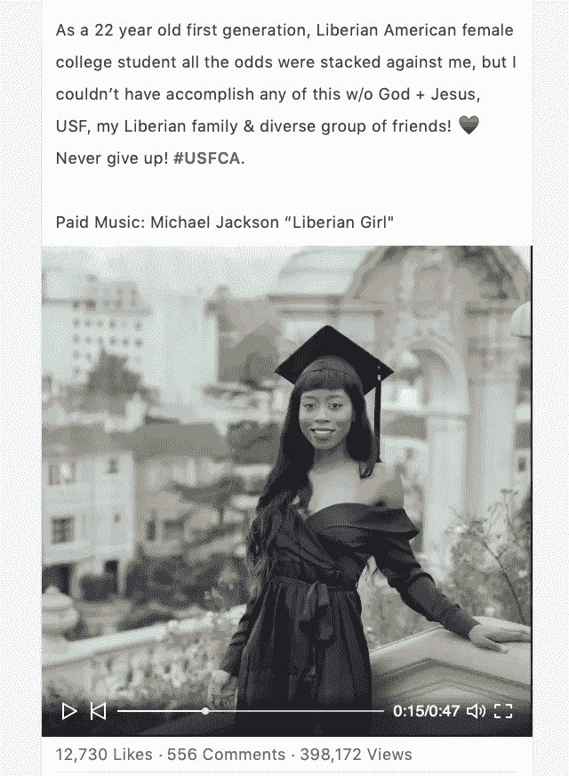

# 通过开发者营开始职业生涯

> 原文：<https://medium.com/hackernoon/bootstrapping-a-career-via-developer-camp-ebb73ef49b7a>

Developer Camp

虽然全世界有数百个黑客马拉松，但只有一个开发者阵营。

Square、Getaround、Temple Run、OAuth、TestFlight、push.io 和 zūm——在过去的 12 年里，它们都在开发者[阵营](https://hackernoon.com/tagged/camp)建立了基础。事实上，包括*苹果、甲骨文、谷歌、亚马逊、迪士尼和脸书在内的主要公司已经从开发者营的获胜团队手中收购了公司。*

是什么让开发者营如此独特和特别？三个字。

# 包容、多样性和赋权。

> 开发者阵营是一个融合了几个不同的、先前存在的事件模型的概念。第一个是 BarCamp，这是一个参与者驱动的“非会议”,其中演示的内容由参与者决定，由他们演示，并完全在现场组织。我们的夏令营包含了这方面的内容，为参与者提供了举行“辅助会议”或工作组会议的机会。我们的夏令营包含了这方面的内容，为参与者提供了举行“辅助会议”或工作组会议的机会。将所有这些概念联系在一起的是一种信念，即共享思想和代码是技术社区向前发展的最佳方式。对开源的贡献和“我们能行”的态度是我们开发者阵营的核心。
> 
> — Dom Sagolla 开发者营

我最近和 Samerial Johns 聊天，他是最近的毕业生，也是开发者营的校友。Samerial 最近在 LinkedIn 上发布的关于她旅程的视频[浏览量飙升至 398172 次！](https://www.linkedin.com/feed/update/urn:li:ugcPost:6481274742396588032/)

Samerial 体现了真正企业家的精神，她获奖的社交旅行应用 Aaireal 是在开发者营实现的。

> 开发者营对我来说是一次奇妙的经历。这是我的第一次黑客马拉松，所以现在我对未来的所有黑客马拉松都抱着很高的标准！在培养与我的黑客马拉松同行的关系时，我学到了很多关于编码语言、各种软件和个人独特背景的知识。这是一个充满正能量的创造性环境，人们渴望创造一个有影响力的软件。
> 
> 我的经历很独特，我不得不推销我的想法，并说服人们加入我的团队，即使我的想法有漏洞。我最终与一名设计师合作，将我的商业理念变成了现实，这是一个名为 Aaireal 的旅游网络应用程序！解决问题并与设计师并肩工作来构建应用程序是令人兴奋的。
> 
> 经过 60 多个小时的应用构建，我们终于为旅行和旅游业创造了一个解决方案。我们推出了应用程序模型，并赢得了最酷手机奖。我感到充满力量、动力和感激。这一经历是通向更多黑客马拉松和更多旅游网络应用开发的大门。
> 
> 我正在开发人员训练营开始的基础上，最终向公众推出产品。这里有一些给打算加入[开发者营](https://devca.mp/developer-camp-2019-february-1-3-fdf6124e3661)的新人的建议——要自信，与每个人分享你的商业想法，在团队中工作，打造你想要的产品！

正是这种自举[黑客马拉松](https://hackernoon.com/tagged/hackathon)的体验激发了 Samerial 和成千上万其他人去构建真正令人惊叹的应用。

开发者营将于本周末在加州圣马特奥东三街 55 号德雷珀大学的英雄城回归

还有数量有限的票。[今天拿到票](https://devcamp2019.eventbrite.com)。

为了鼓励我的读者的多样性和包容性，这里是妇女和女孩使用折扣代码的 50%折扣—**2019 女士**和学生代码的 50%折扣—**2019 学生**

## 关于作者

Dan Zeitman 是一名软件开发人员和倡导者。Dan 曾与 Cloudinary、PubNub、Vinli 和斯坦福大学合作，并共同组织了开发者营，Dan 作为一名 indy 开发人员拥有三十年的实际经验。Dan 对民权、社会行动和人权的强烈奉献精神激励他工作并组织了许多项目，包括两个救灾应用程序，以及开发人员营地顾问项目。