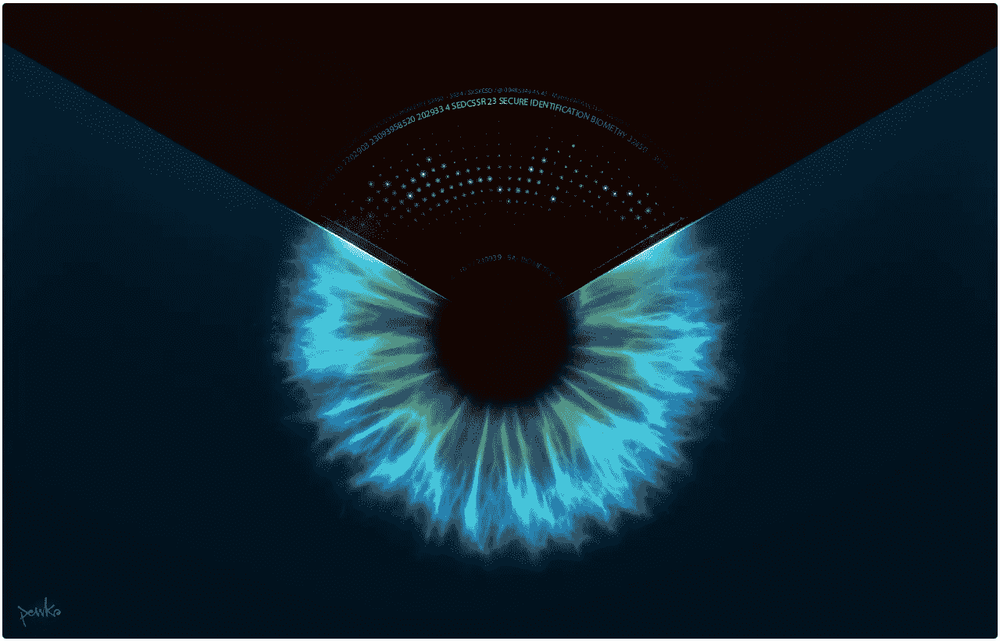
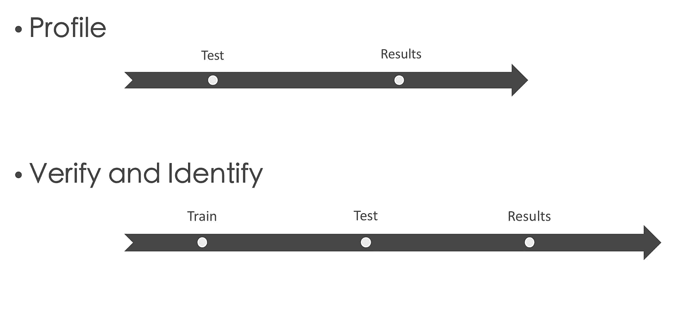
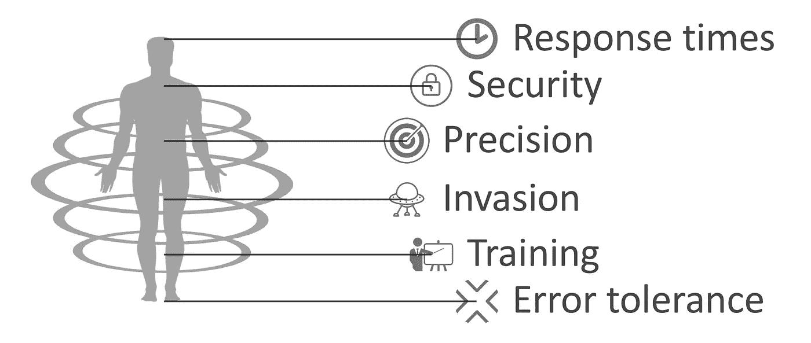

# 机器人和生物识别

> 原文：<https://medium.com/hackernoon/bots-and-biometrics-a2a1902e5f6a>

Iris biometry by [Pablo Alvarez,](http://www.penkorama.com) more details [www.penkorama.com](http://www.penkorama.com)

# 与机器人对话

让我们想象一下人们可以与虚拟助手或机器人进行的几次对话。

例如，一位名叫克莱尔的女士想知道天气预报。
——*克莱尔:好的，机器人，你是做什么的？
—机器人:你好！你叫什么名字？克莱尔:好吧，机器人，克莱尔。机器人:我能为你做什么，克莱尔。克莱尔:好的，机器人，爱丁堡今天的天气怎么样？*

过了一会儿，克莱尔回来了。
*—克莱尔:好的机器人，告诉我现在因弗内斯的天气。
—机器人:你好！你叫什么名字？*

克莱尔不明白。

现在克莱尔想知道她最近的银行对账单。克莱尔:好的，机器人，我想拿到我最后的银行对账单
——机器人:你好，克莱尔！有一段时间了。为了帮助你，我需要你添加你的银行账户信息。Claire 继续添加她的银行详细信息，并使用 ping 号码获得她的银行对账单。

Claire 忘记了与银行有关的事情，回到了对话中。
*——克莱尔:好的机器人，我需要转一些钱给我的丈夫杰米。机器人:当然，克莱尔，加上你的 4 位数密码。克莱尔:我 5 分钟前刚刚做过😞*

克莱尔的女儿名叫陈伶俐，今年 16 岁，试图访问她母亲的日程。陈伶俐想在周五晚上为她的母亲安排一次会面，与她的朋友在家里开一个派对。
*——陈伶俐:好的机器人，我想在周五增加一项活动。
—机器人:当然克莱尔，哪个标题？
—陈伶俐:Ok 机器人，和弗兰克(老板)一起审核工资。
—机器人:标题加了，什么时候？
—陈伶俐:好的机器人，17 点，两个小时。(我会带我所有的朋友来参加聚会)。
—机器人:本周五 17:00-19:00 新增活动。晚安克莱尔。*

当克莱尔发现整个故事时，她想…喝酒。

在以前的案例中，我们可以看到机器人用户在常规对话中面临的困难。在上下文级别，访问和身份模拟。

> 为什么人工智能不聪明？机器人能在不反复询问名字的情况下识别这个人吗？

# 什么是生物识别测试？

生物测定是基于人的身体模式的测试。这些测试允许区分一个人和另一个人，并建立一个人的档案。例如，计算年龄、性别和情绪等。

## 程序

根据生物特征测试的结果，我们建立了下一个分类:

*   **剖析**:获取一个人的年龄、性别或情绪等指标。使用预定义的存储模式进行比较。
*   **验证**:探测用户是否如其所言。
*   **识别**:给定一组先前分类的人，检查该人是否属于该组。

我们可以根据论文的类型和发展情况对生物识别测试进行分类:
——指纹是最著名和最古老的生物识别论文之一。需要有一个用于分析的物理设备。
-需要对音频文件进行声音生物识别测试。
——面部生物识别需要图像支持。
-图像和声音生物识别需要视频支持。
-对于眼视网膜，需要眼视网膜阅读器。(这被认为会导致眼睛受伤)。

# 那是干什么用的

有一个和人的对话要处理。“征得人民同意”后，我们从他们那里获得的“合法”信息越多越好。如果用户是女人或男人，被称为罗斯或约翰，是成年人或婴儿，是快乐的还是烦恼的，这可以用来使对话更人性化。

> “征得人民同意”后，我们从他们那里获得的“合法”信息越多越好。

从对话中提取人的数据，我们有更多的上下文信息，这可以在对话谜题中使用，以提供更明智的回答。

A 分析对话中的语境类型，有:

*   **用户上下文。**如果用户登录系统，有重要信息需要查看。此外，如果机器人运行到提取系统数据的应用程序中，例如，设备类型、品牌、so、版本等。
*   **对话语境。**对话的语言部分。当前领域、实体和意图。
*   **历史背景。**基于用户的旧的存储的对话历史。
*   **推断上下文。**围绕谈话的内容。星期几、用户性别、用户年龄、用户情绪、语音类型。

我们希望给出最好的回答，更有背景，更有说服力。通过生物测定测试，推断的上下文可以被丰富，并有助于机器人决定更好的响应。

# 生物识别的工作原理

对于指纹、面部识别和语音识别等最受欢迎的生物识别技术，该过程将因操作而异。

为了获得用户特征，我们不需要训练机器人，因为我们不需要将人与模型相关联，而是提取个人特征。

尽管这意味着核查和鉴定可能被认为比貌相更具侵犯性。这些测试从用户那里偷走了更多的注意力。甚至可能需要用户在捕捉我们的模型的设备前停留一段时间。

# 如何在我的机器人中包含生物识别

一个想法是为与机器人对话的人提供对话和屏幕。用户可以训练模型，并按照对话中的机器人方向进行测试。
在交谈中识别具有工作流的人是好的。尽管如此，用户可以在谈话的时候拒绝无聊或不需要的想法。

但是一勺糖有助于药物的消化。最理想的是尽可能减少入侵。在这种情况下，获取用户配置文件会更容易，因为不需要培训。

# 我们如何改进流程

我们应该考虑为每一个案例制定一个明确的策略。
然而，这并不容易，而且存在依赖性。

当面临求解所有这些变量方程的问题时，我们可以使用一些技巧:

## 异步测试

不是所有的测试都需要在对话中进行。我们可以通过声音识别使用者。例如，在不同的时刻，不打扰谈话。当开始对话时，我们可以在任何短语中捕捉用户的声音，并在没有干扰的情况下描述用户。

## 组合测试

通常，识别和验证在我们的系统中是至关重要的。不要把所有的机会都放在一张卡上，你可以在不同的时间结合几个生物识别测试。例如，在不同的时间进行语音识别和面部识别，以更安全的方式授权支付。

## 群体生物识别

如果你的机器人有任何团体功能，或者可以同时供几个人使用，安全性不是很重要。你可以给你的谈话加分。想象一下，你的机器人为团体推荐餐馆。你可以通过一项服务为这个团体拍照，这项服务可以获取这个团体成员的性别、年龄和情绪，以便进行更精确的推荐。

## 模仿(欺骗)

如果你的机器人使用安全至关重要的关键系统。如果你要实现或支付一个识别服务，系统检测假冒是很重要的。例如，在图像的情况下。如果在我们的机器人中实现的识别系统没有欺骗检测，它将有可能通过授权用户(模型)的照片识别任何人，并访问关键系统。

# 展望未来

我们也做了一些未来生物统计学的小研究，非常有趣和多样。以下是一些结果:

*   **脉道。**用手指和手掌的静脉方式，可以建立图案，因为每个人都有独特的静脉路径。
    https://what is . techtarget . com/definition/palm-vein-recognition
*   **耳朵形状。**我们的耳朵形状也可以用于人体检测。耳朵的形状很单一。例如，可以在通话期间在移动电话中使用。
    [https://www . new scientist . com/article/dn 7672-ear-biometrics-may-beat-face-recognition/](https://www.newscientist.com/article/dn7672-ear-biometrics-may-beat-face-recognition/)
*   **体香。我们每个人的气味都可以用来识别人。美国陆军想用它来探测远处的潜在目标。[https://www . pop sci . com/technology/article/2010-04/army-wants-smoking-sensors-can-id-potential-perps-afar](https://www.popsci.com/technology/article/2010-04/army-wants-smelling-sensors-can-id-potential-perps-afar)**
*   **行为检测。**通过电磁波可以检测到存在和人的行为。[https://www.aerial.ai/services/](https://www.aerial.ai/services/)
*   **行为计算机检测。**我们打字、点击和移动鼠标的方式可以被测量，并在以后用于识别或验证某些用户。就像这个项目一样[https://www.typingdna.com/](https://www.typingdna.com/)。

# 结论

看起来生物识别技术在这个世界上的应用是未来的事情。虽然，我们都已经在日常生活中使用它作为手机的指纹。现在所有这些想法都可以用在我们的机器人上。我们只需要学习何时、何地以及如何包含它们。

希望你喜欢。
感谢阅读。

虹膜生物统计学 [Pablo Alvarez](http://www.penkorama.com) ，更多细节请见[www.penkorama.com](http://www.penkorama.com)。