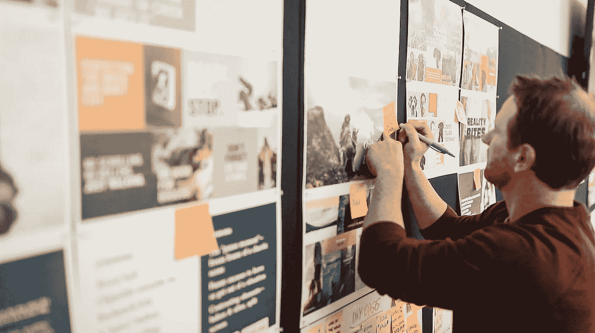
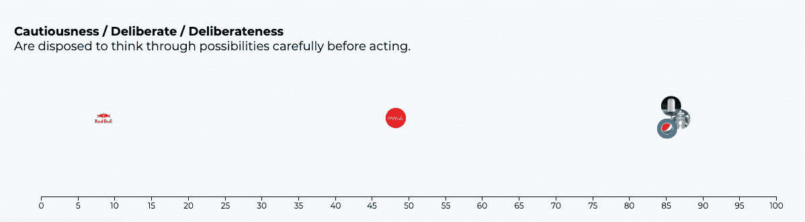
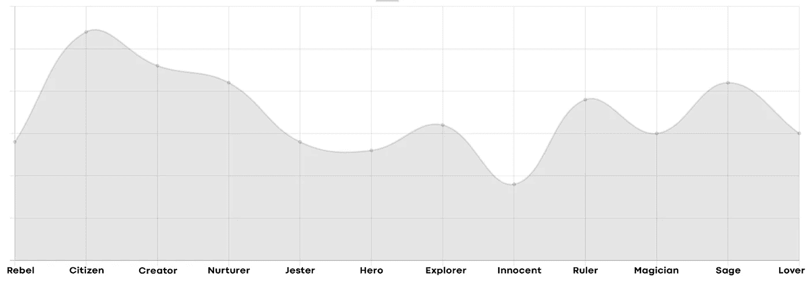
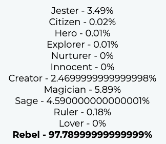
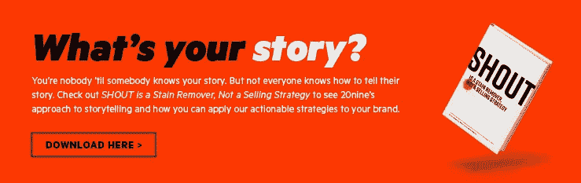

# 基于神经网络的品牌原型分类

> 原文：<https://medium.com/hackernoon/brand-archetype-classification-using-neural-networks-8e0dd7064746>

一个好的品牌不仅仅是一个标志和风格，而是一种体验。作为人类，我们忍不住要把人类的特质赋予非人的实体。通过赋予我们的品牌独特的个性，我们可以使自己与众不同。在一篇名为[用机器学习创建品牌人物角色](https://hackernoon.com/creating-brand-personas-with-machine-learning-647d9314baaa)的早期博客文章中，我写道使用公司生成的内容来程序化地确定他们的个性。为了做到这一点，我利用了 IBM Watson 对来自 Twitter 和公司网站的内容的个性洞察。

我做这项研究的主要动机是看看我们是否能给这样一个主观的话题增加一些客观性。我想知道我们是否能明确回答品牌是否与他们的信息和品牌角色保持一致。举例:与其他饮料相比，红牛在谨慎性方面的个性如何？下图中，0 代表*宁愿立即采取行动，也不愿花时间深思熟虑做出决定*的性格类型，100 代表*在做出决定*之前仔细考虑过的性格类型。

Showing only a few as an example

Twitter 似乎总是更好的数据源，在创建了上面博客中提到的公共工具后，我立即着手使抓取机制更加精确。例如，第一次迭代抓取任何网站的第一级链接，但通常从隐私政策和使用条款中抓取内容，这会扭曲个性化结果。在改进了获取内容的方式后，我开始从世界各地的许多财富 500 强公司和顶级品牌那里收集数据。

我有很多数据，我想用更多的方法来理解它们。其中一个想法是想办法将这些公司分成不同的类别。我想我可以根据品牌的具体个性得分对它们进行分类，为此我决定使用一种叫做原型的心理学理论。

# **品牌原型**

原型源于心理学家卡尔·荣格的理论，即一些故事人物为我们所熟悉，因为他们是我们共有的“集体无意识”的一部分。品牌可以利用这些原型将他们的广告锚定在这些人物角色上，这样消费者就可以更容易地与故事联系起来。我们可以将公司划分为 12 个原型:

**天真** 乐观、诚实、谦逊

**普通人** 友好、谦逊、真实

**主人公** 诚实、坦率、勇敢

**绿林好汉** 叛逆、捣乱、好斗

**探险家** 刺激、无畏、大胆

**创造者** 励志、大胆、泼辣

**统治者** 居高临下，温文尔雅，能言善辩

**魔术师** 神秘、见多识广、让人放心

**情人** 肉欲、移情、抚慰

**养育者** 关怀、温暖、让人放心

**圣人** 知识渊博，有把握，有指导

**小丑** 有趣的爱好者，贪玩的，乐观的

请注意，每个原型都有自己的一套特定的个性特征，我们可以用它们来绘制我们目前拥有的个性数据。

# **进入神经网络**

神经网络是一套算法，旨在识别模式，以帮助我们对数据进行聚类和分类。我们可以使用作为个性得分获得的原始数据作为我们的输入，并输出品牌属于我们 12 个类别之一的概率。为了训练我们的模型，我们需要从一个训练集或者已经分类的数据开始。

有许多大品牌可以作为其特定原型的典范，例如**耐克**成为**英雄。我手动将这些品牌标记到它们的原型桶中，并使用这些品牌来训练神经网络。简单地说，当我们训练一个神经网络时，我们基本上是从连接节点的随机权重开始的。我们运行一次数字，并使用我们在训练数据中已经有的答案(我们选择的原型)来查看我们有多接近。然后，我们一遍又一遍地运行该算法，直到权重产生具有低错误率的模型。**

在我们生成模型后，我们可以在我们的其他数据上测试它，看看我们做得如何。下面是我们收集的所有品牌的不同原型的分布图。

最后，我想看看我们的广告公司会属于哪种类型。考虑到我们的一面墙上写着“20nine 是作为一种反抗行为而成立的”，我想说这是非常准确的。

# 包扎

通过使用这些工具，我们已经获得了许多有趣的见解，而不仅仅是对我们的数据进行分类，能够将品牌个性这样主观的东西可视化真是太棒了。如果您对您的品牌形象和品牌故事感兴趣，请点击下方阅读我们讲述故事的方法，以及如何将我们的可行策略应用于您的品牌。

