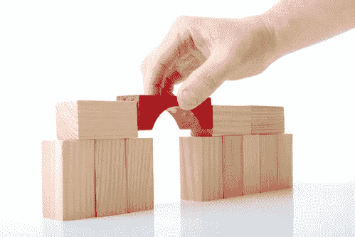
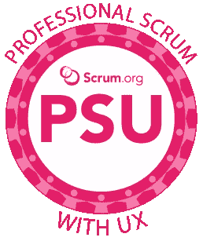

# 打破筒仓！如何在 Scrum 团队中增强以用户为中心

> 原文：<https://medium.com/hackernoon/break-down-silos-how-to-enhance-user-centricity-on-scrum-teams-898e18d418f4>

[加里·佩德雷蒂](https://www.scrum.org/user/147)，职业 Scrum 培训师，【Scrum.org】T2

我经常看到用户体验(UX)设计师努力将焦点、工作和方法与 Scrum 团队在 30 天或更少的迭代中构建产品增量保持一致。我听到的常见问题包括:

*   "开发者对用户并不真正感兴趣，他们只是想构建."
*   “我试图与团队并肩工作，但我总是比他们领先一点，所以我们应该在日常的 Scrum 中谈论什么？”
*   “我不从事分类循环或战术工作。我的工作是战略性的。”
*   “为什么开发者不用我的设计神器和决策？为什么他们从来不回头重构好的设计？为什么我感觉自己从来没有任何影响力？！？!"

这些挑战经常导致 **UX 设计师(uxd)和 Scrum 团队**之间脆弱的关系——或者更糟，不信任、分离和“交错冲刺”(完全独立的团队互相传递工作，他们在完全独立的时间段内执行，他们仍然称之为“冲刺”——即使这些时间段的功能与瀑布阶段完全相同)。

# UX 和 Scrum:一起更好

但是 UX 的设计师不需要在远离 Scrum 团队的孤岛中工作。他们可以管理设计过程，以用户为中心，以及跨团队的假设驱动的开发。事实上，我们可以借鉴我们将其他专业整合到 Scrum 团队中的经验——测试人员、数据分析师和应用程序架构师——来提供一些最初的想法，在 uxd 上做同样的事情时可以尝试。在这篇文章中，我将重点放在应用程序架构师的例子上，但是我意识到，对于我提到的其他技能集和专业，在团队集成方面的态度和模式非常相似。

早期，我从建筑师那里听到这样的事情:

*   “开发人员通常对好的架构不感兴趣。他们只是想创造一些功能。”
*   “我需要在他们之前工作，在功能集成之前，所以我不属于这个团队。”
*   “我的工作是战略性的。”
*   “开发人员只需要按照我告诉他们的去做。然而，他们通常不会……”

听起来熟悉吗？🙂请注意“他们/他们/他们”和“我/我的”的广泛使用，就像上面谈论 UX 挑战的列表一样。

随着时间的推移，架构师意识到所有这些挑战都是相互关联的，需要从团队内部整体解决。架构师从发号施令者转变为合作者，建立共识，并在整个团队中灌输决策背后的“为什么”。也就是说，当你在开发人员前面工作，贬低他们的工作是“战术性的”，并且除了去交付订单之外不与他们合作时，开发人员**就不太可能对好的架构感兴趣。或者，更重要的是，当开发人员理解好的架构决策背后的“为什么”时，当架构师融入团队时(如果只是作为兼职成员)，当架构师将他们的立场从好的架构的指挥官转变为管理者和导师时，您将获得一个好的架构应用程序。这最终是一种朝向合作和共同目标的思维转变。**

建筑师所做的(UX 设计师也可以做的)简单而有效的事情促成并展示了这种思维转变，包括:

*   与编码人员坐在一起，将现有的、已建立的代码和约定收集到可重用的组件和原则中
*   当人们天真地迷失在细节中时，将意识带回更高层次的关注点——架构、产品愿景、用户需求
*   “午餐和学习”侧重于“为什么”和收集反馈，而不是“我要就某事发表演讲…”
*   尽早地、经常地共享工作和工件，而不是在以“大爆炸”的方式交付之前搁置工作

在 Scrum 的  新的[专业 Scrum 与用户体验(PSU)培训课程](https://www.scrum.org/courses/professional-scrum-user-experience-training)中，我们讨论了这种心态转变和可行的策略，以在两天沉浸式的体验学习中实现它。PSU 培训课程教授学生如何成功地将 UX 技术和 Scrum 结合在一起，让学生有机会在整个课程中与跨职能团队一起实践这些技术。

# UX 和 Scrum:更多即将到来！

作为一个对“相对于过程和工具的个人和交互”感兴趣的人，我想以将设计和开发更紧密地结合在一起的*人类*方面开始 UX 和 Scrum 的对话。本系列的后续文章将讨论更多以人为中心的思想，例如以用户为中心，但也讨论了实现这里讨论的相同目标的*过程*和*工件*建议:将设计和开发更紧密地结合在一起，承认共同的目标。

例如——关于过程，UX 设计师如何实际组织工作——也就是说，它如何适应一个月或更短时间的冲刺节奏？关于工件，常见的设计系统工件，比如风格指南，如何不仅被增量地构建，而且尽快地通知实际的工作？

我们将在未来关于 *UX 和 Scrum together* 的博文中探讨这些问题——敬请期待！

## 资源

https://martinfowler.com/ieeeSoftware/whoNeedsArchitect.pdf

*最初发布于*[*https://www . scrum . org/resources/blog/break-down-silos-enhance-user-centricity-UX-scrum-teams*](https://www.scrum.org/resources/blog/break-down-silos-enhance-user-centricity-ux-scrum-teams)*。*