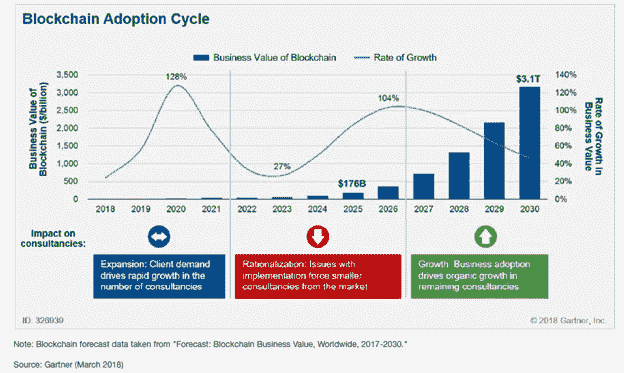
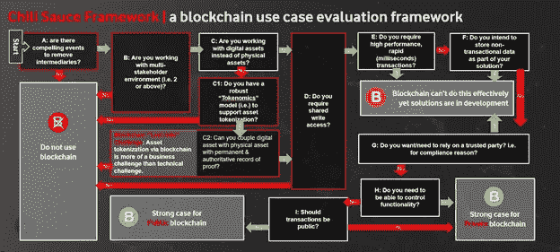

# 打破区块链——评估区块链用例的框架

> 原文：<https://medium.com/hackernoon/breaking-blockchain-a-framework-to-evaluate-blockchain-use-cases-9efbc30a3fa7>

## 如何用 11 个问题确定一个真实的区块链用例

**炒作背后的现实**

我出生在中国北方的一个中等城市哈尔滨，这个地方最出名的两样东西是:啤酒(中国第一家啤酒厂就是在这里建立的)和冰雕。尖端技术对哈尔滨市来说相当遥远。父亲是一位退休的商人，他大半辈子都在酒店行业工作。在我最近一次回家时，爸爸问我最近在忙什么，我告诉他我一直在忙一个叫“区块链”的东西。他的回答让我震惊，“我知道那是什么”。当我的父亲告诉我，甚至他知道区块链，然后我肯定地知道，有巨大的炒作区块链。我想到的唯一问题是，围绕“区块链”或“分布式账本”技术的炒作到底有多大？

Gartner 给出了一个相当令人印象深刻的答案，因为它预测区块链的商业价值到 2026 年将达到**3600 亿美元**，到 2030 年将飙升至**3.1 万亿美元**。人们和企业抱着这是“新互联网”的心态投入到区块链的热潮中，投资于 ICO 并推出区块链解决方案，而不了解区块链正在解决的根本问题(参见“ [**信任时代——区块链解决了其他人无法解决的问题**](/swlh/the-age-of-trust-the-problem-blockchain-solves-that-others-cannot-6024ebf47cad) ”)。

在 DC 华盛顿州举行的 MERL 理工大学 2018 年会议上，三名 MERL 从业者通过互联网搜索记录了 43 个区块链用例，其中大多数都被描述为类似“[运营成本…降低高达 90%](https://exonum.com/napr) ”的热情洋溢的说法。

*“然而，我们没有发现任何文件或证据证明区块链在这些索赔中声称取得的结果。我们也没有找到可供* [*其他技术*](https://www.ictworks.org/tag/lessons-learned/#.W9sVnHtKjIU) *开发的经验教训或实用见解。”*

我认为这些用例中的大部分是由初创公司资助的，所以这可能不算。

在企业界呢？

在与各种跨国公司合作后，我认为所谓的“区块链项目”更多地是由 FOMO(害怕错过)因素驱动的，而不是由结构性评估的令人信服的用例驱动的。我经常听到诸如“我们已经在我们的系统中实现了区块链”(其中大部分是“概念验证”项目)这样的说法。然后我询问他们区块链项目背后的用例是什么，发现大多数用例不需要应用区块链解决方案。那么，这些项目会发生什么呢？它们发布了，公司上了头条，然后人们又回到了传统系统，因为它们更容易、用户友好、使用和维护更便宜。根据美国消费者新闻与商业频道的说法，“84%的公司都在涉足区块链”。平心而论，区块链仍处于早期阶段；大多数公司都在区块链周围进行探索和试验，目的是证明在他们的业务中使用它的可行性。参考下图。

Figure 1: Blockchain adoption cycle

这篇文章的目的是向你展示如何从结构上评估区块链的想法，挑选真正的用例，并应用正确类型的解决方案。

# **区块链用例评估框架(2019)**

为了帮助你评估区块链和确定正确的用例，我开发了一个区块链用例评估框架，我称之为“辣椒酱区块链评估框架”。以下是一些需要注意的事项:

1.该框架是参考世界经济论坛(WEF)的白皮书“宣传之外的区块链”开发的。

2.我做了一些修改，即我觉得最初的白皮书没有考虑“资产令牌化”等解决方案，因此它认为实物资产不适合区块链。

3.我根据我在公司区块链项目和创业 ICO 项目中的工作经验，添加和删除了一些问题。

4.该框架必将成为一份活文档，并将随着区块链技术的进步而更新。请关注我的 [*中*](/@nuo.jiang) *和*[*LinkedIn*](https://www.linkedin.com/in/leo-jiang-9299118/)*获取最新的框架和 pdf 版本。*

Figure 2: Chili Sauce Framework — a blockchain use case evaluation framework

*答:是否有令人信服的事件来移除中介机构？*

当您评估任何区块链用例时，要考虑的第一件事是理解您试图解决什么问题以及随后的好处。区块链引入了一种无信任的信任机制。换句话说，它独立于它所在的位置和操作它的人，因为信任机制已经在数学上得到证明。因此，它消除了中介，开启了一种新的商业模式和一系列好处。

B:你是否在一个多方利益相关者的环境中工作(即涉及两个以上的实体)？

区块链在处理多利益主体的情况下最有效，理想情况下涉及 2 个以上的实体。现代财务会计建立在[复式记账系统](https://en.wikipedia.org/wiki/Double-entry_bookkeeping_system)的基础上，它有其设计上的局限性。例如，它需要第三方来验证交易记录。区块链通过引入三条目会计为这一限制提供了解决方案，在这种会计中，所有涉及外部方的会计条目/交易都由第三个条目加密密封，并驻留在共享的分类账中。第三个条目作为参与交易的各方的数字签名收据，其可以在不需要中央认证机构或票据交换所的情况下被验证。

这种环境的一个例子是移动网络运营商(MnO)和电信公司的漫游服务，其中所有的移动网络运营商都依赖于数据和金融清算中心(DCH/FCH)来进行数据、语音和金融对账服务。将区块链应用于漫游服务将通过消除使用诸如 DCH 和 FCH 的中介的需要而潜在地节省 MNOs 数百万。

*C:你是在使用数字资产而不是实物资产吗？*

区块链在“数字原生”资产方面是有效的。随着资产虚拟化，对实物资产应用区块链也变得可行。比如摩根大通开发的以太坊企业版 [Quorum](https://www.jpmorgan.com/global/Quorum) ，基于[澳洲金融评论](https://www.afr.com/technology/jp-morgans-quorum-blockchain-opens-new-world-of-trading-opportunities-20181027-h176fs)用于金条令牌化。

注意，这种可能性在最初的 WEF 白皮书中被排除了。虽然我相信这是可能的，但我会建议你**小心行事**，考虑到以下因素:

*C1:你是否有一个稳健的“令牌组学”模型(即支持资产令牌化的模型)？*

“令牌经济学”是令牌+经济学的结合。这个新创造的词很好地描述了资产令牌化的原理，即把实物资产数字化为数字价值单位(令牌)的商业模式需要有经济意义。这需要你考虑你的令牌在你的“令牌组学”模型中的角色，它的目的和实现这些目的的特征。例如，指定代币扮演的关键角色是价值交换。价值交换的目的是确保用户能够赚取价值，并将其用于固有生态系统内部的服务。有关令牌组学的更多细节，我将向您推荐 William Mougayar 的文章“[令牌组学——令牌使用、效用和价值的商业指南](/@wmougayar/tokenomics-a-business-guide-to-token-usage-utility-and-value-b19242053416)”。

*C2:你能把数字资产和实物资产结合起来，并有永久的权威证明记录吗？*

在我看来，这可能是资产令牌化最难的部分。我称之为资产令牌化的“最后一英里挑战”。短语“[最后一英里](https://en.wikipedia.org/wiki/Last_mile)”通常在电信领域用于描述电信网络到最终用户驻地的最后一段。最后一英里也是端到端网络连接中最昂贵的部分，因为它通常不属于提供端到端连接的电信公司。在区块链世界，要用数字令牌镜像实体资产，你需要能够在法律上和财务上链接这两种形式的资产。例如，如果您要标记一个房地产，该“标记”需要具有与您的房地产所有权证书相同的法律约束力，并由当地管辖机构认可和保护。这是最后一英里挑战的第一部分—如何使令牌化资产合法化？最后一英里挑战的第二部分是在财务方面。目前，绝大多数国家都有法律要求金融机构使用[存款银行](https://en.wikipedia.org/wiki/Depository_bank)来获得资产担保。数字资产不存在这样的保管处。这意味着，无论技术状况如何，在主流金融领域使用数字资产都没有合法的保护手段。

> **简而言之，通过区块链进行资产令牌化与其说是技术挑战，不如说是业务挑战。**

我见过许多 ICO 创业公司无法解决这一部分，无论他们多么精通技术。强烈建议谨慎行事(有关“最后一英里挑战”和相关缓解建议的更多详细信息，请参考“[最后一英里问题:了解影响区块链未来的经济学](https://hackernoon.com/the-last-mile-problem-understanding-the-economics-affecting-the-future-of-blockchain-4ca937c88248)”。非常欢迎你在 Medium 或 LinkedIn 上关注我的更新。)

*D:你需要共享写权限吗？*

您网络中的利益相关者需要能够将交易写入区块链吗？如果答案是否定的，那么你不需要区块链作为解决方案。

*E:你需要高性能、快速(毫秒级)的交易吗？*

由于其共识模型，区块链在交易速度方面不是很高效。您的用例要求事务以毫秒为单位吗？如果是这样，您将需要仔细评估不同的平台，以确保它们满足您的要求。例如，IBM Hyperledger Fabric 使用新的执行-订单-验证架构，在单个云数据中心环境中将交易速度提高到每秒 3，500 笔。

F:您打算在解决方案中存储非事务性数据吗？

分类账的基本用途是记录交易记录。这对于区块链来说非常有效，因为它设计了一种使用交易模式的货币。存储在链上的数据是事务性数据。考虑到大多数链仅允许有限数量的数据存储在链上，即在千字节的范围内，因此存储诸如视频、图像等非交易数据是不实际的。由于它们的体型。因此，如果您打算将大型数据集或非事务性数据存储为区块链解决方案的一部分，我建议您考虑一种混合解决方案，既包括区块链，也包括传统解决方案。例如，将数据的[散列](https://en.wikipedia.org/wiki/Hash_function)存储在区块链上，并将实际数据存储在链外，即存储在数据库上。这样，我们可以通过查看散列来判断我们的数据是否被修改。更多信息，建议你阅读:[在区块链上存储数据:开发者指南】](https://malcoded.com/posts/storing-data-blockchain)。最后，在继续之前，问自己第一个问题，为什么要考虑区块链？

*G:例如，出于合规原因，您是否希望/需要依赖可信方？*

如果某个行业对使用中介或可信合作伙伴有特定的要求，那么部署区块链可能会很复杂，即使使用它的其他好处显而易见。关键的挑战是说服他们在你的生态系统中发挥作用。

你需要能够控制功能吗？

如果能够更改区块链上的功能(例如，节点分布、许可、参与规则等。)而不在大型开源论坛上对区块链进行详细讨论是可取的，那么你应该选择一个私人的、得到许可的区块链。

*I:交易应该公开吗？*

如果交易需要保密，那么一个私人的、许可的区块链是合适的。如果没有，那么可以使用公共的、未经许可的区块链。

**辣椒酱理论**

为什么我要命名为「辣椒酱区块链评测框架」？因为我觉得区块链就像辣椒酱。辣椒酱令人惊讶，因为你可以把它放在许多东西上，味道真的很好。但是有些东西辣椒酱不适合。例如，你永远不会把辣椒酱放在冰淇淋上。要明白区块链就像辣椒酱——你可以在很多地方加入一点区块链，最终做出一个更好、更有吸引力的解决方案。然而，这肯定不是一个放之四海而皆准、要么全有要么全无的命题。**当区块链与常规技术结合时，它的实现确实是最好的**。

*最后，希望你能带走这个* *金块:*

> ***“区块链实施的成功与技术无关，因为它不是建立在技术创新的基础上，而是一种管理交易的新方式。”***

*如果你觉得这篇文章有用，并且想看我的其他作品，请一定要鼓掌并在* [*中*](/@nuo.jiang) *和* [*LinkedIn 上关注我！*](https://www.linkedin.com/in/leo-jiang-9299118/)