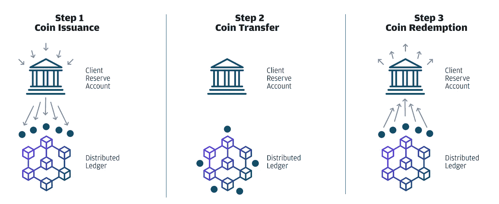
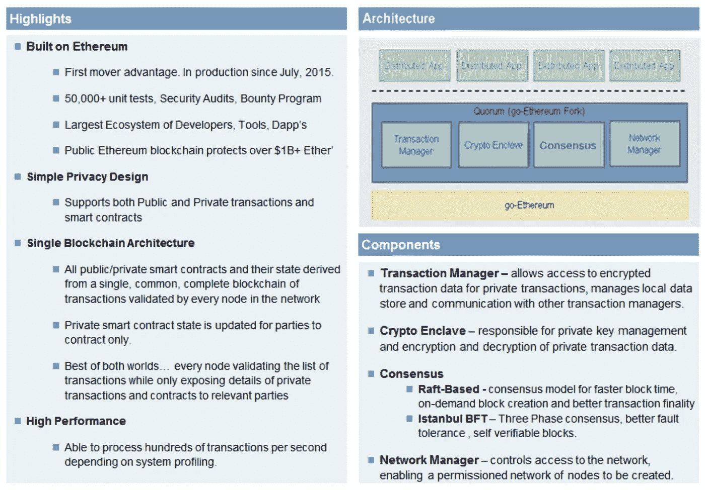

# 分解 JPM 硬币

> 原文：<https://medium.com/hackernoon/breaking-down-jpm-coin-f31c41f3f325>

## 有些人不喜欢这种资产，但它是一个重要的垫脚石

Is JPM Coin just Schrute Bucks or the new Gold Standard?

自从 JPM 硬币宣布以来，我看到了各种各样的反应。从硬币和 Schrute Bucks 的比较中💵或者 V-Bucks(堡垒之夜视频游戏货币)声称 JPM 币将成为加密货币的“黄金标准”,因为“这个人”已经将分散技术的最佳部分吸收并内部化为自己的利益。从保守观点中辨别事实很快变得具有挑战性，这些观点意在捍卫以前的立场，所以我决定去做一些自己的挖掘。我通读了摩根大通关于 JPM 硬币的声明，深入研究了法定人数协议白皮书(JPM 硬币最初所在的区块链协议)，并调查了摩根大通 GitHub，寻找潜在下一步措施的线索。

## 什么是 JPM 硬币

首先，让我们确保清楚 JPM 硬币代表的数字资产类型。JPM 硬币被称为稳定硬币，一种与美元 1:1 挂钩的数字硬币。大多数稳定币，包括 JPM 币，都是基于这样一个前提来维持其价值的，即每发行一种稳定币，都有一种相关的美元抵押。目前有几个这样的稳定圈在流通(系绳，双子，圈等)。JPM 硬币是一个有趣的新进入者，因为它由美国最大的银行和强大的资产负债表支持，为美元抵押的稳定硬币提供了前所未有的可信度。(注:还有加密抵押和非抵押的 stablecoins。)

围绕 JPM 硬币的一个主要争议点在于加密货币的定义。一些人称 JPM 硬币为加密货币，这是不正确的……大多数情况下。围绕这一点缺乏明确性，因为“加密货币”有许多定义。更宽松的定义认为，任何可交易资产的数字表现都是加密货币(如用真正的法定货币购买的堡垒之夜数字视频游戏货币 V-Bucks)。根据这个定义，JPM 硬币是一种加密货币。**但是**，根据更具体的定义，DLT 社区的计算机科学家、工程师和专家使用的 JPM 币是**而不是**一种加密货币。根据这一定义，加密货币是一种*去中心化*的数字货币，其中*加密技术*用于监管货币单位的生成(例如，通过工作证明)并独立于中央银行验证资金转移*。它们是公共分布式区块链上游戏化安全系统的组成部分。*

基于这个定义，JPM 币显然**不是**加密货币，这没什么。摩根大通(J.P. Morgan Chase)长期以来一直对加密货币保持一定距离，同时对区块链技术持乐观态度，JPM 硬币也没有偏离这一立场。

## 它是如何工作的

仅仅因为 JPM 币不是传统的加密货币，并不意味着它在摩根大通的环境中没有有趣的功能和用例。首先，JPM 硬币将在其批发银行客户中试用。这是 JPM 硬币如何在高水平上作为稳定的硬币工作的。一位客户将法定货币(美元)兑换成位于法定区块链上的 JPM 硬币。JPM 硬币然后被转移到另一个 JPM 客户那里，在那里它们被转换回法定货币，JPM 硬币被销毁。

Source: [JP Morgan JPM Coin Q&A](https://www.jpmorgan.com/global/news/digital-coin-payments)

JPM 硬币支持机构客户之间的实时总额结算(RTGS)。当前用于结算和清算支付的过程需要多个银行网络之间的若干交易。这一过程显然效率低下，更糟糕的是，容易受到欺诈和服务器中断或攻击的风险，从而使银行的清算系统瘫痪。通过对法定货币进行令牌化，JPM 硬币将支付终结的等待时间从大约 2 天减少到仅仅几秒钟，这样做既安全又保密。

这是 JPM 硬币的目标。为了降低客户的交易对手和结算风险，降低资本要求并实现即时价值转移，他们选择了 JPM 硬币和区块链。一些文章指出 JPM 硬币和使用区块链是不必要的。他们认为任何连接内部数据库的协议都可以完成这项工作。这些评论忽略了私人区块链为大型金融机构带来的机会的细微差别。正如摩根大通数字资金服务和区块链主管 Umar Farooq 所说:

> 坦白地说，应用程序是无穷无尽的；任何涉及公司或机构的分布式账本都可以使用……展望未来，如果区块链的这种用途流行起来，JPM 硬币可以用于互联网连接设备的支付。

## 分布式分类账

如果没有一个用于交易的分布式分类账，JPM 硬币就不可能存在，这个分类账被称为 Quorum: J.P. Morgan 的项目，旨在创建一个从官方 Go-Ethereum 区块链分出的私人区块链，增加数据隐私并提高交易效率。下图提供了仲裁平台和体系结构的一些关键方面:

Source: [Quorum White Paper](https://github.com/jpmorganchase/quorum/blob/master/docs/Quorum%20Whitepaper%20v0.2.pdf)

像以太坊这样的公共区块链是不够的，原因有几个:公共链不提供批发银行所需的数据隐私级别，公共链上的交易速度目前是出了名的慢(尽管以太坊正在积极推出解决方案来提高性能)。Quorum 旨在解决这些关键需求；然而，JP 摩根团队决定利用以太坊作为区块链的核心架构:

> 本文概述的定额设计展示了如何扩展创新的以太坊平台，以满足企业(尤其是金融机构)在分布式、分散的区块链联盟网络中保护隐私的关键需求。通过建立在以太坊的基础上，Quorum 继承了成熟的 go-ethereum 代码库…

Quorum 已经实现了一些独特的架构，以支持私有交易，并确保在私有区块链的成员之间高效地达成共识。

## **链上数据隐私**

Quorum 支持公共和私有事务。公开交易的管理很像在以太坊区块链。每个法定节点维护存储在 Patricia-Merkle 树中的公共状态，以确保每个人都同意已经发生的事务。当私人事务发生时，每个法定节点接收加密的私人事务数据的散列，但是只有参与私人事务的各方可以看到事务的细节。结果，每个法定节点的私有状态可能不同，因此私有状态被保存在每个节点的单独的 Patricia-Merkle 树中。通过运行 storageRoot RPC API 来达成私有状态共识，可以确认每个节点的私有状态的有效性。然而，这是一个额外的特征，因为由于加密的私人交易的散列包含在公共状态散列中，所以可以经由公共协商来验证私人协商。对私有事务的任何修改都会导致不同的公共状态，使节点不一致。

Quorum 通过修改 geth sendTransaction 命令实现了私有事务，该命令是标准 go-ethereum 实现的一部分。他们添加了一个“privateFor”字段，该字段接收将接收资金的银行或机构的地址，并使整个交易保密。sendTransaction 命令还有一个附加字段，用于加密的私有事务数据的散列(仅用于私有事务)。sendTransaction 命令的其余部分保持不变。

如果你想深入了解细节，我不会在本文中涉及，我强烈建议你阅读定额白皮书[这里](https://github.com/jpmorganchase/quorum/blob/master/docs/Quorum%20Whitepaper%20v0.2.pdf)。

**势下一步**

J.P. Morgan 的 Quorum 团队已经构建了一个强大的框架，并将该项目开源，以便其他开发人员可以利用和迭代该工具。Signature Bank 是一家规模较小的纽约银行，已经将 Quorum 用于一个类似的名为 Signet 的实时支付平台。摩根大通对使用其平台的其他人开放，他们将因此受益于更多的测试和开发。此外，摩根大通区块链团队开发了“Cakeshop”，这是一个用于“类似以太坊的总账”(即 Quorum)的集成开发环境(IDE)和软件开发工具包(SDK)。

如前所述，Umar Farooq 认为这只是一个起点，“坦白地说，应用程序是无穷无尽的”。虽然 JPM 硬币和法定人数将需要重大发展，以利用“互联设备上的支付”的情绪是重要的。这表明摩根大通团队正在研究 JPM 硬币在尚不存在的市场中的未来和潜在应用。

摩根大通 GitHub 有一个名为“zsl-q”的回购协议，其中包含 Quorum 上“零知识安全层”(zsl)实施的 POC。在文件中，他们承认 Quorum 的“主要限制是，它不支持防止在私人合同内交换的数字资产的重复支出”。这是一个严重的承认，定额组必须积极纠正。ZSL 是由设计 Zcash 的团队设计的一种协议，利用 zk-SNARKS 来“实现分布式账本上的数字资产转移，而不泄露任何关于发送者、接收者或被转移资产数量的信息。”具有法定人数的 POC 将允许防止私下交换的数字资产的重复花费。有趣的是，他们与 Zcash 团队合作，强调了投资于 Quorum 项目的专家的广泛性，包括以太坊企业联盟。

来自 J.P. Morgan 的 GitHub 的另一个有趣的见解是为云服务开发 Quorum，回购的标题是“quorum-aws”和“quorum-cloud”。这种云工具可以使 Quorum 快速扩展到更多的客户，并吸引各种各样的机构加入 JPM 硬币生态系统。

## 信任投票

在分布式技术社区中，支持加密货币的人和支持区块链或分布式账本技术(DLT)的人之间存在分歧。过去一年，那些支持区块链的人感到，DLT 的功效被加密货币市场的兴起和流行所掩盖。尽管公共区块链的成功依赖于加密货币作为创建安全博弈论模型的手段，但许可(私人)区块链的情况并非如此。

摩根大通的首席执行官杰米·戴蒙很可能属于后一种支持区块链技术而不是加密的阵营。他一直高调表示对加密货币的不信任，但声称区块链技术有希望，他最近的举动反映了这一点。此外，摩根大通的区块链项目 Quorum 建立在以太坊之上，在设计中重复使用了以太坊的大部分架构。这是对以太坊区块链令人难以置信的信任投票，无论是对其原生的公共形式还是私人迭代。

区块链技术、加密货币和数字资产对世界来说都是新事物。那些尚未启动的公司需要时间来试水，了解技术和机会，然后进行调整。大多数情况下，进步是通过迭代实现的，而不是跳跃式的。无论进展的缓慢对某些人来说有多么令人沮丧，因为我们更喜欢大的飞跃而攻击小的渐进进展是一种适得其反的措施。

JPM 硬币的开发和实施为以太坊和区块链技术提供了有价值的全球曝光。此外，JPM 硬币不会损害以太坊或其他区块链公共倡议。如果你不相信上面的内容，请重读以太坊黄皮书中的这段话:

> 这个项目有很多目标；一个关键目标是促进同意的个人之间的交易，否则他们将没有办法信任彼此。这可能是由于地理上的分离、接口上的困难，或者可能是现有法律制度的不兼容、不称职、不愿意、费用、不确定性、不方便或腐败。通过丰富和明确的语言来指定状态改变系统，并且进一步构建系统，使得我们可以合理地期望协议将因此被自动执行，我们可以提供一种手段来达到这个目的。

要实现上述目标，还有许多工作要做，JPM 硬币将被证明是通往建立在公共分布式账本技术基础上的新世界的一个有价值的垫脚石。

**免责声明**:本文无意提供投资建议。任何投资都应在了解相关风险后谨慎进行。

对分布式的未来有想法、观点或只是感到兴奋？？？在下面留下你的评论吧！