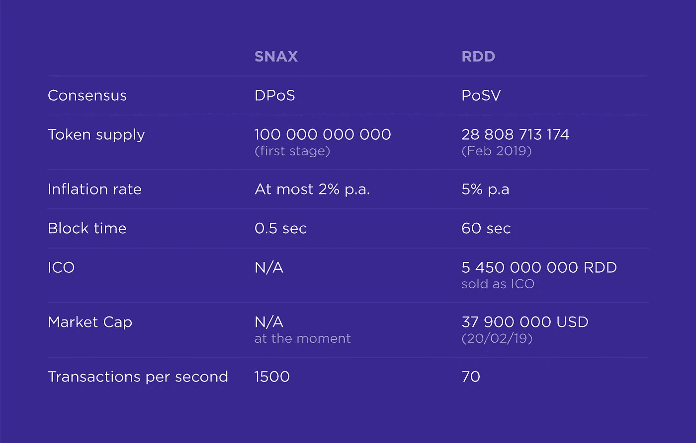

# 将密码带入世界:Snax 和 Reddcoin 分析

> 原文：<https://medium.com/hackernoon/bringing-crypto-to-the-world-snax-and-reddcoin-analysis-d8bef39e7ac>

区块链社区的多个项目正试图通过整合社交网络和区块链网络来实现加密货币的广泛采用。他们的目标是创造能被大众广泛使用的“社会硬币”。本文是系列文章的第一部分，该系列文章将探讨增加区块链技术采用的不同方法。

以下是不熟悉加密货币的人第一次使用区块链时面临的一些问题:

1.  **使用简单**。今天的密码不容易使用。UX 是不直观的，有许多步骤，人们必须采取获得和使用加密。例如，创建一个以太坊钱包远不是小事，那么钱包地址是不可能记住的，而且最重要的是，创建交易然后为它选择汽油价格会使人困惑。
2.  **交易成本、速度和可扩展性**。为了被普通大众广泛采用，密码必须提供便宜和快速的交易。它必须能够每天处理数百万笔交易，因为它的受众可以达到数亿人。
3.  **获取代币。**到目前为止，大多数人都听说过加密货币，但是大多数人不知道如何获得它。如果代币的目的是由某个社区使用，那么该社区中的人应该能够获得所述代币，而不必从交易所购买代币。
4.  **狭窄的用例。**目前，大多数加密货币仅作为证券使用。你可以交易它们，但是你用它们购买商品和服务的能力有限。人们应该有能力使用加密货币执行广泛的任务。

在本文中，我们将看看 Reddcoin 和 Snax 如何尝试解决这些问题。

以下是关于 Reddcoin 和 Snax 的技术信息:

Technical comparison of Snax and Reddcoin

Reddcoin 和 Snax 的目标都是让普通大众更容易接触到数字货币。两家公司都试图通过将区块链无缝集成到多个现有的社交网络中，同时使交易快速而廉价，来实现这一目标。你可以在这里阅读更多关于 Snax 令牌分发[的内容。](/@Snax/snax-token-distribution-a181610ffe8)

# 简单易用

Reddcoin 是市场上最古老的加密货币之一，从一开始，它就将自己标榜为一种社交加密货币，带来了创造更容易识别的账户名称以取代标准加密钱包地址的想法。

创建这些账户名称(也称为 ReddID)是为了让加密货币更容易被大众接受，这一想法得到了进一步发展。目前，Reddcoin 正在研究一种方法，将多个社交网络账户名称与他们的 ReddID 联系起来。

这个命名系统有一个主要的缺陷，因为它使用起来相当复杂(基于测试版，因为还没有完整的发布版本)。如果你是一个密码新手，你需要做的是:

1.  用 Reddcoin 创建钱包。
2.  在加密交换机上注册。
3.  交换菲亚特给 crypto，得到 RDD。
4.  下载浏览器扩展，为您创建一个单独的钱包。
5.  支付一些 RDD 来注册你的 ReddID
6.  等待网络确认，如果失败，则再次尝试[。](https://reddcointalk.org/t/registering-a-reddid/1910)
7.  将你的社交账户绑定到 ReddID。

不过，这确实有助于让 RDD 变得更容易使用，因为完成这个过程后，你将不再需要记住冗长的钱包地址，你可以简单地使用社交账户名称来发送和接收交易。

借助 Snax，您可以通过几个简单的步骤开始使用网络:

1.  下载浏览器扩展(或者以后的手机 app)。
2.  获取您的种子短语并设置密码。
3.  创建您的 Snax 帐户，并通过向您的社交帐户发布给定的哈希(数字和字母的字符串)来验证您的帐户。
4.  获得 50 SNAX airdrop 进行注册

一旦你发布了一条推文，其他的一切不仅是自动的，而且是免费的！现在，您将拥有一个 Snax 区块链网络帐户和一个与之绑定的社交媒体帐户，您可以只使用朋友的社交帐户名称发送和接收交易。如果你的朋友还不在 Snax 网络上，你甚至可以向他们的社交账户发送交易！他们一加入 Snax 就会收到资金。

# 交易成本、速度和可扩展性

Reddcoin 是从 Litecoin 衍生出来的开源区块链。第一块于 2014 年 2 月 2 日以 PoW ( [工作证明](https://en.wikipedia.org/wiki/Proof-of-work_system))共识发布，同年 8 月 2 日变更为 [PoSV](https://wiki.reddcoin.com/Proof_of_Stake_Velocity_(PoSV)) 共识。Reddcoin 平均交易费用目前约为 [0.04 美分](https://bitinfocharts.com/comparison/reddcoin-transactionfees.html)，几乎免费。然而，交易价格一直在波动，在 2018 年 11 月初达到了 [60 美分](https://bitinfocharts.com/comparison/reddcoin-transactionfees.html)，尽管到那时 RDD 的价格已经下降了近一年。你应该预计平均交易将在 4-12 分钟内处理，这与比特币相比相当快，但仍远低于信用卡的速度。

我们选择基于 EOS 引擎构建我们的区块链，以保护我们的社区不必为他们的交易支付任何费用，正因为如此，Snax 社交交易是免费的，只需几秒钟即可确认。

谈到交易速度，Reddcoin 每秒可以处理大约 [70 笔交易](https://www.reddit.com/r/reddCoin/comments/2jbhe0/can_we_make_more_than_10_million_transactions_per/)或每天 600 万笔交易。这可以在将来通过增加块大小来增加，然而，这将增加网络的负担，因为网络的整体大小也将增加。

Snax 正在使用最先进的区块链引擎之一，这使其每秒钟能够处理[至少 1500](https://coincodex.com/article/2052/eos-achieves-3000-transactions-per-second/) 笔交易，总计每天超过 1.2 亿笔交易。这也可以在未来通过将不同的平台集成分割到不同的侧链来改进。

# 获取代币

社交加密货币必须有公平的代币分配——每个人都应该能够获得它，而不需要从其他人那里购买或投资昂贵的硬件。

赌注速度证明允许每个拥有 RDD 代币的人通过下注代币来赚取红利。下注代币并不特别困难，但你必须在他们的核心钱包上有一些代币，并了解其功能才能做到这一点。你的钱包里的最低并发余额每年可以获得大约 5%的利息。

Snax 使用授权的利益一致证明，允许任何计算机上有 64GB RAM 和 512GB SSD 的人成为网络的当选代表，并获得大量代币。你必须说服人们为你投票(投票权重的大小取决于你持有的代币数量),奖励相当大，因此你将面临很多竞争，但是，这不是 Snax 赢得代币的唯一方式。

此外，Snax 还创建了一个新的系统来分发名为 Publisher Reward 的代币，社交影响者可以通过一个复杂的评估算法获得他们的内容奖励，你可以[在这里找到](https://snax.one/whitepaper.pdf)。任何有社会影响力的人都可以获得出版商奖励——你不需要事先拥有任何 Snax。由于它是绝对免费的，而且获得出版商奖励非常简单，这将有助于吸引社会影响者，因为他们将有直接的经济激励来加入网络，从而进一步提高 Snax 区块链的采用率。

# 狭窄的用例

加密货币去年成为了许多头条新闻，因为许多人开始在比特币、以太坊和其他加密货币上交易，就像它们是证券一样。虽然加密令牌可以用作证券，但要让普通人使用加密，它应该有更多的用例。

Reddcoin 致力于为社交网络建立代币作为小费和捐款机制。Reddcoin 提供了一种廉价快速的机制，可以向人们捐款，使用他们的社交账户作为地址，应该可以解决这个问题。他们需要解决一个问题——你目前只能向已经注册的人发送提示，这限制了 Reddcoin 广泛采用这一功能的能力。

Snax 已经解决了这个问题，因为您可以使用每个人的社交帐户名称向他们发送 Snax 令牌，即使他们不在 SNAX 网络上——人们会在验证他们的帐户后立即收到他们的 SNAX。这使得 Snax 成为一个很好的捐赠工具。

Snax 为开发人员提供智能合约，以开发链内的分散式应用程序。你可以把 Snax 想象成公共社交媒体上的一个可编程的、不可信的财务层。与社交网络合作的开发者可以通过使用 Snax 财务结构来构建游戏和将社交账户货币化的平台，从而节省大量资源。

例如，如果开发人员想要开发一个使用社交媒体帐户的游戏，并在游戏中进行一些允许用户互相发送收藏品的交易，他们可以通过使用 SNAX 令牌来节省大量时间和资源。Snax 为开发人员实现他们的想法提供了代码基础，并带来了新的用例。

# 结论

Snax 和 Reddcoin 都试图让加密货币更贴近大众，然而，他们有不同的方法来解决由此产生的问题。Reddcoin 是一项较老的技术，但它已经过时间的考验，背后有一个庞大的社区。然而，我们相信 Snax 拥有更现代的机制，这将有助于它成为第一个将分散货币带给更广泛受众的加密工具。

我们的团队相信社交加密货币的未来，我们欢迎 Reddcoin 社区的人们加入我们，帮助我们将区块链技术的奇迹带给普通大众。

如果你有关于 Snax emission 如何工作，如何获得出版商奖励，或者如何成为 Snax network 的一名制作人的问题，请随时加入我们在[https://discord.gg/qygxJAZ.](https://discord.gg/qygxJAZ.)的讨论，不要忘记在 [Twitter](https://twitter.com/SnaxTeam) 上关注我们，并为这篇文章鼓掌！

此外，你可以在这里找到常见问题的答案[https://snax.one/faq.](https://snax.one/faq.)