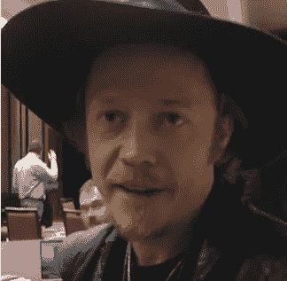

# 我从布洛克·皮尔斯 71 分钟的采访中学到了什么

> 原文：<https://medium.com/hackernoon/brock-pierce-interview-tales-from-the-bitcoin-floor-e479693a49bd>

## **2019 年展望，当熊市是好事**

My interview with Brock Pierce at CoinAgenda Global

2018 年有近 [500 场加密会议](http://www.bitcoinmarketjournal.com/conferences/)，区块链亿万富翁 Brock Pierce 在其中许多会议上发言。他在 CoinAgenda Global 呆到很晚，在篝火般的故事周围召集信徒。他出席了由 Justin Wu 和 Chris Champion 主持的纳斯达克加密峰会，就比特币的优点反驳了花花公子人物 Dan Bilzerian。开启 2019 年，他将在下周的 CES 上参加我的小组讨论[伟大的加密辩论](https://www.ces.tech/conference/Digital-Money/The-Great-Crypto-Debate.aspx)。

他在节目中无处不在，我开始觉得自己就像《滚石》记者卡梅伦·克罗在邪教经典*中扮演的角色，几乎出名*，一个追踪摇滚明星生活和时代的嵌入式记者。

就在上周，他给了我 71 分钟问他任何事情。

以下是采访中的亮点。

**first s 的创始人**

作为创始人和投资者，他的职业生涯如此多产，我请他描述一下他在行业发展中扮演的角色。

皮尔斯童年时是一名演员(以《强大的鸭子》而闻名)，他的成人生涯始于流媒体视频，然后进入游戏领域。2009 年，当比特币网络上线时，皮尔斯修补了采矿，并用比特币积累了他的早期财富。直到 2013 年 10 月，他与巴特和布拉德·斯蒂芬斯(Brad Stephens)一起创立区块链资本(Blockchain Capital)，才正式投资该空间。

“在区块链资本之前，我像孵化器一样启动创业公司，”Pierce 告诉我，“我创办了一家名为 GoCoin 的支付公司，一家名为 KnCMiner 的顶级采矿设备的独家经销商，接管了全亚洲第一台名为 Robocoin 的比特币 ATM 的独家经销权，给了币安 CZ 第一份加密工作，创办了世界上第一家加密银行,[波多黎各的] Noble Bank，创办了 Expresscoin。我是 Mastercoin 的创始人之一，在 2013 年夏天创建了第一个 ICO，然后创办了 Tether，现在每年交易 2 万亿美元，是仅次于比特币的第二大交易令牌，也是第一个在区块链上交易的真实世界资产。”

“在我全职做基金之前，Tether 是我做的最后一批创业公司之一，”皮尔斯说。“这才是区块链资本真正起步的原因。我意识到我不能同时资助 10 到 20 家公司，因为除了 crypto 之外，我还有其他 8 家公司。我能够扩大规模并在生态系统中曝光的唯一方式是成为一名全职投资者。”

“区块链资本是第一个专门投资加密和区块链的风险基金。我是主要创始人，并与 15 至 20 位朋友共同投资，包括中国 BTCC 的世尘小雪、Litecoin 的查理·李和 Tally Capital 的马修·罗扎克。第一个基金是免费的。我们一开始不是把它当生意做，只是为了好玩。然后巴特和布拉德非常投入，并正式确定下来。”

**安全令牌的诞生**

出于对在美国推出 ICOs 所涉及的监管风险的警惕，皮尔斯向我解释了他和他的合作伙伴如何在 2017 年第二季度推出第一个安全令牌时知道时机是正确的。

“我们为区块链资本的第三只基金 BCAP 添加了第一个安全令牌。这个团队由巴特、布拉德、杰里米(加德纳，Augur 的联合创始人)和我组成。我在努力争取。我管理了 AngelList 上的十大辛迪加之一，看到了众筹、股权融资和风险投资的融合点。我也是 DSTLD Jeans 的顾问，DSTLD Jeans 是美国第二家与《就业法案》相关的 Reg A 产品，我知道它可以合规地完成。”

“在外部，我们得到了 Argon Group 的 Stan Miroshnik 和 Emma Channing 的支持。Emma 是这个领域中伟大的无名英雄之一，她应该因为是第一个构造安全令牌的人而受到表扬。我们领先所有人两年。当你是一个受到严格监管的市场的先锋时，在这个行业里，我不建议任何人成为牛仔。做好你的准备，做好你的准备。这不是传统的企业家精神，你只是去那里，然后请求许可。在这方面搞砸的后果会让你付出生命的代价。”

“在 BCAP 之后，我辞去了区块链资本管理合伙人的职务，以便成为 Block One 的联合创始人。一旦你管理着非常大的机构基金，你就不能成为合伙人。所以我选择不管理未来基金，这样我就可以回去做一名企业家。这是我一生中做出的最好的决定，但在花了 4 年时间建立了该领域最杰出的基金之一后，很难放弃。我仍然参与区块链资本，但不是管理团队的一部分。除了曾是联合创始人之外，我没有正式的角色。”

区块链资本将于 2018 年 3 月为他们的第四只基金筹集 1.5 亿美元，两个月后，Block One 在史上最大的 ICO 中筹集了 40 亿美元。

皮尔斯左块一， [EOS 的开发者。IO](http://eos.io/) ，发起 [EOS 联盟](https://www.businesswire.com/news/home/20180817005432/en/EOS-Alliance-Launches-Mandate-%E2%80%9CEmpower-EOS-All%E2%80%9D)，这是一个由音乐艺术家死神阿近和其他 EOS 投资者组成的非营利性社区，专注于授权股权证明网络的治理问题。

皮尔斯还是比特币基金会的主席，该基金会的董事会成员包括文尼·林厄姆、世尘小雪、布鲁斯·芬顿、迈克尔·佩克林和卢·克拉森。

**冲击十亿**

然而，皮尔斯的持久遗产可能只是他重建波多黎各的慈善工作。2017 年底，在风暴摧毁了该岛后，他在飓风玛丽亚后搬到了那里。2018 年 3 月，他发起了重启基金会，以帮助恢复工作。我问他，自飓风袭击以来，过去一年取得了哪些进展。

“我们已经做了很多小事，比如在家里安装太阳能电池板，为那些没有电的人供电，为人们提供食物，但大项目一直在鼓励创业精神。我们在 Mayaguez 和 Ponce 与 Parallel 18 一起举办了有史以来第一次黑客马拉松，Parallel 18 是一个加速器，它为每个初创公司提供 4 万美元的政府拨款，没有股权。这是一个很棒的项目，每批有 500 名申请者，最多可录取 40 名。有两家初创公司在首轮融资中分别筹集了超过 100 万美元的资金。资助这些公司的天使是来自 crypto 和区块链的企业家背景的 Act 22 人。第 22 幕来自对冲基金和股票基金的人不会投资创业公司，那不是他们的基因。”

[第 22 号法案](https://www.doradobeach.com/real-estate-puerto-rico/act-20-22-tax-advantages)指的是 2012 年的立法，该立法为在波多黎各建立真正住所的企业和高净值个人提供避税天堂。

“我已经成为波多黎各大学的一名有意义的捐助者，帮助他们重建图书馆并扩大他们的创客工作室。他们是美国排名第 15 的工程学院，美国宇航局、谷歌和脸书基本上都有全职招聘人员。他们培养出了非常有才华的人，但是如果他们想要一份好工作，他们就必须离开。如果你是一个有创业梦想的企业家，第一次，工具就在这里。现在你有了合适的加速器、孵化器、黑客马拉松、合作设施、黑客屋和资本形成。这就是一个生态系统是如何开始的。我对波多黎各的长期前景充满了难以置信的热情。”

“波多黎各类似于新加坡。这是一个没有足够多的人口来吸引大多数投资者的市场。新加坡之所以有趣，是因为人们将它视为一个中心辐射模式。当你想到新加坡时，你会想到它是通往东南亚的门户，因为它有法治。投资者不想在印度尼西亚、马来西亚、越南、老挝或柬埔寨注册公司。他们想知道这是一家专注于这些市场的新加坡公司，因为他们希望他们的资本在一个安全的司法管辖区。”

“波多黎各作为一个拥有 300 万人口的法治岛国，也有类似的机会。它拥有美国的所有安全设施，但没有美国的税收问题。你可以在这里建立面向加勒比海和拉丁美洲的公司。委内瑞拉不稳定，阿根廷只是稍微好一点，拉丁美洲的大部分地区不是许多机构投资者放心投资的地方。波多黎各讲西班牙语，其地理位置是一个门户。基本上迈阿密一直试图成为什么，”皮尔斯补充说。

我问他是否知道 2018 年有多少 Act 22 crypto 和区块链企业家搬到波多黎各。

“这些只是估计，但感觉 1500 个说要搬到这里的人中有 500 个真的搬了。”尚不清楚在 2018 年 crypto 崩溃后，人们是否会重新考虑搬到波多黎各。“我们试图更有效地跟踪它，”他解释说。“主要是我们看到了三分之一的掉线率，因为这是一个颠覆他们生活的重大承诺，许多人来自加利福尼亚和纽约。”

皮尔斯在巡回演讲时一直试图提高波多黎各的知名度，为该岛吸引资金。他谈到试图通过影响力投资来改变现状。他重复着他的咒语，告诉我，“亿万富翁是能够积极影响十亿人生活的人。我的 KPI 不是关于我赚了多少钱。我关心我正面影响了多少人的生活。这是我衡量自己的度量单位。”

它能跌到多低？

我问皮尔斯，他是否认为 FAANG 和 crypto 在 11 月份的崩溃是相关的，可能是因为对经济衰退或贸易问题的预期。

“巧合多于相关性，但还有更广泛的市场波动可以关联，”他回答道。“是的，可能有一些重叠。一般来说，密码市场与其他任何东西都没有关联。这是加密市场的主要好处之一，即它们独立运作，但许多投资加密的人也投资技术。它们在某些方面是相似的行业。crypto 的许多大股东肯定也是 FAANG 股票的大股东。”他回答道。

"你认为抛售的原因是什么？"我问。

“必要的市场调整。我们已经经历了多个周期，价格上涨，人们变得兴奋，一群人涌入。价格持续上涨，超过合理水平，然后市场必须经历一个修正阶段，这是一件好事。当价格开始过快上涨时，许多企业家出于错误的原因进入这个行业。纠正创造了净化，一种必要的净化。坏演员通常会离开，而真正的信徒会留下来创造伟大的东西。”

他继续说，“特别是 ICO 市场被高估了，人们甚至没有原型或工作产品。他们有一份白皮书和一个缺乏经验的团队，在大多数情况下，他们从未运送过产品，他们以荒谬的估值筹集资金，却没有放弃任何股权。事情就像 1999 年的网络股一样上涨。每个人都在购买以太坊来投资每天都在翻倍的东西。以太坊到 2000 美元的唯一原因是因为你需要以太来购买 ico。人们不会投资有良好吸引力或实际结果的好项目。这基本上是赌博，不可持续，所以每个人都开始意识到，像在 2000 年，这不是一个理性的市场。音乐椅游戏中的问题是音乐什么时候停止？”

“或者是谁停了音乐？”我问，“你认为可能是市场操纵引发了抛售吗？”

“我敢肯定绝对有一些。主要是在纽约为对冲基金工作的人。大多数真正的市场操纵者都在华尔街。”皮尔斯回答道。“这一切都很好。价格是情绪的主要晴雨表。它不跟踪基本面。这是由情感、FOMO(害怕错过)和追求利润驱动的。”

“你觉得比特币的地板在哪里？”我问。"有人说这是最后一次上涨开始的地方，低至 500 美元."

“我猜大约是 3000 美元，但也可能低至 1000 美元。如果低于 1000 美元，我会感到震惊。如果低于 2000 美元，我会感到惊讶。这个领域有太多的兴趣和活动，我的直觉是，地板可能在 3000 美元左右，这不是我的专业领域。”

我问下一轮上涨的动力是什么。

“两件事之一:要么是传统市场的重大不确定性，这意味着金融系统发生灾难性事件，导致全球货币、债券或股票市场崩溃，这种生态系统因其弹性和分散架构而受益；或者我们开始看到用例被市场采用。”他回答道。

然后，我问他关于他用来分析投资的指标。

“我关注的最有趣的属性是社区。当你有开源软件时，你可以复制和粘贴代码，这样技术就不会产生差异。技术提供了先发优势，但支撑你的项目并带来长期成功的是你建立和培育的社区的质量。我主要看管理的质量。另一件重要的事情是开发人员的采用。有多少开发人员在这个系统上工作。如果没有人在你的链上建设，你的链有多好也没用。以太坊有一个巨大的开发者社区，他们是第一名。EOS 是第二名。Tron 排名第三，这让我有点惊讶，但他们在建立社区方面做得很好，创始人 Justin Sun 在 Twitter 上，技术已经赶上来了。这就是你建立社区的方式，不是靠保持安静，而是靠发出声音，让人们听到音乐，然后说我想跟着节拍跳舞。”

“下一个杀手是 dapp 游戏吗？”我问。

“是的，游戏将是其中很大的一部分。最早采用 crypto 的是游戏玩家。这就是为什么韩国和中国如此之大，因为这些市场是人们玩视频游戏以及为《第二人生》和《魔兽世界》等游戏买卖虚拟货币的地方。正是世界各地的用户群体推动了第一波加密应用，所以我认为各种形式的游戏很有可能成为生态系统成功的主要驱动力之一。”他补充道，“短信和点对点支付也可以为没有银行账户的人提供服务。地球上三分之二的人享受不到金融服务。”

**RegTech 是红热的**

我最后一个问题是关于他的 2019 年展望。

“证券代币将是革命性的，它们将催生一个千万亿级的市场，”皮尔斯告诉我，“这是因为我们看到了世界法定货币、债务市场、股票、房地产、艺术品的代币化……”

他以对市场下跌的好处的思考作为结论。

“我们将会看到大量的东西被构建出来，数百万用户将会使用多种应用程序。我喜欢价格下降的事实。当价格上涨时，因为团队不在附近逗留，所以很少建造。每个人都变得太快，这降低了人们的积极性。我在这个生态系统中看到的所有最好的东西都是在熊市中建造的。”

本人于 2019 年 1 月 2 日发表于[金融科技时报](https://thefintechtimes.com/brock-pierce-interview-tales-from-the-bitcoin-floor/?fbclid=IwAR2K0NeGA7U31i8Y2V4XnOhjuY2M7Yn19AoMciG2XS9g8NhxR4bK12Mx2dw)！