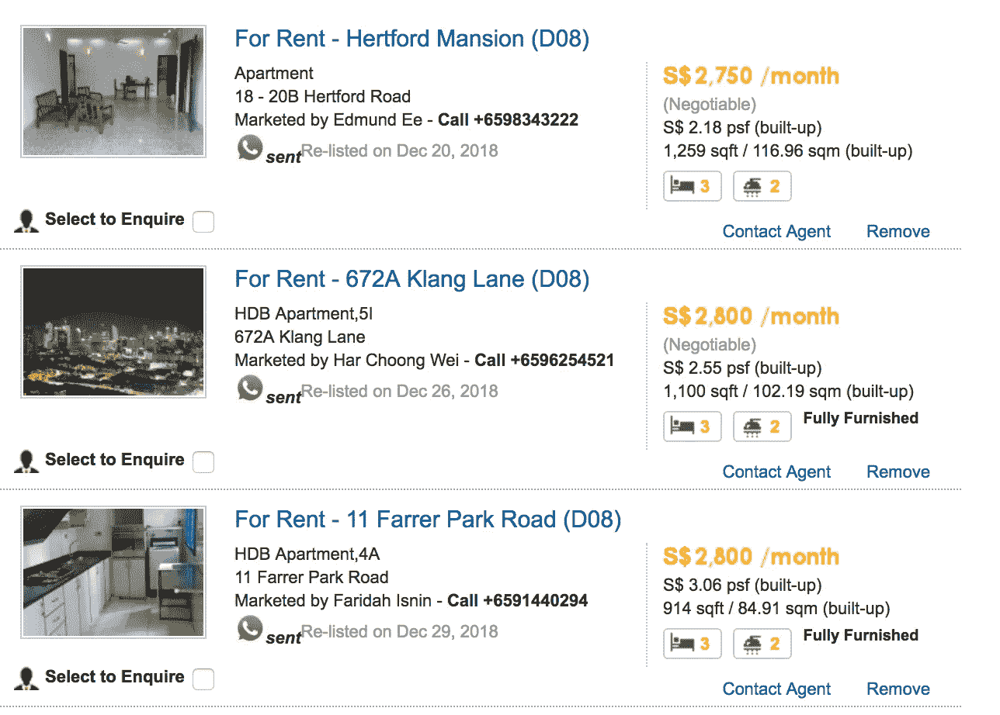

# 浏览器扩展:拿回属于你的东西

> 原文：<https://medium.com/hackernoon/browser-extensions-taking-back-whats-yours-717d44274862>

## 我做了一个 chrome 扩展，可以向网页上的所有电话号码发送 WhatsApp 消息，而不用在手机上保存联系人。

> [GitHub 链接](https://github.com/vedant1811/to-whatsapp-crx)。


How I felt after hacking with WhatsApp

最近不幸找了个出租屋。除了在房产租赁门户网站上解析多个房产，我还得联系代理。对于**每一个我喜欢*(并有机会得到)*的**属性:

> 我不得不将电脑屏幕上的代理电话号码复制到我的手机上，等待 WhatsApp 同步联系人，在脑海中记住电脑上的列表名称，然后才从我的手机上发送消息。

而且，我必须做 79 次**:**

****

**agents to contact**

**过多的体力劳动；一定有更好的解决方案。**

**做了一些功课后，我决定开发一个 chrome 扩展，它可以解析每一个网页，查找电话号码，只需轻轻一点就能发送消息。一些迭代之后，它能够向每一个号码发送消息，带有一个到相应属性的链接，*只需点击一下。*分机还存储已发送的电话号码，以防止重复信息:**

****

**After running my extension**

# **技术实现**

**我想我可以在 web.whatsapp.com 运行定制的 javascript 来发送消息。但是没有办法打开一个没有保存号码的新用户的*聊天框*。我可以通过联系人和消息将查询参数传递给*web.whatsapp.com*，类似于[https://web.whatsapp.com/send?phone=1234556789&text = Hey](https://web.whatsapp.com/send?phone=9112345567890&text=Hey)。这将打开*聊天框*到数字+1 23456789，在*聊天框*中有*‘嘿’*。然后，点击发送按钮，瞧！消息已发送。**

**按照上面的计划，我把它分成了以下几个子任务:**

1.  **分析每一页的电话号码**
2.  **在这些数字后面添加一个 WhatsApp 图标**
3.  **搜索该电话号码前的超链接*。***
4.  **点击图标打开 WhatsApp web，手机号码上有一条预先填充的消息，其中包含找到的超链接。**
5.  **添加一个*“发送给所有人”*动作，在后台向所有联系人发送消息。**
6.  **在 web.whatsapp.com 运行的脚本，等待聊天框(或*无效号码*弹出窗口)打开并发送消息。**
7.  **发送消息是一个长时间运行的任务，所以显示如下状态:*发送，已发送，电话无效。***
8.  **存储已发送的号码，这样我就不会意外地向同一个号码发送多条消息。**

**我使用了非常棒的 [libphonenumber-js](https://github.com/catamphetamine/libphonenumber-js) 库和一些 javascript 来查找电话号码，并添加了 WhatsApp 图标。**

**点击后，我使用 chrome 扩展 API 打开 WhatsApp 网页标签。这有点棘手，因为添加图标的*内容脚本*必须向*后台脚本*发送一条*消息*来打开选项卡和参数。通过一些递归代码，我可以找到电话号码前最近的超链接。几乎总是这个链接指向代理提供的属性(我的脚本会给谁发消息)。**

**这标志着中间点:我可以从浏览器向未保存的联系人发送 WhatsApp 消息，而无需触摸我的手机。**

**然后，针对 WhatsApp Web，我写了一些`async` / `await`代码。它必须等待网络应用程序加载；具体来说，它要么等待聊天框打开，要么等待*“通过 url 共享的电话号码无效”*弹出窗口出现。这部分真的很有趣——我没有编写缩进的匿名/箭头函数，而是编写了线性的`await`语句。我通过了桑迪·梅斯的斜视测试**

> ***“眯眼看你。向后靠。寻找形状的变化。寻找颜色的变化。形状反映了循环的复杂性——大量的嵌套条件。颜色反映了不同层次的抽象，不同类型的事物混杂在一起。斜视测试能帮上忙！”***

**剩下的部分很简单:使用 chrome APIs 在*内容和后台脚本之间发送消息。*chrome API 在页面刷新之间存储数据也很简单。**

**我真的很喜欢在我创建的元素中添加函数并从代码的不同部分调用它们的方式。例如，参见`setStatus`功能:**

```
// in 1 file:
function addSendToWaToNode(node, phoneNumber) {
  const sendToWaNode = document.createElement('span');
  ...
  sendToWaNode.setStatus = (status, save = false) => {
    sendToWaNode.lastChild.textContent = status;
  if (save) {
      chrome.storage.sync.set({ [waNumber]: status }, function() {
        console.log(`saved ${waNumber} : ${status}`);
      });
    }
  }
}// in another file, I could use it like:
phoneSpans = document.querySelectorAll(`.${WA_SPAN_CLASS_NAME}`);
span = phoneSpans[0];
span.setStatus('sent', true);
```

## **终于，期待已久的生产运行！**

**我想我联系了 80 个代理，而不是 30 个，只是因为太容易了。**

**为 chrome 扩展编写 javascript 很不错，因为我不必担心不同浏览器的兼容性问题，并且可以自由使用 ES6 特性(常量、异步、等待、箭头函数、字符串插值)。**

**最初，我将代码组织得井井有条，功能也很少(大约 5 行)，但最终我还是放弃了。你知道，我仍然无家可归。**

**我非常怀念的一件事是对测试的本地支持。我阅读了人们制作的节点应用程序和一些框架，如代码，以支持对其扩展的测试。但没有现成的解决方案，所以我只是让它去为这个项目。**

# **离别的思绪**

**我**花了一周**来编写这个 chrome 扩展，而不是像 80 个代理那样花**几个小时**来手动发送消息。但是那样的话就没有什么可写博客*(或者吹牛)*的了。尽管如此，我还是会再做一次。**

**该扩展目前处于测试阶段。它需要更多的用户界面和错误处理来成为一个通用的扩展。不确定我是否应该在 chrome 网上商店发布它。告诉我你是否想要使用像这样的东西。**

**我真的很喜欢扩展的想法。这就像添加了应用程序创建者没有时间做的功能；或者他们认为它们是 bug，而不是特性。请放心，还会有更多的扩展。延期请求打开😉**