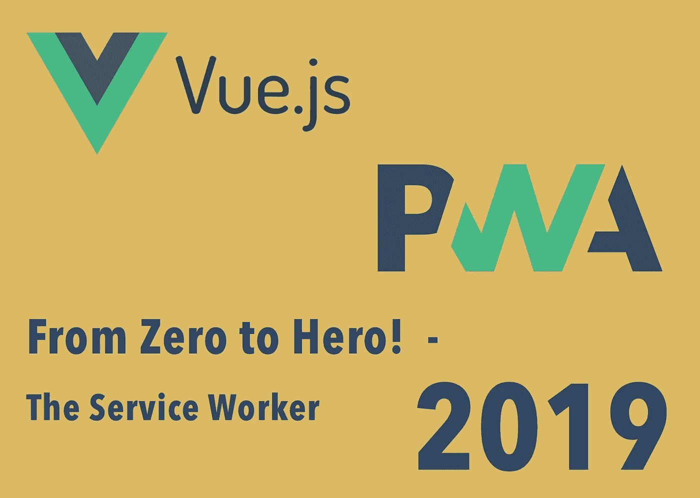
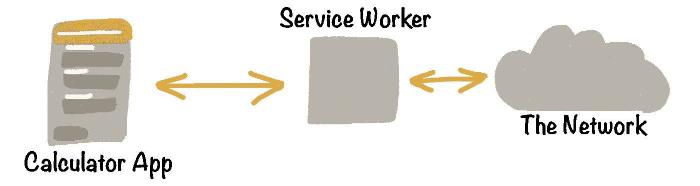
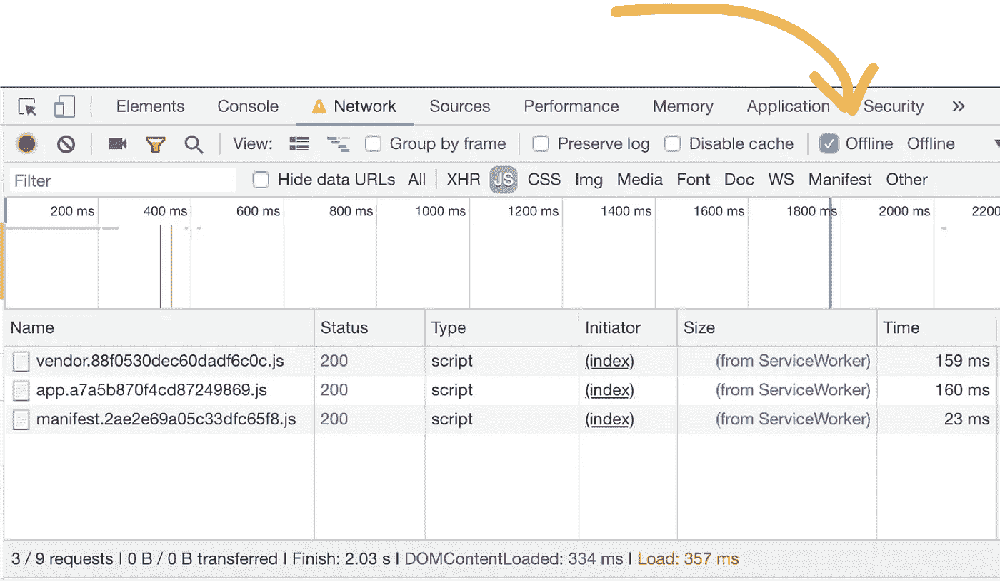
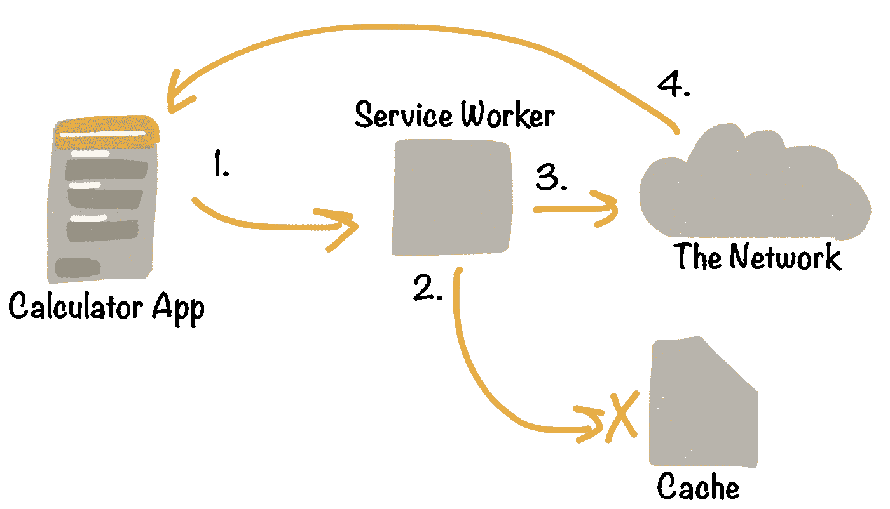

# 在 VueJs 中构建一个进步的 Web App，从零到英雄！第二部分——服务人员

> 原文：<https://medium.com/hackernoon/build-a-progressive-web-app-in-vuejs-from-zero-to-hero-part-2-the-service-worker-d9babc3d756f>



在本教程中，我们将实现并讨论**服务工人**，这是一项核心技术，它将原生应用程序令人惊叹的离线优先体验添加到常规 web 应用程序中。

事实上，这篇文章是教你如何用 VueJS 开发所谓的渐进式 web 应用的系列文章的第二部分！

[第一部分](https://hackernoon.com/a-progressive-web-app-in-vue-tutorial-part-1-the-vue-app-f9231b032a0b) —在 [VueJS](https://hackernoon.com/tagged/vuejs) 中构建税收计算器应用。

第二部分——让应用程序离线工作。

如果您还没有完成第一部分，请不要担心，您也可以直接开始构建 PWA 特性。我们走吧！

## 离线优先范式

在今天的网络上，当没有网络连接时，大多数网站和网络应用程序都会失败。这是如此普遍，以至于今天的用户甚至不会抱怨这种糟糕的体验。

对于渐进式 web 应用程序来说，情况就不同了，因为这些应用程序在本地应用程序和 Web 应用程序之间架起了一座桥梁。与网络相比，本地应用用户不会简单地接受由于糟糕的[网络](https://hackernoon.com/tagged/network)连接导致的完全崩溃。

这就是为什么构建 PWAs 不仅需要新的技术，还需要新的范例来满足这些用户的期望。这个范例叫做**离线优先**！归结为一句话:

> 离线优先意味着总是根据用户当前的网络条件提供最佳的体验。

通过查看税务计算器应用程序作为我们的起点，我们可以直接了解离线优先对于应用程序开发意味着什么。

# 税收计算器应用程序


这是我们在本教程的第[部分](https://hackernoon.com/a-progressive-web-app-in-vue-tutorial-part-1-the-vue-app-f9231b032a0b) I 中构建的 VueJS 应用程序。它帮助用户根据一些个人细节计算德国所得税(真的很棘手)。

要开始使用已经完成的应用程序，请查看这个 [repo](https://github.com/fh48/vue-calculator-pwa) 的`07_complete`分支。

# 让我们让应用程序离线工作！

让我们从离线使用所得税计算器开始。通常，所有静态文件(HTML、JS、CSS、图像等。)被一次又一次地请求。由于 tax calculator 应用程序在前端进行计算，因此实际上并不需要服务器连接，只是为了获取这些静态文件。这意味着，要让我们的应用程序离线可用，我们只需要使用服务人员来缓存它们就可以了！


Chrome’s offline-dinosaur easter egg won’t be part of our app experience anymore.

听起来没那么容易，对吧？

事实上，大部分工作已经完成。我们的应用程序基于 VueJS PWA 模板，支持开箱即用的静态资产预缓存。然而，如果你不熟悉**服务工作者**和**缓存 API** 的概念，就不容易理解发生了什么。

这就是我们在本节开始探索这两个主题的原因！

## **什么是服务人员？**



服务人员是您的浏览器在后台运行的脚本，独立于网页。它既不能直接与网页交互，也不能直接访问 DOM，因为服务工作器运行在不同的线程上。服务工作者的这种性质为不需要网页或用户交互的功能打开了大门，例如网络请求的拦截和管理以及包括数据缓存。

你自己检查一下吧！转到`webpack.prod.conf`文件，在那里我们配置`sw-precache`来构建一个服务工人。寻找`SWPrecacheWebpackPlugin`构造器，将`minified`选项改为`false`。

然后，运行`yarn build`。当我们现在检查我们的`/build`文件夹时，我们在那里找到了`service-worker.js`文件。服务人员是生产的唯一特征。想象一下，你的应用程序会在开发模式下缓存所有静态文件…这不是一个非常愉快的开发体验。这就是为什么我们需要[服务于](https://github.com/zeit/serve)我们的生产建设，以确保一切正常运行。

```
yarn global add serve
```

然后运行下面的命令并浏览 [http://localhost:3000](http://localhost:3000)

```
serve dist/
```

你应该看看你所知道的税收计算器。现在转到开发工具，网络标签。设置`offline`勾号并刷新页面。该应用程序仍在那里，功能齐全！



太好了，现在我们知道什么是服务人员，以及`[sw-precache](https://github.com/GoogleChromeLabs/sw-precache)`如何让我们非常方便地设置它。然而，我们还没有探究服务人员实际上是如何缓存静态文件的。

## 缓存存储 API

首先，理解缓存的一般工作原理很重要。因此，我们来看看[缓存存储](https://developer.mozilla.org/en-US/docs/Web/API/CacheStorage)浏览器 API。这是一种相当新型的缓存层，它允许我们显式地管理资产的缓存。您可能还记得，CacheStorage 与 AppCache 完全不同。CacheStorage 不那么固执己见，更先进，这给了我们更多的自由。

CacheStorage 非常适合我们的目的，因为它允许我们在非常精细的级别上管理我们的缓存需求。基本上，我们可以为每一个单独的单个决定如何以及何时从缓存或网络提供服务。尽管我们基本上可以想出非常个性化的缓存策略，但有几个是通用的，值得了解一下。

最常见的有*仅缓存*、*缓存回退到网络*、*仅网络*、*网络、回退到缓存和通用回退。*

## **缓存优先策略**



我们的`sw-precache`库有一个`cache-first`策略。

这意味着，当应用程序开始加载其静态文件(1)时，服务工作人员会拦截请求。接下来，服务工作者尝试从本地缓存存储提供静态文件(2)。只有当文件不可用时，它才连接到网络获取文件(3)并完成应用程序的请求(4)。

一般来说，`cache-first`对于基本的离线优先实现来说是一个很好的策略。然而，这种策略也有一些缺点。例如，它防止用户总是看到最新版本的应用程序，因为服务人员最好提供缓存的、可能过时的应用程序版本。在`sw-precache`的[文档](https://github.com/GoogleChromeLabs/sw-precache#considerations)中，他们建议通过以下方式进行补偿

> 当有新内容时，向用户显示提示/警告，让他们有机会重新加载页面以获取新内容。

对于我们的税收计算器来说，这不是一个大问题，否则其他缓存策略可能是更好的选择。

**您想了解更多关于缓存策略的信息吗？就把这个教程往你最感兴趣的方向开吧！参与投票，了解你真正关心的是什么！**

## 服务人员生命周期

要成功实施上述任何一种缓存策略，熟悉服务人员的生命周期非常重要。因此，现在让我们来看看实际生命周期的简化版本。我们来看以下几个阶段:i *安装，激活*和*激活。*这些阶段中的每一个都必须在工人的一生中完成。


当工人进入其中一个阶段时，它发出一个事件，我们可以监听。现在我们可以检查我们的服务人员实际上是如何缓存我们的静态文件的。不要让助手函数迷惑了你，我为你强调了什么是最重要的。

**安装事件，**通常用于在服务人员激活之前缓存需要可用的文件。例如，服务人员正常工作所依赖的请求。如果出现任何问题，我们只需取消安装。下次用户访问该页面时，服务人员将再次尝试安装。

如果有新的静态资产，它们会被`cache.put(cacheKey, resonseToCache)`添加到缓存中，否则工作者会转移到下一个阶段。`event.waitUntil()`在服务工作者中被大量使用来扩展当前状态，直到传递的回调链被解决。

**激活事件，**当服务人员被激活时，它将控制我们的应用程序。需要激活一个工作线程，它才能拦截获取请求。当一个工作者被初始注册时，pages 在下次加载之前不会使用它。`claim()`方法迫使服务人员立即控制一个页面。我们还可以在这里做更多的缓存管理，从缓存中删除不再属于我们期望的 URL 的请求。

**Fetch 事件，**Fetch 事件是我们唯一没有看到的是服务工作者实际上是如何获取缓存的静态文件的。这是通过监听`fetch`事件实现的。

我跳过了如何计算`shouldRespond`，更重要的是理解我们如何从缓存返回内容给所有的`GET`请求。如果我们不能从缓存中提供服务，因为我们可能没有缓存请求的资源，我们只需让请求通过，从网络获取内容。

不要忘记回到你的`webpack.prod.conf`文件，将`minified`选项重置为`true.`

## 服务人员得到很好的支持吗？

您可能已经对服务人员的浏览器和平台支持感到疑惑。长话短说，所有主要的浏览器厂商和平台都明确承诺扩展它们的 PWA 支持。

然而，苹果远远落在后面，他们可能需要很长时间才能赶上。就在去年的 iOS 11.3 更新中，苹果开始支持服务人员的基本功能。

在[第一部分](https://hackernoon.com/a-progressive-web-app-in-vue-tutorial-part-1-the-vue-app-f9231b032a0b)的介绍中，您可以找到更多关于哪些厂商和平台承诺支持 PWAs 的信息。

这就是我们现在需要了解的关于服务工作者和缓存的全部内容。我们已经涵盖了使我们的应用程序成为真正的离线优先体验的基本细节！

**你下一步想学什么？就把这个教程往你最感兴趣的方向开吧！参与投票，了解你真正关心的是什么！**

感谢阅读！*如果你喜欢这篇博文，在 Twitter 上关注我*[*@ Fa _ Hinse*](https://twitter.com/Fa_Hinse)**请鼓掌👏**