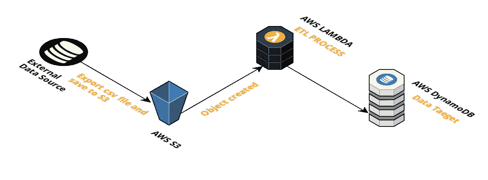

# 用 AWS S3 兰巴和 DynamoDB 构建无服务器数据管道

> 原文：<https://medium.com/hackernoon/build-a-serverless-data-pipeline-with-aws-s3-lamba-and-dynamodb-5ecb8c3ed23e>


AWS Lambda plus Layers 是管理数据管道和实现无服务器架构的最佳解决方案之一。这篇文章展示了如何使用 AWS Lambda 函数、S3 和 DynamoDB 构建一个简单的数据管道。

## 这条管道能实现什么？

每天，外部数据源将数据导出到 S3，并导入到 AWS DynamoDB 表中。

## 先决条件

*   [无服务器架构](https://serverless.com/)
*   Python3.6
*   [熊猫](https://pandas.pydata.org/)
*   码头工人

## 这条管道是如何工作的

每天，外部数据源将前一天的数据以 **csv** 格式导出到 S3 存储桶。S3 事件触发一个 AWS Lambda 函数，该函数执行 **ETL** 过程并将数据保存到 **DynamoDB** 。



## 安装无服务器框架

在开始之前，安装 [**无服务器框架**](https://serverless.com/) 。打开一个终端，输入`npm install -g serverless`来安装无服务器框架。

## 创建新服务

使用 AWS Python 模板创建新服务，指定唯一的名称和可选路径。

```
$ serverless create --template aws-python --path data-pipline
```

## 安装无服务器插件

然后可以运行下面的命令项目根目录来安装**server less-python-requirements**插件，

```
$ serverless plugin install -n serverless-python-requirements
```

编辑`serverless.yml`文件，如下所示:

```
**plugins**:
  - serverless-python-requirements
**custom**:
  **pythonRequirements**:
    **dockerizePip**: non-linux
    **layer**: true  #Put dependencies into a Lambda Layer.
```

*需要安装****Docker****才能设置****dockerizePip****:****true****或****dockerizePip****:****非 linux***

## 添加 S3 事件定义

这将创建一个**dev . document . files**bucket，当一个 csv 文件被添加到 bucket 中时，它将触发 **importCSVToDB** 函数。

```
**functions**:
  **importCSVToDB**:
    **handler**: handler.importCSVToDB
    **layers**:
      - {**Ref**: PythonRequirementsLambdaLayer}
    **environment**:
      **documentsTable**: ${self:custom.documentsTableName}
      **bucketName**: ${self:custom.s3bucketName}
    **events**:
      - **s3**:
          **bucket**: ${self:custom.s3bucketName}
          **event**: s3:ObjectCreated:Put
          **rules**:
            - **suffix**: .csv
```

完整示例 serverless.yml 如下:

## 添加 Lambda 函数

现在，让我们更新我们的 **handler.py** 以从 S3 桶中的源 csv 创建 pandas 数据帧，将数据帧转换为字典列表，并使用 **update_item** 方法将 dict 对象加载到 DynamoDB 表:

*从上面 lambda 函数可以看出，我们使用 Pandas 来读取 csv 文件，****Pandas****是 Python 中最流行的数据操作包，DataFrames 是 Pandas 数据类型，用于存储表格形式的 2D 数据。*

让我们部署服务并进行测试！

```
$ sls deploy --stage dev
```

为了测试数据导入，我们可以手动将 csv 文件上传到 s3 bucket，或者使用 AWS cli 将本地文件复制到 s3 bucket:

```
$ aws s3 cp sample.csv s3://dev.document.files
```

这就是了。您将获得导入 DynamoDB **DocumentsTable** 表的数据。

你可以在我的 **GitHub repo** 中找到完整的项目:

[](https://github.com/yai333/pythonserverlesssample) [## yai333/pythonserverlesssample

### 使用 AWS S3、Lamba 和 dynamo db-yai 333/python server less sample 构建无服务器数据管道

github.com](https://github.com/yai333/pythonserverlesssample) 

## AWS 数据管道

或者，您可以使用 AWS 数据管道将 csv 文件导入 dynamoDB 表

> AWS 数据管道是一个 web 服务，您可以使用它来自动移动和转换数据。使用 AWS 数据管道，您可以定义数据驱动的工作流，以便任务可以依赖于先前任务的成功完成。您定义数据转换的参数，AWS 数据管道执行您设置的逻辑。

[](https://docs.aws.amazon.com/datapipeline/latest/DeveloperGuide/what-is-datapipeline.html) [## 什么是 AWS 数据管道？- AWS 数据管道

### 通过 AWS 数据管道 web 服务中的数据驱动工作流，自动化数据的移动和转换。

docs.aws.amazon.com](https://docs.aws.amazon.com/datapipeline/latest/DeveloperGuide/what-is-datapipeline.html) 

## 了解更多信息

[](/@yia333/building-a-fully-serverless-realtime-cms-using-aws-appsync-and-aurora-serverless-7258fe1925f7) [## 使用 AWS Appsync 和 Aurora Serverless 构建一个完全无服务器的实时 CMS

### AWS 使 AWS RDS Aurora 的无服务器选项普遍可用，这将意味着在构建完全…

medium.com](/@yia333/building-a-fully-serverless-realtime-cms-using-aws-appsync-and-aurora-serverless-7258fe1925f7) [](/the-apps-team/how-to-add-nodejs-library-dependencies-in-a-aws-lambda-layer-with-serverless-framework-d774cb867197) [## 如何使用无服务器框架在 AWS Lambda 层中添加 NodeJs 库依赖项

### 无服务器计算在 re:Invent 2018 上得到推动。AWS 宣布了简洁的 Lambda 层，它给了开发者多达五个…

medium.com](/the-apps-team/how-to-add-nodejs-library-dependencies-in-a-aws-lambda-layer-with-serverless-framework-d774cb867197) [](/@yia333/in-order-to-create-automated-testing-in-a-continuous-integration-environment-you-will-need-to-35d9952ccca4) [## 使用 Selenium Python web driver Chrome PyTest 和 CircleCI 进行端到端测试 React 应用

### 为了在持续集成环境中创建自动化测试

medium.com](/@yia333/in-order-to-create-automated-testing-in-a-continuous-integration-environment-you-will-need-to-35d9952ccca4) [](/@yia333/running-selenium-and-headless-chrome-on-aws-lambda-layers-python-3-6-bd810503c6c3) [## 在 AWS Lambda 层上运行 Selenium 和 Headless Chrome

### AWS 已经将 Lambda 函数的超时限制从 5 分钟延长到 15 分钟，并且有了新的 Lambda 层功能，它…

medium.com](/@yia333/running-selenium-and-headless-chrome-on-aws-lambda-layers-python-3-6-bd810503c6c3)