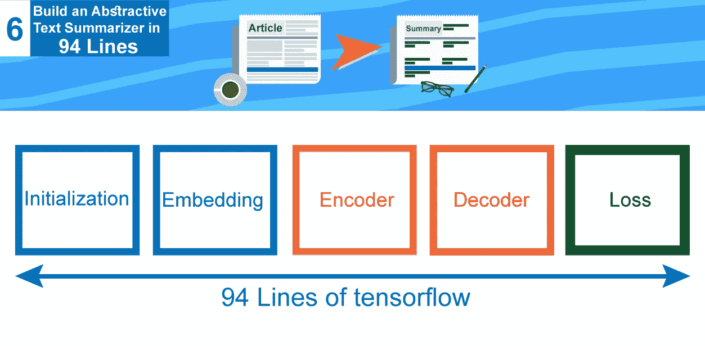
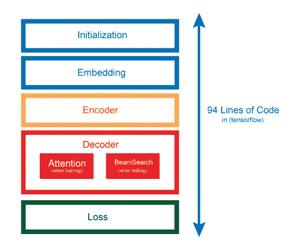
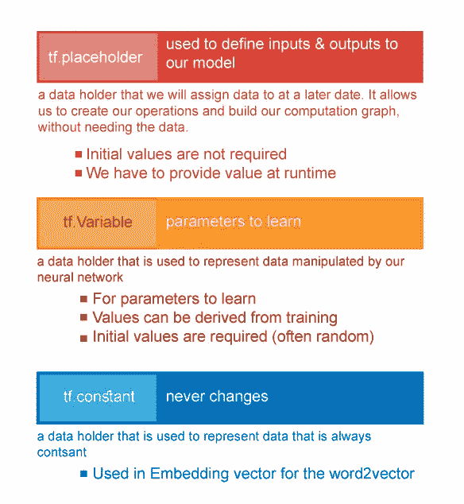
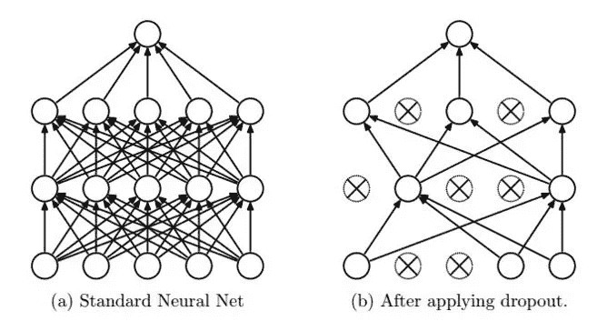

# 在 Tensorflow 的 94 行中构建一个抽象的文本摘要器！！(教程 6)

> 原文：<https://medium.com/hackernoon/build-an-abstractive-text-summarizer-in-94-lines-of-tensorflow-tutorial-6-f0e1b4d88b55>



本教程是一系列教程中的第六个，将帮助您使用 tensorflow 构建一个抽象的文本摘要器，今天我们将以优化的方式在 tensorflow 中构建一个抽象的文本摘要器。

> 今天，我们将浏览一个为这项任务构建的最优化的模型，这个模型是由 [**董军-李**](https://github.com/dongjun-Lee) 编写的，这是 [**到他的模型的链接**](https://github.com/dongjun-Lee/text-summarization-tensorflow) ，我已经在不同的数据集(不同的语言)上使用了他的模型，它产生了真正惊人的结果，所以我真的要感谢他的努力

我对模型进行了多次修改，使其能够在 google colab 上无缝运行([链接到我的模型](https://github.com/theamrzaki/text_summurization_abstractive_methods/tree/master/Implementation%20A%20(seq2seq%20with%20attention%20and%20feature%20rich%20representation)/Model%202))，并且我已经将数据托管到 google drive 上([更多关于如何将 google drive 链接到 google colab](https://hackernoon.com/begin-your-deep-learning-project-for-free-free-gpu-processing-free-storage-free-easy-upload-b4dba18abebc) )，因此不需要下载代码和数据，您只需要一个 google colab 会话来运行代码， 把我的谷歌硬盘里的数据复制到你的硬盘里(关于这个还有[，把谷歌硬盘连接到你的谷歌笔记本上)](https://hackernoon.com/begin-your-deep-learning-project-for-free-free-gpu-processing-free-storage-free-easy-upload-b4dba18abebc)


EazyMind free Ai-As-a-service for text summarization

我在一个网站上添加了一个文本摘要模型 [eazymind](http://bit.ly/2VxhPqU) ，这样你就可以实际尝试自己生成摘要(看看你能构建什么)，它可以通过简单的 api 调用来调用，并且通过一个 [python 包](http://bit.ly/2Ef5XnS)，这样文本摘要就可以很容易地集成到你的应用程序中，而不需要设置 tensorflow 环境的麻烦，你可以免费注册[，并享受免费使用这个 api 的乐趣。](http://bit.ly/2VxhPqU)

# 0-简介

## 0-A 关于系列

这是一系列教程，将帮助您使用 tensorflow 使用多种方法构建一个抽象的文本摘要器，我们称之为抽象，因为我们教导神经网络生成单词，而不仅仅是复制单词。

到目前为止我们已经讨论过了(这个系列的代码可以在[这里](https://github.com/theamrzaki/text_summurization_abstractive_methods)找到)

0.[深度学习免费生态系统概述](https://hackernoon.com/begin-your-deep-learning-project-for-free-free-gpu-processing-free-storage-free-easy-upload-b4dba18abebc)(如何使用 google colab 和 google drive)

1.  [概述文本摘要任务和用于该任务的不同技术](https://hackernoon.com/text-summarizer-using-deep-learning-made-easy-490880df6cd)
2.  [**使用的数据以及如何表示我们的任务**](https://hackernoon.com/abstractive-text-summarization-tutorial-2-text-representation-made-very-easy-ef4511a1a46) **(本教程的先决条件)**
3.  [什么是 seq2seq 文本摘要，为什么](https://hackernoon.com/tutorial-3-what-is-seq2seq-for-text-summarization-and-why-68ebaa644db0)
4.  [多层双向 LSTM/GRU](/@theamrzaki/multilayer-bidirectional-lstm-gru-for-text-summarization-made-easy-tutorial-4-a63db108b44f)
5.  [波束搜索&注意文本摘要](/@theamrzaki/beam-search-attention-for-text-summarization-made-easy-tutorial-5-3b7186df7086)

## 0-B 关于使用的数据

将被使用的数据将是新闻和它们的标题，它可以在我的 google drive 上找到，所以你只需将它复制到你的 google drive 上，而不需要下载它

> 我们将使用单词嵌入来表示数据，这只是将每个单词转换为一个特定的向量，我们将为我们的单词创建一个字典([更多关于这个](https://hackernoon.com/abstractive-text-summarization-tutorial-2-text-representation-made-very-easy-ef4511a1a46) ) **(本教程的先决条件)**

## 0-C 关于使用的型号

有不同的方法来完成这项任务，它们是建立在一个基础概念上的，并且它们会继续发展和建设。

今天，我们将开始构建这个基石实现，这是一种称为 RNN 的网络，它被安排在一个称为 seq2seq 的编码器/解码器架构中([详见本](https://hackernoon.com/tutorial-3-what-is-seq2seq-for-text-summarization-and-why-68ebaa644db0))，然后我们将在一个多层双向结构中构建 seq2seq，其中 rnn 小区将是一个 LSTM 小区([详见本](/@theamrzaki/multilayer-bidirectional-lstm-gru-for-text-summarization-made-easy-tutorial-4-a63db108b44f))， 然后，我们将添加一个注意机制，以更好地连接编码器和解码器(更多关于的[)，然后，为了生成更好的输出，我们使用了波束搜索的巧妙概念(更多关于](/@theamrzaki/beam-search-attention-for-text-summarization-made-easy-tutorial-5-3b7186df7086)的

所有这些不同方法的代码可以在[这里](https://github.com/theamrzaki/text_summurization_abstractive_methods)找到

所以让我们开始吧！！

# 模型结构

我们的模型被构造成不同的模块，这些模块是



## 初始化块:

这里我们将初始化所需的张量流**占位符** & **变量**，这里我们将定义将在整个模型中使用的 **RNN 单元格**

## 嵌入块:

这里我们将定义在**编码器** &和**解码器**中使用的嵌入矩阵

## 编码器模块:

在这里，我们将定义**多层双向 RNN** (在这个上有更多[)，它构成了我们模型的编码器部分，我们**输出编码器**状态作为解码器部分的输入](/@theamrzaki/multilayer-bidirectional-lstm-gru-for-text-summarization-made-easy-tutorial-4-a63db108b44f)

## 解码器模块:

这里，解码器实际上分为两个不同的部分

1.  **注意机制** ( [更多关于此](/@theamrzaki/beam-search-attention-for-text-summarization-made-easy-tutorial-5-3b7186df7086))用于更好地连接编码器和解码器，这将用于**训练**阶段
2.  **光束搜索** ( [更多关于这个](/@theamrzaki/beam-search-attention-for-text-summarization-made-easy-tutorial-5-3b7186df7086))用于从我们的模型产生更好的输出，这将用于**测试**阶段

## 损失区块:

这个模块将只在**训练**阶段使用，这里我们将对我们的梯度应用剪辑，我们将实际运行我们的优化器(这里使用 Adam 优化器)，这里是我们将梯度应用到优化器的地方。

# 1-初始化块

首先，我们需要导入我们将使用的库

```
import tensorflow as tf
from tensorflow.contrib import rnn  **#cell that we would use**
```

在构建我们的模型类之前，我们需要先定义一些张量流的概念



所以我们倾向于这样定义占位符

```
X = tf.placeholder(tf.int32, [None, article_max_len])
# here we define the input x as int32 , with promise to provide its # data in runtime
#
# we also provide its shape , where None is used for a dimension of # any size 
```

对于变量，我们倾向于把它们定义为

```
global_step = tf.Variable(0, trainable=False)
# a variable must be intialized , 
# and we can set it to either be trainable or not
```

然后让我们构建我们的**模型类**

```
class Model(object):
    def __init__(self, reversed_dict, article_max_len, summary_max_len, args, forward_only=False):
        self.vocabulary_size = len(reversed_dict)
        self.embedding_size = args.embedding_size
        self.num_hidden = args.num_hidden
        self.num_layers = args.num_layers
        self.learning_rate = args.learning_rate
        self.beam_width = args.beam_width
```

我们将传递一个名为 args 的 obj，它实际上包含来自

1.  嵌入大小(word2vector 的大小)
2.  num _ hidden(RNN 的大小)
3.  num _ layers(RNN 的层数)([更多关于这个](/@theamrzaki/multilayer-bidirectional-lstm-gru-for-text-summarization-made-easy-tutorial-4-a63db108b44f))
4.  学习率
5.  波束宽度([更多关于这个](/@theamrzaki/beam-search-attention-for-text-summarization-made-easy-tutorial-5-3b7186df7086)
6.  保留问题

我们还需要用其他参数初始化模型，如

1.  逆序字典(关键字字典，每个关键字都是一个指向特定顺序的数字)
2.  article _ max _ len & article _ summary _ len(作为输入的文章句子的最大长度和作为输出的摘要句子的最大长度)
3.  仅向前(布尔值表示训练或测试阶段)(**仅向前=假→训练阶段**)

然后继续初始化

```
if not forward_only: **#training phase**
            **#keep_prob as variable in training phase**
            self.keep_prob = args.keep_prob
else: **#testing phase**
            **#keep_prob constant in testing phase**
            self.keep_prob = 1.0

        **#here we would use LSTM as our cell**
        self.cell = tf.nn.rnn_cell.BasicLSTMCell 

        **#projection layer that would be used in decoder in both 
        #training and testing phase**
        with tf.variable_scope("decoder/projection"):
              self.projection_layer =  tf.layers.Dense(self.vocabulary_size, use_bias=False)

        **#define batch size(our data would be provided in batches)**
        self.batch_size = tf.placeholder(tf.int32, (), name="batch_size")

        **#X as input , define as length of articles** 
        self.X = tf.placeholder(tf.int32, [None, article_max_len])
        self.X_len = tf.placeholder(tf.int32, [None])

        **#define decoder (input , target , length) 
        #using the summary length** 
        self.decoder_input = tf.placeholder(tf.int32, [None, summary_max_len])
        self.decoder_len = tf.placeholder(tf.int32, [None])
        self.decoder_target = tf.placeholder(tf.int32, [None, summary_max_len])

        **#define global step beginning from zero** 
        self.global_step = tf.Variable(0, trainable=False)
```

# 2-嵌入块:

在这里，我们将使用 word2vector 来表示我们的**输入条目，它们将是嵌入式输入**和**解码器输入**(更多关于此的 #and you enable args.glove variable to true
if not forward_only and args.glove:
**#here we use tf.constant as we won't change it
#get_init_embedding is a function
#that returns the vector for each word in our dict**
init_embeddings = tf.constant(get_init_embedding(reversed_dict, self.embedding_size), dtype=tf.float32)
else: **#else random define the word2vector for testing**
init_embeddings = tf.random_uniform([self.vocabulary_size, self.embedding_size], -1.0, 1.0)
self.embeddings = tf.get_variable("embeddings", initializer=init_embeddings)
**#then define for both encoder input**
self.encoder_emb_inp = tf.transpose(tf.nn.embedding_lookup(self.embeddings, self.X), perm=[1, 0, 2])
**#and define for decoder input**
self.decoder_emb_inp = tf.transpose(tf.nn.embedding_lookup(self.embeddings, self.decoder_input), perm=[1, 0, 2])

# 3-编码器模块:

在这里，我们实际上为 seq2seq 的编码器部分定义了多层双向 lstm(在这个中有更多的[)，我们将在我们称之为“编码器”的命名范围中定义我们的变量。](/@theamrzaki/multilayer-bidirectional-lstm-gru-for-text-summarization-made-easy-tutorial-4-a63db108b44f)

这里我们将使用**退出**的概念，我们将在我们架构中的每个单元后使用它，它用于随机激活我们网络的子集，并在正则化训练期间使用。



```
with tf.name_scope("encoder"): fw_cells = [self.cell(self.num_hidden) for _ in range(self.num_layers)] bw_cells = [self.cell(self.num_hidden) for _ in range(self.num_layers)] fw_cells = [rnn.DropoutWrapper(cell) for cell in fw_cells] bw_cells = [rnn.DropoutWrapper(cell) for cell in bw_cells]
```

现在，在定义了前向和后向单元之后，我们需要将它们连接在一起以形成双向结构，因此我们将使用**stack _ bidirectional _ dynamic _ rnn**，它将以下所有参数作为其输入

1.  前向单元格
2.  反向单元格
3.  编码器 emb 输入(以 word2vector 格式输入文章)
4.  X_len(文章长度)
5.  使用 time_major = True 会更有效一点，因为它避免了在 RNN 计算的开始和结束时进行转置。

```
encoder_outputs, encoder_state_fw, encoder_state_bw = tf.contrib.rnn.stack_bidirectional_dynamic_rnn(
                fw_cells, bw_cells, self.encoder_emb_inp,
                sequence_length=self.X_len, time_major=True, dtype=tf.float32)
```

现在我们需要实际使用这个**stack _ bidirectional _ dynamic _ rnn**函数的输出，我们主要需要 2 个主输出

1.  encoder_output(将用于注意力计算)([更多关于注意力](/@theamrzaki/beam-search-attention-for-text-summarization-made-easy-tutorial-5-3b7186df7086))
2.  编码器状态(将用于解码器的初始状态)

因此，要获得编码器输出，我们只需

```
self.encoder_output = tf.concat(encoder_outputs, 2)
```

然后为了得到 encoder_state，我们将使用 LSTMStateTuple 组合正向和反向的(encoder_state_c)和(encoder_state_h)

```
encoder_state_c = tf.concat((encoder_state_fw[0].c, encoder_state_bw[0].c), 1)encoder_state_h = tf.concat((encoder_state_fw[0].h, encoder_state_bw[0].h), 1)self.encoder_state = rnn.LSTMStateTuple(c=encoder_state_c, h=encoder_state_h)
```

# 4 解码器模块:

这里解码器分为两部分

1.  训练部分(训练注意力模型)([更多关于注意力模型](/@theamrzaki/beam-search-attention-for-text-summarization-made-easy-tutorial-5-3b7186df7086))
2.  测试/运行部分(用于注意和光束搜索)([更多关于光束搜索](/@theamrzaki/beam-search-attention-for-text-summarization-made-easy-tutorial-5-3b7186df7086))

因此，让我们首先为这两个部分定义 out (name scope)和(variable scope)，我们还将定义一个多层单元结构，它也将用于这两个部分

```
with tf.name_scope("decoder"), tf.variable_scope("decoder") as decoder_scope:
            decoder_cell = self.cell(self.num_hidden * 2)
```

## 4 .训练部分(注意力模型)

首先，我们需要准备我们的注意力结构，这里我们将使用 BahdanauAttention

**encoder_output** 将在注意力计算中使用(更多关于注意力模型的

```
attention_states = tf.transpose(self.encoder_output, [1, 0, 2])
attention_mechanism = tf.contrib.seq2seq.BahdanauAttention(
                    self.num_hidden * 2, attention_states, memory_sequence_length=self.X_len, normalize=True)
```

然后我们将进一步定义解码器单元(从解码器的第一步开始，我们将解码器单元定义为一个简单的多层 lstm，现在我们将添加 attention)，为此我们将使用 **AttentionWrapper** ，它将 attention_mechanism 与解码器单元结合在一起

```
decoder_cell = tf.contrib.seq2seq.AttentionWrapper(decoder_cell, attention_mechanism,                                                                 attention_layer_size=self.num_hidden * 2)
```

现在，我们需要定义解码器单元的输入，该输入实际上来自 2 个来源(seq2seq 上的self.decoder_output = outputs.rnn_output**#then get logits , by performing a transpose on decoder output** self.logits = tf.transpose(self.projection_layer(self.decoder_output), perm=[1, 0, 2])**#then reshape the logits** self.logits_reshape = tf.concat(
[self.logits, tf.zeros([self.batch_size, summary_max_len - tf.shape(self.logits)[1], self.vocabulary_size])], axis=1)

## 4.b 测试/运行部分(注意和光束搜索)

在此阶段，有两个主要目标

1.  将编码器输出和编码器状态& x_len(物品长度)分成多个部分，以实际执行光束搜索方法([更多关于光束搜索的信息](/@theamrzaki/beam-search-attention-for-text-summarization-made-easy-tutorial-5-3b7186df7086)
2.  构建一个独立于解码器输入的解码器，因为在测试阶段我们没有摘要句子作为输入，所以我们需要以不同于上面的方式构建解码器

首先，让我们将编码器输出和编码器状态& x_len(物品长度)分成几部分，以实际执行光束搜索方法，这里我们将使用上面已经定义的**光束宽度**变量

```
tiled_encoder_output = tf.contrib.seq2seq.tile_batch(
                    tf.transpose(self.encoder_output, perm=[1, 0, 2]), multiplier=self.beam_width)tiled_encoder_final_state = tf.contrib.seq2seq.tile_batch(self.encoder_state, multiplier=self.beam_width)

tiled_seq_len = tf.contrib.seq2seq.tile_batch(self.X_len, multiplier=self.beam_width)
```

然后让我们定义注意机制(就像前面一样，但是要考虑平铺变量)

```
attention_mechanism = tf.contrib.seq2seq.BahdanauAttention(
                    self.num_hidden * 2, tiled_encoder_output, memory_sequence_length=tiled_seq_len, normalize=True)decoder_cell = tf.contrib.seq2seq.AttentionWrapper(decoder_cell, attention_mechanism,                                                                 attention_layer_size=self.num_hidden * 2)initial_state = decoder_cell.zero_state(dtype=tf.float32, batch_size=self.batch_size * self.beam_width)

initial_state = initial_state.clone(cell_state=tiled_encoder_final_state)
```

然后让我们定义我们的解码器，但是这里我们将使用 **BeamSearchDecoder** ，这考虑了所有的

1.  解码器单元(先前定义)
2.  嵌入 word2vector(在嵌入部分定义)
3.  投影层(在课程开始时定义)
4.  解码器初始状态(先前定义)
5.  光束宽度(用户定义)
6.  开始令牌和结束令牌

```
decoder = tf.contrib.seq2seq.BeamSearchDecoder(
                    cell=decoder_cell,
                    embedding=self.embeddings,
                    start_tokens=tf.fill([self.batch_size], tf.constant(2)),
                    end_token=tf.constant(3),
                    initial_state=initial_state,
                    beam_width=self.beam_width,
                    output_layer=self.projection_layer )
```

剩下要做的就是定义输出，它实际上会直接反映整个 seq2seq 架构的实际输出，因为这一阶段是实际计算预测的阶段

```
outputs, _, _ = tf.contrib.seq2seq.dynamic_decode(
                    decoder, output_time_major=True, maximum_iterations=summary_max_len, scope=decoder_scope)self.prediction = tf.transpose(outputs.predicted_ids, perm=[1, 2, 0])
```

# 5-损失区块:

这一块是训练实际发生的地方，这里训练实际上是通过多个步骤发生的

1.  计算损失([关于损失计算的更多信息](https://hackernoon.com/tutorial-3-what-is-seq2seq-for-text-summarization-and-why-68ebaa644db0))
2.  计算渐变并在渐变上应用剪辑(更多关于分解渐变的内容
3.  应用优化器(这里我们将使用 Adam 优化器)

首先，我们定义我们的名称范围，我们将指定这个块只在训练阶段有效

```
with tf.name_scope("loss"):
            if not forward_only:
```

其次，我们将计算损失([更多关于损失计算](https://hackernoon.com/tutorial-3-what-is-seq2seq-for-text-summarization-and-why-68ebaa644db0)

```
crossent = tf.nn.sparse_softmax_cross_entropy_with_logits(
                    logits=self.logits_reshape, labels=self.decoder_target)weights = tf.sequence_mask(self.decoder_len, summary_max_len, dtype=tf.float32)self.loss = tf.reduce_sum(crossent * weights / tf.to_float(self.batch_size))
```

第三，我们将计算我们的梯度，并应用剪辑梯度，以解决问题的爆炸梯度([更多关于爆炸梯度](https://hackernoon.com/multilayer-bidirectional-lstm-gru-for-text-summarization-made-easy-tutorial-4-a63db108b44f))

> **(** [**出自教程 4**](https://hackernoon.com/multilayer-bidirectional-lstm-gru-for-text-summarization-made-easy-tutorial-4-a63db108b44f) **)**
> 
> **爆炸梯度:**发生在深层网络中(即:有许多层*的网络，就像我们的例子一样)，当我们应用反向传播时，梯度会变得太大。实际上，使用**梯度削波**的概念，可以很容易地解决这个误差，这只是简单地设置一个特定的阈值，当梯度超过阈值时，我们会将其削波到某个值。*

```
params = tf.trainable_variables()
gradients = tf.gradients(self.loss, params)
clipped_gradients, _ = tf.clip_by_global_norm(gradients, 5.0)
```

第四，我们将应用我们的优化器，这里我们将使用 Adam 优化器，这里我们将使用之前定义的 learning_rate

```
optimizer = tf.train.AdamOptimizer(self.learning_rate)self.update = optimizer.apply_gradients(zip(clipped_gradients, params), global_step=self.global_step)
```

如果上帝愿意，下一次我们会去的

1.  将我们的数据分成批次所需的代码
2.  需要代码来使用此模型进行培训

然后，在我们完成了这个核心模型的实现之后，如果上帝愿意的话，我们将使用其他的现代实现来实现文本摘要，比如

1.  指针发生器
2.  通过 seq2seq 使用强化学习

([更多关于文本摘要 seq2seq 的不同实现](https://hackernoon.com/text-summarizer-using-deep-learning-made-easy-490880df6cd?source=post_stats_page---------------------------))

本教程的所有代码都可以在这里找到。

> *我真心希望你喜欢阅读这个教程，我希望我已经把这些概念讲清楚了，这一系列教程的所有代码都可以在这里找到*[](https://github.com/theamrzaki/text_summurization_abstractive_methods)**，你可以简单地使用 google colab 来运行它，请查看教程并告诉我你对它的看法，希望再次见到你**

# *后续教程*

*   *[用于文本摘要的抽象&提取方法的组合(教程 7)](http://bit.ly/2EhcRIZ)*