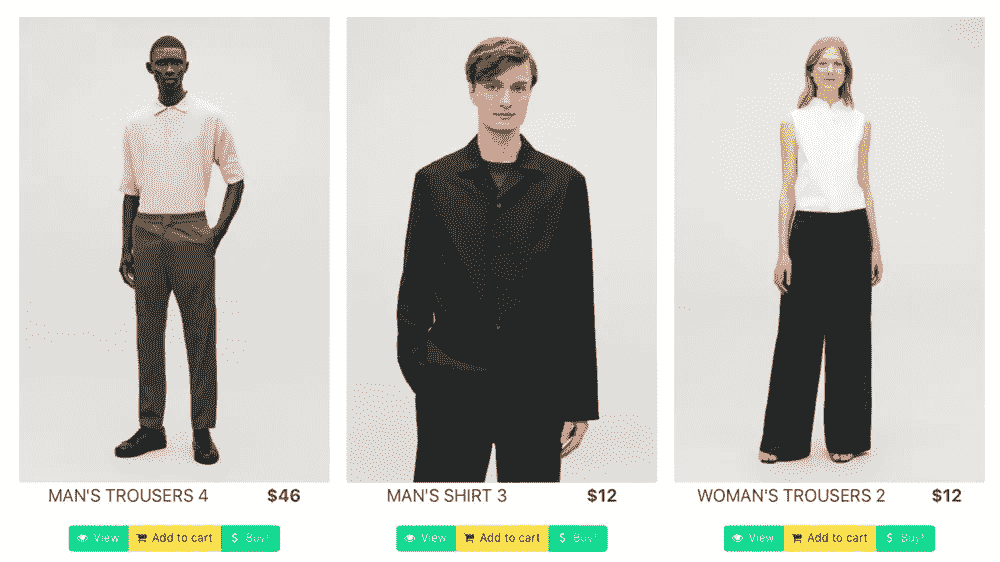
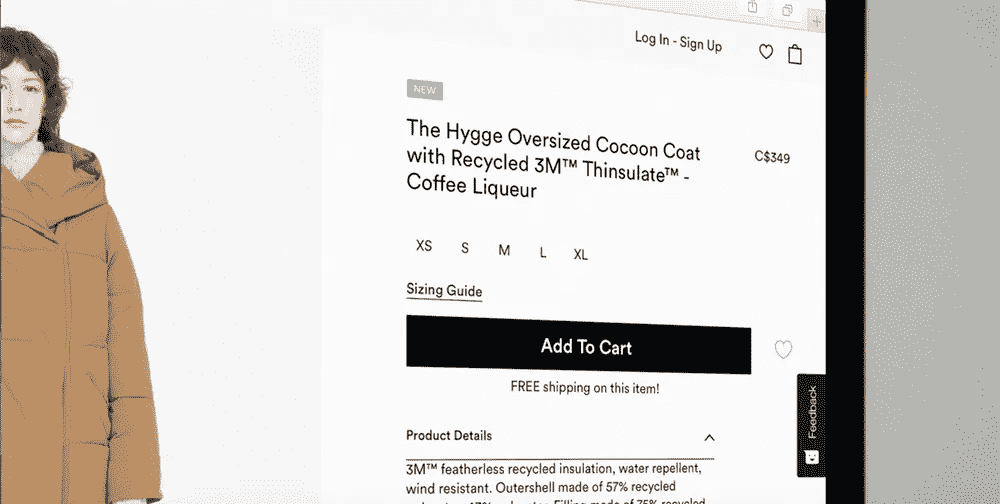

# 使用 Angular 和 Cosmic JS 构建一个个性化的电子商务应用程序

> 原文：<https://medium.com/hackernoon/build-an-ecommerce-app-with-personalization-using-angular-and-cosmic-js-9eba6f33b042>



*本文将假设 Angular 的一些基本知识，以便它可以专注于手头的特定任务。如果您对实施过程中的任何细节有不清楚的地方，请随时问我*

# TL；速度三角形定位法(dead reckoning)

看一看[库](https://github.com/cosmicjs/angular-ecommerce-personalization)和[安装 app](https://cosmicjs.com/apps/ecommerce-personalization) ，或者[查看演示](https://cosmicjs.com/apps/ecommerce-personalization/demo)。

# 我们将要建造的

这个网站将是一个非常简单的电子商务网站的代表。其目的是展示我们如何为每个人提供定制的体验。我们的数据将由 Cosmic JS 存储和服务，我们将使用 Angular 作为我们的前端。



# 它将如何工作

我们的店面将只是一个产品列表页面，显示所有存储在宇宙 JS 中的产品，随机排序。产品将属于多个类别，每个产品将显示 3 个按钮来模拟以下行为:

*   视图->值:1
*   添加到购物车->值:2
*   购买->价值:3

这些将代表不同程度的兴趣。

用户将与网站互动，他们的兴趣将存储在他们的个人资料中，增加每个产品类别的相应价值。

一个完整的交互应该是这样的:用户点击“购买”一个“泳装”产品，增加其属于“泳装”产品的简介分数。然后，页面将对页面进行排序，更突出地显示属于“泳装”的产品。

# 准备我们的桶

我们要做的第一件事是准备我们的宇宙 JS 桶。我们必须创建一个空桶和三种对象类型:

*   种类
*   制品
*   用户

每个`user`将为`interests`存储一个`sessionID`和一个 JSON 对象。
每个`product`都会有一个`price`，一个`categories`的集合和一个`image`。
类别不需要任何元数据，我们将只使用它的`title`。

如果你像我一样懒，你总是可以**通过[安装 app](https://cosmicjs.com/apps/ecommerce-personalization) 来复制演示桶**。

# 准备场地

我们需要做的第一件事是创建一个新的 Angular 站点(我总是推荐使用 CLI 来完成)。现在，让我们创建一个 HTTP 拦截器来处理针对 Cosmic JS API 的认证，所以我们不需要在每个调用中都添加这个。它将为 GET 请求附加`read_key`参数，为其他所有请求附加`write_key`。

```
@Injectable({ providedIn: 'root' })
export class CosmicInterceptor implements HttpInterceptor {
  intercept(req: HttpRequest<any>, next: HttpHandler): Observable<HttpEvent<any>> {
    if (req.url.match(/api.cosmicjs/)) {
      let params = new HttpParams({ fromString: req.params.toString() });
      if (req.method === 'GET') {
        params = params.append('read_key', environment.read_key); req = req.clone({
          params: params
        });
      } else {
        let payload = JSON.parse(req.body);
        payload.write_key = environment.write_key; req = req.clone({
          body: payload
        });
      }
    }
    return next.handle(req);
  }
}
```

产品列表将是我们唯一的页面，因此在创建组件之后，我们的路由应该如下所示:

```
const routes: Routes = [{ path: '', component: ProductListingComponent }];
```

# 产品列表页面

我们需要展示产品，所以让我们定义我们的模型:

```
import { Category } from './category';export class Product {
  _id: string;
  slug: string;
  title: string;
  price: string;
  categories: Category[];
  image: string; constructor(obj) {
    this._id = obj._id;
    this.slug = obj.slug;
    this.title = obj.title;
    this.price = obj.metadata.price;
    this.image = obj.metadata.image.url;
    this.categories = []; if (obj.metadata && obj.metadata.categories) {
      obj.metadata.categories.map(category => this.categories.push(new Category(category)));
    }
  }
}
```

**我们稍后会在那里讨论类别。*

现在让我们开始用方法填充我们的服务。首先，我们需要一个`getProducts()`方法:

```
private products$: Observable<Product[]>;getProducts(): Observable<Product[]> {
    if (!this.products$) {
      this.products$ = this.http.get<Product[]>(this.productsUrl).pipe(
        tap(_ => console.log('fetched products')),
        map(_ => {
          return _['objects'].map(element => new Product(element));
        }),
        shareReplay(1),
        catchError(this.handleError('getProducts', []))
      );
    }
    return this.products$;
  }
```

**我们正在缓存响应，我们的产品不会经常改变，我们会经常调用这个方法……*

组件本身将非常简单。现在，它只会调用两个对我们服务的调用:

```
import { Component, OnInit } from '@angular/core';
import { CosmicService } from 'src/app/core/_services/cosmic.service';
import { Product } from '@models/product';
import { UserService } from 'src/app/core/_services/user.service';
import { User } from '@models/user';@Component({
  selector: 'app-product-listing',
  templateUrl: './product-listing.component.html',
  styleUrls: ['./product-listing.component.scss']
})
export class ProductListingComponent implements OnInit {
  public productList: Product[];
  public user: User; constructor(private cosmicService: CosmicService, private userService: UserService) {} ngOnInit() {
    this.userService.user$.subscribe(user => {
      this.user = user;
    });
    this.cosmicService.getProducts().subscribe(products => (this.productList = products));
  }
}
```

这是 HTML:

```
<div class="columns" *ngIf="productList && user">
  <ng-container *ngFor="let product of (productList | customSort:user.interests)">
          <div class="product-tile column is-one-third">
            
            <div class="level is-size-4 is-uppercase">
                <span class="level-item">{{product.title}}</span>
                <span class="level-item has-text-weight-bold">${{product.price}}</span>
            </div>
            <app-actions [product]="product"></app-actions>
          </div>
  </ng-container>
</div>
```

你注意到那个`app-actions`组件了吗？它将负责用户将对每个产品执行的操作。不过我们先来谈谈那之前的`user`...

# 关于用户的一切

我们的用户模型将是最“复杂”的。因为我们将从站点创建用户，并从 Cosmic JS 中检索他们，所以我们需要一个更灵活的构造器。我们还添加了一些方法来构建一个有效负载对象，用于向 Cosmic JS 发布内容，以及另一个用于管理兴趣的对象。

```
import { Category } from './category';export class User {
  _id: string;
  slug: string;
  interests: JSON; constructor(obj?) {
    this._id = obj ? obj._id : '';
    this.slug = obj ? obj.slug : '';
    this.interests = obj ? JSON.parse(obj.metadata.interests) : {};
  } postBody() {
    return {
      title: this.slug,
      type_slug: 'users',
      metafields: [
        {
          key: 'interests',
          value: JSON.stringify(this.interests)
        }
      ]
    };
  } putBody() {
    return {
      title: this.slug,
      slug: this.slug,
      metafields: [
        {
          key: 'interests',
          value: JSON.stringify(this.interests)
        }
      ]
    };
  } increaseInterest(category: Category, weight: number) {
    if (!this.interests[category.title]) {
      this.interests[category.title] = weight;
    } else {
      this.interests[category.title] += weight;
    }
  }
}
```

我们不会为我们的示例构建一个合适的身份验证过程。每个用户在浏览器的本地存储中都有一个 sessionID，我们将使用它来创建和标识用户。为了方便起见，我们将用户实例保存在会话存储中。为了保持整洁，让我们创建一个`user`服务:

```
import { Injectable } from '@angular/core';
import { User } from '@models/user';
import { CosmicService } from './cosmic.service';
import { BehaviorSubject } from 'rxjs';@Injectable({
  providedIn: 'root'
})
export class UserService {
  private userSource = new BehaviorSubject<User>(new User());
  public user$ = this.userSource.asObservable(); constructor(private cosmicService: CosmicService) {} init() {
    let sessionID = localStorage.getItem('sessionID'); if (!sessionID) {
      const user = new User(); sessionID = Math.random()
        .toString(36)
        .substr(2, 9); localStorage.setItem('sessionID', sessionID);
      user.slug = sessionID; this.cosmicService.setUser(user).subscribe(user => {
        this.setSessionUser(user);
      });
    } else if (!sessionStorage.getItem('user')) {
      this.cosmicService.getUser(sessionID).subscribe(user => this.setSessionUser(user));
    }
  } setSessionUser(user: User) {
    sessionStorage.setItem('user', JSON.stringify(user));
    this.userSource.next(user);
  } getSessionUser(): User {
    const user = sessionStorage.getItem('user'); if (user) {
      return Object.assign(new User(), JSON.parse(user));
    } else {
      return null;
    }
  }
}
```

`init()`方法将用于我们的`app.component.ts`:

```
constructor(private userService: UserService) {} ngOnInit() {
    this.userService.init();
  }
```

我们还需要一种设置和获取用户的方法，让我们用以下方法扩展我们的`cosmic.service`:

```
getUser(slug: string): Observable<User> {
    const url = `${this.singleObjectUrl}/${slug}`;
    return this.http.get<User>(url).pipe(
      tap(_ => console.log(`fetched user: ${slug}`)),
      map(_ => {
        return new User(_['object']);
      }),
      catchError(this.handleError<User>(`getUser: ${slug}`))
    );
  } setUser(user: User) {
    return this.http.post<User>(this.addObjectPath, JSON.stringify(user.postBody())).pipe(
      map(_ => {
        return new User(_['object']);
      }),
      catchError(this.handleError<User>())
    );
  }
```

另外，请注意，我们创建了一个可观察的`user$`,每次我们在会话中设置(或更新)用户时都会发出这个消息，您已经在产品列表上看到了订阅。在文章的最后有更多关于这个的内容。

回到`actions.component`。这是一组三个按钮，如下所示:

```
<div class="buttons has-addons is-centered">
  <a class="button is-primary" (click)="viewProduct()">
    <span class="icon is-small">
      <i class="fa fa-eye"></i>
    </span>
    <span>View</span>
  </a>
  <a class="button is-warning" (click)="addProductToCart()">
    <span class="icon is-small">
      <i class="fa fa-shopping-cart"></i>
    </span>
    <span>Add to cart</span>
  </a>
  <a class="button is-success" (click)="buyProduct()">
    <span class="icon is-small">
      <i class="fa fa-dollar"></i>
    </span>
    <span>Buy!</span>
  </a>
</div>
```

这些方法看起来像这样:

```
@Input() product: Product; viewProduct() {
    this.increaseInterest(1);
  } addProductToCart() {
    this.increaseInterest(2);
  } buyProduct() {
    this.increaseInterest(3);
  } increaseInterest(weight: number) {
    const user: User = this.userService.getSessionUser();
    this.product.categories.forEach((category: Category) => {
      user.increaseInterest(category, weight);
    }, this); this.userService.setSessionUser(user);
    this.cosmicService.updateUser(user).subscribe();
  }
```

当更新兴趣时，我们也在会话中刷新用户，我们也在 Cosmic JS 中更新用户，我们永远不知道用户何时或如何离开网站！让我们回到我们的`cosmic.service`并添加这个方法:

```
updateUser(user: User) {
    return this.http.put<User>(this.editObjectPath, JSON.stringify(user.putBody())).pipe(
      map(_ => {
        return new User(_['object']);
      }),
      catchError(this.handleError<User>())
    );
  }
```

# 包装好一切

我们现在有办法展示产品，创造用户和他们的兴趣，更新和存储它们。就这样…差不多了。基于这一切，产品列表页面会有怎样的变化？还有最后一件事我们还没有完成 customSort 管道。它看起来是这样的:

```
@Pipe({
  name: 'customSort'
})
export class CustomSortPipe implements PipeTransform {
  transform(value: Product[], interests: JSON): Product[] {
    value.sort((a: Product, b: Product) => {
      const aWeight = this.getWeight(a.categories, interests);
      const bWeight = this.getWeight(b.categories, interests); if (aWeight < bWeight) {
        return 1;
      } else if (aWeight > bWeight) {
        return -1;
      } else {
        return 0;
      }
    });
    return value;
  } getWeight(categories: Category[], interests: JSON) {
    let weight = 0;
    categories.forEach(category => {
      weight += interests[category.title] || 0;
    });
    return weight;
  }
}
```

该管道将获取产品列表，并根据参数提供的用户兴趣按重量排序…

神奇之处在于:产品列表页面订阅了会话用户中的更改，因此每次用户执行一个操作时，用户都会更改，排序会随着更改而重新执行。

就这些，我希望这已经展示了如何在 Angular 和 Cosmic JS 的帮助下为你的用户提供定制的体验。