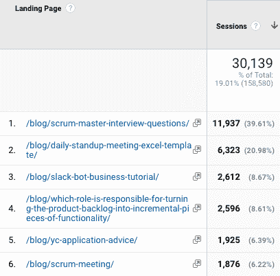
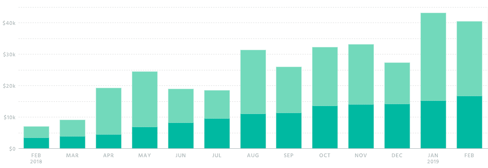

# 在 Slack 上建立业务—使用 Slack-first 应用程序每月花费 8 万美元

> 原文：<https://medium.com/hackernoon/building-a-business-on-slack-80k-mo-with-a-slack-first-app-80eb79ab6cfb>

## Slack 不仅仅是一款聊天应用；这是一个建立稳固业务的生态系统。

虽然 Slack 正在为 IPO 做准备，但其应用生态系统仍在不断发展，成为一个创业的平台。Slack-first 应用程序 Standuply 在 2019 年 2 月实现了 8 万美元的收入。

> 我是 Alex Kistenev，Standuply 的首席执行官兼联合创始人，负责营销。这篇文章是关于我将一个 Slack 应用增长到每月 8 万美元的经历。

# 产品竞争

如果你[在 Slack 应用目录中搜索“stand up”](https://slack.com/apps/search?q=standup)，你会发现 Standuply 排名第一，其他 30 个竞争应用都落在后面。我们是这样做的。

## 激光聚焦

有 web 开发工作室做的 Slack apps。他们感受到了痛苦，拥有了资源，最终制造出了最初的产品。但这只是一个开始。

比较在同一领域工作的两个团队。

A 队有客户，有其他工作要做，他们的营销资源有限。团队 B 倾其所有，所有的努力都集中在一个产品上。

很明显，如果两个队的资源相当，B 队有更好的机会。

> **关键要点**:当缩小关注范围时，你有可能击败那些分散资源的人。

## 利基洞察

artem(Standuply 的产品主管)有十年的项目管理经验。这帮助他见证了敏捷团队中的问题。

Artem 知道哪些流程需要自动化，并设想如何通过 Slack API 来实现。我们花了几个月的时间来实现敏捷流程的自动化，这是无人能及的(例如，待办事项整理，规划扑克)。

> Standuply 是我在 Slack 中见过的比较聪明的工作流工具之一。— Ryan Hoover，Product Hunt 的创始人。

> 关键要点:小众体验在理解需要构建什么方面发挥了巨大作用。

## 完美的产品

如今，许多初创公司的人都痴迷于完美主义(我也是)。然而，如果你要构建一个理想的产品，这可能会很棘手。

通往创业墓地的道路是为少数用户制造功能，而不是为大多数用户构建核心功能。

我们总是把价值放在次要的功能和花哨的东西之上。是的，有时用户对此不高兴，有些人甚至因此而离开。

但是，这些年来，我们设法建立了一个有价值的产品，同时挤压了一些不那么重要的改进。

> **关键外卖**:不要陷入打造完美产品的陷阱；先争取价值。

# 营销一款 Slack 应用

以下是我们营销的方法。有时行得通，有时行不通。

## 内容营销

受 [Groove 的博客](https://www.groovehq.com/blog/)的启发，我们决定跟随他们的道路，分享我们如何经营业务的见解。

我准备了十几篇文章，花了大量时间做影响者外联，并试图每周发布一篇新的博客文章。但是没有用。

我们的大多数帖子收到了 1-2k 的读者，只有少数线索进来。推广部分是一个挑战——我们无法建立一个持续的读者流。

然后，我们开始尝试 SEO，并取得了不错的结果——每月有成千上万的读者阅读新创作的文章。

Data: 1 Aug 2018–1 Jan 2019

然而，只有几篇文章带来了线索，其他人的读者只是路过。Standuply 是 story drive leads 的重要组成部分的帖子。

> **关键要点**:当你把关于你的产品的优秀内容部分地结合起来，并从 SEO 开始时，内容营销就起作用了。

## 引人注目的特征

我们正在根据我们的愿景构建功能。然而，有时我们发现的东西不仅增加了价值，而且在 Standuply 周围引起了轰动。

这就是我们如何通过 Standuply 在 Slack 中建立 [Slack 民意调查](https://standuply.com/slack-poll)、[语音](https://standuply.com/voice-messages-in-slack)和[视频](https://standuply.com/video-messages-in-slack)消息。今天，每天有几十条线索只针对这些功能。

我们在产品搜索上发布这些功能，并在互联网上传播。产品搜索是传播产品重大更新消息的一个很好的来源。

> **关键要点**:使用吸引人的功能作为一种营销方式来传播关于你的产品的消息。

## 辅助项目

副业可能会吸引人们对你产品的注意。下面是我们实验过的:360 AI/区块链会议列表[2000 Slack 社区列表](https://standuply.com/conferences)2000 Slack 社区列表电子书[如何使用 Slack](https://standuply.com/how-to-use-slack) 。

我们学到了与内容营销相同的东西:相关性、高价值、SEO 焦点。

未发行的材料(区块链会议)尽管流量巨大，却没有带来任何线索。相比之下，Slack 社区带给我们的不仅是 Slack 生态系统中的认可，还有数百条线索。

## 相扑

AppSumo 是互联网上最大的软件交易网站，拥有 100 万用户。我们是 AppSumo 的特色，它给我们带来了超过 45，000 美元的销售额。

想把你的软件产品卖给他们所有人吗？它是这样工作的。

1.  获得介绍。这增加了被报道的机会。
2.  准备好以一个固定的(非常低的)价格卖出一笔终身交易。
3.  确保你的支持团队准备好应对一大群会问很多问题的新手。

现在坐下来放松，AppSumo 会给你带来很多新的销售。

您当前的一些客户可能会从定期订阅转向终身交易。但是在我们的例子中，只有少数几个。

> **关键要点** : AppSumo 通过出售大量有限的交易，是初创公司初始资金的重要来源。

# 先创业

我们很幸运在没有任何外部投资的情况下盈利。因此，我们摆脱了投资者对我们的增长和公司规模的预期。

我目睹了无数创业公司因为对增长的痴迷和错误的预期而遇到的麻烦。你必须小心成长，不要过量。

我们不急于招聘和营销支出，而是选择增加我们生存机会的速度，专注于建立稳定的业务。

> **关键要点**:成长很重要，但要三思而后行，要么全力以赴，要么退出游戏。

## 十亿美元的生意

如何才能建立一个十亿美元的企业？我们想了很多，但没有找到答案。

去年秋天，我在喝咖啡时遇到了埃丝特·戴森，向她征求意见。我确信她能向金玉良言揭示一个松散的第一公司如何有一天成为独角兽。

但这是她告诉我的。

> *不是每个公司都应该成为十亿美元的公司。拥抱你的道路，沿着它走，不要被别人分心。—威尔维尔的创始人埃丝特·戴森。*

后来我意识到这是多么明智的建议。作为一个团队，我们关心的是建立一种企业，在这种企业中，我们享受我们的工作，作为专业人士成长，并拥有对我们自由的控制权。

> **关键外卖**:想想怎么才能成为独角兽没问题，但是如果你还没有答案(还没有)就不要分心。

## 结果是:8 万美元/月

这一切都有助于我们的收入增长。请看下面由 [ProfitWell](https://profitwell.com) 确认的数据。

2018 年 2 月: **$7，131** 信用卡销售额。

2019 年 2 月:

*   **信用卡销售额为 40，490 美元；**
*   ****:通过 AppSumo 实现 33，807 美元**的销售额。**

**将我们在 2 月份完成的几份年度合同加起来，总收入为 8 万美元。值得一提的是，去年的整体营销预算约为 1 万美元。**

> ****关键要点**:了解你真实的生活方式可能是一项巨大的投资。并非专家所说的一切都适用于你的企业。只有你自己知道什么对你好。**

****看看我以前的故事:****

**[*选择卡斯帕钱包——存放 CSPR 的最佳方式*](/staking-times/choosing-a-casper-wallet-c96d512d3982)**

**[*哪里可以买到卡斯珀(CSPR)币——截至 2022 年的最佳交易所*](/staking-times/where-to-buy-casper-cspr-coin-in-2022-2e041ed675a)**

**[*如何在 2022 年下注卡斯珀币(CSPR)并计算你的奖励*](/staking-times/how-to-stake-casper-coins-cspr-in-2022-and-calculate-your-rewards-dc5d31a04e63)**

**图片鸣谢: [Unsplash](https://unsplash.com/photos/pElSkGRA2NU) 。**