# 用 Python 从头开始构建前馈神经网络

> 原文：<https://medium.com/hackernoon/building-a-feedforward-neural-network-from-scratch-in-python-d3526457156b>


Photo by [Chris Ried](https://unsplash.com/@cdr6934?utm_source=medium&utm_medium=referral) on [Unsplash](https://unsplash.com?utm_source=medium&utm_medium=referral)

在这篇文章中，我们将看到如何用 python 从头开始实现前馈神经网络。这是我上一篇关于[前馈神经网络](https://hackernoon.com/deep-learning-feedforward-neural-networks-explained-c34ae3f084f1)的文章的后续。

> 引用说明:本文的内容和结构基于四分之一实验室——[pad hai](https://padhai.onefourthlabs.in/)的深度学习讲座。

# 前馈神经网络

前馈神经网络也被称为**多层神经元网络** (MLN)。这些模型网络被称为前馈，因为信息仅在神经网络中向前传播，通过输入节点，然后通过隐藏层(单层或多层)，最后通过输出节点。


Generic Network with Connections

传统模型，如麦卡洛克皮茨，感知器和 Sigmoid 神经元模型的能力仅限于线性函数。为了处理输入和输出之间复杂的非线性决策边界，我们使用了多层神经元网络。

为了理解前馈神经网络学习算法和网络中存在的计算，请参考我以前关于前馈神经网络的文章。

[](https://hackernoon.com/deep-learning-feedforward-neural-networks-explained-c34ae3f084f1) [## 深度学习:解释前馈神经网络

### 你的第一个深度神经网络

hackernoon.com](https://hackernoon.com/deep-learning-feedforward-neural-networks-explained-c34ae3f084f1) 

# 编码部分


Photo by [Hitesh Choudhary](https://unsplash.com/@hiteshchoudhary?utm_source=medium&utm_medium=referral) on [Unsplash](https://unsplash.com?utm_source=medium&utm_medium=referral)

在编码部分，我们将涉及以下主题。

1.  **生成不可线性分离的数据**
2.  **用乙状结肠神经元训练并观察表现**
3.  **从头开始编写我们的第一个前馈网络**
4.  **根据数据训练 FF 网络，并与 Sigmoid 神经元进行比较**
5.  **为一个 FF 网络写一个通用类**
6.  **训练二元分类的类属**
7.  **使用交叉熵损失函数为多类数据训练 FF 网络**

如果你想跳过理论部分，直接进入代码，

[](https://github.com/Niranjankumar-c/Feedforward_NeuralNetworrks) [## niranjankumar-c/前馈 _ 神经网络

### 从头开始构建我们的神经网络。通过…为 Niranjankumar-c/前馈神经网络的发展做出贡献

github.com](https://github.com/Niranjankumar-c/Feedforward_NeuralNetworrks) 

*PS:如果你有兴趣把代码转换成* ***R，*** *一旦完成就给我发消息我会在这里和 GitHub 页面上展示你的作品。*

在开始构建我们的网络之前，首先我们需要导入所需的库。我们导入`numpy`来评估两个向量之间的矩阵乘法和点积，`matplotlib`来可视化数据，从`sklearn`包中导入函数来生成数据和评估网络性能。

# 生成虚拟数据

请记住，我们使用前馈神经网络是因为我们想要处理非线性可分数据。在本节中，我们将了解如何随机生成非线性可分数据。

为了随机生成数据，我们将使用`make_blobs`生成高斯分布的点。我在 2D 空间生成了 1000 个数据点，用四个 blob`centers=4`作为多类分类预测问题。每个数据点有两个输入和 0、1、2 或 3 个类别标签。**第 9、10 行**中的代码有助于使用散点图可视化数据。我们可以看到，它们有 4 个中心，数据是线性可分的(几乎)。

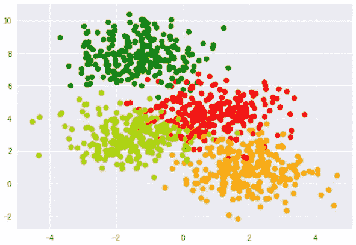

Multi-Class Data

在上面的图中，我能够用一个简单的散点图用颜色表示 3 个维度——2 个输入和类别标签。注意`make_blobs()`函数会生成线性可分的数据，但是我们需要有非线性可分的数据进行二分类。

```
labels_orig = labels
labels = np.mod(labels_orig, 2)
```

将这 4 个类转换为二进制分类的一种方法是将这 4 个类的余数除以 2，这样我就可以得到新的标签 0 和 1。

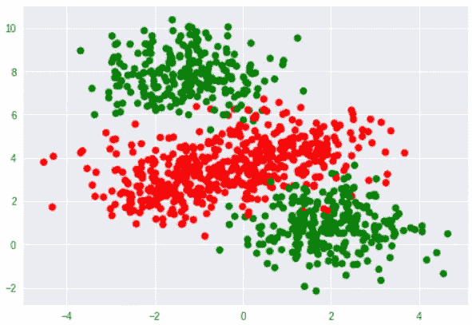

Binary Class Data

从该图中，我们可以看到斑点的中心被合并，使得我们现在有一个二元分类问题，其中决策边界不是线性的。一旦我们准备好数据，我已经使用了`train_test_split`函数以 90:10 的比例分割`training`和`validation`的数据

# 用乙状结肠神经元训练

在我们开始训练关于乙状结肠神经元的数据之前，我们将在名为*乙状结肠神经元的类中构建我们的模型。*

在`SigmoidNeuron`类中，我们有 9 个函数，我将一个接一个地向你介绍这些函数，并解释它们在做什么。

```
def __init__(self):    
    self.w = None    
    self.b = None
```

`__init__`函数(构造函数)有助于将 s 形神经元 **w** 权重和 **b** 偏差的参数初始化为无。

```
#forward pass    
def perceptron(self, x):  
    return np.dot(x, self.w.T) + self.bdef sigmoid(self, x):    
    return 1.0/(1.0 + np.exp(-x))
```

接下来，我们将定义两个函数`perceptron`和`sigmoid`，这两个函数表征了正向传递。在乙状结肠神经元的情况下，正向传递包括两个步骤

1.  `perceptron` —计算输入**x**权重 **w** 之间的点积，并加上偏差 **b**
2.  `sigmoid` —获取感知器的输出，并在其上应用 sigmoid(逻辑)函数。

```
#updating the gradients using mean squared error loss  
def grad_w_mse(self, x, y):
    .....def grad_b_mse(self, x, y):
    .....#updating the gradients using cross entropy loss  
def grad_w_ce(self, x, y):
    .....def grad_b_ce(self, x, y):    
    .....
```

接下来的四个函数表征了梯度计算。我已经编写了两个独立的函数，使用均方误差损失和交叉熵损失来更新权重 **w** 和偏差 **b** 。

```
def fit(self, X, Y, epochs=1, learning_rate=1, initialise=True, loss_fn="mse", display_loss=False):
    .....
    return
```

接下来，我们定义接受几个参数的“fit”方法，

`X` —输入

`Y` —标签

`epochs` —我们将允许我们的算法迭代数据的次数，默认值设置为 1

`learning_rate` —通过我们的训练数据，我们的体重在每一步中的变化幅度，默认值设置为 1

`intialise` —是否随机初始化模型参数。如果设置为`True`，权重将被初始化，如果你想重新训练模型，你可以设置为`False`。

`loss_fn` —选择算法的损失函数来更新参数。它可以是“mse”或“ce”

`display_loss` —布尔变量，指示是否显示每个历元的损耗减少

在`fit`方法中，我们检查通过参数 X 和 Y 传递的数据，并使用均方损失或交叉熵损失计算参数的更新值。一旦我们更新了值，我们就去更新权重和偏差项(*第 49–62 行*)。

```
def predict(self, X):
```

现在我们定义我们的预测函数将输入`X`作为一个参数，它期望是一个`numpy`数组。在预测函数中，我们将使用训练好的模型计算每个输入的前向传递，并发回一个 numpy `array`，其中包含每个输入数据的预测值。

现在我们将在我们创建的乙状结肠神经元上训练我们的数据。首先，我们实例化 Sigmoid Neuron 类，然后对 1000 个时期和学习率设置为 1 的训练数据调用`fit`方法(这些值是任意的，不是该数据的最佳值，您可以围绕这些值进行操作，找到最佳时期数和学习率)。默认情况下，损失函数设置为*均方误差损失*，但您也可以将其更改为*交叉熵损失*。

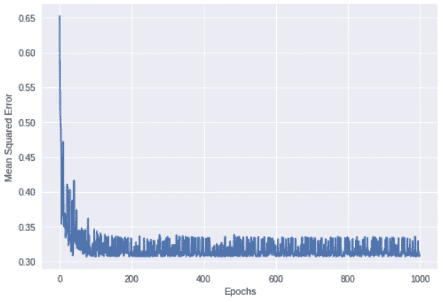

Sigmoid Neuron Loss Variation

正如你所看到的，乙状结肠神经元的损失正在减少，但有很多振荡可能是因为大的学习率。您可以降低学习率并检查损失变化。一旦我们训练了模型，我们就可以对测试数据进行预测，并通过将 0.5 作为阈值来二进制化这些预测。我们可以计算模型的训练和验证准确性，以评估模型的性能，并通过改变时期数或学习率来检查任何改进范围。

```
#visualizing the results
plt.scatter(X_train[:,0], X_train[:,1], c=Y_pred_binarised_train, cmap=my_cmap, s=15*(np.abs(Y_pred_binarised_train-Y_train)+.2))
plt.show()
```

了解模型对训练集中每个点的预测正确与否的数据点。我们将使用`matplotlib.pyplot`中的散点图功能。该函数将两个输入作为第一和第二特征，对于颜色，我使用了`Y_pred_binarised_train`并定义了一个自定义的“cmap”用于可视化。正如你所看到的，下图中每个点的大小是不同的。

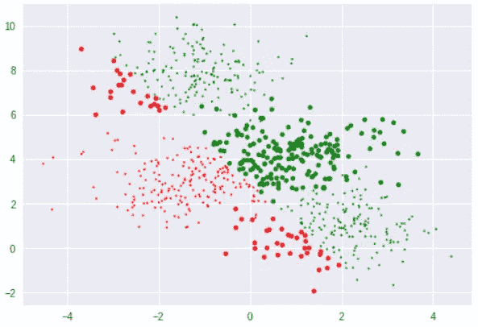

4D Scatter Plot

图中每个点的大小由一个公式给出，

```
s=15*(np.abs(Y_pred_binarised_train-Y_train)+.2)
```

该公式采用预测值和实际值之间的绝对差值。

*   如果实际值等于预测值，则大小= 3
*   如果实际值不等于预测值，则大小= 18

图中的所有小点表示模型正确预测了这些观察值，大点表示这些观察值分类不正确。


4D Scatter Plot

在该图中，我们能够表示 4 个维度-两个输入特征，颜色表示不同的标签，点的大小表示预测是否正确。该图中重要的一点是，乙状结肠神经元不能处理非线性可分离数据。

如果你想学习 sigmoid 神经元学习算法的详细数学检查我以前的职位。

[](https://towardsdatascience.com/sigmoid-neuron-learning-algorithm-explained-with-math-eb9280e53f07) [## 用数学解释的 Sigmoid 神经元学习算法

### 在本帖中，我们将详细讨论 sigmoid 神经元学习算法背后的数学直觉。

towardsdatascience.com](https://towardsdatascience.com/sigmoid-neuron-learning-algorithm-explained-with-math-eb9280e53f07) 

# 先写前馈神经网络

在本节中，我们将采用一个非常简单的前馈神经网络，并用 python 从头开始构建它。网络总共有三个神经元——两个在第一个隐藏层，一个在输出层。对于这些神经元中的每一个，预激活用‘a’表示，后激活用‘h’表示。在网络中，我们总共有 9 个参数——6 个权重参数和 3 个偏差项。

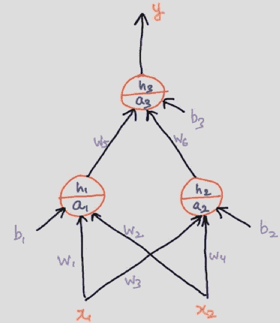

Simple Feedforward Network

类似于 Sigmoid 神经元的实现，我们将在一个名为*firstfnetwork 的类中编写我们的神经网络。*

在`FirstFFNetwork`类中，我们有 6 个函数，我们将一个接一个地检查这些函数。

```
def __init__(self):    
.....
```

`__init__`函数初始化网络的所有参数，包括权重和偏差。与神经网络中只有两个参数的 sigmoid 神经元不同，我们有 9 个参数需要初始化。所有 6 个权重被随机初始化，3 个偏差被设置为零。

```
def sigmoid(self, x):    
    return 1.0/(1.0 + np.exp(-x))
```

接下来，我们为网络中的每个神经元定义用于后激活的 sigmoid 函数。

```
def forward_pass(self, x):    
#forward pass - preactivation and activation    
    self.x1, self.x2 = x    
    self.a1 = self.w1*self.x1 + self.w2*self.x2 + self.b1    
    self.h1 = self.sigmoid(self.a1)    
    self.a2 = self.w3*self.x1 + self.w4*self.x2 + self.b2    
    self.h2 = self.sigmoid(self.a2)   
    self.a3 = self.w5*self.h1 + self.w6*self.h2 + self.b3    
    self.h3 = self.sigmoid(self.a3)    
    return self.h3
```

现在我们有了正向传递函数，它接受一个输入 **x** 并计算输出。首先，我已经初始化了两个局部变量，并等同于输入 **x** ，它有两个特性。

对于这三个神经元中的每一个，会发生两件事，

> 预激活用“a”表示:它是输入加上偏差的加权和。
> 
> 激活用“h”表示:激活函数是 Sigmoid 函数。

第一神经元的预激活由下式给出，

```
a₁ = w₁ * x₁ + w₂ * x₂ + b₁
```

为了获得第一个神经元的激活后值，我们简单地将逻辑函数应用于激活前 a₁.的输出

```
h₁ = sigmoid(a₁)
```

对第二个神经元重复同样的过程，得到 a₂和 h₂.

第一个隐藏层中存在的两个神经元的输出将作为第三个神经元的输入。第三神经元的预激活由下式给出，

```
a₃ = w₅ * h₁ + w₆ * h₂ + b₃
```

并且在 a₃上应用 sigmoid 将给出最终的预测输出。

```
def grad(self, x, y):    
    #back propagation
    ......
```

接下来，我们有一个`grad`函数，它将输入 **x** 和 **y** 作为参数，并计算向前传递。基于向前传递，它计算这些权重相对于损失函数的偏导数，在这种情况下损失函数是均方误差损失。

> 注意:在这篇文章中，我不会解释我们如何得到这些参数的偏导数。现在就把这个函数当作一个黑盒，在我的下一篇文章中，我将解释我们如何在反向传播中计算这些偏导数。

```
def fit(self, X, Y, epochs=1, learning_rate=1, initialise=True, display_loss=False):
    ......
```

然后，我们有类似于乙状结肠神经元的`fit`功能。在这个函数中，我们遍历每个数据点，通过调用`grad`函数计算偏导数，并将这些值存储在每个参数的新变量中(*第 63–75 行*)。然后，我们继续更新所有参数的值(*第 77–87 行*)。我们还有`display_loss`条件，如果设置为`True`，它将显示所有时期的网络损耗变化图。

```
def predict(self, X):    
#predicting the results on unseen data
    .....
```

最后，我们有 predict 函数，它将一大组值作为输入，并通过对每个输入调用`forward_pass`函数来计算每个输入的预测值。

# **根据数据训练 FF 网络**

我们现在将在我们创建的前馈网络上训练我们的数据。首先，我们实例化`FirstFFNetwork`类，然后在 2000 个历元和学习率设置为 0.01 的训练数据上调用`fit`方法。

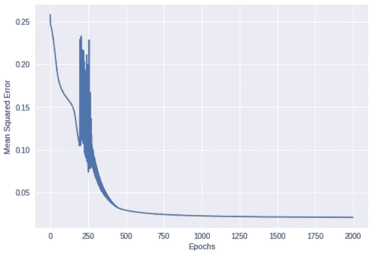

FF Network Loss

```
#visualize the predictions
plt.scatter(X_train[:,0], X_train[:,1], c=Y_pred_binarised_train, cmap=my_cmap, s=15*(np.abs(Y_pred_binarised_train-Y_train)+.2))
plt.show()
```

为了更好地了解神经网络的性能，我们将使用在 sigmoid neuron 中使用的相同 4D 可视化图，并将其与 sigmoid neuron 模型进行比较。

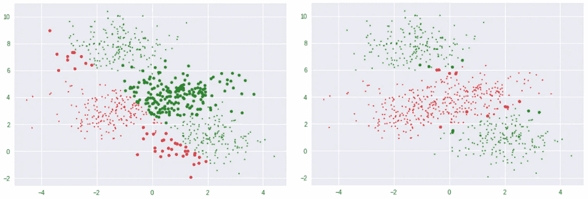

Single Sigmoid Neuron (Left) & Neural Network (Right)

正如你所看到的，大多数点都被神经网络正确分类了。关键是，仅仅通过组合三个 sigmoid 神经元，我们就能够解决非线性可分离数据的问题。

# 前馈神经网络的一般类

在本节中，我们将编写一个通用类，它可以通过将隐藏层的数量和每个隐藏层中的神经元数量作为输入参数来生成神经网络。泛型类也将输入的数量作为参数，之前我们只有两个输入，但现在我们也可以有 n 维输入。

> 注意:在这种情况下，我只考虑二进制分类的网络。

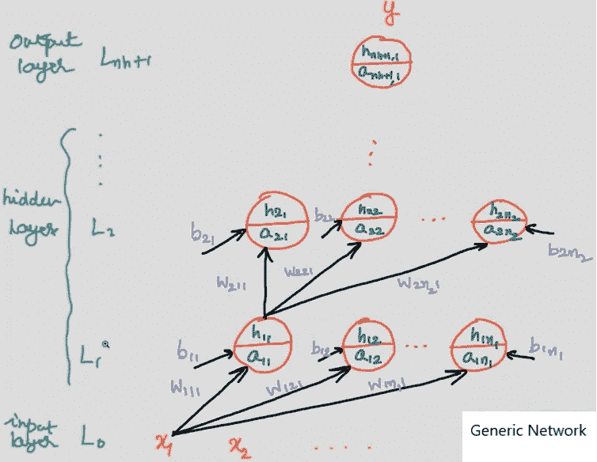

Generic Feedforward Network

在我们开始为通用神经网络编写代码之前，让我们理解表示与特定神经元相关联的权重和偏差的指数的格式。

> w(层数)(该层中的神经元数)(输入数)
> b(层数)(与该输入相关的偏置数)
> a(层数)(输入数)

W₁₁₁ —与连接到第一个输入的第一个隐藏层中存在的第一个神经元相关联的权重。

W₁₁₂ —与连接到第二个输入的第一个隐藏层中的第一个神经元相关联的权重。

b₁₁ —与第一个隐藏层中的第一个神经元相关联的偏差。

b₁₂ —与第一个隐藏层中的第二个神经元相关联的偏差。

# **代码**:

一个功能一个功能的解释，

```
def __init__(self, n_inputs, hidden_sizes=[2]):    
#intialize the inputs    
    self.nx = n_inputs    
    self.ny = 1 #one final neuron for binary classification.   
    self.nh = len(hidden_sizes)    
    self.sizes = [self.nx] + hidden_sizes + [self.ny]
    .....
```

`__init__`函数有几个参数，

`n_inputs` —进入网络的输入数量。

`hidden_sizes` —需要一个整数列表，表示隐藏层中存在的神经元数量。

*   [2] —一个具有 2 个神经元的隐藏层
*   [2，3] —两个隐藏层，第一层有 2 个神经元，第二层有 3 个神经元。

在这个函数中，我们初始化两个字典 **W** 和 **B** 来存储网络中每个隐藏层的随机初始化的权重和偏差。

```
def forward_pass(self, x):    
    self.A = {}    
    self.H = {}    
    self.H[0] = x.reshape(1, -1)
    ....
```

在`forward_pass`函数中，我们已经初始化了两个字典 **A** 和 **H** ，我没有将输入表示为 **X** 而是将其表示为 H₀，这样我们就可以将其保存在后激活字典 **H** 中。然后，我们将遍历所有层，计算预激活&后激活值，并将它们存储在各自的字典中。最终层的预激活输出与我们网络的预测值相同。该函数将在外部返回该值。这样我们就可以用这个值来计算神经元的损失。

请记住，在之前的类 *FirstFFNetwork* 中，我们已经分别为每个神经元的预激活和后激活计算进行了硬编码，但在我们的一般类中情况并非如此。

```
def grad_sigmoid(self, x):    
    return x*(1-x) def grad(self, x, y):    
    self.forward_pass(x)
    .....
```

接下来，我们定义两个函数来帮助计算参数对损失函数的偏导数。

```
def fit(self, X, Y, epochs=1, learning_rate=1, initialise=True, display_loss=False):        
    # initialise w, b    
    if initialise:      
        for i in range(self.nh+1):        
            self.W[i+1] = np.random.randn(self.sizes[i],    self.sizes[i+1])        
            self.B[i+1] = np.zeros((1, self.sizes[i+1]))
```

然后，我们定义我们的`fit`函数，它本质上是相同的，但是在这里我们循环通过每个输入，并以一般化的方式更新权重和偏差，而不是更新单个参数。

```
def predict(self, X):    
#predicting the results on unseen data
    .....
```

最后，我们有一个 predict 函数，它将一大组值作为输入，并通过对每个输入调用`forward_pass`函数来计算每个输入的预测值。

# 前馈神经网络的训练类属

我们现在将在我们创建的通用前馈网络上训练我们的数据。首先，我们实例化`FFSNetwork`类，然后在 2000 个历元和学习率设置为 0.01 的训练数据上调用`fit`方法。

下面给出了训练数据的神经网络的损失变化，

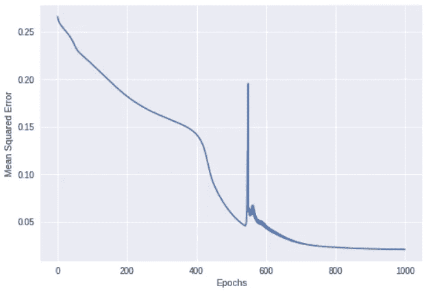

从图中，我们看到损失函数比之前的网络下降得稍慢，因为在这种情况下，我们有两个隐藏层，分别有 2 个和 3 个神经元。因为它是一个具有更多参数的大型网络，所以学习算法需要更多的时间来学习所有参数并通过网络传播损耗。

```
#visualize the predictions
plt.scatter(X_train[:,0], X_train[:,1], c=Y_pred_binarised_train, cmap=my_cmap, s=15*(np.abs(Y_pred_binarised_train-Y_train)+.2))
plt.show()
```

我们将再次使用相同的 4D 图来可视化我们的一般网络的预测。请记住，小点表示这些观察结果被正确分类，大点表示这些观察结果被错误分类。

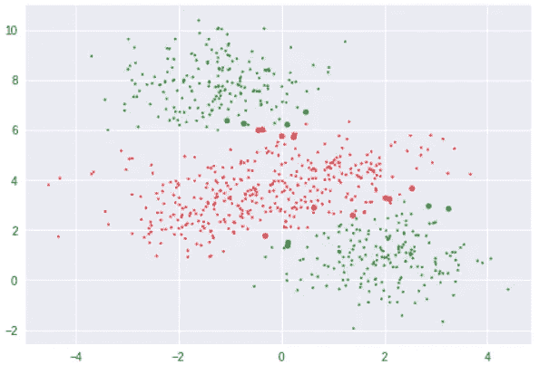

*您可以调整历元数和学习率，看看是否可以将误差降低到当前值以下。此外，您可以创建一个每层都有许多神经元的更深层次的网络，并观察该网络的表现。*

# 用于多类分类的通用 FF 类

在这一节中，我们将扩展上一节中编写的通用函数，以支持多类分类。在开始构建泛型类之前，我们需要做一些数据预处理。

请记住，最初，我们用 4 个类生成数据，然后我们将多类数据转换为二进制类数据。在本节中，我们将使用原始数据来训练我们多类神经网络。

这里我们有 4 个不同的类，所以我们对每个标签进行编码，以便机器能够理解并在其上进行计算。为了对标签进行编码，我们将在训练和验证标签上使用`sklearn.OneHotEncoder`。

我们将在一个名为`FFSN_MultiClass`的类中编写用于多类分类的通用前馈网络。

我将解释在我们之前的`FFSNetwork`类中所做的改变，以使其适用于多类分类。

首先，我们有我们的`forward_pass`函数，

```
def forward_pass(self, x):
    self.A = {}
    self.H = {}
    self.H[0] = x.reshape(1, -1)
    for i in range(self.nh):
      self.A[i+1] = np.matmul(self.H[i], self.W[i+1]) + self.B[i+1]
      self.H[i+1] = self.sigmoid(self.A[i+1])
    self.A[self.nh+1] = np.matmul(self.H[self.nh], self.W[self.nh+1]) + self.B[self.nh+1]
    self.H[self.nh+1] = self.softmax(self.A[self.nh+1])
    return self.H[self.nh+1]
```

因为我们有来自网络的多类输出，所以我们在输出层使用 softmax 激活而不是 sigmoid 激活。在*第 29–30 行*，我们使用 softmax 层来计算输出层的正向传递。

```
def cross_entropy(self,label,pred):
    yl=np.multiply(pred,label)
    yl=yl[yl!=0]
    yl=-np.log(yl)
    yl=np.mean(yl)
    return yl
```

接下来，我们有损失函数。在这种情况下，我们使用的是交叉熵损失函数，而不是均方误差。通过使用交叉熵损失，我们可以找到预测概率分布和实际概率分布之间的差异，以计算网络的损失。

# 为多类分类训练通用类

我们现在将在我们创建的通用多类前馈网络上训练我们的数据。首先，我们实例化`FFSN_MultiClass`类，然后在 2000 个历元和学习率设置为 0.005 的训练数据上调用`fit`方法。请记住，我们的数据有两个输入和 4 个编码标签。

下面给出了训练数据的神经网络的损失变化，

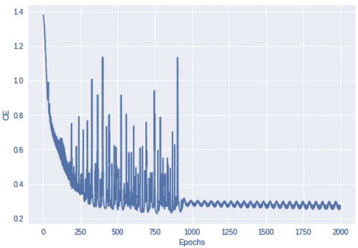

我们将再次使用相同的 4D 图来可视化我们的一般网络的预测。为了绘制图表，我们需要从网络中获得一个最终的预测标签，为了获得该预测值，我应用了`argmax`函数来获得概率最高的标签。使用该标签，我们可以绘制 4D 图，并将其与实际输入数据散点图进行比较。

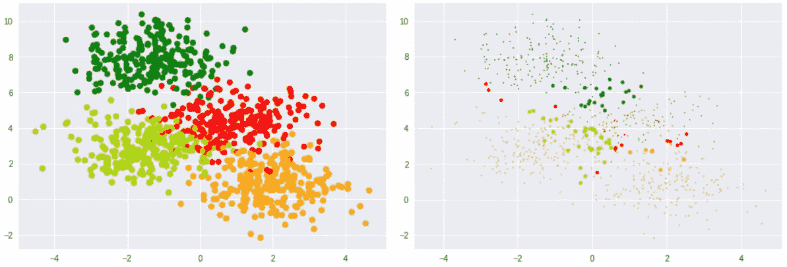

Original Labels (Left) & Predicted Labels(Right)

现在，我们已经成功地从零开始构建了用于多类分类的通用神经网络。


Photo by [Vasily Koloda](https://unsplash.com/@napr0tiv?utm_source=medium&utm_medium=referral) on [Unsplash](https://unsplash.com?utm_source=medium&utm_medium=referral)

# 下一步是什么？

> 通过编码学习

在本文中，我们使用了`make_blobs`函数来生成玩具数据，我们已经看到`make_blobs`生成线性可分数据。如果你想生成一些复杂的非线性可分数据来训练你的前馈神经网络，可以使用`sklearn`包中的`make_moons`函数。

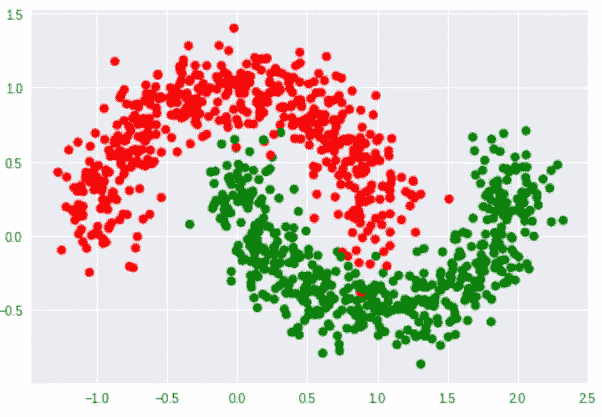

Make Moons Function Data

`make_moons`函数产生两个交错的半圆数据，本质上给你一个非线性可分的数据。此外，您可以在数据中添加一些高斯噪声，使神经网络更复杂地达到非线性可分离的决策边界。

使用我们的通用神经网络类，您可以创建一个更深的网络，每层中有更多数量的神经元(每层中也有不同数量的神经元),并调整学习速率&多个时期，以检查在哪些参数下神经网络能够达到可能的最佳决策边界。

本文中讨论的全部代码都在这个 GitHub 存储库中。随意叉或者下载。

[](https://github.com/Niranjankumar-c/Feedforward_NeuralNetworrks) [## niranjankumar-c/前馈 _ 神经网络

### 从头开始构建我们的神经网络。通过…为 Niranjankumar-c/前馈神经网络的发展做出贡献

github.com](https://github.com/Niranjankumar-c/Feedforward_NeuralNetworrks) 

*PS:如果你有兴趣把代码转换成* ***R，*** *一旦完成就给我发消息。我会在这里和 GitHub 页面上展示你的作品。*

如果你有兴趣了解更多关于人工神经网络的知识，请查看来自 [Starttechacademy](https://courses.starttechacademy.com/full-site-access/?coupon=NKSTACAD) 的 Abhishek 和 Pukhraj 的[人工神经网络](https://courses.starttechacademy.com/full-site-access/?coupon=NKSTACAD)。还有，这门课会用最新版本的 Tensorflow 2.0 (Keras 后端)来教。他们还有一个非常好的关于机器学习(基础+高级)的包，用 Python 和 R 语言编写。

# **结论**

在这篇文章中，我们从头构建了一个简单的神经元网络，并看到它表现良好，而我们的 sigmoid 神经元不能处理非线性可分数据。然后，我们已经看到了如何编写一个通用类，它可以采用' **n** 个输入和' **L** 个隐藏层(每层有许多神经元)来使用均方误差作为损失函数进行二进制分类。之后，我们使用 softmax 和交叉熵作为损失函数来扩展我们的泛型类，以处理多类分类，并看到它的性能相当好。

*推荐阅读*

[](https://hackernoon.com/deep-learning-feedforward-neural-networks-explained-c34ae3f084f1) [## 深度学习:解释前馈神经网络

### 你的第一个深度神经网络

hackernoon.com](https://hackernoon.com/deep-learning-feedforward-neural-networks-explained-c34ae3f084f1) 

在我的下一篇文章中，我会用一些数学知识详细解释反向传播。所以确保你在媒体上跟踪我，以便在它下降时得到通知。

直到那时和平:)

NK。

Niranjan Kumar 是汇丰银行分析部门的实习生。他对深度学习和人工智能充满热情。他是[人工智能](/tag/artificial-intelligence/top-writers)中[媒介](https://medium.com/u/504c7870fdb6?source=post_page-----d3526457156b--------------------------------)的顶尖作家之一。在 [LinkedIn](https://www.linkedin.com/in/niranjankumar-c/) 上与我联系，或者在 [twitter](https://twitter.com/Nkumar_283) 上关注我，了解关于深度学习和人工智能的最新文章。

**免责声明** —这篇文章中可能有一些相关资源的附属链接。你可以以尽可能低的价格购买捆绑包。如果你购买这门课程，我会收到一小笔佣金。