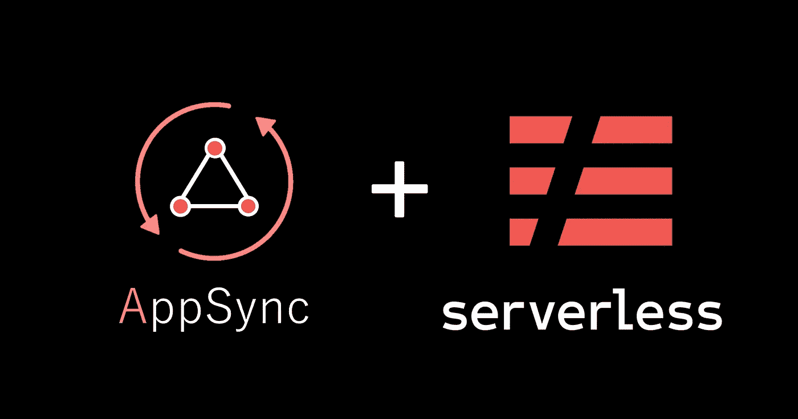
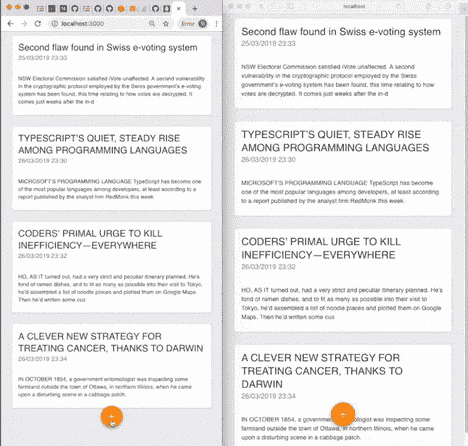
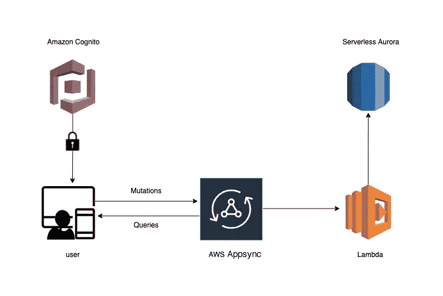
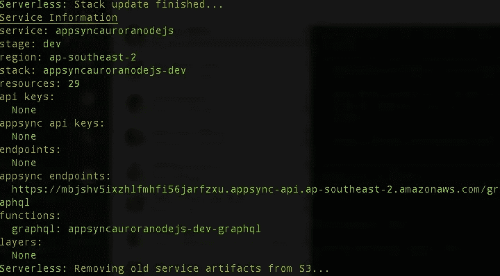

# 使用 AWS Appsync 和 Aurora Serverless 构建一个完全无服务器的实时 CMS

> 原文：<https://medium.com/hackernoon/building-a-fully-serverless-realtime-cms-using-aws-appsync-and-aurora-serverless-7258fe1925f7>



AWS 使 AWS RDS Aurora 的无服务器选项普遍可用，这将意味着在用关系数据库构建完全无服务器架构方面的突破。不再需要使用 SQL 管理连接池，不再需要担心 RDS 实例，成本基于服务消耗的计算时间，并且代码不运行时不收费。

在这篇文章中，我的目标是构建一个全功能的 AWS AppSync 驱动的后端和发布管理应用的 React 前端。该应用程序将为最终用户提供一套功能，允许公共用户查看帖子，管理员用户添加/删除帖子，让我们开始吧！



## 应用架构

应用程序架构使用:

*   [无服务器框架](https://serverless.com/)
*   AWS Appsync
*   AWS 认知用户池和身份池
*   **AWS 极光无服务器**
*   自动气象站λ



## 先决条件

遵循本指南之前，必须完成以下工作:

*   设置 AWS 帐户
*   安装 AWS CLI
*   使用用户凭据配置 AWS CLI
*   从 NPM 安装无服务器框架

```
$ npm install -g serverless
```

# 后端

## 创建新服务

使用 AWS Python 模板创建新服务，指定唯一的名称和可选路径。

```
$ sls create --template aws-nodejs --path simpleCMS
```

在 app 文件夹中，有一个 serverless.yml 文件。需要这个文件来配置我们的应用程序的行为方式。

## 配置 Appsync

安装`serverless-appsync-plugin`

```
npm install serverless-appsync-plugin
```

将`serverless-appsync-plugin`添加到`serverless.yml`的插件部分

```
plugins:
   - serverless-appsync-plugin
```

将以下配置添加到`serverless.yml`的自定义部分

```
custom:
  **appSync**:
    **region**: ${self:provider.region}
    **name**: ${self:service.name}-${self:provider.stage}
    **authenticationType**: AWS_IAM
    **serviceRole**: "${self:service.name}-AppSyncServiceRole"
    **userPoolConfig**:
      **awsRegion**: "${self:provider.region}"
      **userPoolId**: ${self:custom.userPool.${self:provider.stage}}
      **defaultAction**: ALLOW
    **mappingTemplates**:
      - **type**: Query
        **dataSource**: LambdaSource
        **field**: getPosts
        **request**: "Query-getPosts-request.vtl"
        **response**: "Query-getPosts-response.vtl"
      - **type**: Post
        **dataSource**: LambdaSource
        **field**: author
        **request**: "Query-author-request.vtl"
        **response**: "Query-author-response.vtl"
      - **type**: Mutation
        **field**: addPost
        **request**: Mutation-addPost-request.vtl
        **response**: common-response.vtl
        **kind**: PIPELINE
        **functions**:
          - addPost
          - sendNotification
      - **type**: Mutation
        **dataSource**: LambdaSource
        **field**: deletePost
        **request**: Mutation-deletePost-request.vtl
        **response**: common-response.vtl
    **functionConfigurations**:
      - **dataSource**: LambdaSource
        **name**: "addPost"
        **request**: "Function-addPost-request.vtl"
        **response**: "common-response.vtl"
      - **dataSource**: LambdaSource
        **name**: "sendNotification"
        **request**: "Function-sendNotification-request.vtl"
        **response**: "Function-sendNotification-response.vtl"
    **dataSources**:
      - **type**: AWS_LAMBDA
        **name**: LambdaSource
        **description**: "Lambda DataSource"
        **config**:
          **functionName**: graphql
          **lambdaFunctionArn**: { Fn::GetAtt: [GraphqlLambdaFunction, Arn] }
          **serviceRoleArn**: { Fn::GetAtt: [AppSyncLambdaServiceRole, Arn] }
```

*您可以从*[***GitHub repo***](https://github.com/yai333/AppcyncServerlessCMS)***中获取所有映射模板。***

接下来，为 Appsync 创建一个 IAM 服务角色:

## 配置认知

将以下配置添加到`serverless.yml`中的资源部分

请注意，上面的配置将创建一个支持认证和未认证用户的 Cognito 身份池，然后一个系统管理员用户将被添加到 Cognito 用户池，并向所提供的电子邮件地址发送一封带有临时密码的电子邮件。

```
**InitialSystemAdminUser**:
    **Type**: AWS::Cognito::UserPoolUser
    **Properties**:
      **UserPoolId**:
        **Ref**: CognitoUserPool
      **Username**: "test@neami.app"
      **DesiredDeliveryMediums**:
        - EMAIL
      **ForceAliasCreation**: true
      **UserAttributes**:
        - **Name**: email
          **Value**: "test@neami.app"
        - **Name**: name
          **Value**: Admin
```

## 配置 RDS Aurora 无服务器

要设置 RDS Aurora Serverless，我们还需要创建一个 VPC 和至少 2 个数据库子网，配置如下

要将 Appsync lambda 数据源链接到 RDS，您需要将我们刚刚配置的 Aurora RDS 的 VPC 配置添加到 **providers** 部分

```
provider:
  **vpc**:
    **securityGroupIds**:
      - Fn::GetAtt: [DatabaseVpcSecurityGroup, GroupId]
    **subnetIds**:
      - **Ref**: PrivateSubnet1
      - **Ref**: PrivateSubnet2
```

你可以在这里 找到完整的 serverless.yml [**。**](https://github.com/yai333/AppsyncServerlessCMS/blob/master/nodejs/serverless.yml)

## 设计 Graphql 模式

模式文件是文本文件，通常命名为 schema.graphql

## 添加 Lambda 函数

现在，让我们更新 handler.js 来配置我们的数据库连接并执行一些查询，这是 handler.js 文件的样子:

这就是后端，让我们部署服务。

无服务器框架使部署变得快速而轻松。您需要做的只是运行一个命令:

```
$ sls deploy --stage dev
```

它将自动在 AWS 上提供资源，打包并将所有代码推送到 S3，然后从那里发送到 Lambdas。终端应该显示类似如下的输出



# 反应前端

我假设您已经使用 react 加载了一些东西(使用 create-react-app 创建)。要从 React with AWS AppSync 执行 GraphQL 查询，需要以下库:

*   `[aws-amplify](https://github.com/aws/aws-amplify)` [、](https://github.com/aws/aws-amplify) `[aws-amplify-react](https://github.com/aws/aws-amplify)` -用于 Auth 和其他 AWS 调用
*   `[aws-appsync](https://github.com/awslabs/aws-mobile-appsync-sdk-js)` [、](https://github.com/awslabs/aws-mobile-appsync-sdk-js) `[aws-appsync-react](https://github.com/awslabs/aws-mobile-appsync-sdk-js)` -管理与`graphql` api 端点通信的 apollo 客户端包装器
*   `[react-apollo](https://github.com/apollographql/react-apollo)` -面向 React 框架的 Apollo 客户端库
*   其他阿波罗库，如`apollo-link-http`、`apollo-link-state`和`apollo-cache-inmemory`

我希望这篇文章对你有用，你可以在我的 **GitHub repo** 中找到完整的项目:

[](https://github.com/yai333/AppsyncServerlessCMS) [## yai333/AppsyncServerlessCMS

### 使用 AWS Appsync、Aurora 无服务器、无服务器框架和 React-yai 333/AppsyncServerlessCMS 的完全无服务器 CMS

github.com](https://github.com/yai333/AppsyncServerlessCMS) 

# 了解更多信息

[](/@yia333/how-to-add-a-cache-layer-to-appsync-dynamodb-resolver-be924842916b) [## 如何向 Appsync API 添加缓存层

### 在这篇文章中，我展示了一个基于无服务器框架的简单应用程序的例子。该应用程序使用亚马逊…

medium.com](/@yia333/how-to-add-a-cache-layer-to-appsync-dynamodb-resolver-be924842916b) [](/@yia333/build-a-serverless-data-pipeline-with-aws-s3-lamba-and-dynamodb-5ecb8c3ed23e) [## 用 AWS S3 兰巴和 DynamoDB 构建无服务器数据管道

### AWS Lambda plus Layers 是管理数据管道和实现无服务器管理的最佳解决方案之一

medium.com](/@yia333/build-a-serverless-data-pipeline-with-aws-s3-lamba-and-dynamodb-5ecb8c3ed23e) [](/@yia333/in-order-to-create-automated-testing-in-a-continuous-integration-environment-you-will-need-to-35d9952ccca4) [## 使用 Selenium Python web driver Chrome PyTest 和 CircleCI 进行端到端测试 React 应用

### 为了在持续集成环境中创建自动化测试

medium.com](/@yia333/in-order-to-create-automated-testing-in-a-continuous-integration-environment-you-will-need-to-35d9952ccca4) [](/the-apps-team/how-to-build-a-react-chat-app-with-aws-api-gateway-websockets-and-cognito-custom-authorizer-6f84f2da47ec) [## 如何使用 AWS API Gateway WebSockets、自定义 Lambda 授权器构建 React 聊天应用程序

### 几天前，AWS 宣布推出一个广受欢迎的功能:亚马逊 API 网关的 WebSockets

medium.com](/the-apps-team/how-to-build-a-react-chat-app-with-aws-api-gateway-websockets-and-cognito-custom-authorizer-6f84f2da47ec) [](/@yia333/running-selenium-and-headless-chrome-on-aws-lambda-layers-python-3-6-bd810503c6c3) [## 在 AWS Lambda 层上运行 Selenium 和 Headless Chrome

### AWS 已经将 Lambda 函数的超时限制从 5 分钟延长到 15 分钟，并且有了新的 Lambda 层功能，它…

medium.com](/@yia333/running-selenium-and-headless-chrome-on-aws-lambda-layers-python-3-6-bd810503c6c3)