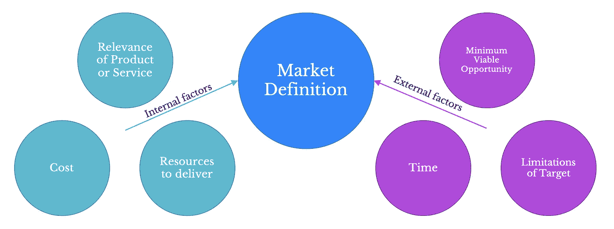
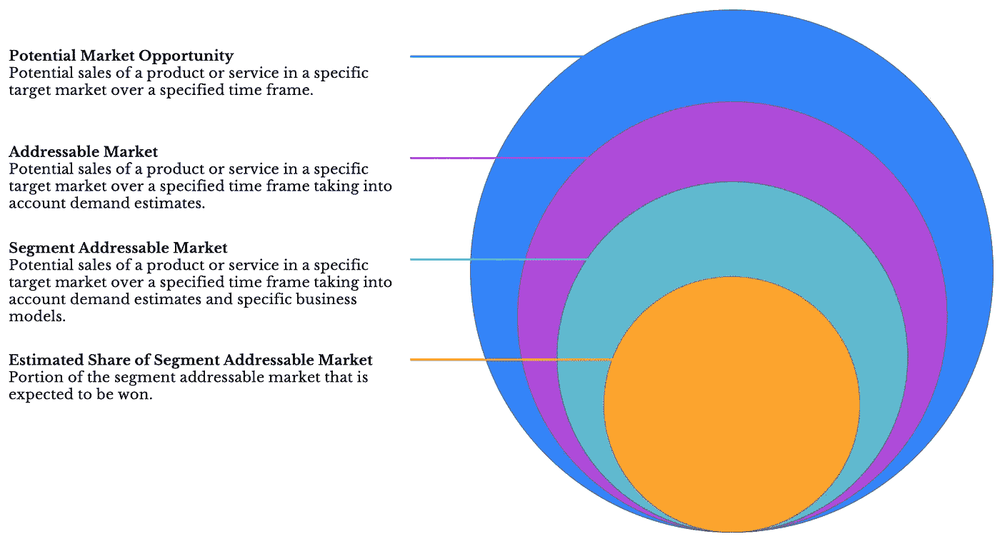
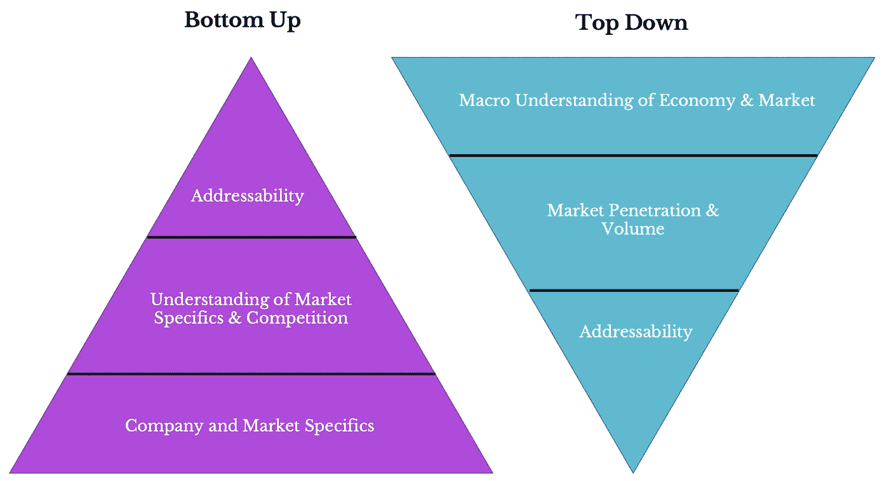

# 为你创业公司的产品建立一个市场模型

> 原文：<https://medium.com/hackernoon/building-a-market-model-for-your-startups-product-59943cf5b161>

所有成功的初创公司都有一些共同点——他们的产品或服务解决了一个问题，或者满足了企业或零售消费者的需求。因此，确定你的创业公司在经济中的空间的一个重要部分是了解你的目标市场。

本文是研究如何加深对目标市场的理解的系列文章的第一篇。在此基础上，我们将着眼于开发能够吸引客户并最终推动创业成功的走向市场战略。

# 定义市场

市场定义是一组特征，这些特征确定了将使用你的产品或服务的企业或消费者群体，并且可以合理地预期在给定的时间范围内购买该产品或服务。

下图显示了你的市场定义是如何由内部和外部因素构成的。从广义上讲，内部因素与你的创业公司利用其产品或服务的能力有关，而外部因素则是那些影响你的目标市场是否采纳你的产品或服务的因素。

# 思考市场规模

在我们建立一个模型来计算你的潜在市场之前，了解如何评估你的市场是很重要的。类似于俄罗斯的套娃，任何市场本质上都可以被理解为一系列更小的嵌套子群体。

虽然你可能认为你的产品或服务可能与地球上几乎每个人都相关，但事实上，你实际能占领的市场规模会有一系列限制。

例如，虽然一种新品牌的运动/锻炼压缩装置可以针对普通人群(基于每个人都可以/应该锻炼！)，您可能需要调整以考虑以下因素:

*   特定客户群对运动装备的兴趣是多还是少；
*   这些客户的购买习惯(如购买时间、更换时间)。和
*   你实际制造、生产和解决产品市场需求的能力。

# 估计市场规模

估计市场规模通常有两种方法:自上而下的'*和自下而上的'*方法。**

**顾名思义，这些方法从问题的反面来看市场规模。自上而下的方法的特点是简单，它基本上包括计算总市场，然后估计你的潜在市场份额。**

**另一方面，自下而上的方法包括估计你在市场上的潜在销售额，以确定总销售额。正如你从上面关于市场规模的评论中所猜测的，自下而上的估算方法通常是首选。**

**对自下而上方法的偏爱很大程度上是由于这种方法迫使你问一系列关于你的产品和服务以及潜在顾客的难题。**

**而不是简单的自上而下的信封背面计算("*)嗯，总市场是 1 亿美元，我们认为我们可以占据 10%，所以我们的销售额将是 1000 万美元。*”)，自下而上的方法需要你深入思考:**

*   **你的产品或服务在市场中的地位("*)我们的产品比竞争对手的更好/更受欢迎/更便宜吗？*)；**
*   **您的走向市场方法和市场定位("*)我们将如何销售我们的产品？*)；和**
*   **市场需求和增长(*“虽然整体市场正以每年 5%的速度增长，但我们认为我们能从竞争对手那里夺取市场份额，并以 10%的速度增长吗？”*)。**

****

**当然，重要的是要记住，任何市场模型最终都是基于假设和你输入的数据——正如俗话所说的“垃圾进，垃圾出”。**

**你可能认为你的产品是举世无双的，注定会出现在世界上每个家庭的柜台上，但重要的是退一步考虑挑战(和机遇！)在那之前，当你评估你的产品或服务的潜在市场时，你将会面对。**

**在我们系列的下一篇文章中，我们将会看到更多关于建立市场模型的细节，包括如何做出合理的假设和为你的模型获取数据。**

*****Lupercal Advisory 是一家咨询公司，专门为初创和早期公司提供战略、运营&财务和数据方面的咨询。如果你想讨论你的创业，请通过***[***enquiries@lupercalcapital.com***](mailto:enquiries@lupercalcapital.com)***联系我们。也请访问我们在***[***lupercaladvisory.com***](http://lupercaladvisory.com)***。*****