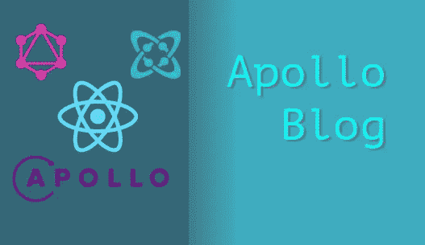

# 用 Apollo 和 Cosmic JS 构建一个进步的博客应用

> 原文：<https://medium.com/hackernoon/building-a-progressive-blog-app-with-apollo-and-cosmic-js-aaaccd24966f>



你好陌生人。

跟我来一次短暂的冒险，我们为发布博客风格的文章构建了一个快速、简单的界面。一些明智的事情。它应该看起来干净、简单，但是能够用一些查询魔法执行强大的资源获取。我说的是 Graphql，这是一种基于 web APIs 构建的查询语言。说到 web APIs，我们还将使用我们方便的内容管理服务:Cosmic JS 来创建和存储我们的博客数据。

# TLDR:

[进步阿波罗博客](https://cosmicjs.com/apps/apollo-blog)
[进步阿波罗博客代码库](https://github.com/jacobknaack/apollo-blog)

# 开始前为 0.0

在继续之前，请确保您的机器上安装了所需的开发工具。主要是你会需要 [**节点 JS**](https://nodejs.org/) **，**其附带的包管理器: **npm，**和 **git** **。Git** 是半可选的，仅用于编码存储和部署，如果这是你的目标的话。

一旦你安装了这些，我们就可以开始设置我们的项目，并最终开始编写一些 Javascript。

# 0.1 库和包

让我们来看看我们将用来创建我们的博客平台的主要包。

*   [**创建 React 应用**](https://facebook.github.io/create-react-app/)——我们将利用一直流行的 React 库来构建我们的 UI 组件。为了引导我们的项目，我们还将使用一个方便的命令行工具**create-create-app**，这样我们就可以在配置和设置上花费尽可能少的时间，并开始创建有意义的 javascript。
*   这是一个 UI 框架，允许我们导入完全风格化的 UI 组件。没有繁琐的 CSS 规范来获得一些看起来很好的东西。
*   [**阿波罗/ Graphql**](https://www.apollographql.com/) —这两个包是齐头并进的。 **Apollo** 将被用作 Graphql 客户端，向我们的 Graphql 服务器端点发出请求。它易于配置，使用起来非常简单。这又一次让我们能够专注于编写更少的 javascript，而不是专注于应用程序的高级组合。当然，Graphql 将允许我们发出只返回我们关心的数据的请求，让我们有效地从 Cosmic JS 中获取内容。

我相信所有无聊的事情都过去了，我们可以开始敲打键盘了！

# 1.0 设置我们的项目

让我们启动我们的终端，开始引导我们的项目源文件。对于那些没有安装 **Create React App** 的用户，我们可以用一个简单的 npm 命令来完成:

```
$npm install -g create-react-app
```

完成后(或者您已经安装了这个包)，我们可以通过运行 cli 调用我们的初始项目文件:

```
$create-react-app apollo-blog
```

你会注意到在你的终端上发生了相当多的奇迹，因为我们的应用程序是用各种强大的库和源代码引导的。看一下我们的文件系统，会显示一个名为“apollo-blog”的目录。将目录更改到该文件夹将显示类似于以下的结构:

```
apollo-blog/
    README.md 
    node_modules/
    package.json
    public/
        index.html
        favicon.ico
    src/
        App.css
        App.js
        App.test.js
        index.css
        index.js
        logo.svg
```

我们现在应该能够运行:

```
$npm start
```

或者

```
$yarn start
```

这将运行存储在我们的“package.json”文件中的启动脚本，该文件与 Webpack 和构建工具捆绑在一起，这些工具将处理所有 React 源代码的编译，并将其捆绑到准备好提供给浏览器的文件中。

脚本运行后，您应该会在终端中看到一条简单的消息，并且您的默认浏览器应该会打开一个项目正在运行的选项卡。您应该会看到类似这样的内容:

# 1.1 安装 Javascript 库

下一步是安装一些 npm 库，这将有助于快速创建一个好看的应用程序界面，并轻松地从 Cosmic JS graphql 服务器获取数据。

在您的终端中运行以下命令，让我们讨论一下这些包将为我们做些什么:

```
$npm install --save apollo-boost react-apollo graphql dotenv semantic-ui-css semantic-ui-react react-router-dom
```

**Apollo-boost/react-Apollo/graph QL**——这些家伙将作为主要解决方案，将我们的数据从 Cosmic JS 服务器高效、可扩展地获取到我们的客户端 UI。它们为我们的组件提供包装器，以便能够配置查询，并为数据加载和错误处理提供有用的变量。

这个包将允许 is 配置半敏感密钥，这样我们就不需要公开存储任何东西来访问我们的宇宙 JS 桶。

**semantic-ui-css/semantic-UI-react**—我们的 UI 框架将允许我们导入预样式的容器和组件，让我们专注于编程功能，花更少的时间处理 CSS 和其他样式考虑。

**react-router-dom** —一个 react 库，允许我们配置 url 路由逻辑，以控制我们的应用程序内的链接和访问 URL 参数。

安装好这些之后，我们就可以开始写一些 javascript 了！

# 1.2 配置环境变量

我们将添加一个最低限度的安全预防措施，以便我们不会让任何请求通过我们的 bucket 的 API 端点，请随意跳过这一部分，但要注意，您的组件将会有一些不同的行为，任何知道如何发出 API 请求的人都可以查询您的 bucket。所以，你知道…不要把任何敏感信息放进你的桶里。

我们将要求一个 **read_key** 附加到我们 bucket 的每个 API 请求上。你必须为你的宇宙 JS 桶生成一个设置标签，点击基本设置。**宇宙 JS** > **你的斗** > **设置** > **主**。

在顶部应该有标题为 **API 访问** > **API 读取访问键**的部分。点击按钮**生成新密钥**。将密钥复制到您的剪贴板，让我们用配置文件配置我们的项目目录:

```
$touch .env
```

这个文件将用我们的 **API 读访问键**来配置我们的项目，这样我们就不必将它硬编码到我们的源代码中，并提交给全世界/其他窥探的人。

只需在您的。环境文件:

确保你的变量名带有前缀 **REACT_APP** ！捆绑我们源代码的构建脚本将寻找这一点，以使变量在我们编译的 javascript 中可用。完成后，我们现在准备在 React 项目中使用这个键。

# 2.0 创建我们的路线和组件

最后，我们准备创建组件并设置路线。为了使事情尽可能简单，我们只创建了两条路线和两个主要组件:

**路线**

```
{protocol}://{host}/
```

*   将列出我们文章的首页路径。

```
{protocol}://{host}/article/:articleName
```

*   将显示我们文章内容的文章路径。

**组件**

```
/views/home.js
```

*   该组件将获取所有文章并显示一般文章信息。

```
/views/article.js
```

*   获取一篇文章并显示所有文章内容的组件。

# 2.1 配置 App.js

让我们继续，在您喜欢的任何文本编辑器中打开 **App.js** 组件，并开始用我们的路由逻辑和 **Graphql** 客户端配置它。

我们将从 **react-apollo** 导入一个组件包装器和一个构造函数，该函数将让组件包装器中的组件向指定的 Graphql 服务器发出请求(对我们来说，这将是 Cosmic JS 的 Graphql 服务器)。

我们还想为 **react-router-dom** 导入包装组件。这将允许我们使用我们的浏览器 url 来系统地切换组件视图和访问任何 url 参数。

最后，我们将从**语义 UI** 导入一个 CSS 文件，这样我们就可以利用它的类选择器，并为导入的组件提供它们的基本样式。

以下是我们的 **App.js** 在一切都正确配置后的样子:

# 2.2 创建主视图

让我们在新目录中创建新文件

```
src/views/home.js
```

这个文件夹将存储我们所有的视图层 React 组件。我们的主页视图将只返回一些关于我们站点的简要信息和已经发布到我们博客的文章列表。

该组件的主要部分是显示标题和站点描述的标题，以及显示语义 UI 组件的列表。

我们还需要用一些 **Graphql** 逻辑来配置这个视图，以便它可以向 Cosmic JS 发出请求

现在我们有了旧的 React 组件，它将在组件渲染之前从我们的内容管理器(Cosmic JS)获取文章，并将这些文章作为数组传递给组件 props。

**Apollo** 还为我们提供了一些来自 is 数据对象的便利属性，特别是一个 **error** 对象，以及一个 **loading** boolean，我们用它来有条件地呈现组件，比如当请求被获取时加载消息，当我们的 error 对象返回消息时显示错误消息。

# 2.3 创建文章视图

随着我们的文章列表显示在我们的主页上，我们需要创建一个视图来显示包含在每个文章对象中的博客内容。

让我们在我们的**视图**目录中创建另一个文件:

```
src/views/article.js
```

创建这个组件类似于 Home 视图，但是我们的查询将包括一个来自我们存储在 prop 上的 URL 的文章标识符:**匹配**，当我们在**路径**上呈现一个组件时 **react-router-dom** 会为我们创建这个标识符。

这个组件比我们的 Home 组件简单得多，主要是因为我们只是使用了**查询**组件包装器，而不是使用 **Graphql** 组件将我们的组件转换成更高级别的组件。这使我们可以直接在组件逻辑中访问我们的 **Graphql** ，但是*不能在组件属性中使用它！所以请注意。*

对于这两个组件，我在源代码中包含了一些最小的样式对象，但是您可以随意发挥您的创造力，修改样式属性来创建您自己的外观。

就是这样！我们构建了两个相对简单且可伸缩的 React 组件，它们被配置为两个独立的 url 路由。我们可以通过 **react-router-dom** 轻松控制我们的视图，并通过 **Apollo / Graphql** 和 **Cosmic JS** 的力量明智地获取我们的数据。

# 3.0 部署

如果你想让全世界都可以使用你的应用程序，create-react-app 附带了一些方便的部署脚本。

# 3.1 运行构建脚本

如果你看一下 **package.json** 文件，我们有一个名为 **build** 的脚本。运行它将编译所有的项目文件，并将它们捆绑到一个静态的构建目录中，该目录可以部署到任何托管服务中。

您还会注意到，在脚本完成后，您可以选择使用 **serve** 模块直接发布到 github 页面。你只需要在 **package.json** 中添加一个 **homepage** 值，并确保 **serve** 包安装了 **npm** 或 **yarn** 。

点击构建消息末尾的链接，了解更多关于使用这种方法进行部署的信息。

# 3.2 使用 Netlify 和 Github 进行部署

Netlify 提供应用构建和部署服务，他们会给你一个免费的(如果不是有点冗长的话)URL 让你部署客户端代码。这个过程非常简单，当我们对源代码进行修改时，我们可以使用 github 库来不断地部署我们的代码。

在您创建帐户/登录到 Netlify 仪表板后，应该有一个名为**站点**的选项卡。

单击**站点**选项卡将显示您在 Netlify 上部署的站点列表。从这里你有两个选择:

1.  使用使用**构建**脚本创建的静态构建目录进行部署。
2.  将您的 Netlify 帐户连接到 git 存储库，并使用连续部署。*这一步要求您将代码提交给 git 存储库。*

部署静态构建目录非常简单，但是需要您手动构建并上传文件到 Netlify。只需将构建目录从 Netlify 仪表板直接拖到 sites 选项卡底部的区域。

这将自动将您的站点部署到 Netlify 将生成的 url。简单，但是每次更新源代码时都需要工作。

在最右边会有一个按钮，显示来自 Git 的**新站点。**选择此选项将引导您完成授权 Netlify 访问代码库的过程。完成这些步骤后，Netlify 将根据您指定的构建脚本构建您的站点文件，并在您每次提交 repo 时自动部署它！

# 结论

今天我就讲到这里。黑客快乐，直到我们再次见面:)

如果你对用 Cosmic JS 构建应用有任何意见或问题，[在 Twitter 上联系我们](https://twitter.com/cosmic_js)，[在 Slack 上加入对话](https://cosmicjs.com/community)。