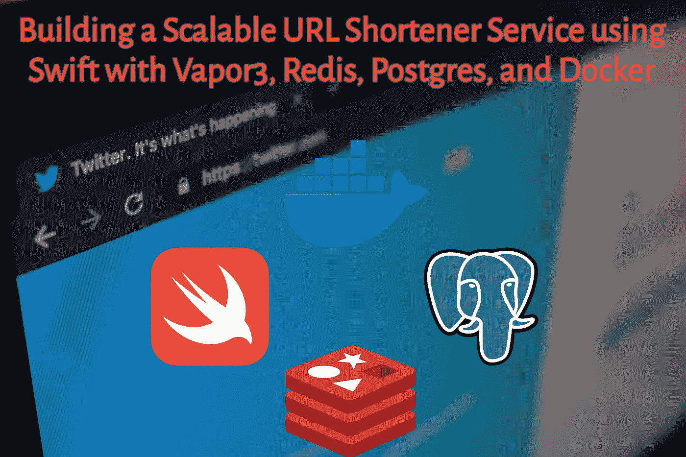
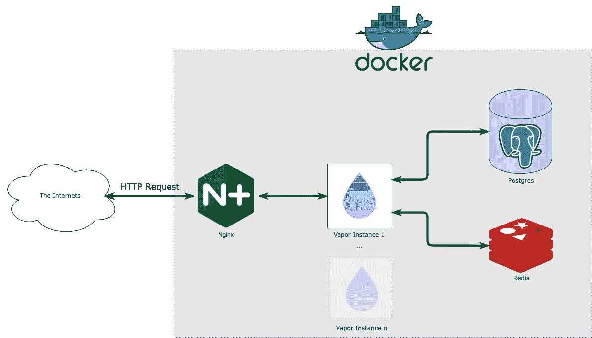

# 使用 Swift 和 Vapor3 构建可扩展的 URL Shortener 服务

> 原文：<https://medium.com/hackernoon/building-a-scalable-url-shortener-service-using-swift-with-vapor3-853032a9a130>

## 使用 Swift 和 Vapor3 超越“你好，世界”

Photo by [Con Karampelas](https://unsplash.com/photos/gHrEvF7Ugb4?utm_source=unsplash&utm_medium=referral&utm_content=creditCopyText) on [Unsplash](https://unsplash.com/search/photos/screen?utm_source=unsplash&utm_medium=referral&utm_content=creditCopyText)

在我完成了几个基本的 Vapor 教程，并使用 Vapor 创建了一个模拟服务器[之后，我努力思考下一步该做什么。我最终在 Medium 上看到了这个帖子，这看起来是一个尝试使用](https://hackernoon.com/building-an-excellent-mock-server-in-swift-with-vapor-7e25aaa985e6) [Vapor](https://hackernoon.com/tagged/vapor) 构建的优秀项目。

 [## 如何构建一个规模达到数十亿的微小 URL 服务？

### 构建一个规模达到数十亿的 url shortner 服务是一个软件架构挑战。这个博客涵盖了基本的…

medium.com](/@vaibhav0109/how-to-build-a-tiny-url-service-that-scales-to-billions-f6fb5ea22e8c) 

在这篇文章中，我将基于上面文章中的一些设计，通过结合 [Vapor](https://github.com/vapor/vapor) 、 [Redis](https://github.com/vapor/redis) 、Nginx 和 [Postgres](https://github.com/vapor/fluent-postgresql) ，并利用 Docker 来简化开发和测试，来实际构建一个 [URL](https://hackernoon.com/tagged/url) 缩短服务。

# 目标

该项目的目标是构建一个可扩展的、快速的 URL 缩短器，它将支持使用 Vapor 的自动和自定义 URL 缩短功能。创建抗枚举键的目标不在本项目的讨论范围之内——假设链接创建者有责任确保共享的 url 不会被未授权的用户访问。

# 设计

我将按组件分解设计，然后看看每一部分如何适应创建新 url 和访问现有 url 的逻辑流程。

## **蒸汽网络应用**

从路由逻辑到缩短算法本身，大多数实际的业务逻辑将发生在 Vapor 应用程序内部。我试图以这样一种方式来计划，如果必要的话，Vapor 应用程序的实例数量可以按比例增加以满足需求。

## **Postgres 数据库**

Postgres 将作为应用程序的持久存储。Postgres 似乎是一个不错的选择，因为它易于使用，使用 Fluent 与 vapor 集成，并且它是云不可知的。

## **Redis**

雷迪斯将承担双重职责。首先，它将充当原子计数器，以便允许应用程序的多个实例并行运行。其次，它将充当快速缓存，以响应频繁的链接请求。

## **Nginx**

Nginx 将充当任意数量的 Vapor 实例的边界反向代理和循环请求。

## **Docker (docker-compose)**

在这个例子中，我使用 docker-compose 将所有东西捆绑在一起，简化本地开发和测试。

Network diagram

# 代码

## 入门指南

本教程假设你已经安装了 [docker-compose](https://docs.docker.com/compose/install/) 和 [Vapor](https://docs.vapor.codes/3.0/install/macos/) 。

首先要做的是创建一个新目录来存储我们所有的项目文件。

然后初始化一个新的 Vapor 项目。该命令将为您设置一个新的 Vapor 模板，其中包含一个示例 ToDo 应用程序的代码。

因为我喜欢利用 XCode 的代码补全功能，所以我还会添加一个 xcodeproj 文件，并在 XCode 中打开我们的项目。

## 脚手架

首先，我们需要考虑如何在这个项目中使用 docker。由于 XCode 实际上只关心包文件，我们将使用命令行创建一个 *Dockerfile* 和 *docker-compose.yml* 文件。因为 docker 基础知识超出了本教程的范围，所以我不会讲太多细节，但是我们将用于开发的所有东西都是非常基础的。在以后的文章中，我可能会考虑为生产部署配置您的应用程序。

通过运行以下命令，创建一个新的 *Dockerfile* 和 *docker-compose.yml* 文件。

将以下内容粘贴到*文档*中。这段代码将在 docker 容器中构建和启动我们的 Vapor 应用程序，并在端口 8080 上公开 API。

接下来将以下内容添加到 *docker-compose.yml* 文件中。这里还有更多的东西，但在较高的层面上，它定义了我们的每个图像:Vapor 应用程序的 **api** ，Postgres 数据库的 **db** ，redis 的 **redis** ，nginx 的 **nginx** 。它还将为 Postgres 配置一些基本的身份验证，并为 db 操作和服务 API 创建单独的网络。

您还需要为 nginx 定义您的配置，以便让转发按预期工作。我的 *conf.d/api.conf* 文件看起来是这样的。

## 蒸汽网络应用

首先要看的 Vapor 代码是我们的 *Package.swift* 文件。正如我前面提到的，我们希望确保我们的项目拥有与 Redis 和 Postgres 交互所需的所有必要依赖项。用以下内容替换现有的 *Package.swift* 文件。

**配置**

接下来，我们可以看一下 *configure.swift* 文件，看看我们如何使用 Vapor 应用程序中 docker 文件中描述的一些环境变量。这个文件相当简单，注释应该可以消除任何歧义，所以我不会在这里详细讨论。

至于其余的样板代码，在你的项目中应该有一个 app.swift 和一个 *boot.swift* 文件，这里使用的缺省值对我们的目的来说很好。

**车型**

接下来，我们将删除模板中包含的 *Todo.swift* 文件，并创建一个新的 Link.swift 文件来描述我们的 *Link* 模型。链接模型不包含任何意外的特性。它有一个 [**id** ，这是 Fluent](https://docs.vapor.codes/3.0/fluent/models/#id) 中的一个特殊字段；还有一个 friendlyUrl，它表示一个自定义的 Url；一个 shortUrl，它表示一个将重定向到原始 Url 的缩短 Url；一个 createdAt 元数据属性， [vapor 可以自动填充它](https://docs.vapor.codes/2.0/fluent/model/#timestamps)，最后还有一个 expiresAt 属性，可以用来清理旧链接。

稍后我将介绍我们计划如何使用这个数据库的短 url 和 id 进行查询，但是因为我们也允许用户使用自定义的“友好”url，所以我们也应该为此添加一个唯一的索引。在项目的 *App* 目录下创建一个名为 *Migrations* 的新目录。在这个目录中，创建一个名为 *migrations.swift* 的新文件，并添加以下代码。在上面的 configure.swift 中，从第 56 行开始，您可以看到实际运行这个迁移的代码。

**路由**

接下来我们将查看*路线。swift* 这是 Vapor 希望您的路线被定义的地方。因为这个服务实际上只有两个功能；1.创建重定向(链接)和 2。重定向请求，我们的 *routes.swift* 文件将非常简单。用以下内容替换自动生成的 *routes.swift* 文件。

**控制器**

最后，我们到达控制器，为我们的 API 服务的实际业务逻辑。这里有几个工作流，所以我将逐一介绍。

1.  保存新链接

正如你在上面的 *routing.swift* 中看到的，创建一个新链接是通过向`/links`发出 POST 请求来完成的。当发出请求时，它要做的第一件事是向 redis 请求一个来自原子计数器的新 id。然后，我们将使用这个数字 id 和 POST 请求中提供的其余有效负载来创建一个新的 Link 实例，并将其保存到 Postgres。假设保存成功，我们将把这个链接添加到 redis 缓存中并返回对象。

2.重新寄送

该服务的第二部分是将所有 GET 请求重定向到适当的 url(如果存在的话)。我稍后将介绍该服务使用的缩短算法，但是通常该服务会首先检查 redis，看它是否缓存了重定向。假设它在 redis 中没有找到匹配，它将把请求传递给 look up()，lookup()将尝试根据我们的 base62 编码的 id 或者根据用户定义的友好 url 来查找 url。不管使用什么查找方法，如果找到结果，我们将构造一个大多数浏览器都应该遵循的 307 重定向响应。如果在 redis 或 Postgres 中没有找到结果，则返回 404 错误。

## 缩短网址

因为我们将主要依赖整数 id 进行链接查找，所以我们需要某种方法将整数缩短为更紧凑的格式。整数在达到 100，000 或数百万之前都工作得很好，在这一点上，您可能真的不会节省太多空间。这就是 Base62 编码发挥作用的地方。

不出所料，Base62 使用了 62 个字符的映射[a-zA-Z0–9]。这意味着 10，000，000 这样的长数字可以用更紧凑的“fxSK”来表示。

我还通过在自动生成的 Base62 字符串前面加上“.”来区分自动生成的 URL 和自定义的 URL，在重定向处理期间解析提供的路径时，如果路径以“.”开头我们知道查询 id 索引，如果不知道，我们知道使用 friendlyUrl 查询。

## 运行应用程序

假设您已经设置了 docker-compose 并遵循了上面的步骤，那么在开发模式下运行应用程序(下面有更多关于生产的内容)应该很简单。你可以在这里找到我所有的代码。

要启动应用程序，只需从项目的根目录运行`docker-compose up`。第一次启动可能需要几分钟，因为它需要下载 Vapor 的所有依赖项并构建应用程序。

要扩大您运行的 swift 节点数量，您只需添加`--scale api=N`，其中 N 是您想要的节点数量。Docker 应处理 Nginx、Redis 和 Swift 节点之间的路由。

## 下一步是什么？

很明显，这个应用程序存在许多问题，使它无法成为一个产品化的服务。如果我继续这个例子，在部署这个应用程序之前，我会添加一些东西。

*   添加单元和组件测试覆盖率

> 这值得自己写一整篇文章，因为我们需要模仿我们的依赖关系。

*   生产配置已更改

> 在我们的例子中，所有的 postgres 和 redis 配置信息都被硬编码到应用程序和 docker-compose 文件中。对于生产就绪型服务，我们希望强化这一点，并且可能不会使用其他编排来管理我们的数据存储。但是 docker-compose 对本地发展很有帮助。

*   提高弹性

> 该应用程序目前可以处理错误，但如果我们的 Postgres 存储变得无法访问或我们的原子计数器被重置并与现有记录冲突，我们该怎么办——显然还有待改进。

## 参考

 [## 蒸汽/蒸气

### 💧服务器端 Swift web 框架。在 GitHub 上创建一个帐户，为 vapor/vapor 开发做贡献。

github.com](https://github.com/vapor/vapor)  [## 使用 Vapor 在 Swift 中构建一个优秀的模拟服务器

### Swift，它不再仅仅适用于移动设备…

hackernoon.com](https://hackernoon.com/building-an-excellent-mock-server-in-swift-with-vapor-7e25aaa985e6)  [## 如何构建一个规模达到数十亿的微小 URL 服务？

### 构建一个规模达到数十亿的 url shortner 服务是一个软件架构挑战。这个博客涵盖了基本的…

medium.com](/@vaibhav0109/how-to-build-a-tiny-url-service-that-scales-to-billions-f6fb5ea22e8c) 

你可以在这里查看这个项目的所有代码。