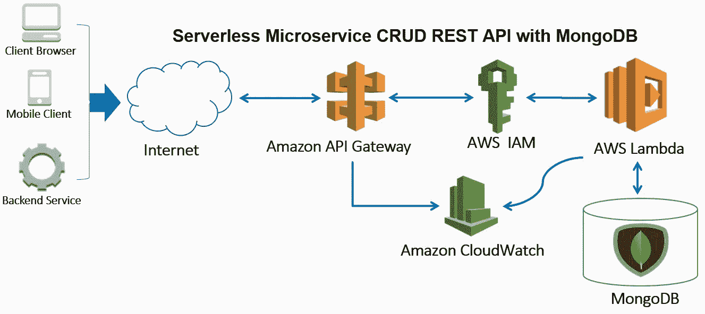
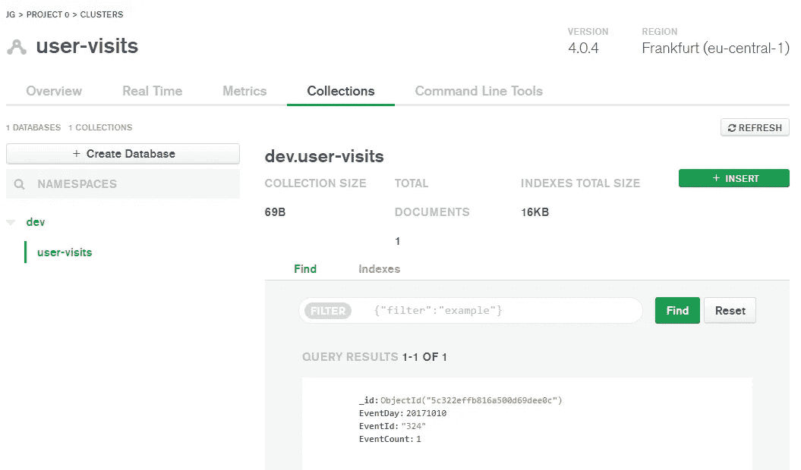
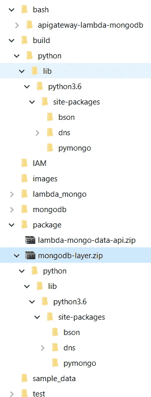
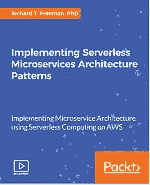

# 用 MongoDB 构建无服务器微服务 CRUD RESTful API

> 原文：<https://medium.com/hackernoon/building-a-serverless-microservice-crud-restful-api-with-mongodb-6e0316efe280>

在本帖中，我们将构建一个无服务器的微服务，在一个完全托管的 MongoDB NoSQL 数据库上公开创建、读取、更新、删除(CRUD)操作。我们将使用新发布的 **Lambda 层**来封装与 MongoDB 集成所需的第三方库。我们将使用亚马逊 API 网关来创建、管理和保护我们的 REST API，以及它与 AWS Lambda 的集成。Lambda 将用于解析请求并执行 CRUD 操作。我使用自己的开源代码和脚本，以及 AWS [无服务器应用模型](https://github.com/awslabs/serverless-application-model)来测试、打包和部署堆栈。



Serverless Microservice CRUD REST API with MongoDB

无服务器正在获得越来越多的牵引力，可以完成或补充集装箱。在无服务器中，仍然有服务器，只是你不管理它们，你按使用付费，它会自动为你扩展。它也是事件驱动的，因为你可以更多地关注业务逻辑代码，而不是入站集成，这要归功于越来越多的 Lambda 事件源触发器，如 Alexa、S3、DynamoDB 和由 AWS 构建和维护的 API Gateway。

更有趣的是，在这篇文章中，我使用了我在 [AWS re:Invent 2016](https://www.youtube.com/watch?v=YGNu6SLCk50) 和[AWS 大数据博客文章](https://aws.amazon.com/blogs/big-data/analyze-a-time-series-in-real-time-with-aws-lambda-amazon-kinesis-and-amazon-dynamodb-streams/)中介绍的模式的简化版本和子集，您可以使用 DynamoDB 从我们内部的 [RAVEN 数据科学平台](https://aws.amazon.com/solutions/case-studies/justgiving/)中使用的 Kinesis 流中的数十亿网络分析事件中实现大规模实时计数器。这里的重点将是创建前端，而不是后端，即使用 API Gateway，Lambda 和 MongoDB 的无服务器 CRUD REST API。

# MongoDB 和我的历史

有许多 NoSQL 数据库，如 Amazon DynamoDB，这是一个键值和文档存储，可以轻松地与 AWS 中的其他无服务器堆栈集成，其中有许多博客帖子、书籍、文档和视频课程，包括 [my own](https://www.packtpub.com/application-development/implementing-serverless-microservices-architecture-patterns-video) 。正如我们之前介绍过 DynamoDB 一样，让我们来谈谈如何使用 MongoDB。如果我们看看一些[数据库排名](https://db-engines.com/en/system/MongoDB)，它在总体排名第五，在文档存储数据库排名第一，并且有一些大公司在使用它。

我和 MongoDB 有些渊源。当我们于 2013 年在 [JustGiving](https://www.justgiving.com/) 开始在生产中部署*机器学习的旅程时，这是一个以技术换公益的众筹和筹款平台，从 2600 万用户那里筹集了超过 50 亿美元用于公益事业，并于 2017 年被 [Blackbaud](https://www.blackbaud.com/) 以 1 . 21 亿美元收购。我选择将产品命名为 PANDA，我们构建的第二个系统是一个离线批量训练和推理引擎(当时在产品中嵌入数据科学非常罕见，更多的是在笔记本电脑上进行本地数据科学，没有 Apache Spark，也没有无服务器或稳定的 docker)。这些批量分数、推断或预测将定期插入 MongoDB，我们将通过我们的 PANDA REST API 提供预测、推荐和建议，我们的前端服务和移动应用程序将调用这些 API。我认为这种架构的美妙之处在于，我们将数据科学服务从前端产品中分离出来，允许我们以不同的速度移动，并在他们不注意的情况下更新后端。*

当时，我选择 MongoDB 作为后端数据存储，因为它是一个 NoSQL 数据库，使我们能够灵活地在 JSON 中存储数据，以非常低的延迟检索数据，并可以通过分片轻松地向外扩展。在 JustGiving，这是一个伟大的人工智能成功故事，也是许多后续案例研究、主题演讲、[书籍](https://www.amazon.co.uk/Cracking-Data-Code-Unlock-organisation/dp/1781333335)和[认可](https://www.techuk.org/insights/news/item/9603-meet-october-s-big-data-hero)的开始。我们不再使用 MongoDB，但 PANDA 仍在使用，新的令人兴奋的功能和实验正在定期添加。我写这篇文章的灵感来自于阅读 Adnan Rahi 的[关于使用 node.js 和 MongoDB](https://hackernoon.com/building-a-serverless-rest-api-with-node-js-and-mongodb-2e0ed0638f47) 构建无服务器 API 的帖子，但是在这里我使用了 Re:Invent(我目前最喜欢的语言 Python)的最新无服务器特性和开源 AWS 无服务器应用模型( [SAM](https://docs.aws.amazon.com/serverless-application-model/latest/developerguide/what-is-sam.html) )。

# MongoDB 设置

MongoDB Atlas 是我们将使用的，因为它有一个没有信用卡的免费层，并且是一个完全托管的服务。

## 设置新的集群

1.在你的浏览器中，进入 [MongoDB web 界面](https://www.mongodb.com/cloud/atlas)2。选择**开始免费**3
。输入你的**邮箱**，**名**，**姓**，**密码**
4。检查**我同意服务条款。**
5。选择**免费入门**
7。选择**关闭**进行**全局集群配置**6。选择 **AWS** 为**云提供商&区域**7。选择有**自由层可用的地区**
*美国地区选择 **us-east-1**
*欧洲地区选择 **eu-central-1**
*亚洲地区选择 **ap-southeast-1** 或 **ap-south-1**
8。对于**集群层**将其留在 **M0(共享 RAM，512 MB 存储)**
9。对于**附加设置**，保留默认值
10。对于**簇名**键入`user-visits`11。选择**创建集群**
*您也将获得验证码
*这将开始创建集群

## 配置并连接到您的集群

现在让我们创建一个 Lambda 函数可以使用的数据库用户，通过将 IP 范围列入白名单来允许 Lambda 访问数据库并连接到集群。

1.选择**安全**选项卡和 **MongoDB 用户**
2。选择**添加新用户**子选项卡
3。在急停认证中
*为**用户名**输入`lambdaReadWriteUser`
*为**密码**输入安全密码
*为**用户权限**选择**读写任意数据库**
4。选择 **IP 白名单**子选项卡
5。选择**添加 IP 地址**6
。选择**允许从任何地方访问**
*安全风险—您将看到添加了 CIDR `0.0.0.0/0`，允许任何系统访问数据库，这通常是一种非常糟糕的安全做法，但对于这里的演示数据的概念证明来说是不错的。
7。选择**确认**8
。选择**概述**标签
9。在沙盒窗口
10 中选择**连接**。选择**下的**短 SRV 连接串**复制与你的驱动**11 兼容的连接串。安装 Python 依赖包`pymongo`、`dnspython`、`bson`、`$ sudo pip install pymongo dnspython bson`、
或`sudo pip install -r requirements.txt`

## 使用 Python 本地连接到 MongoDB

创建一个名为`mongo_config.py`的 Python 脚本，并键入或粘贴以下内容

```
db_username = "lambdaReadWriteUser"
db_password = "<my-super-panda-password>"
db_endpoint = "user-visits-abcde.mongodb.net/test?retryWrites=true"
db_port = "27017"
```

`db_endpoint`是短 SRV 中的主机，即`@`符号后的部分。这里的`test`将是数据库的名称，用所需的名称替换它。

## 安全建议

上述内容存在一些安全风险，因此对于生产部署，我建议:
*使用 MongoDB AWS VPC 对等连接(您将需要使用 payed M10+实例)
*不要在 IP 白名单中使用`0.0.0.0/0`，而是在 VPC 中启动 Lambda 并将其限制在那个无类域间路由(CIDR)或 IP 范围内
*不要使用`mongo_config.py` 来存储密码，而是使用 KMS 来加密密码并将其存储在 Lambda 环境变量中。

现在让我们创建四个 CRUD 方法。

## 创建 PUT 方法

创建并运行名为`mongo_modify_items.py`的 Python 脚本，键入或粘贴以下内容

在这里，我使用了存储库设计模式并创建了一个`class MongoRepository`，它抽象并集中了与 MongoDB 的所有交互，包括 JSON 记录的连接和插入。当`MongoRepository`被实例化时，我们使用`mongo_config.py`中的变量和参数`mongo_db`、`table_name`创建我们之前看到的短 SRV 连接字符串。

在`insert_mongo_event_counter_json()`方法中，我首先对数据有一个`EventId`的检查进行整形，然后用`EventId`和`EventDay`创建一个`entity_id` entity_id，作为类似于主键的更新过滤器。`{“$set”:{‘EventCount’: event_data.get(‘EventCount’, 1)}}`是更新动作，这里我们覆盖了更新过滤器的现有`EventCount`值，因为它是一个 PUT，所以应该是幂等的——多次调用它具有相同的效果。这里我使用`update_one()`向您展示`$set`操作符，但是您同样可以使用更简单的`insert_one()`将 JSON 文档添加到 MongoDB 集合中，参见 [Mongo 文档](https://docs.mongodb.com/manual/crud/)。

当您运行此命令时，您应该会在控制台中看到以下内容

```
{'n': 1, 'nModified': 0, 'opTime': {'ts': Timestamp(946684800, 2), 't': 1}, 'electionId': ObjectId('7fffffff0000000000000001'), 'ok': 1.0, 'operationTime': Timestamp(1546799181, 2), '$clusterTime': {'clusterTime': Timestamp(946684800, 2), 'signature': {'hash': b'~\n\xa5\xd9Ar\xa5 \x06f\xbd\x8e\x9d\xc39;\x14\x85\xb6(', 'keyId': 6642569842735972353}}, 'updatedExisting': True}Process finished with exit code 0
```

请注意，`’ok’: 1.0`表示更新成功，而`’n’: 1, ‘nModified’: 0`表示添加了一条记录，没有修改其他记录。

13.在你的浏览器中，回到 [MongoDB web 界面](https://www.mongodb.com/cloud/atlas)
14。在左侧导航栏
15 的**集群**下选择**用户访问**。选择**收藏**标签
你应该会看到这样的东西



再次运行它，您将看到`EventCount : 1`，这是预期的行为。

## 创建 GET 方法

现在让我们给`class MongoRepository`添加另外两个叫做`query_mongo_by_entityid()`和`query_mongo_by_entityid_date()`的方法

```
def query_mongo_by_entityid(self, entity_id):
    results = self.event_collection.find({'EventId': entity_id})
    print("Query: %s found: %d document(s)" % (entity_id, results.count()))
    return dumps(results.sort("EventDay", pymongo.ASCENDING))def query_mongo_by_entityid_date(self, entity_id, entity_date):
    entity_id = {'EventId': entity_id, 'EventDay': {"$gt": int(entity_date)}}
    results = self.event_collection.find(entity_id)
    print("Query: %s found: %d document(s)" % (entity_id, results.count()))
    return dumps(results.sort("EventDay", pymongo.ASCENDING))
```

*   `query_mongo_by_entityid()`通过`EventId`查询 MongoDB，并通过`EventDay`对结果进行升序排序。
*   `query_mongo_by_entityid_date()`按`EventId`和大于指定参数的`EventDate`查询 MongoDB，并按`EventDay`将结果按升序排序。

## 创建 POST 方法

现在让我们给`class MongoRepository`添加另一个叫做`upsert_mongo_event_counter_json()`的方法

```
def upsert_mongo_event_counter_json(self, event_data):
    entity_id = {'EventId': event_data.get('EventId', ''),
                     'EventDay': int(event_data.get('EventDay', 0))}
    if event_data.get('EventId', '') != '':
        self.event_collection.update_one(entity_id,
                                     {"$inc":{"EventCount":     
                                     event_data.get('EventCount',1)}},
                                     upsert=True).raw_result
    else:
        print("No EventId, skipping record")
```

称之为主要的

```
def main():
    print(mongo_repo.upsert_mongo_event_counter_json(event_sample))
```

您现在将看到`EventCount : 2`再次运行它，并且您将看到`EventCount`将增加`1`。这是因为如果指定了`event_sample`字典中的`EventCount`值，则`$inc`会将`EventCount`递增，否则默认为`1`。

## 创建删除方法

最后，我们也需要一个删除数据的方法。

```
def delete_mongo_event_counter_json(self, entity_id):
    return dumps(self.event_collection
                 .delete_many({'EventId': entity_id})
                 .deleted_count)
```

这里我们选择删除与给定的`entity_id`参数匹配的记录。

我们现在知道了如何本地连接和更新 MongoDB 中的记录，现在让我们使用相同的 Mongo CRUD 代码以及解析请求、形成响应和基于 HTTP 方法控制执行流所需的附加代码来创建 Lambda 函数。在此之前，让我们创建 Lambda 所需的角色和策略。

# 创建无服务器配置

我假设您已经安装了 AWS CLI 并带有密钥，如果您必须在 Windows 上运行，那么您正在运行一个 [Linux Bash shell](https://www.howtogeek.com/249966/how-to-install-and-use-the-linux-bash-shell-on-windows-10/) 。您还拥有 Python 3.6+安装程序。

## 创建环境变量

首先，我创建名为`common-variables.sh`的配置文件来存储所有的环境变量。我喜欢这样做，稍后我可以在 CI/CD 工具中配置这些，这样可以更容易地移植到不同的 AWS 帐户。

在这里，我使用 CLI 确定 AWS 帐户 ID，但是您也可以像注释中所示的那样对它进行硬编码，您可以对 region 进行同样的操作。你还会看到我有一些 Layers 变量，我们将使用 shorty 来创建带有 MongoDB 包的层，Lambda 将需要这些包来对 MongoDB 进行 CRUD 访问。

## 创建 Lambda 执行角色

首先，让我们创建一个 Lambda IAM 角色，它将允许 Lambda 写入 CloudWatch。

用以下 JSON 内容创建一个名为`assume-role-lambda.json`的文件

然后我们用下面的代码创建一个名为`create-role.sh`的 shell 脚本

这里我们创建了一个名为`lambda-mongo-data-api`的新角色，并附加了 AWS 托管策略`AWSLambdaBasicExecutionRole`。这将允许我们将日志存储在 CloudWatch 中，以便进行任何调试和监控。

使用`./create-role.sh`运行 shell 脚本来创建 Lambda 执行角色并附加策略。

## 创建 SAM 模板

AWS [无服务器应用程序模型(SAM)](https://docs.aws.amazon.com/lambda/latest/dg/serverless_app.html) 是一个框架，允许您在 AWS 上构建无服务器应用程序，包括创建 IAM 角色、API 网关和 Lambda 资源。比起其他流行的框架，我更喜欢 SAM，比如领先的 [Serverless](https://serverless.com/) ，因为 SAM 受 AWS 支持，不是基于 node.js，而是基于 Python。它使用 SAM 模板来定义无服务器应用程序，并使用 AWS CLI 来构建和部署它，这是基于 CloudFormation 的。

用下面的代码创建一个名为`lambda-mongo-data-api.yaml`的文件

从上到下，我首先用一个描述定义 SAM 模板的类型，然后我们定义一组在部署时从`common-variables.sh`传入的参数。如果没有传入这些值，那么它们将返回到默认值:
* `PythonVersion`默认值为 python3.6
* `AccountId`默认值指定为`000000000000`*
*`AWSRegion`区域
* `LayerName`我们将为图层
* `LayerVersion`命名，因为每次发布新版本时每个图层都有一个版本
这些参数中的每一个都是占位符，在 YAML 中用`[!Sub](https://docs.aws.amazon.com/AWSCloudFormation/latest/UserGuide/intrinsic-function-reference-sub.html)` CloudFormation 函数替换。

然后我们有 CORS 设置、Lambda 配置处理程序、代码、名称和其他设置。

然后使用我们刚刚创建的 IAM 角色。我更喜欢创建独立于 SAM 的角色，因为它们可以更容易地被重用，因为它们不会被无服务器堆栈删除。我还有一个名为`demo`的环境变量。出于安全原因，我将列出完整的`GET POST PUT DELETE`方法，但是您可以将其缩短为`Method: ANY`。

## 创建 Lambda 函数

接下来让我们用下面的代码创建一个名为`lambda_crud_mongo_records.py`的 Lambda 函数:

这里从上到下分三个档次。

*`class HttpUtils`是一组用于解析查询字符串、正文并返回响应的实用方法。
*我们之前谈到的`class MongoRepository`，它抽象并集中了所有的 MongoDB 交互。
*`class Controller`控制主流程，根据方法、请求参数和请求体调用不同的 Mongo 方法。这里的方法有`GET`、`DELETE`、`POST`和`PUT`。对于`GET`方法，根据是否提供了`startDate`，我们可以在 Mongo 上进行两种类型的查询。

我已经编写了大部分防御性代码，所以像处理无效 JSON 和请求中的非数字这样的事情，不会降低 Lambda。

## 创建包

一旦部署到 AWS，Lambda 将需要 Python 依赖包`pymongo`、`dnspython`和`bson`。
这些需要打包和部署才能工作。有两种方法可以做到这一点。第一个是使用一个`virtualenv`来创建依赖包并添加 Lambda 代码，并将它们压缩成一个 Zip 包。第二种也是较新的方法，是使用 Lambda 层，将一个包含依赖包的包作为 Zip 文件，另一个用于 Lambda 源代码本身。

## 用 MongoDB 依赖包创建一个层

什么是层？它们是在 RE:Invent 2018 上推出的，是 Lambda 包和依赖管理最有用的功能之一。过去，任何非标准的 Python 库或 boto3 包都必须与 Lambda 代码打包在一起。这使得包比它需要的要大，也阻止了 Lambdas 之间的重用。有了层，任何代码都可以与 Lambda 函数代码本身分开打包和部署。这允许一个层被不同的 Lambda 和一个更小的 Lambda 包重用。每个 Lambda 函数支持多达 5 层，允许您抽象第三方依赖包，也可以抽象您自己组织的代码。

这里让我们创建一个包含三个依赖 Python 包的包，Lambda 需要这些包来连接 MongoDB 并在其上执行 CRUD 操作。

用下面的代码创建一个名为`lambda-requirements.txt`的文件

```
bson>=0.5.6
dnspython>=1.15.0
pymongo>=3.6.1
```

这包含将在层中打包的依赖包。我添加这个是因为我不想包含其他不需要的测试包，它们在`requirements.txt`中。

用下面的代码创建一个名为`create-dependent-layer.sh`的脚本

所有的环境变量都是从我们上面运行的“common-variables . sh”shell 脚本中创建的。

这个脚本首先创建一个 virtualenv，并使用`pip3`几个[选项](https://pip.pypa.io/en/stable/reference/pip_install/)安装我们在`lambda-requirements.txt`中指定的包，以最大限度地减少安装我们需要的依赖包所需的代码量和时间。

然后，该脚本将安装了 virtualenv 的依赖包复制到目录`${packages_path}/${python_version}/site-packages/`中，这里是`../../build/python3.6/site-packages/`文件夹。这里我明确列出了包文件夹，因为我发现有时你 pip 安装的包有不同的文件夹名，所以被遗漏了。例如，包`dnspython`实际上存储在`dns`文件夹下，而不是像您所期望的`dnspython`文件夹下。我遍历了一个包列表`${packages_array[@]}`，并使用`rsync`来复制文件和目录。请注意，要使该层正常工作，需要遵循如下所示的目录约定:



Lambda Layers Folder Structure and Build

`Python3.6`文件夹结构的惯例是`python/lib/python3.6/site-packages/`。

然后我们用包创建 Zip 存档。这里的`${target_package_folder#../}`用于去掉前面的`../`前缀，因为我们只想向上一层，并在`package`文件夹下创建 Zip 存档。这将在正确的文件夹结构`python/lib/python3.6/site-packages/`中创建一个包含第三方包的`mongodb-layer.zip`档案。

然后，我们使用`aws s3 cp`将 Zip 存档复制到 S3，这样它就可以作为一个层使用。

最后，我们运行`aws lambda publish-layer-version`将它发布为一个层，再次使用我们在`common-variables.sh`中创建的环境变量。

运行脚本`./create-dependent-layer.sh`来创建`mongodb-layer.zip`

您会注意到，每次运行该脚本时，它都会创建一个新的图层版本。Lambda 将使用的当前版本在`common-variables.sh`中指定。

还有其他方法来创建一个层中使用的包，比如使用 docker 容器或 EC2，但是本质上这个过程也是类似的，使用`virtualenv`和`pip`。在撰写本文时，AWS 只有一个`SciPy`可用，但我希望将来会添加更多。

现在我们有了构建 Lambda 档案所需的层。

## 用 Lambda 创建一个包

然后我们使用`create-lambda-package.sh`压缩 Lambda 和包

在这里，我们创建了两个 python 脚本的 Zip 存档文件`lambda_crud_mongo_records.py`，其中包含 Lambda 代码和`mongo_config.py`，其中包含 MongoDB 凭证。

运行脚本`./create-lambda-package.sh`检查 Zip 存档文件是否已创建。

我们现在有一个 Zip 文件，其中 Lambda 作为`lambda-mongo-data-api.zip`和它的第三方依赖包作为已经部署的可重用层`mongodb-layer.zip`。这一层可以被账户中的任何其他 Lambda 使用！现在让我们看看如何使用 SAM 部署 API Gateway 和 Lambda 函数。

或者，您可以让 SAM 创建 Zip 文件，但是我更喜欢控制这个过程，因为例如 CI/CD 步骤可以将 Zip 创建为可以回滚的工件，并且您还可以引入进一步的优化来减小大小或使用字节代码。

## 构建和部署无服务器微服务

现在我们已经有了 Zip 包，或者作为 Lambda 及其第三方包的一个胖 Zip 包(在 AWS RE:Invent 之前的 2018 年就已经完成了)，或者一个 Lambda Zip 存档和一个用于我们已经部署的层的 Zip 包，让我们部署整个堆栈。

## 将 Lambda 和包作为一个 Zip 文件进行构建和部署

以下是 shell 脚本`build-package-deploy-lambda-mongo-data-api.sh`的内容

* `aws cloudformation package`打包 AWS SAM 模板引用的工件，创建一个“lambda-mongo-data-API-output . YAML”模板，并将它们上传到 S3。
* `aws cloudformation deploy`通过创建并执行变更集来部署指定的 AWS SAM / CloudFormation 模板。这里是 API 网关和 Lambda 函数。你可以看到，我可以传入一些我们之前在萨姆·YAML 模板中看到的参数:`AccountId`、`LayerName`、`LayerVersion`、`PythonVersion`，这些参数是我们在`common-variables.sh`中指定的。

现在我们只需要运行脚本来创建 Lambda Zip、包，并将其与 API 网关一起部署。

```
$ ./build-package-deploy-lambda-mongo-data-api.sh
```

## 测试部署的 API

现在，您已经了解了如何部署无服务器堆栈，并且可以在 AWS 管理控制台中测试 API 网关和 Lambda，或者对 API 或 Lambda 进行自动化测试，但这里让我们重点关注使用名为 Postman 的 API 测试工具来手动测试它是否按预期运行。对于 GET 或 DELETE 方法，我们可以使用浏览器，但是我们需要一个类似于 [Postman](https://www.getpostman.com) 或[失眠症](https://insomnia.rest)的工具，因为为了测试 PUT 和 POST 方法，我们需要在请求中提供一个 JSON 主体。

1.登录 AWS 管理控制台，打开 [API 网关控制台](https://console.aws.amazon.com/apigateway)
2。在 Amazon API Gateway 导航窗格
3 中选择**API/API Gateway-dynamo**下的 **Stages** 。选择**将**放在 **Prod/visits/PUT** 下以获取调用 URL
*调用 URL 应该类似于` [https://{restapi_id}。执行-api。{ region } . Amazon AWS . com/Prod/visits `](https://{restapi_id}.execute-api.{region}.amazonaws.com/Prod/visits`)
*接下来我们将使用调用 URL
4。下载并安装[邮差](https://www.getpostman.com/)
5。发射邮递员
6。从积木中选择**请求**或从菜单
7 中选择**新建>请求**。在新建保存请求窗口
*中**请求名称**键入`put-api-test`
*中**选择要保存到的集合或文件夹:**键入`api-test`
*选择**创建集合“API-test”**并在列表中选择
*选择**保存到 api-test**

## 测试部署的 API PUT 方法

1.打开一个新的邮递员标签
2。从方法下拉菜单
3 中选择上传。在**输入请求 URL** 中，键入您部署的 PUT URL，例如`[https://vjp 3 e 7 nvnh . execute-API . eu-west-1 . amazonaws . com/Prod/visits `](https://vjp3e7nvnh.execute-api.eu-west-1.amazonaws.com/Prod/visits`)
*选择 **PUT** 下的**API>用户评论> Stages**
4。选择**主体**拉环
5。在 body 下的行中，从单选按钮中选择 **raw** 和其右侧的 **JSON(应用程序/JSON)**6。键入以下内容

```
{
 "EventId": "2011",
 "EventDay": "20171013",
 "EventCount": 2
}
```

7.选择**发送**8
。检查响应体，如果是`{“n”: 1, […]`，那么它已经被添加，否则你会得到一个异常消息，检查 URL，JSON 体和方法是正确的。
9。再次选择**发送**两次，这应该没有影响，现在让我们看看 GET 响应。

## 测试部署的 API GET 方法

1.在 Postman
2 中打开相同的选项卡。把方法改成**得到**3。将`/2011`追加到 URL
4。选择**发送**

您应该得到以下响应正文:

```
[
    {
        "_id": {
            "$oid": "5c3281a1b816a500d6a85afc"
        },
        "EventDay": "20171013",
        "EventId": "2011",
        "EventCount": 2
    }
]
```

使用 PUT 方法，无论调用多少次,`EventCount`值都保持不变，这就是所谓的幂等运算。

## 测试部署的 API POST 方法

现在让我们测试 POST 方法，它在每次被调用时都将计数器递增指定的值，即非幂等运算。这对于实现计数器(如实时页面浏览量或分数)可能很有用。

1.在 Postman
2 中打开相同的选项卡。将方法改为**贴**贴
3。像原来的 PUT URL
4 一样从 URL
中移除`/2011`。选择**主体**标签
5。在 body 下的行中，从单选按钮中选择 **raw** 并选择其右侧的 **JSON(应用程序/JSON)**6。键入以下内容:

```
{
 "EventId": "2011",
 "EventDay": "20171013",
 "EventCount": 2
}
```

7.选择**发送**8
。选择左边的**获取**和**发送**

```
[
    {
        "_id": {
            "$oid": "5c3282c6b816a500d6a88210"
        },
        "EventDay": 20171013,
        "EventId": "2011",
        "EventCount": 4
    }
]
```

运行几次，你会看到`EventCount`增加，如果你修改请求 JSON 主体`EventCount`的值，你也可以增加少于或多于`2`的值。

## 测试已部署的 API 删除方法

1.在 Postman
2 中打开相同的选项卡。将方法改为**删除**
3。将`/2011`附加到 URL(像 GET 一样)
4。选择**发送**

您还可以检查 MongoDB 控制台，您将看到没有记录

1.打开 [MongoDB 控制台](https://cloud.mongodb.com/)和
2。在导航中选择**星团**
3。在**概述**选项卡中选择**用户访问**和
4。在**用户访问**中选择**收藏**和
5。在名称空间下选择**Dev>user-vists*** Mongo 将运行一个查询
6。您应该得到查询结果 0

## 清理

由于我们已经使用 SAM 部署了无服务器 API，要删除它，只需运行`./delete-stack.sh`以下是 shell 脚本的内容:

`aws cloudformation delete-stack`删除 API 网关和 Lambda。使用 for 循环一次删除一个层。这里的`${layer_version}`是从`common-variables.sh`中声明的环境变量中固定下来的，但是通过查找当前层版本，可以很容易地使其成为动态的。

1.打开 [MongoDB 控制台](https://cloud.mongodb.com/)
2。在导航中选择**集群**3
。在**概览**选项卡中选择**用户访问**4。在**用户访问**中选择**收藏**和
5。在**开发>用户访客**旁边，选择**删除**图标
6。在**下拉列表**窗口中输入“用户访问”

## 结束语

做得好，你已经部署了一个无服务器的微服务，它有一个完整的 CRUD RESTful API 和一个 MongoDB NoSQL 后端。我们已经使用新发布的层来打包 MongoDB 依赖项，并使用 Postman 对其进行了测试。我将很快在 GitHub 上添加完整的源代码。

如果你想了解更多关于无服务器微服务和更复杂的用例，请看看我的视频课程，并支持我写更多免费的技术博客帖子。

我的视频课程还提供了其他实现的无服务器模式架构、源代码、shell 脚本、配置和演练。对于初学者和中间用户，[完整的无服务器数据 API](https://www.packtpub.com/application-development/building-scalable-serverless-microservice-rest-data-api-video?utm_source=github) 代码、配置和详细的演示

[](https://www.packtpub.com/application-development/building-scalable-serverless-microservice-rest-data-api-video)

[Building a Scalable Serverless Microservice REST Data API Video Course](https://www.packtpub.com/application-development/building-scalable-serverless-microservice-rest-data-api-video)

对于中级或高级用户，我用原始内容、代码、配置和详细的演示介绍了 [15+无服务器微服务模式](https://www.packtpub.com/application-development/implementing-serverless-microservices-architecture-patterns-video?utm_source=github)的实现。

[](https://www.packtpub.com/application-development/implementing-serverless-microservices-architecture-patterns-video)

[Implementing Serverless Microservices Architecture Patterns Video Course](https://www.packtpub.com/application-development/implementing-serverless-microservices-architecture-patterns-video)

请随时在[LinkedIn](https://www.linkedin.com/in/drfreeman/)Medium 或 [Twitter](https://twitter.com/richardtfreeman) 上与我联系并留言。