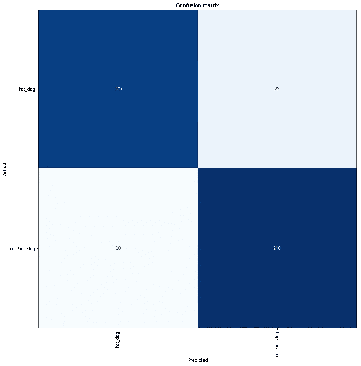
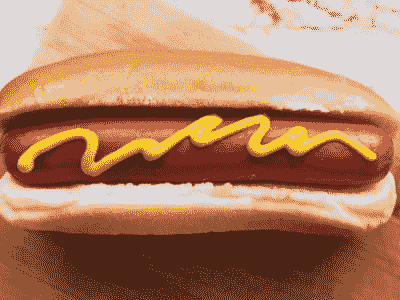

# 无服务器“不是热狗”

> 原文：<https://medium.com/hackernoon/building-a-serverless-not-hotdog-classifier-with-aws-sagemaker-and-lambda-dd473cf6506a>

## 使用 fast.ai、AWS Sagemaker 和 Lambda 构建无服务器图像分类器。


*更新(2019 年 5 月):在*[*【https://hotdog-or-not.netlify.com/】*](https://hotdog-or-not.netlify.com/)亲自试用

自从 HBO 的硅谷上出现了“不是热狗”应用程序，以及蒂姆·安格拉德关于他们如何用 TensorFlow 建立这一应用程序的[综合文章](/@timanglade/how-hbos-silicon-valley-built-not-hotdog-with-mobile-tensorflow-keras-react-native-ef03260747f3)以来，我感到用更少的代码和无服务器计算模型来复制这一应用程序是一种挑战。

现在，由于 fast.ai 的[精彩课程和去年 re:Invent](https://course.fast.ai/)发布的[Lambda Layers，我终于成功训练了一个模型(在这个](/comic-relief/our-takeaways-from-aws-re-invent-8ea8c6795885) [Kaggle 数据集](https://www.kaggle.com/dansbecker/hot-dog-not-hot-dog/data)上有 93%的准确率)并使用 [PyTorch](https://pytorch.org/) 层和[无服务器框架](https://serverless.com/)将其部署到 Lambda 函数。最让我惊讶的是，我用迁移学习训练一个足够好的分类器只花了不到 10 分钟，而做一个预测只花了大约 1-2 秒。

我确信用于模型训练的 [AWS Sagemaker](https://aws.amazon.com/sagemaker/) 和用于模型推理的 [AWS Lambda](https://aws.amazon.com/lambda/) 的组合是一个成功的组合——参见[这里](/comic-relief/serverless-at-comic-relief-eaf3ff25cbfe)和[这里](/comic-relief/the-journey-to-90-serverless-at-comic-relief-a79356fb76cd)关于为什么我普遍认为无服务器正在成为主要的计算范例。机器学习的无服务器模型的美妙之处在于，你可以既进行训练又进行推理，而且只需要花几美元。此外，运行 Lambda 的推理意味着您可以将这样的模型投入生产，而不用担心成本或缩放(AWS [声称](https://aws.amazon.com/machine-learning/elastic-inference/)90%的 GPU 成本都花在推理上)。

在这篇文章中，我将带你完成模型训练(使用 f [ast.ai](https://docs.fast.ai/) 、 [Pytorch](https://pytorch.org/) 和 AWS Sagemaker 上支持 GPU 的 Jupyter 笔记本实例)，将我们的模型部署到 S3 和 Lambda，最后在生产中大规模运行。

# 模特培训


Example data from the [Kaggle dataset](https://www.kaggle.com/dansbecker/hot-dog-not-hot-dog).

模型训练在 GPU 上性能最好，AWS Sagemaker 可以轻松设置 Jupyter 笔记本。在 1.26 美元/小时的价格下，`ml.p2.large`实例是一种非常划算的方式来开始模型训练，而不必花大钱。

我开始构建一个基于 [resnet50](https://arxiv.org/abs/1512.03385) 的模型，一个在 [ImageNet](http://www.image-net.org/) 上训练的高性能模型。我使用 [Kaggle 的热狗或无热狗数据集](https://www.kaggle.com/dansbecker/hot-dog-not-hot-dog)，它包含一组热狗和无热狗(其他食物类型)图像。数据在训练集和测试集之间分割，每个集有 500 张图像(250 张热狗图像，250 张其他食物类型的图像)。

```
data = ImageDataBunch.from_folder(path, ds_tfms=get_transforms(), size=400).normalize(imagenet_stats)
```

使用[迁移学习](http://ruder.io/transfer-learning/)——即重用预先训练的模型——是图像识别中非常成功的技术，而 [fast.ai](https://fast.ai) 使其非常容易实现:

```
learn = cnn_learner(data, models.resnet50, metrics=accuracy)
```

此时，我们已经准备好开始模型的实际训练，我遵循了最初训练模型中最后一层的经典方法，找到最佳学习速率，解冻模型，并重新训练模型的所有先前层。

```
learn.fit_one_cycle(5)# Find the optimal learning rates for training previous layers
learn.lr_find()
learn.recorder.plot()# Unfreeze our model and continue training
learn.unfreeze()
learn.fit_one_cycle(20, max_lr=slice(1e-6,1e-4))
```

经过训练，我达到了 93%的准确率，如下图混淆矩阵所示。500 张测试图片中只有 35 张被错误分类，而且更难将食物分类为热狗，而不是相反:25 张图片被错误地识别为热狗，而只有 10 张热狗预测不是热狗。



Confusion matrix for our predictor.

获得合理准确性的关键是尝试不同的事情。在我的实验中，我将网络架构从 resnet35 更改为 resnet50，尝试了不同的学习速率，并更改了输入图像的大小(我发现 400x400 像素比传统的 224x224 像素效果更好)。虽然这个特定问题领域的最新技术可能有 98%左右的准确率，但我非常高兴达到 93%的准确率，尤其是考虑到我的训练集相当小(记住:我们每个类别只有*500 张*图片)。在这个片场，其他人已经到了 [87%](https://hackernoon.com/anothernothotdog-280ee5b86fb3) 和 [92%](https://yashuseth.blog/2018/03/05/hotdog-or-not-hotdog-image-classification-in-python-using-fastai/) 。

此外，我不想花几个小时等待我的模型训练。相反，通过 fast.ai 方便的默认设置和直观的自上而下的学习方法，并使用现有的图像分类器网络架构，我知道我可以在几分钟内达到良好的准确性*。*事实上，fast.ai [最近设法将仅用 18 分钟训练 ImageNet 的记录设定为 93%的准确率](https://www.fast.ai/2018/08/10/fastai-diu-imagenet/)。这些人正在进行一项严肃的任务，要永远改变我们进行机器学习的方式。

# 将我们的分类器出口到 S3

为了使用我们训练好的模型进行推理，例如对新图像进行实际预测，我们需要将我们的模型导出并存储在云中。

PyTorch 可以轻松地将您的模型导出到 [TorchScript](https://pytorch.org/docs/master/jit.html) 中。这里您需要知道的是，无论何时您在 TorchScript 中有一个模型，您都可以使用这个模型，而不需要 Python 环境。很整洁，不是吗？

```
save_texts(path/'models/classes.txt', data.classes)
trace_input = torch.ones(1,3,img_size,img_size).cuda()
jit_model = torch.jit.trace(learn.model.float(), trace_input)
model_file='cr_jit.pth'
output_path = str(path/f'models/{model_file}')
torch.jit.save(jit_model, output_path)
```

我们最终的 TorchScript 模型是 103 MB，我们现在需要把它和我们的类文件(热狗，没有热狗)压缩在一起。

```
tar_file=path/'models/model.tar.gz'
classes_file='classes.txt'
with tarfile.open(tar_file, 'w:gz') as f:
    f.add(path/f'models/{model_file}', arcname=model_file)
    f.add(path/f'models/{classes_file}', arcname=classes_file)
```

最后，我们希望将模型上传到 S3 桶`fastai-model`，这样我们的 Lambda 函数就可以在下一步中使用它。

```
s3 = boto3.resource('s3')
s3.meta.client.upload_file(str(tar_file), 'fastai-model', 'hotdog/model.tar.gz')
```

# 部署到 AWS Lambda

一旦我们在 S3 建立了模型，下一步就是让预测器在 Lambda 上运行，这样我们就可以进行预测，而不必为闲置的基础设施买单。

我在部署 AWS Lambda 的[上使用了优秀的 Fast.ai 指南，但我没有使用 AWS 的](https://course.fast.ai/deployment_aws_lambda.html) [SAM](https://docs.aws.amazon.com/serverless-application-model/index.html) ，而是采用了[代码](https://github.com/fastai/course-v3/blob/master/docs/production/aws-lambda.zip)来与 node.js [无服务器框架](https://serverless.com/)一起工作，这是[我长期以来在管理无服务器工作负载时最喜欢的](/comic-relief/serverless-at-comic-relief-eaf3ff25cbfe)。

`serverless.yml`的相关位是函数声明 is

```
functions:
  hotdog:
    environment:
      MODEL_BUCKET: fastai-model
      MODEL_KEY: hotdog/model.tar.gz
    handler: handler.lambda_handler
    layers:
      - arn:aws:lambda:us-east-1:934676248949:layer:pytorchv1-py36:1
    events:
      - http:
          path: invoke
          method: post
```

我们使用 Lambda 层的魔力来获取运行我们的模型推理所需的所有库。在 re:Invent 2018 发布 Lambda layers 的[版本之前，你必须将所有的依赖项打包到一个 ZIP 文件中，确保它与 Lambda 的 AWS Linux 环境兼容，同时保持总的包大小小于 250 MB。我以前在这方面的尝试确实是一次相当令人沮丧的经历。(](/comic-relief/our-takeaways-from-aws-re-invent-8ea8c6795885)[https://github.com/pvhee/digit-recognizer-serverless](https://github.com/pvhee/digit-recognizer-serverless))

现在，您可以包含公开可用的层(感谢 [Matt McClean](https://github.com/mattmcclean) 整理出一组 Pytorch 层)，部署并运行。没必要在本地和 Docker 鬼混。

然后，我从 [SAM 示例项目](https://github.com/fastai/course-v3/raw/master/docs/production/aws-lambda.zip)中复制了`handler.py`代码，该项目获取一个图像 URL，从 S3 下载我们的模型，运行 Pytorch 的模型推理，并返回一个带有关联概率的预测。为了部署它，我们运行:

```
serverless deploy
```

它返回一个端点

> [https://C5 nostwq 4c . execute-API . us-east-1 . Amazon AWS . com/dev/invoke](https://c5nostwq4c.execute-api.us-east-1.amazonaws.com/dev/invoke)

看一下代码库[这里](https://github.com/pvhee/fastai-hotdog)。

# 生产中的推理

最令人兴奋的是看到我们的模型在生产中的表现，在它从未见过的图像上。

让我们从一个简单的热狗图片开始:



Source: [https://leitesculinaria.com/](https://leitesculinaria.com/)

```
curl -d "{\"url\":\"[https://leitesculinaria.com/wp-content/uploads/fly-images/96169/best-hot-dog-recipe-fi-400x300-c.jpg\](https://leitesculinaria.com/wp-content/uploads/fly-images/96169/best-hot-dog-recipe-fi-400x300-c.jpg\)"}" -H "Content-Type: application/json" -X POST [https://c5nostwq4c.execute-api.us-east-1.amazonaws.com/dev/invoke](https://c5nostwq4c.execute-api.us-east-1.amazonaws.com/dev/invoke){"class": "hot_dog", "confidence": 0.9999924898147583}
```

正如所料，我们的分类器以 99.99%的置信度预测这是一个`hot_dog`。

让我们看看它是否能区分热狗和墨西哥墨西哥肉酱:

```
curl -d "{\"url\":\"https://www.verywellfit.com/thmb/QlsstkY21zG3k3vU5f8ujzxCGp8=/768x0/filters:no_upscale():max_bytes(150000):strip_icc():format(webp)/fajitas-56a5c2803df78cf77289c87c.jpg\"}" -H "Content-Type: application/json" -X POST [https://c5nostwq4c.execute-api.us-east-1.amazonaws.com/dev/invoke](https://c5nostwq4c.execute-api.us-east-1.amazonaws.com/dev/invoke){"class": "not_hot_dog", "confidence": 0.8462255001068115}
```

不错！我们有理由相信那不是热狗。

如果你觉得你已经准备好开始愚弄这个预测器了(不可否认这很有趣)，那么值得记住我们是如何训练这个分类器的。作为我们学习阶段的一部分，我们只有热狗和其他非热狗食物的图片。这意味着，如果你向它展示的东西 [*看起来像*热狗，但不是](https://9to5google.com/2017/06/26/not-hotdog-silicon-valley-android-launch/)的话，它无疑会惨败。这个热狗手机壳可以说是一个热狗，我们的预测者有 99%的把握将其归类为热狗。现在，为了制作一个更好的分类器，您需要返回并用这些类型的图像丰富您的数据集，并重新训练您的模型。

# 大规模预测

Lambda 最酷的特性之一是，伸缩性是你不必担心的事情——至少我们的简单预测器不需要担心，因为它没有可能成为你瓶颈的下游依赖性。

为了测试这一点，让我们对从 [ImageNet](http://www.image-net.org/) 数据库中随机采样的一组 1000 张图像运行我们的预测器。请注意，我并不特别关心预测热狗的高准确性，而只关心在模拟实际生产用例的情况下我可以做出这些预测的速度。

使用[cannon . io](https://artillery.io/)节点库，很容易在不到一分钟的时间内模拟大约 900 个请求([如果您有兴趣，请查看代码](https://github.com/pvhee/fastai-hotdog/tree/master/loadtest))。

```
All virtual users finished
Summary report @ 21:48:05(+0100) 2019-04-27
   Scenarios launched:  904
   Scenarios completed: 904
   Requests completed:  904
   RPS sent: 14.63
   Request latency:
      min: 371.2
      max: 3139.4
      median: 1357.9
      p95: 1950.6
      p99: 2355.5
   Scenario counts:
     0: 904 (100%)
   Codes:
     200: 904
```

您可以看到，对于 95%的请求，我们的预测器在不到两秒钟的时间内返回结果(p95，或第 95 百分位)，这包括将图像传递给我们的预测器。还不错！

# 关于无服务器机器学习的思考

最初的分类器被设计成在移动设备上运行推理。因此，我们做了大量的工作来使其适应特定的计算环境。对于真实的场景，有一个 REST 端点可用于发出返回分类结果的 POST 请求就足够了。同样，在支持 GPU 的云环境(如 Sagemaker)中训练您的模型也是一件愉快且容易的事情。

我将任何代码部署到云的首选方法涉及 AWS Lambda。我坚信，无服务器范式将迅速接管并成为云原生应用程序的主要编程模型。因此，我很高兴没费多大力气就完成了这最后一点——我相信无服务器推理将成为大规模运行预测的主要机制。它还清楚地表明，除了训练模型之外，您不需要 GPU 的能力来做任何事情。一个简单的内存为 1g 的 Lambda 就可以做到这一点。

*在这里用无服务器模板*[](https://github.com/pvhee/fastai-hotdog)**和我用于模型训练的 Jupyter 笔记本* [*在这里*](https://github.com/pvhee/fastai-hotdog/blob/master/notebooks/hotdog.ipynb) *查看代码库。**

**如果你感兴趣的话，可以看看漫画救济技术博客* *上的一系列博文* [*。*](https://medium.com/comic-relief/serverless/home)*

**最后，非常感谢* [*杰瑞米·霍华德*](https://twitter.com/jeremyphoward) *来自*[*fast . ai*](https://fast.ai)*让机器学习变得如此轻松愉快。**