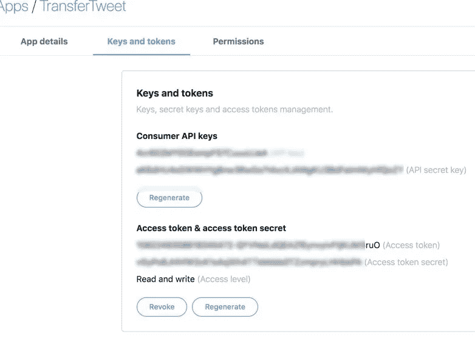
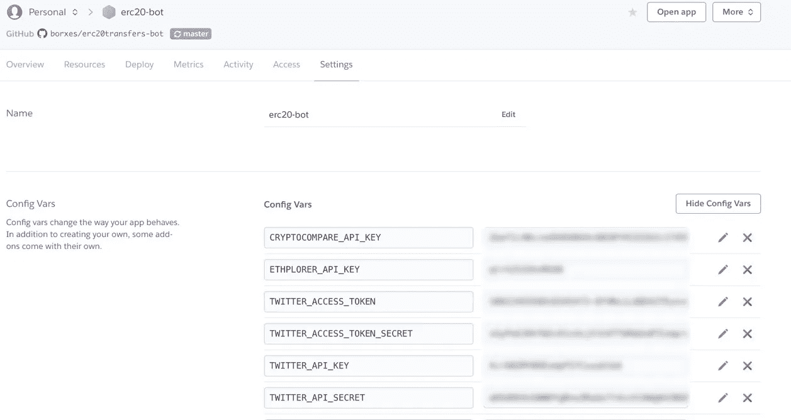

# 用 Node.js、Heroku 和 crypto APIs 构建一个跟踪 ERC-20 令牌传输的 Twitter Bot

> 原文：<https://medium.com/hackernoon/building-a-twitter-bot-tracking-erc-20-token-transfers-with-node-js-heroku-and-crypto-apis-8cf618a3f287>


Photo by [Lukas](https://unsplash.com/@hauntedeyes?utm_source=medium&utm_medium=referral) on [Unsplash](https://unsplash.com?utm_source=medium&utm_medium=referral)

一个推特机器人在推特上发布重大的 ERC-20 代币转让怎么样？这些信息可能会引起交易者的兴趣，或者对黑客攻击和退出骗局发出实时警报。

在本指南中，我们将了解如何跟踪代币转账，如何在推特上发布相关信息，以及如何在 Heroku 上免费托管机器人。

该机器人在 [@erc20events](https://twitter.com/erc20events) 运行，源代码可在 [Github](https://github.com/borxes/erc20transfers-bot) 上获得。

# 先决条件

为了遵循这个指南，你需要为你的机器人准备一个 Twitter 账户，一个免费的 [Heroku](https://heroku.com) 账户和 [node.js](https://nodejs.org/en/) 在你的开发机器上。

# 获得一个 Twitter 开发者账户

在你创建了一个新的 Twitter 账户后，[申请访问](https://developer.twitter.com/en/apply-for-access.html)开发者平台。填写所有必要的细节，然后等待 Twitter 批准你。通常需要 24-48 小时。一旦获得批准，[创建一个新的应用程序](https://developer.twitter.com/en/apps/create)，以便生成 API 密钥和令牌。



# 检测 ERC-20 令牌传输

在这个项目中，我选择了市值最高的 12 个 ERC 20 强股票，并将它们保存在一个 Javascript 数组中:

由于名单很短，我只是从 [Etherscan](https://etherscan.io) 上复制粘贴了他们的合同地址。

那么我们如何跟踪这些代币的转移呢？每次 ERC-20 令牌传输都会发出一个 transfer()事件。自然的方法是使用 web3.js 库来[订阅](https://web3js.readthedocs.io/en/1.0/web3-eth-contract.html#contract-events)这些事件，并在每次被跟踪的 ERC-20 契约发出事件时，直接由区块链(通过 Infura 的基础设施)通知，如下所示:

这种方法只有一个问题。首先，我们必须通过 web 套接字连接到 Infura:

```
const web3 = new Web3(
 new Web3.providers.WebsocketProvider(‘wss://mainnet.infura.io/ws’)
);
```

根据我的经验，这种连接对于频繁获得通知来说并不是最可靠的。由于我们的机器人将被托管在 Heroku 上(Heroku 每天重新启动它的实例)，我们需要一个更可靠的解决方案。

这个解决方案就是 [Ethplorer.io](https://ethplorer.io) 提供的免费 [API](https://github.com/EverexIO/Ethplorer/wiki/Ethplorer-API) 。具体来说，`getTokenHistory`端点返回任何令牌操作的数组。它可以按操作类型(在我们的例子中是转移)和时间进行过滤。

比如这个调用[http://API . eth plorer . io/getTokenHistory/0 XB 8 c 77482 e 45 f1 f 44 de 1745 f 52 c 74426 c 631 BDD 52？API key = free key&type = transfer&limit = 5](http://api.ethplorer.io/getTokenHistory/0xB8c77482e45F1F44dE1745F52C74426C631bDD52?apiKey=freekey&type=transfer&limit=5)将返回最近五次 BNB 令牌传输。这正是我们所需要的。

# 计算 ERC-20 令牌传输的价值

我们已经看到了如何轮询 Ethplorer API，并获得每个令牌协定地址的最新 ERC-20 令牌传输。但我们只对大额转账感兴趣，比如价值超过 25，000 美元的代币转账。

为了计算转让的价值，我们需要将转让的代币数量乘以代币的现行汇率。

方便的是，Ethplorer 的 API 在响应`getTokenHistory` API 调用时返回一个`tokenInfo`对象。该对象包含令牌的更新价格信息。但是有一个问题。对于一些有趣的令牌，如 REP(auger)和 HOT(赫萝)，价格信息不会返回。

为了解决这个问题，我们可以使用 [CryptoCompare API](https://min-api.cryptocompare.com) 。免费层每月为您提供 100，000 次通话，这足以每天检索我们的代币当前价格。

在初始化我们的 bot 时，我们将简单地为令牌数组中的每个令牌调用 CryptoCompare API 的`/data/price`端点，并保存我们得到的价格。我们只需要做一次，因为 Heroku 每天都会重启实例，所以价格会每 24 小时更新一次。

现在我们有了所有的代币利率，我们可以很容易地计算出我们检测到的每笔代币交易的价值，并只在推特上发布重要的交易。

# 使用 setInterval()进行连续传输跟踪

知道了如何询问代币转账并计算其价值，我们现在可以将它们联系起来:

这段代码完成了持续跟踪特定 ERC-20 令牌传输的所有工作。我们调用 Ethplorer API 并询问最近一分钟发生的所有传输，然后我们将每个接收到的*操作*发送给提供的回调。

对 Ethplorer API 的调用被包装在`setInterval`中，以执行以固定时间延迟重复的调用。时间间隔是随机的，这样我们就不会用大量的调用来轰炸 API。

# 过滤重要的传输

我们已经看到，对于每个检测到的令牌传输，都会调用一个回调。这个回调函数需要计算一次转移的价值，并且只有当这个价值超过我们的阈值时才发布消息。

在这里，我们将转移的代币的数量转换为规范化的形式，同时考虑到每个代币定义的小数。大多数 ERC-20 代币有 18 位小数(就像以太坊本身一样)，但有些没有:USDC 稳定硬币只定义了 6 位，而 Zilliqa 有 12 位，所以我们必须考虑这一点。

接下来，我们将转移的代币数量乘以价格并获得值。如果它超过了阈值(目前是 50000 美元),我们就构造一个消息字符串并发布出去。

我们还保存了交易散列，这样我们就不会不止一次地发布关于同一笔转账的消息。

# 简单的推特行为

请看这篇关于如何用 node.js 连接 Twitter API 的信息丰富的[文章](https://codeburst.io/build-a-simple-twitter-bot-with-node-js-in-just-38-lines-of-code-ed92db9eb078)

它简明地描述了如何生成 Twitter API 键并在我们的 bot 中使用它们。一旦我们有了这些，我们就可以简单地在推特上发布任何消息(为了更好地衡量，还可以将它记录到控制台上):

# 将这一切结合在一起

要连接所有这些部分，我们需要做的就是从。env 文件，用它们的价格初始化令牌并开始跟踪它们。

# 在 Heroku 上部署 Twitter 机器人

我已经在 [Heroku](https://heroku.com) 上注册了这个机器人，创建了一个新的应用程序，并将其连接到机器人的 Github repo。

Heroku 需要做两处修改:

1.  将“Procfile”添加到 repo 的根目录。这个[文件](https://heroku.com)让 Heroku 知道这是一个工作进程，而不是一个 web 应用程序，它只有一行代码:

```
worker: node app.js
```

2.我们不能再使用`dotenv`模块从。环境文件。很自然。env 文件不会上传到 Github，也不会部署到 Heroku。简单的解决方案是在 Heroku 的应用程序设置页面上手动将秘密定义为配置变量:



# 结果

ERC-20 转会追踪器[机器人](https://twitter.com/erc20events)已经运行了几天，发了 301 条推文，已经有了 10 个追随者。

可以做一些事情来改善它，例如使推文在视觉上更具吸引力，并过滤掉稳定的币币转账。

如果你有任何问题或建议，请在评论中告诉我。