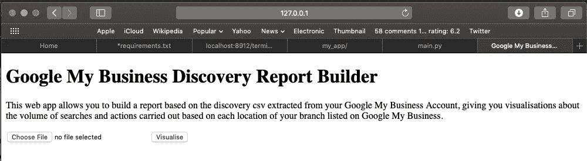
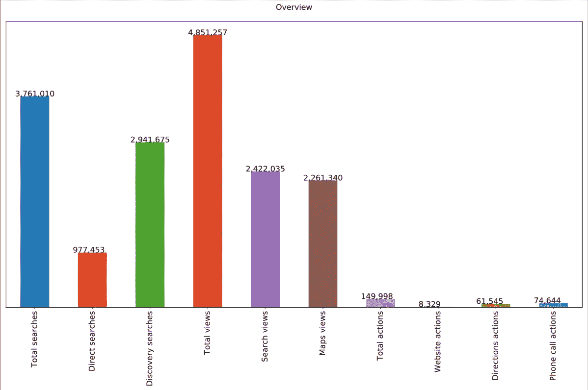
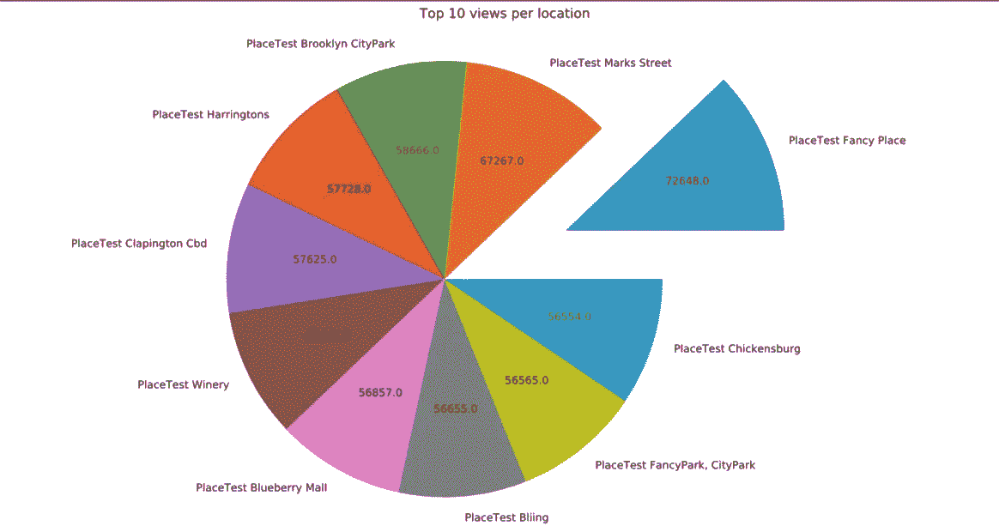

# 用 Python 构建一个 web 应用程序来可视化 Google 我的业务发现数据

> 原文：<https://medium.com/hackernoon/building-a-web-app-to-visualise-google-my-business-discovery-data-4d7c7f510e6>


Source: Memegenerator

数据可视化是分析过程中不可或缺的一部分，它使您能够以一种易于与所有业务部门沟通的方式讲述您的数据故事，并让您了解您的业务的不同方面是如何表现的。它类似于一部电影；有时候，传达信息的最佳方式是通过视觉上吸引人的调制解调器，它能够抓住人们的注意力并增加回忆。


Inaccurate information

不言而喻，与上面的图像不同，产生的可视化必须准确，特别是如果这些可视化为用于指导商业和营销决策的报告提供信息。

最近，我签约为一家大银行的一个部门做一些分析工作。当我失望地发现他们实际上并没有在大楼里存放大量现金时，我发现这项工作非常有趣。我必须完成的任务之一是开发报告，以可视化数字营销数据。其中一份报告，没有透露太多，涉及从谷歌我的业务(GMB)可视化数据。

根据此任务，让我们创建一个场景。假设你在一家大公司工作，在一个国家/世界有多个分支机构。所有的实体分支机构都在 GMB 上市，因为你想让人们轻松找到你的分支机构，你想从执行与你的行业相关的搜索查询的人那里吸引潜在的新客户。每个月，您都希望获得与您的分支机构相关的搜索、操作和查看的摘要，例如:地图总浏览量、总操作数、总浏览量、最高浏览位置和按用户执行的搜索和操作排名的前 10 个位置。你或许可以在 Excel、Google Data Studio 和 Tableau 上创建这些可视化效果，但是为了这篇博客，我决定使用 Flask 创建一个 web 应用程序，允许用户上传从 GMB 提取的 discovery CSV，清理 CSV 并只需点击一下就可以创建可视化效果。

我从未在 Python 上创建过网络应用，所以我满足于使用 [flask](http://flask.pocoo.org/) ,因为根据我的研究，它似乎相对容易理解。

**为 app 创建文件夹**

烧瓶文档有一个非常简单易懂的教程，教你如何设置虚拟环境和安装依赖项来启动项目。第一步包括在我的 Jupyter 终端上创建项目文件夹和虚拟环境(我的默认 shell 是 bash)。设置并激活我的虚拟环境后，我继续创建 requirements.txt 文件。这个文件包含了运行我的应用程序需要安装的所有库。这背后的想法是允许另一个想要与我的应用程序交互的最终用户在他/她的机器上重新创建虚拟环境以及应用程序运行所需的库。

```
#requirements.txt Flask==0.12.3
click==6.7
gunicorn==19.7.1
itsdangerous==0.24
Jinja2==2.9.6
MarkupSafe==1.0
pytz==2017.2
requests==2.13.0
Werkzeug==0.12.1
pandas==0.23.0
matplotlib==1.4.2
numpy=1.8.2
```

需求文件创建在我刚刚创建的同一个文件夹中。创建这个文件后，我使用 pip 安装了需求文件中列出的库。

```
pip install -r requirements.txt
```

**构建网络应用**

加载相关库后。第一步是允许用户上传报告。

```
UPLOAD_FOLDER = ‘./Downloads/gmbreports’
if not os.path.exists(UPLOAD_FOLDER):
 os.makedirs(UPLOAD_FOLDER)

ALLOWED_EXTENSIONS = ‘csv’
app = Flask(__name__)
app.config['UPLOAD_FOLDER'] = UPLOAD_FOLDER
def allowed_file(filename):
    return '.' in filename and \
           filename.rsplit('.', 1)[1].lower() in ALLOWED_EXTENSIONS
```

使用这段代码，我将允许上传的文件限制为 CSV 格式的文件，并指定上传的文件将保存在本地机器的 downloads/gmbreports 文件夹下。我添加了一个条件，如果路径不存在，就必须创建它。

然后，我为我的 web 应用程序创建了 Flask 类的实例，这“启动”了我的 flask web 应用程序。

**界面**

由于该应用程序的目的是以 CSV 的形式接收输入并生成报告，我创建了一个功能，提示用户上传 CSV。

```
[@app](http://twitter.com/app).route('/', methods=['GET', 'POST'])
def upload_file():
    if request.method == 'POST':
        if 'file' not in request.files:
            flash('No file part')
            return redirect(request.url)
        file = request.files['file']
        if file.filename == '':
            flash('You need to upload a csv file')
            return redirect(request.url)
        if file and allowed_file(file.filename):
            filename = secure_filename(file.filename)
            file.save(os.path.join(app.config['UPLOAD_FOLDER'], filename))
            return redirect(url_for('uploaded_file',
                                    filename=filename))
    return '''
    <!doctype html>
    <title>Google My Business Discovery Report Builder</title>
    <h1>Google My Business Discovery Report Builder</h1>
    <p>This web app allows you to build a report based on the discovery csv extracted from your Google My Business Account, giving you visualisations about the volume of searches and actions carried out based on each location of your branch listed on Google My Business.</p>
    <form action="/transform" method="post" enctype="multipart/form-data">
      <p><input type="file" name="file">
         <input type="submit" value=Visualise>
    </form>
    '''
```

我的代码中的@app.route 部分是一个装饰器，它告诉 flask 应该触发 upload_file 函数运行的 URL。此函数检查上传的文件是否为允许的格式(CSV)，将文件保存在指定的文件夹中，并返回带有我的应用程序前端界面的 HTML。

HTML 本质上是一个上传表单，它运行一个我命名为 transform 的函数。该函数清理 CSV 文件，并根据文档中的数据创建可视化效果。

## 清理和创建可视化的功能

由于这个应用程序的核心功能是从 GMB 提取一个特定格式的 CSV，清理它并返回大约 8 个基于显示数据的可视化，我的下一步涉及创建“主函数”来执行这个转换

```
def transform():
 disc = open(‘clean.csv’)
 disc2 = open(‘clean_two.csv’,’w’)
 #cleaning up csv
 for row in disc:
 row = row.strip()
 row = row[1:-1]
 row = row.replace(‘“”’,’”’)
 disc2.write(row+’\n’)
 disc2.close()
 disc.close()
 discovery = pd.read_csv(‘clean_two.csv’)
 discovery_clean = discovery.iloc[1:]
 cols = list(discovery_clean.columns[4:])
 discovery_clean[cols] = discovery_clean[cols].apply(pd.to_numeric,errors=’coerce’)
```

最初，CSV 在一行中返回的应该是许多列(没有划分为列)，但是，一个共同的特征是每个列名都用双引号括起来。为了清理这个问题，我将双引号转换为单引号——这样我可以利用 pd.read_csv 将引号中的每个文本作为列名读取，然后将每个新行作为列下的一行。

作为清理的一部分，我删除了出现在第二行中的值，因为这些值不能归类为列或归属于每列的值，这些是列的描述。

```
with PdfPages('plots.pdf') as pdf:
        #first figure
        plt.figure(figsize=(20,10))
        ax = discovery_clean[cols].sum().plot.bar(figsize=(20,10))
        ax.axes.get_yaxis().set_visible(False)
        ax.set_title('Overview\n',fontsize='15',color='black')
        ax.xaxis.set_tick_params(labelsize=15)
        for x in ax.patches:
            ax.text(x.get_x()-.09,x.get_height()+20,\
            f'{int(x.get_height()):,}',fontsize=15,color='black')
        plt.rcParams['figure.figsize']=(20,10)
        pdf.savefig(bbox_inches='tight')
        plt.close()
```

继续转换功能，我希望可视化以 pdf 格式返回，每个可视化创建自己的页面。使用 [PdfPages](https://matplotlib.org/gallery/misc/multipage_pdf.html) 函数，我创建了包装器/框架来创建多个 pdf 页面，并开始创建一个可视化的摘要，总结了在该文档所代表的时间段内 GMB 所有地点所执行的关键操作。

```
plt.figure(figsize=(16,8))
mpl.rcParams['font.size'] = 12
disc_plot = discovery_clean.groupby('Business name')['Total views'].sum().nlargest(10)
labels = list(disc_plot.index)
nums = (disc_plot.values).astype(int)
def actual_nums(vals):
    a = np.round(vals/100.*nums.sum())
    return a
explode = []
for v in nums:
    if v == max(nums):
        explode.append(0.3)
    else:
        explode.append(0)
plt.pie(nums,labels=labels,autopct=actual_nums,explode=explode,radius=0.50)
plt.tight_layout()
plt.title("Top 10 views per location\n",fontsize=15,color='black')
plt.axis('equal')
pdf.savefig(bbox_inches='tight')
plt.close()
```

第二个可视化返回一个饼图，显示具有最高浏览量的前几个位置，并展开具有最大值的饼图。因为饼图默认返回百分比，所以我创建了一个函数来将百分比转换成相应的数字。我确保以这样一种方式来调整这个图表和后续图表的大小，以便将它们保存为 pdf，每个图表都是一页，不会被切断。

**创建报告**

在我的报告中总共创建了 8 个图表。

```
[@app](http://twitter.com/app).route('/transform',methods=["POST"])
def transform_view():
    request_file=request.files['file']
    request_file.save('clean.csv')
    if not request_file:
        return "No file"
    result = transform()
    print(result)    
    return send_file('plots.pdf', as_attachment=True)
```

我想要的一件事是将报告保存为 pdf 格式，并保存为附件，当我在 web 应用程序上按下上传按钮时，它会自动下载。将 as_attachment 设置为 true 允许我的函数将我的报告保存为附件，并在报告创建后下载到我的本地机器上。

**输出样本**


Running the app on bash

通过引用文件名(main.py)在 bash 上运行应用程序会产生一个到 web 应用程序的链接，单击链接 my browser 会打开 web 应用程序。



Google My Business Discovery Report Builder web -app

没有向应用程序添加任何 CSS，这将返回相对简单的 web 应用程序，我可以上传从 Google My Business 提取的 discovery CSV 文件，并创建带有摘要可视化的报告。



Summary of Google My Business searches and actions



Top 10 locations based on Google My Business Views

该功能生成的输出是一个易于理解和生成的报告，消除了每次从 Google My Business 提取 discovery CSV 时生成新的可视化内容的需要。

鳍。

欢迎提出任何评论和批评，或者关注我那些没有争议的推文。