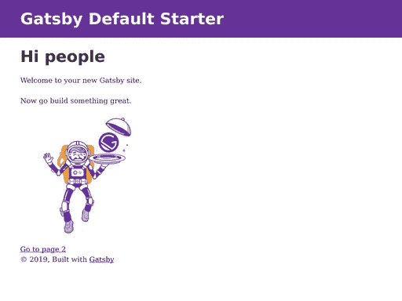
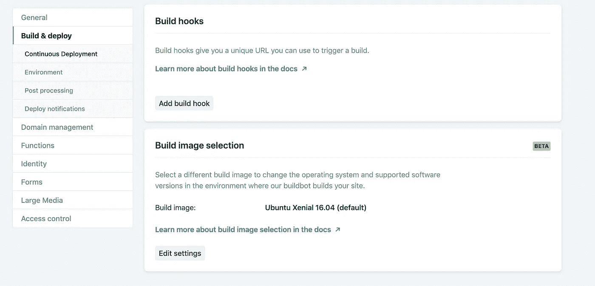
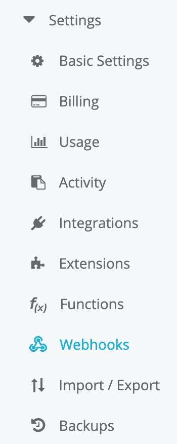

# 使用 Gatsby JS 和 Cosmic JS 构建和设计作品集网站

> 原文：<https://medium.com/hackernoon/building-and-designing-a-portfolio-site-using-gatsby-js-and-cosmic-js-17818d9000ef>


如今，创建/更新我们的投资组合是一件必要的坏事。地点在变，人在变，因此内容创建和管理的循环不断地搅动。当你发现自己需要重新设计投资组合时，有大量的工具和服务可以考虑。目前最让你感兴趣的是 Gatsby JS 静态站点生成器和一个无头 CMS，比如 Cosmic JS。今天，有了这两个工具，我们将创建一个可持续部署的工作组合，当内容发生变化时，可以重新构建。

# TLDR:

[盖茨比作品集现场演示](https://cosmicjs.com/apps/gatsby-agency-portfolio)

[下载代码库](https://github.com/cosmicjs/gatsby-agency-portfolio)

# 开始前为 0.0

我们正在创建一个包含静态数据的组合网站，但是如果能够轻松地修改我们网站的内容而不需要修改大量的源代码，那就更好了。因此，我们正在构建一个客户端，它使用存储在内容管理服务上的内容，并以编程方式在我们选择的任何 URL 上显示它。

# 0.1 我们正在使用的工具

*   [Gatsby JS](https://www.gatsbyjs.org/)——这是一个静态站点生成器，当我们的内容发生变化时，它会自动获取新数据并重建我们的站点文件。捆绑了数据获取魔法 GraphQL 和一直存在的 React JS 前端框架。
*   Cosmic JS —我们的内容管理服务，将存储我们需要的关于我们网站的所有信息。Cosmic JS 提供了非常灵活的数据模型定义，允许我们存储所有类型的信息，从可重复数据到简单的文本字段和 HTML 内容。**注意！** — *为了遵循本教程，您需要在 Cosmic JS 上创建一个桶，并用适当的* [*数据对象*](https://cosmicjs.com/add-bucket?import_bucket=5cbf745a10d5c22da1f9b3e2) *填充它。*
*   RSuite —一个预样式组件库，它与 react 一起为我们提供预样式组件。这将允许我们使用开箱后看起来很棒的组件，同时也给了我们根据需要进行调整的灵活性。
*   Netlify (可选)——这是一个部署服务，可以让我们直接连接到 git 存储库。使用它，我们可以配置 webooks 来重建静态文件，并在源代码发生变化时进行自动部署。

让我们开始配置我们的设置。

# 1.0 安装和设置

我们只有一些开始构建所需的软件需求。主要是我们需要[节点 JS](https://nodejs.org/en/) ，npm 或者 yarn，如果你愿意，我们将使用 [git](https://git-scm.com/) 在 **Netlify** 上做一些部署工作。

# 1.1 初始化我们的项目

一旦您安装了这些，我们就可以开始设置我们的开发环境了。Gatsby 使用了一个非常方便的漂亮的 CLI，允许我们用一个项目目录来引导我们的项目，这个项目目录可以在节点环境中构建和服务。

如果您没有 CLI，可以使用简单的 npm 终端命令安装它:

```
$npm install -g gatsby-cli
```

这将需要一点时间来安装，但几秒钟后，您将可以访问 gatsby 终端命令，我们可以使用它来初始化我们的项目:

```
$gatsby new gatsby-portfolio
```

现在我们有一个名为 **gatsby-portfolio** 的目录，在您运行 gatsby 命令的位置，切换到该目录并列出其内容:

```
$cd gatsby-portfolio/ && ls -la
```

您应该会看到类似以下内容的文件夹和文件列表:

```
. ├── node_modules
  ├── src
  ├── .gitignore
  ├── .prettierrc
  ├── gatsby-browser.js
  ├── gatsby-config.js
  ├── gatsby-node.js
  ├── gatsby-ssr.js
  ├── LICENSE
  ├── package-lock.json
  ├── package.json
  └── README.md
```

打开 **package.json** ，我们将看到我们现在可以使用一些终端脚本来构建/服务我们的项目。尝试在您的终端中运行启动脚本:

```
$npm start
```

或者

```
$yarn start
```

几秒钟后，我们应该在我们的终端上看到一条成功消息，我们应该能够在我们的 [localhost](http://localhost:8000) 上查看我们的初始项目视图，您应该看到类似这样的内容:



很好，现在在你的终端中按下 **ctrl + C** 来停止开发服务器，我们现在准备好安装我们的节点库了。

# 1.2 安装我们的库

我们需要 Gatsby 的一些插件来运行我们的 Graphql 查询，以及一些额外的环境配置和组件库 RSuite。在您的项目目录中，我们需要运行一些终端命令来获取我们的 js 库:

```
$yarn add rsuite dotenv gatsby-source-cosmicjs gatsby-plugin-sass gatsby-plugin-less node-sass less
```

让我们浏览一下这些内容，并讨论一下我们要添加到项目中的内容:

*   r suite——我上面提到的组件库。安装这个让我们导入 React 类，并将预先设计好的组件插入到我们的 UI 中。
*   **dotenv** —允许我们用敏感的 api 键、令牌来配置我们的源代码，无论这些东西在开发人员之间可能会改变，但在构建源代码时应该存在。
*   gatsby-source-cosmicjs —一个 gatsby 插件，它可以让我们轻松地向 Cosmic JS graphql API 发出 graphql 请求。
*   **gatsby-plugin-sass/Gatsby-plugin-less/node-sass/less**—将让我们使用的 Gatsby 插件和样式库。scss 和。更少的文件。这将允许我们导入 rsuite 样式规范，并在构建时正确地捆绑它们。

# 1.3 配置 Gatsby

为了让 Gatsby 能够构建我们的 html 文件，我们需要从 Cosmic JS 获取数据，并使用 graphql 获取的数据构建每个页面。让我们打开 **gatsby-config.js** 并添加我们已安装的软件包:

我们已经为 **sass** 和 **less** 添加了我们的插件，还添加了我们的 **gatsby-source-cosmicjs** 插件。你会注意到我们使用了一些环境变量来配置这个插件，所以我们需要添加一个隐藏文件来存储这些变量。

```
$touch .env
```

现在将你的变量添加到这个文件中，dotenv 会使用我们的 **gatsby-config.js** 文件的第 1 行来定义这些变量。您可以在您的 Cosmic JS bucket 中找到分配给这些变量的值:Bucket Name>Dashboard>Settings>Basic Settings:

现在我们可以开始构建了！

# 2.0 构建我们的组件

那么我们到底在建造什么？嗯，基本上我们将创建一个大的页面组件，并创建一系列的显示组件来处理我们的投资组合的每个部分。让我们来分解一下:

```
src/pages/index.js
```

*   这是我们的主页，在这里我们所有的组件将被加载并用于显示投资组合信息。

```
src/components/projects.js
```

*   这将是我们的项目部分，将采取项目数据和显示每个项目的信息。这将需要一个由我们的投资组合项目组成的道具，并在适当的时候对它们进行迭代以显示数据。

```
src/components/work.js
```

*   这将是一个部分，强调我们的技能和我们提供的服务/工作类型，人们可能会仔细阅读我们的投资组合。

```
src/components/about.js
```

*   这将是一个关于我们的部分，显示我们想要分享的任何个人数据。

```
src/components/contact.js
```

*   最后，我们有一个组件，我们将用于显示一个联系形式，让用户向我们发送电子邮件，如果他们有任何查询。

# 2.1 主页

这是我们的主要组成部分，是我们投资组合的切入点。它的工作是对来自 Cosmic JS 的投资组合数据发出几个 Graphql API 请求，并将这些数据传递到我们投资组合的不同部分。让我们看看组件，并讨论发生了什么:

这里唯一真正存在的显示元素是闪屏，它为我们提供了一点可以显示贵公司的副本。但是我们的内容的实质将被推进到每个部分组件中。

现在让我们修改我们的**标题**，这样我们就可以在我们的主页上显示导航。

# 2.2 修改表头组件

默认情况下，Gatsby 给了我们一个**布局**组件，让我们用**页眉**和**页脚**来包装每一页。我们将为我们的投资组合添加一些导航到标题中，这样用户可以通过单击我们将从 rsuite 导入的导航栏来导航到我们投资组合的不同部分:

这些链接将通过主页上每个部分的名称属性将主页向下滚动到每个部分。

# 2.3 工作组成部分

这个组件接收我们提供的任何服务的数据，特别是一个**名称**，一个简短的**摘要、**和一个更深入的**描述**，让我们向我们的用户显示:

这将遍历我们的服务对象。对于存在的每个服务，我们都向工作组件部分添加一个新的 div。现在我们可以在 Cosmic JS 上修改和添加数据，它会相应地更新。

# 2.4 项目及关于组件

这些部分的行为方式基本相同，我们从“主页”显示一些信息。只是一些文本，为用户提供每个部分的一些上下文，但之后我们只是迭代我们已经保存到我们的宇宙 JS 桶的列表对象。

这是我们的项目组件，它将遍历我们的项目并显示图像和文本:

就像项目显示标题并显示关于项目的图像和数据一样，我们也可以对“关于”部分中的个人和数据进行同样的操作:

# 2.5 接触元件

最后，我们有一个组件，将用户联系到我们指定的电子邮件。这将处理我们的联系人表单，并用一些状态变量进行初始化，以便我们可以控制我们的用户输入，所有的输入和表单组件都由 rsuite 处理，因此我们不必向表单字段和反馈组件添加太多的样式属性:

本质上，我们验证我们的表单域并检查是否所有的表单域都存在，然后我们使用 **mailto** url 打开一个电子邮件客户端并用我们的消息填充它。

# 3.0 部署(可选)

现在我们已经准备好部署我们的应用程序了。这个过程中最重要的部分是确保我们的应用程序在我们更改了 Cosmic JS 上的任何数据时能够自我重建。如果我们使用 git **集成连续部署，Netlify** 将允许我们激活一个 buildhook，以便使用从 Cosmic JS API 获取的更新数据生成新的静态文件。

# 3.1 从 Git 部署

如果您还没有帐户，请转到 [Netlify](https://www.netlify.com/) 创建一个帐户。从应用仪表板点击**新网站从 Git** 在应用仪表板。从这里开始，您将逐步完成授权 Netflify 从 git 服务(github、gitlab、bitbucket)访问存储库的过程。

你必须添加你的**宇宙 _ 读取 _ 密钥**和你的**宇宙 _ 桶 _ 弹头**作为环境变量。一旦在 Netlify 上创建了应用程序，就可以在部署设置下找到它。在同一个区域，你可以创建你的 **buildhook** 来允许 Cosmic JS 在更新完成后请求重建你的文件:



一旦创建了构建钩子，转到 Cosmic JS 并将其添加到你的桶的设置下的 **webhooks** 标签中:



按照说明添加一个 webhook，它会在每次更新对象时从 Netlify 向该 url 发出 post 请求，您应该有一个持续部署的、超级快速的 portfolio 站点准备好进行更新。

谢谢你跟随我，下次我决定做一些酷的东西时再见:)

*最初发表于*[*https://cosmicjs.com*](https://cosmicjs.com/articles/building-and-designing-a-portfolio-site-using-gatsby-js-and-cosmic-js)*。*