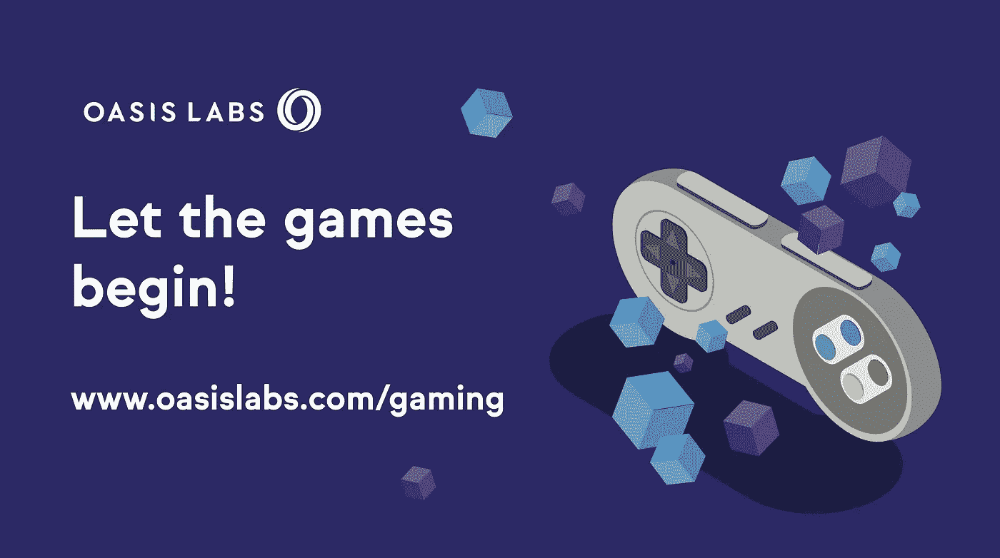
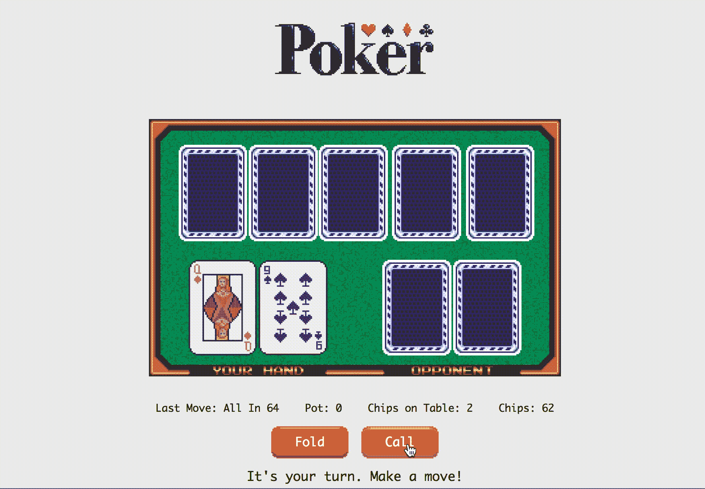
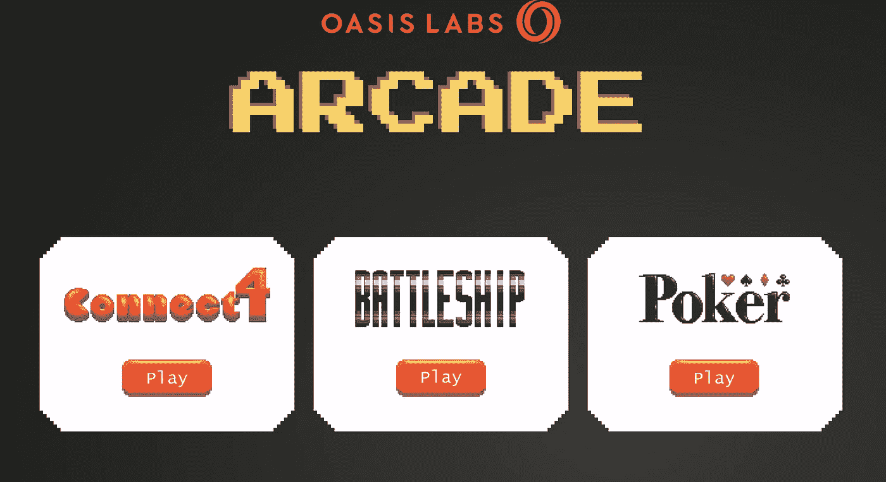
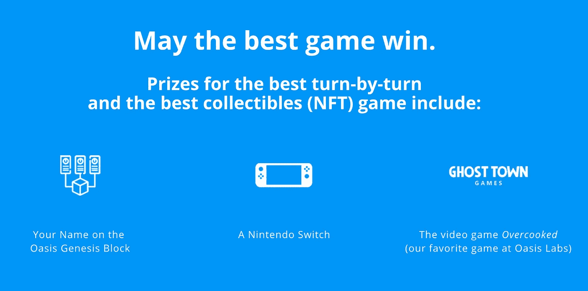

# 建设保密的区块链奥运会

> 原文：<https://medium.com/hackernoon/building-blockchain-games-with-confidentiality-9a51ec98e37e>

## 使用 Oasis Labs 的游戏 SDK

## 概观

Oasis Labs 刚刚发布了一款**全新的**[**Oasis Gaming SDK**](https://docs.oasiscloud.io/en/latest/gaming-sdk/)**——这款新工具可以帮助开发者轻松构建和部署具有内置保密性的回合制和可收藏的区块链游戏。**

**使用[机密智能合同](https://docs.oasiscloud.io/en/latest/confidentiality-develop/)，SDK 为开发人员提供了为任何游戏添加机密性的工具，并防止游戏用户获得他们不应该获得的信息——偷看他人的牌，在发牌前预测牌，或在他人准备好之前看到他们的行动。更普遍的是，区块链游戏还允许用户保留他们在任何游戏中赢得的东西的所有权——无论是小猫、收藏卡还是芯片——并在未来将它们带到其他游戏中。**

**要了解游戏 SDK 如何工作， [**现在就开始玩我们的复古版扑克、战舰和连接四个**](http://arcade.oasiscloud.io) 。我们将这些都设计在 16 位设计中，以纪念早期的游戏。我们还公开了这些游戏的[源代码](https://docs.oasiscloud.io/en/latest/gaming-sdk/#next-steps),这样你就可以很容易地开始构建自己的游戏了。**

********

# **关于游戏 SDK 的更多信息**

## **更快更简单的游戏开发**

**区块链游戏可能很难构建。特别是多人游戏有很多的依赖。为了帮助避免这种复杂性，SDK 包含了许多预构建的功能，包括:**

*   ****游戏流程管理**在区块链上跟踪回合并更新游戏状态。我们设计了一个乐观执行模型，这意味着当用户移动时，它在浏览器中执行，而事务在区块链上处理。**
*   ****网络传输**随着游戏的进行向每个玩家发送更新。这包括状态同步，以确保当游戏状态改变时，SDK 为每个玩家更新浏览器视图。**
*   ****与** **web 框架的集成**让为你的游戏构建 web UI 变得容易。**
*   ****开发者模式**允许你在浏览器中调试游戏引擎和智能合约。这对于测试很有用，意味着在准备好发布游戏之前，您不必担心智能合约部署。**

## **使用机密智能合同防止作弊**

**部署在线游戏的一个风险是，有人可能会试图入侵你的游戏并作弊——查看玩家的牌来通知他们自己的赌注，或者完全改变另一个玩家的行动。当一个游戏的赌注很高时(想想:在线比赛和赌注)，这对开发者来说尤其危险。**

**机密智能合同非常适合区块链游戏，因为它们支持可证明的公平游戏。使用智能合约可以确保玩家无法规避游戏规则，而保密性则可以确保游戏的敏感数据保持私密。例如，使用机密智能合约构建的扑克游戏可以保证玩家只能查看自己的牌，任何人(包括 Oasis nodes)都不能通过查看其他玩家的牌或事先查看牌组来作弊。**

**通过使用[机密智能合同](https://docs.oasiscloud.io/en/latest/confidentiality-overview/)，Oasis Gaming SDK 寻求实现防止作弊的游戏环境，并确保玩家在准备好之前看不到彼此的行动。**

## **在绿洲拱廊获得灵感**

**为了给你一些 SDK 如何在实践中使用的例子，我们开发了三个逐回合游戏— [扑克、战舰和连接四个](http://arcade.oasiscloud.io)。它们都以复古为主题，向早期游戏致敬。**

****

## **立即部署您的游戏**

**使用 [Oasis Gaming SDK](https://docs.oasiscloud.io/en/latest/gaming-sdk/) 开发的游戏功能齐全:它们可以被部署到 Oasis Devnet 上，并在用户之间即时直播。为了帮助您入门，我们提供了几个使用 SDK 构建的示例游戏，包括扑克、井字游戏、四人连接和战舰。你可以按照我们的教程来看看它有多容易，或者你可以自己开发一个全新的游戏。**

## **打造游戏，赢取奖品**

**为了启动 Oasis Gaming SDK，我们将举办第一次[数字黑客马拉松](http://www.oasislabs.com/gaming)。非常简单——在 Oasis Devnet 上构建一个游戏，我们将奖励最佳回合制游戏和最佳收藏品游戏的获胜者，奖品包括:**

*   **你的名字在 ***绿洲创世纪区块*** 上**
*   **新的**任天堂 Switch****
*   **一份**煮过头的** ( *我们在绿洲*最喜欢玩的游戏之一)**

****

**要参加比赛，请在 4 月 15 日之前提交您最好的[游戏](http://www.oasislabs.com/gaming) **。我们将在四月底宣布获胜者。****

## **关键链接:**

*   **[绿洲街机](http://arcade.oasiscloud.io)**
*   **[游戏 SDK 文档和示例代码](https://docs.oasiscloud.io/en/latest/gaming-sdk/)**
*   **[数字黑客马拉松详情](http://www.oasislabs.com/gaming)**
*   **[办公时间登记](https://zoom.us/webinar/register/7115525226408/WN_go-0g0GGT4mhvzI5g0dfQA)**

***有关 Oasis Labs 的问题，请发送电子邮件至*[*info@oasislabs.com*](mailto:info@oasislabs.com)*，我们将尽快回复您。***