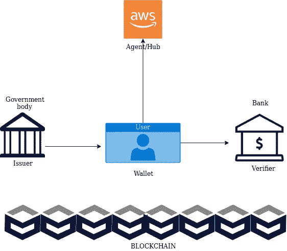

# DID 的构建模块(分散标识符)

> 原文：<https://medium.com/hackernoon/building-blocks-of-did-decentralized-identifiers-ee91d5cacd31>

**DID 的构建模块有:**

*钱包
*代理商
*枢纽
* DID
* DID 凭证
*验证凭证
*发卡行
*验证人

**SSI 和构造块用于:**

1.支持两个 did
2 之间的路由和连接(通过 PKI)。支持向个人和组织发放可验证的凭证。
3。支持对个人和组织处理的可验证凭证的验证。

**钱包**

1.  钱包是一个管理公钥/私钥对的应用程序。
2.  它运行在移动电话、个人电脑、家庭服务器、游戏控制台或专用硬件设备上。
3.  钱包=与 DIDs 关联的私钥+公钥+其他数据表示可验证的凭证。

**代理商**

1.  代理类似于钱包，它们存储公钥/私钥对，但是它们可以做更多的事情。

2.总账太大，不适合手机。

3.它充当分类帐的接口，缓存与用户相关的键和记录

4.如果实现了代理，DID 文档将包括指向代理的服务端点的指针。

5.个人管理他们的钱包或代理中的公司、
政府和机构的验证凭证。

6.代理/中枢被期望
代表一个个体身份做事情，比如做决定、共享数据、或者通过智能契约执行其他指令。

**轮毂**

多个代理一起形成一个中心

Hub =多个代理

示例一家公司为其 IT 部门的 100 名员工创建了一个身份中心

身份中心= 100 名代理

**验证过的凭证**

1.  可验证的证书是由第三方，比如大学证明的数据。

2.机构可以向用户钱包发放*可验证的凭证*。

3.机构用他们的私钥签署可验证的凭证。

**发行人和验证人**

颁发者是向用户颁发可验证凭证的一方。大学向学生颁发学位作为可验证的凭证。

验证者是验证学位是否是假的并且是同一个人的一方。示例您的公司验证您的可验证凭证。

**下一篇博客:**

[https://medium . com/@ sethisaab/decentralized-identifiers-in-deep-explain-af0f 979 b 7 bb 6](/@sethisaab/decentralized-identifiers-in-depth-explanation-af0f979b7bb6)

— — — — — — — END — — — —

联系人:sethi.shivam27@gmail.com