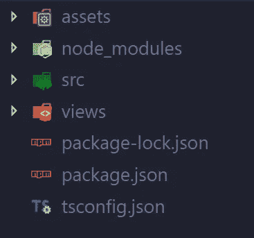
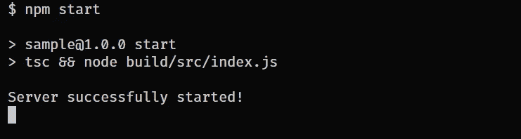
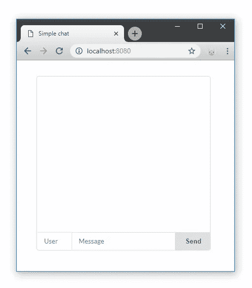
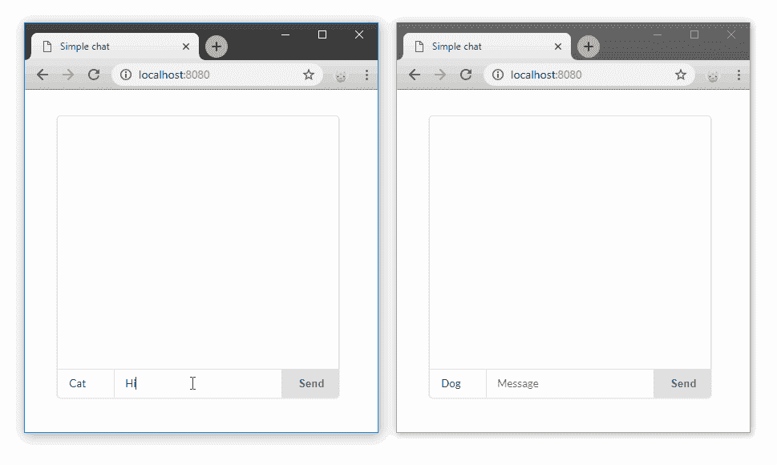

# 用 Odi 建立聊天(Node.js)

> 原文：<https://medium.com/hackernoon/building-chat-with-odi-node-js-e77ecd3891b2>


# 介绍

聊天应用程序是一个非常常见的例子，用来显示客户端和服务器之间简单的实时通信。本教程描述了如何使用 Odi，**TypeScript server-side framework for node . js 轻松实现这一点。**

# **项目设置**

**我们要开发的应用程序不仅要建立实时通信通道，还要向客户端呈现前端，包括所需的资产。**

## **基本设置**

**让我们建立 Odi 项目。首先要初始化`package.json`和`tsconfig.json`文件。我们可以用两个简单的命令来完成。**

```
npm init -y
tsc --init
```

**并安装 **Odi** 。**

```
npm install odi
```

**此外，我们需要修改`tsconfig.json`文件，因为有几个选项必须编辑。Odi 主动使用 decorators 和元数据，所以我们需要启用这些特性。**

```
"experimentalDecorators": true,
"emitDecoratorMetadata": true
```

**另一件事是`target`选项。默认情况下，它设置为`es5`，但是在这个规范中有几个东西是不支持的。由于我们是渐进的，让我们把它设置为最新版本**

```
"target": "ES2018"
```

## **项目结构**

**我们将为视图、资产和服务器源代码建立不同的文件夹。**

****

*   ****src** —服务器源代码。**
*   ****视图** —将呈现给客户的 JSX 模板。**
*   ****资产** —客户端 *JS* 和 *CSS* 文件。**

**JSX 模板是必须编译的文件。将**视图**文件夹添加到`tsconfig.json`文件的*根目录*中，并设置 *outDir* 。**

```
"outDir": "./build",
"rootDirs": ["./src", "./views"]
```

# **开始获取**

**Odi 基于*依赖注入*模式，所以每个应用组件都会被自动导入、实例化和注入。**

**必须只指定包含源文件的文件夹，然后 Odi 可以扫描它以导入应用程序组件(控制器、服务、存储库等)。**

## **主文件**

**在`src`文件夹中创建`index.ts`文件。它将是服务器入口点文件。**

```
import { Core } from "odi";
import { join } from "path";new Core({
    sources: __dirname,
    server: {
        port: 8080,
        socket: true,
        static: {
            root: join(__dirname, '../../assets'),
            prefix: '/assets'
        }
    }
}).listen(() => console.log("Server successfully started!"));
```

**我们只需要实例化`Core`类。`Core`构造函数接受单个参数，设置对象。有很多可能的选择，但是现在，我们只需要其中的几个。**

**首先，我们需要指定`sources`属性。这是 Odi 应用程序的必需设置。作为我们为服务器端代码选择的`src`文件夹中的`index.ts`文件，我们可以使用`__dirname`来设置当前目录。**

**`port`属性也是必需的。它将服务器绑定到指定的端口。**

**现在谈谈以下部分:**

```
socket: true,
static: {
     root: join(__dirname, '../../assets'),
     prefix: '/assets'
}
```

**我们必须启用套接字并设置静态文件服务选项。所有来自 **assets** 文件夹的文件都可以通过带有`/assets`前缀的 URL 获得。**

## **安装依赖项**

**Odi 框架自动只包含几个必需的包。不同特性的所有其他依赖项都是可选的，因此只有在使用某个特性时才需要安装。**

**比如你准备搭建一个简单的 REST 服务器，不需要 GraphQL、WebSockets、SSR 等包。**

**我们希望在我们的聊天应用程序中有 WebSockets 和模板(JSX)。因此，让我们安装缺失的软件包:**

```
npm install socket.io react react-dom
```

**仅此而已，Odi 会自动导入。正如你所看到的， [socket.io](http://socket.io) 被用于实现实时功能。模板处理也需要 React 包。**

**现在我们可以开始写代码了:)**

# **应用**

**我们将创建一个 web 服务器，它使用模板向客户端呈现 HTML，为客户端提供文件( *JS* ， *CSS* )，并使用 WebSockets 建立一个实时通信通道进行聊天。让我们在聊天中加入历史。因此，最后 10 条消息将保存在我们的系统中。**

## **消息和历史**

**`Message`会相当简单，只有`username`和`text`字段。我们可以用一个简单的界面来完成，因为我们不打算使用数据库。**

```
export interface Message {
    username: string;
    text: string;
}
```

**和历史服务**

```
@Service()
export default class HistoryService {
    private store: Message[] = [];

    getMessages() {
        return this.store;
    } addMessage(message: Message) {
        if(this.store.length > 10)
            this.store.shift(); this.store.push(message);
    }
}
```

**我们的存储是一个简单的消息数组。商店管理的方法很少。如果我们得到的消息超过 10 条，我们只需从数组中删除第一条消息。**

**正如你所看到的，`Service` decorator 被用于`HistoryService`类来将 is 设置为一个服务组件。服务在依赖注入容器中是单例的。现在，它可以被注入到其他应用程序组件中。**

**将所有这些代码放在`src/services`文件夹的`history.ts`文件中。**

## **Web 套接字**

**用下面的代码在`src/sockets`目录下创建`chat.socket.ts`文件。**

```
import { Socket, OnEvent, ISocket, Autowired } from "odi";
import HistoryService, { Message } from "../services/history";@Socket('chat')
export default class ChatSocket extends ISocket { @Autowired()
    history: HistoryService; @OnEvent('massage:send') 
    onmessage(message: Message) {
       this.history.addMessage(message); 
       this.emit('message:new', message);
    }
}
```

**我们用`message:send`事件的处理程序定义了`/chat`名称空间。如果触发了`message:send`事件，所有连接到该名称空间的客户端都将收到`message:new`事件和消息数据的通知。**

**您可以注意到`Socket` decorator 定义了名称空间。不需要前导斜杠。要将方法设置为某个事件的处理程序，使用`OnEvent` decorator，它接受事件名称作为参数。**

**此外，我们使用`Autowired`装饰器注入了`HistoryService`。`ChatSocket`类的`history`字段会被 Odi 初始化，所以你不需要做任何额外的事情。**

**唯一可以从 TypeScript 中看到的错误是**

```
[ts] Property 'history' has no initializer and is not definitely assigned in the constructor.
```

**Odi 自动初始化注入的字段，所以只需在`tsconfig.json`中禁用该检查**

```
"strictPropertyInitialization": false
```

## **模板(JSX)**

**有很多模板处理器——EJS、杰德、帕格。但是这些技术有很多限制和不便。在大多数情况下，要让 IntelliSense 和代码突出显示模板，需要安装 IDE/Editor 的扩展。**

**在 Odi 中，由 React 支持的 JSX 用于模板化。你可以简单地用 JSX 创建组件。但是记住，这只针对模板，任何逻辑，监听器或者客户端代码在渲染的时候都会被忽略。
*(目前，我们正在全力进行 SSR。希望很快发布)***

**我们需要告诉 TypeScript 编译器，我们将使用 React JSX。`tsconfig.json`中的** 

```
...
"jsx": "react"
```

## **布局**

**让我们创建我们的布局组件`layout.view.tsx`，它将是所有页面的包装器。如上所述，所有模板都将在**视图**文件夹中。**

```
import React, { SFC } from 'react';export const Html: SFC = ({ children }) => (
    <html lang="en">
        <head>
            <meta charSet="UTF-8" />
            <meta name="viewport" />
            <meta httpEquiv="X-UA-Compatible" content="ie=edge"/>
            <link href="/assets/index.css" type="text/css" ... />
            <title> Simple chat </title>
        </head>
        <body>
            {children}
        </body> <script src="path/to/socket.io" />
        <script src="/assets/index.js" />
    </html>
)
```

**对于 socket.io-client 库，我们可以使用 CDN。所以只需用下面的链接`https://cdnjs.cloudflare.com/ajax/libs/socket.io/2.2.0/socket.io.js`替换脚本标签中的`path/to/socket.io`**

**在第二个脚本标记中指定了客户端 js 文件。稍后我们将在**资产**文件夹中创建它。**

## **聊天组件**

**实际上，我们的聊天需要 3 个组成部分:**

1.  **消息表示**
2.  **控件(发送按钮、消息输入、用户名输入)**
3.  **聊天容器**

**我认为我们可以将所有这些组件放在一个文件中，`chat.view.tsx`**

```
import React from 'react';
import { Message } from './services/history.service';export const ChatMessage = ({ username, text }: Message) => (
    <div>
        <b>{username}: </b>
        <span>{text}</span>
    </div>
)
```

**我们可以使用`Message`接口作为`ChatMessage`组件的道具类型。**

**让我们添加聊天控件。为了方便起见，使用了属性，因为我们将在客户端使用 js，而不使用任何库或框架。**

```
export const ChatControlls = () => (
    <div className="message-box">
        <input placeholder="User" id="user-input" />
        <input placeholder="Message" id="message-input" />
        <button> Send </button>
    </div>
)
```

**最后一件事，聊天包装。**

```
interface ChatProps {
    messages: Message[];
}export const Chat = ({ messages }: ChatProps) => (
    <div className="chat">
        <div className="container">
          {messages.map(msg,i) => <ChatMessage key={i} {...msg}/> )}
         </div>
        <ChatControlls />
    </div>
)
```

**该组件接受 props 中的一组消息(我们的历史)，以便在页面加载时呈现出来。**

**现在我们可以把所有东西放在一起，定义我们的页面组件`page.view.tsx`**

```
import React from 'react';
import { Chat } from './chat.view';
import { Html } from './layout.view';
import { Message } from './services/history.service';interface ChatPageProps {
    history: Message[];
}export const ChatPage = ({ history }: ChatPageProps) => (
    <Html>
        <Chat messages={history} />        
    </Html>
)
```

**这就是我们聊天应用程序的模板。我有几行 CSS 代码，我会把它们包含在源代码中，你可以在文章的结尾找到它们。**

**我们可以转向控制器。**

# **控制器**

**控制器是一种简单而强大的路由机制。控制器方法被映射到 web 服务器路径。方法返回的值作为响应发送。**

**为了创建一个控制器，您必须使用`@Controller`装饰器并继承`IController`类。装饰器设置组件类型，因此 DI(依赖注入)容器可以检测该类的用途。**

**对于我们的聊天，我们只需要一个控制器向客户端呈现模板。由于我们要使用 JSX 内部的控制器文件，它必须有`tsx`文件扩展名。所以，让我们在`src/controllers`文件夹中创建`render.controller.tsx`。**

```
import React from 'react';
import { Controller, IController, Get, Autowired } from "odi";
import { ChatPage } from '../../views/page.view';
import HistoryService from '../services/history.service';@Controller()
export default class RenderController extends IController { @Autowired()
    history: HistoryService; @Get index() {
        return <ChatPage history={this.history.getMessages()}/>;
    }
}
```

**如您所见，我们将`HistoryService`注入到`history`属性中。此外，使用`Get`方法定义了`/`路径的处理程序。我们可以简单地返回我们的 JSX 组件。结果，Odi 自动检测到它是一个模板，并将其作为简单的 HTML 呈现给客户端(web 浏览器)。**

# **启动应用程序**

**现在，我们可以开始我们的应用程序，看看我们得到了什么。让我们在`package.json`文件中指定`start`脚本:**

```
"scripts": {
    "start": "tsc && node build/src/index.js"
}
```

**运行`npm start`命令编译我们的源代码并运行服务器入口文件。**

****

**让我们打开浏览器并检查`localhost:8080`**

****

**如您所见，我们刚刚清空了没有任何功能的聊天，因为我们没有将客户端`index.js`指定到**资产**文件夹中。**

# **客户**

**首先，让我们获取聊天容器和控件的引用。**

```
const button = document.querySelector('button');const messageInput = document.querySelector('#message-input');
const usernameInput = document.querySelector('#user-input');
const container = document.querySelector('.container');
```

**当一个新消息到来时，我们需要将它作为一个子元素添加到`container`元素中。我们需要创建表示消息的元素的函数。**

```
function createMessage({ username, text }) {
    const element = document.createElement('div');

    element.innerHTML = `
        <b>${username}: </b>
        <span>${text}</span>
    `; return element;
}
```

**然后，让我们连接到我们的`chat`名称空间，并为`message:new`事件添加事件处理程序。当激发此事件时，消息元素将被追加到容器中。**

```
const socket = io('/chat');
socket.on('message:new', message => {
    const messageElement = createMessage(message);
    container.appendChild(messageElement);
});
```

**还有最后一步，`onclinck`为我们的按钮处理程序。**

```
button.onclick = () => {
    socket.emit('massage:send', { 
        text: messageInput.value, 
        username: usernameInput.value
    }); messageInput.value = "";
}
```

**我们从输入中收集数据，并将其作为`message:send`事件发送。此外，每次发送后，消息输入文本将被清除。**

**现在我们可以刷新页面，看看我们得到了什么。**

****

**刷新页面后，我们将拥有消息的历史记录。**

# **沙箱**

**您可以在这里查看源代码并与应用程序进行交互:**

# **附言（同 postscript）；警官（police sergeant）**

**谢谢你的阅读！如果你喜欢 Odi，请在 [GitHub Odi](https://github.com/Odi-ts/odi) 上支持我们**

**此外，如果您想了解更多信息，可以查看以前的文章和文档:**

1.  **[文件](https://odi.gitbook.io)**
2.  **[第一篇](/@dantsk/odi-ddd54848c1c3)**
3.  **[第二篇](/@dantsk/odi-jsx-openapi-and-more-ca67555527b)**

**如果你有任何想法或问题，请随时离开！非常感谢！:)**