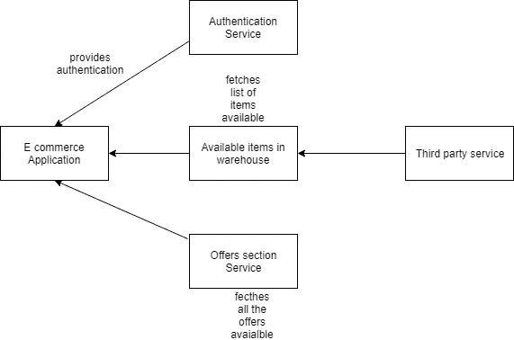
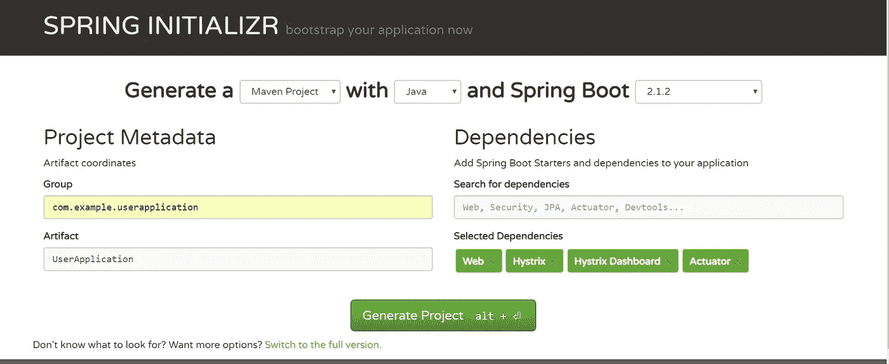
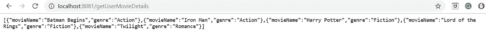
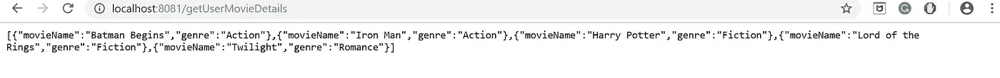
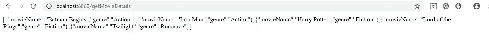
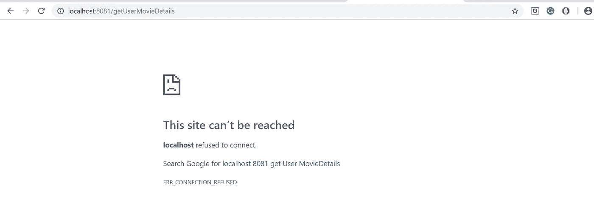
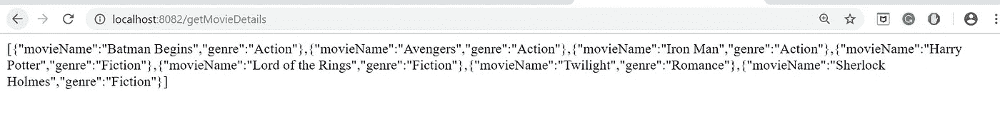
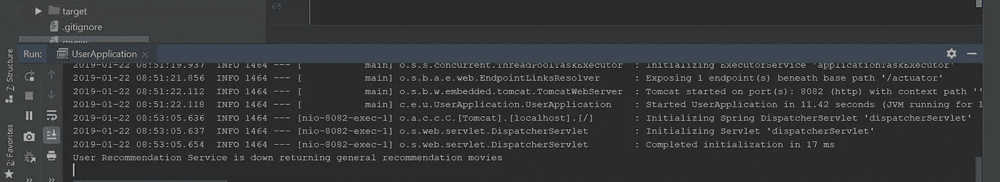
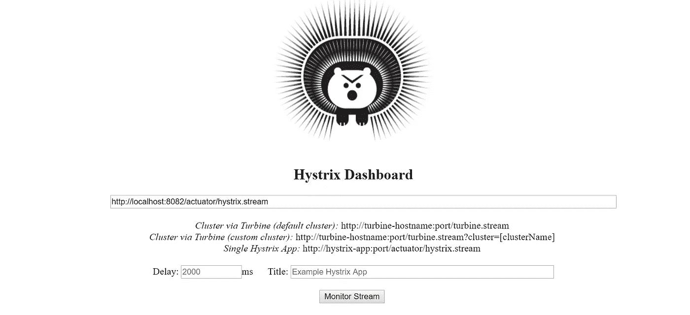
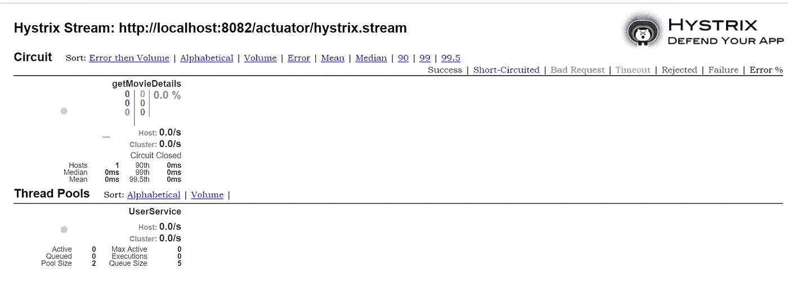

# 使用网飞的 Hystrix 构建容错微服务

> 原文：<https://medium.com/hackernoon/building-fault-tolerant-microservices-using-netflixs-hystrix-c36083ca9af5>

微服务是独立、自治服务的集合，而不是将所有模块紧密集成到一个应用中的整体应用。

在微服务架构中，开发容错微服务是非常必要的。我们必须以这样一种方式开发微服务，即故障影响必须最小化，并且应该基于快速故障机制以具有最小的影响。

这是一个基于微服务架构的电子商务应用程序的例子。

E-commerce application Microservice architecture

上述架构运行良好，直到有一天电子商务应用程序停止工作。发现获取可用项目列表的服务没有响应。经过进一步分析，发现它使用了有缺陷的第三方服务。错误已从第三方服务蔓延到主应用程序。

考虑另一个例子，当使用电子商务应用程序时，用户项目推荐服务停止工作。在这种情况下，我们应该显示不特定于用户的项目。这样，用户将无法知道我们的推荐引擎失败了。这就是为什么构建容错微服务非常重要的原因。

网飞拥有世界上最好的基础设施之一。为了构建容错微服务，网飞想出了 Hystrix，他们将其开源。

 [## 网飞/海斯特里克斯

### Hystrix 是一个延迟和容错库，旨在隔离远程系统、服务和应用程序的访问点

github.com](https://github.com/Netflix/Hystrix) 

根据网飞的说法，“Hystrix 是一个延迟和容错库，旨在隔离远程系统、服务和第三方库的访问点，防止级联故障，并在故障不可避免的复杂分布式系统中实现弹性。”

我们将使用 Hystrix 构建一个应用程序，并使其具有容错能力。我们将创建一个获取用户推荐电影列表的应用程序。我们将使用 Spring boot 来创建微服务。

转到 [Spring Initializer](https://start.spring.io/) ，输入组名、工件名并选择依赖项。点击 generate project，解压并在您喜欢的 IDE 上生成它(我使用 IntelliJ 作为例子)。我使用 spring initializer 创建了两个应用程序——“*用户应用程序*和“*用户推荐*”。

Spring Initializer

在 UserRecommendation 应用程序中，创建一个名为"*user recommendation controller*的 rest 控制器和一个 POJO *Movie* ，其中包含电影名称、上映日期和流派。我们将在一个静态列表中填充电影列表。

我创建了一个 rest 调用“ *getUserMovieDetails* ”，它将获取所有用户特定电影的列表。此外，我们通过在 resources 文件夹下的 *application.properties* 文件中定义端口号来使用端口号 8081。启动 tomcat 服务器，当我们点击 rest URL 时，我们得到如下结果:

现在，我们将构建使用网飞 Hystrix 的用户应用程序，并调用用户推荐[微服务](https://hackernoon.com/tagged/microservice)。

使用相同的过程创建另一个应用程序，并将其导入 IDE。我们将使用端口号 8082 来运行该服务。像我们在前面的服务中所做的那样配置端口号。

在用户应用程序中，我们需要启用 Hystrix 和 Hystrix 仪表板。我们可以通过添加以下注释来做到这一点。

为了实现回退机制，我们使用以下代码:

这里，如果对 *getMovieDetails* 的方法调用失败，那么将调用其回退方法调用 *movieDetailsFallback* 。

现在让我们测试回退机制

我们有两个微服务在端口 8081 和端口 8082 上运行。基本上，运行在 8081 上的服务根据用户推荐给我们电影列表，而运行在 8082 上的服务首先给运行在 8081 上的服务打电话，如果它失败，那么它显示不是特定于用户的一般电影列表。两个 tomcat 服务器现在都在运行。

让我们首先测试运行在 8081 上的用户推荐服务:

User Recommendation Service

现在测试用户服务，它反过来调用用户推荐服务。因为推荐服务在这里，所以不会发生回退，我们会得到完全相同的结果。

现在，我们将停止在端口 8081 上运行的推荐服务。

user recommendation service stopped

现在，当我们试图点击运行在 8082 上的用户服务时，它将调用它的回退方法，并将仍然给我们结果。

Movies are shown not specific to the user

当我们的推荐服务关闭时，我们通过调用 fallback 方法来显示不特定于用户推荐的电影。在贴有*UserService.java*的要点上面，我们可以看到控制台上的日志。

Console Logs

Hystrix 还为我们提供了仪表板来监控统计数据。

转到此 URL—"[http://localhost:8082/hy strix](http://localhost:8082/hystrix)"并在 URL 输入字段中输入"[http://localhost:8082/actuator/hy strix . stream](http://localhost:8082/actuator/hystrix.stream)"并点击 monitor stream。

Hystrix Health stats

在这里，我们可以看到与我们实现了回退机制的方法相关的所有细节。我们可以看到成功、超时和失败的百分比。还有关于线程池的相关信息。

所以通过这种方式，我们可以使用 Hystrix 构建容错的微服务。

您可以在我的 GitHub 资源库中找到源代码:

 [## gauravmsand/容错微服务

### 通过在 GitHub 上创建一个帐户，为 gauravmsand/容错微服务开发做出贡献。

github.com](https://github.com/gauravmassand/fault-tolerant-microservices) 

感谢阅读。