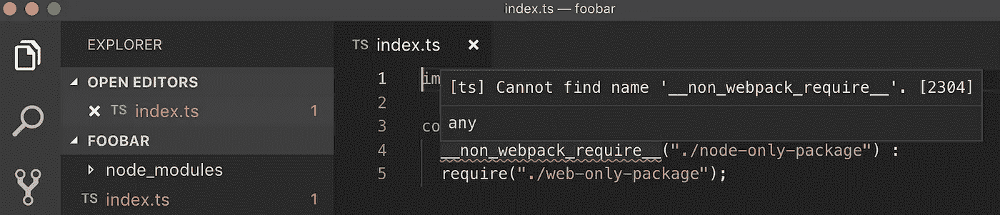

# 构建同构的 JavaScript 包

> 原文：<https://medium.com/hackernoon/building-isomorphic-javascript-packages-1ba1c7e558c5>

我第一次在 web 开发中碰到这个词的时候，不得不在字典里查同构。[维基百科](https://en.wikipedia.org/wiki/Isomorphic_JavaScript)报道称 ***同构 JavaScript*** *，也被称为* ***通用 JavaScript*** *，描述了*[](https://en.wikipedia.org/wiki/JavaScript)**JavaScript 应用程序，它们同时运行在* [*客户端*](https://en.wikipedia.org/wiki/Client_(computing)) *和* [*服务器上*](https://en.wikipedia.org/wiki/Server_(computing))*

*构建一个在服务器(即节点)和客户端(即浏览器)都能开箱即用的包是很困难的。一旦你开始混合依赖项，即使其中一个调用一个仅节点的包(想想`[fs](https://nodejs.org/api/fs.html)`)或仅浏览器的对象(想想`[window](https://www.w3schools.com/jsref/obj_window.asp)`)，它也会影响你的整个构建。更糟糕的是，您甚至可能无法合理地推断出这个问题的存在，因为它们可能隐藏在与您正在编写的代码毫无关系的子-子-子依赖关系中。*

*本文档描述了开发同构节点包的几个简单约定，并以一封关于如何对它们进行打包的固执己见的信件结束。*

# *忽略 webpack 中的要求*

*即使你使用像`[detect-node](https://www.npmjs.com/package/detect-node)`这样的包来创建条件节点 vs 浏览器导入， [webpack](https://webpack.js.org/) 并不关心条件，因为它不知道运行时将如何解析它们。因此，在下面的场景中:*

```
*const foo = isNode ?
  require("fs") :
  require("fs-web");*
```

*它会很乐意尝试打包您需要的所有代码，这意味着在这种情况下，它会尝试打包`fs`。然后，它将失败，并显示以下错误消息。*

```
*Module not found: Error: Can't resolve 'fs' in [insert file here]*
```

*在回答我关于如何解决这个难题的问题时，Alex Rokabilis 写道:*

> *[查看]不太知名的`__non_webpack_require__`函数。这是一个特定于 webpack 的函数，它将指示解析器避免捆绑这个被请求的模块，并假设全局`require`函数是可用的。*

*虽然`[__non_webpack_require__](https://webpack.js.org/api/module-variables/)`是 API 的一个文档部分，但它隐藏在文档深处，因此不为人知。然而，它的工作原理就像一个小窍门。*

*如果你试着写:*

```
*const foo = isNode ?
  [__non_webpack_require__](https://webpack.js.org/api/module-variables/)("fs") :
  require("fs-web");*
```

*节点将退出，并显示以下错误消息:*

```
*__non_webpack_require__ is not defined*
```

*Typescript 也不会识别`__non_webpack_require__`。*

**

*这可以通过以下方式来克服:*

1.  *对于打字稿用户，需要`[@types/webpack-env](https://www.npmjs.com/package/@types/webpack-env)`。不要为此使用`[@types/webpack](https://www.npmjs.com/package/@types/webpack)`，它不起作用。*
2.  *在您的代码中，在使用`__non_webpack_require__`之前，编写以下代码:*

```
*if (isNode) {
  (global as any).__non_webpack_require__ = require;
}*
```

*有几种不同的方法可以实现这一点，其中大多数方法不会在 IDE 中引发错误，并且可以使用 [babel](https://babeljs.io/) 和 [typescript](https://www.typescriptlang.org/) 进行编译，但是在您的节点环境中会失败。所以用这个吧——我们的团队已经对它进行了广泛的测试，它是有效的。*

# *使用依赖注入和 TS 接口*

*[依赖注入](https://en.wikipedia.org/wiki/Dependency_injection)是一种流行的模式，由 Bob 叔叔在[这篇文章](http://blog.cleancoder.com/uncle-bob/2012/08/13/the-clean-architecture.html)中广为传播，我在这个博客上已经多次提到。其思想是依赖关系应该总是向内导入，这意味着“核心”代码永远不应该知道依赖关系，而是应该通过接口与调用代码签订合同，调用代码通过引入相关的依赖关系来实现这个合同。*

*在`unmock-js`中，我们将依赖注入用于日志记录和持久性机制，这两者都是在运行时注入到主`unmock`函数中的选项对象中定义的。如果没有给定选项，则根据`detect-node`包选择合理的缺省值，这是检测环境是否为节点的最流行、最可靠的方法。让我们看看它是如何工作的。*

*在我们的依赖注入中，`options`参数被定义为包含以下接口:*

```
*export interface IUnmockOptions {
  // ... some stuff, then ...
  logger?: ILogger;
  persistence?: IPersistence;
  // ... more stuff
}*
```

*`ILogger`和`IPersistence`本身包含各种方法，比如`ILogger::log`和`IPersistence::saveHeaders`，这些方法调用特定于节点或浏览器的函数。例如，下面是`IPersistence`接口中一个方法的 node 和 jsdom 代码之间的区别:*

```
*// fs-persistence.tsexport default class FSPersistence implements IPersistence {
  public saveHeaders(hash: string, headers: {[key: string]: string})   
  {
   fs.writeFileSync(`${this.outdir(hash)}/response-header.json`, JSON.stringify(headers, null, 2));
  }
}// local-storage-persistence.ts
export default class LocalStoragePersistence implements IPersistence {
  public saveHeaders(hash: string, headers: {[key: string]: string}) 
  {
    window.localStorage[`${this.outdir(hash)}/response-header.json`] = JSON.stringify(headers, null, 2);
  }
}*
```

# *不要使用单独的包装*

*我在这个问题上反复思考了很久。一方面，为不同的环境使用不同的包解决了“80 年代圣诞灯”现象，即一个环境中的错误会影响所有其他环境。当然，这对包和项目管理是有害的。另一方面，如果开发人员试图开发一个同构的包，并且现在需要包含和管理多个包，单独的包会导致可用性问题。例如，目前的情况是`[@sentry/node](https://www.npmjs.com/package/@sentry/node)`对`[@sentry/browser](https://www.npmjs.com/package/@sentry/browser)`。例如，如果您正在开发一个 [Next.js](https://nextjs.org) 包，并试图重用依赖于 [Sentry](https://sentry.io) 的服务器和客户端代码，这可能会导致一大堆`if / then`子句。我相信哨兵会解决这个问题，但如果可能的话，一般问题应该避免。*

*这一理念的结果是，`[unmock-js](https://www.npmjs.com/package/unmock)`是一个单一的包，可以完美地跨节点和浏览器环境工作，甚至在混合了两者代码的复杂场景中。*

*目标是简化开发人员的体验，以便他们在构建 web 应用程序时，有一种内置电池的方式来开始处理模拟数据。*

# *TL；博士；医生*

*当制作同构 JS 包时:*

1.  *使用`__non_webpack_require__`。*
2.  *使用依赖注入。*

*感谢阅读！*

**

*Who doesn’t like Morph?!?*