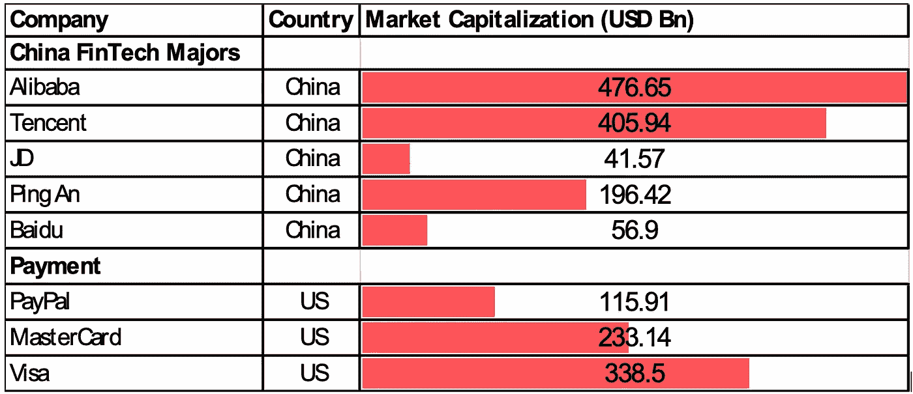
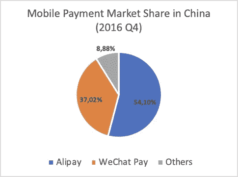
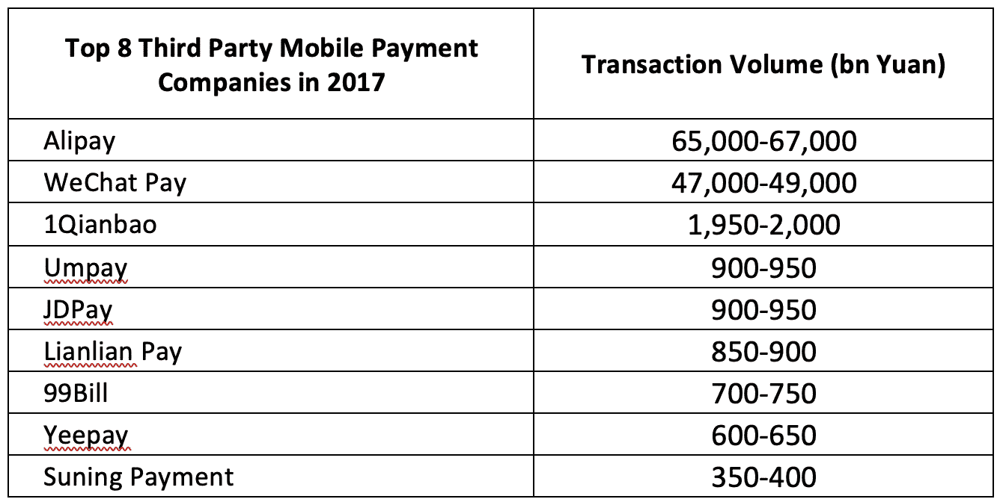
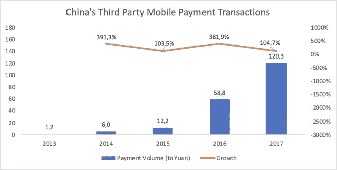
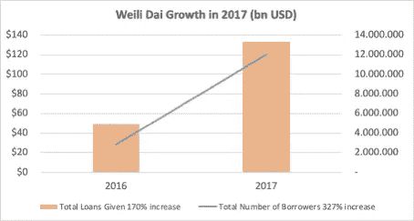
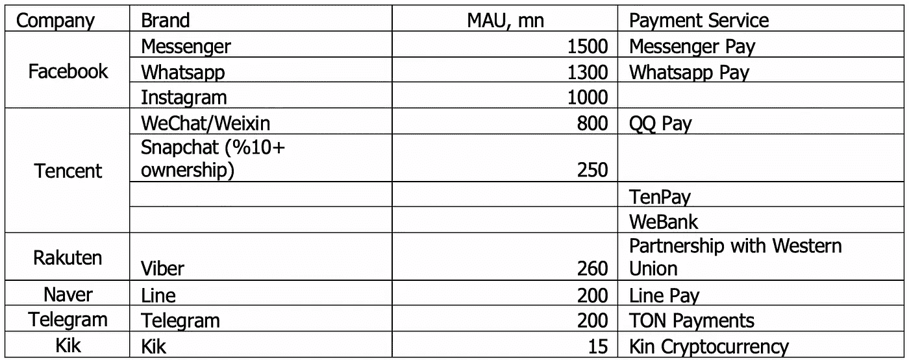

# 用可编程的金钱和信任建立新一代数字银行:你准备好迎接下一轮了吗？

> 原文：<https://medium.com/hackernoon/building-new-generation-digital-banks-with-programmable-money-and-trust-are-you-ready-for-the-next-36f4f29acbfd>

银行业是在其产品、服务和流程中最成功地实施技术开发的行业之一。然而，从金融数字化开始的变革的参与者不再仅仅是这些银行。根据《千禧一代+金钱:未过滤的旅程》的脸书报告，92%的千禧一代(平均年龄为 26.5 岁)不信任传统银行，这无疑是 2008 年金融危机造成的。最引人注目的结果是新产品和新服务在一段时间内开始出现在市场上并扩大其覆盖范围。例如，近年来，拥有庞大客户群和大量现金储备的科技巨头阿里巴巴和腾讯、平安、百度等为许多没有银行账户的客户提供了新的支付选择，其数字钱包服务在当地和全球市场取代了现金和信用卡。当考虑将技术和创新融入金融业时，可以说，尽管与西方“同行”(最重要的美国)相比，中国起步较晚，但随着经济的自由化，中国目前在金融科技领域享有“后发优势”。

> 根据麻省理工学院评论 2019 年 1 月中国问题，中国的移动支付市场已经达到了 15.4 万亿美元的规模，约为美国的 41 倍。这两个国家之间的增长和适应差异表明，不同的方法、投资和普通民众的支持可以产生两种趋势。

如果你回顾几年前，这并不奇怪，根据 2016 年 Factset 金融数据和分析报告，两家中国技术和支付公司腾讯的微信支付和蚂蚁金服的支付宝分别达到 2319 亿和 2134 亿美元的市值，而美国公司 Paypal、万事达卡和 Visa 分别为 476 亿、1124 亿和 1812 亿美元。在普华永道 2018 年发布的另一项市场研究“[全球市值 100 强公司](https://www.pwc.com/gx/en/audit-services/assets/pdf/global-top-100-companies-2018-report.pdf)”报告中，前十名中有两家新进入者，中国科技公司腾讯和阿里巴巴，取代了美国公司埃克森美孚和富国银行。尽管美国仍以 54 家公司(2018 年为 42 家)统治着全球 100 强，但中国以 12 家公司(比去年增加两家，比 2009 年增加三家)位居第二。特别是，与 2017 年的数据相比，中国科技和支付公司在 2018 年的绝对增幅位居第二，其变化率在全球前 20 个国家的市值中分别为 82%和 75%。

As of March 1st, 2019

**那么，腾讯和阿里巴巴的所有价值来自哪里？**

先说阿里巴巴。它的成功部分取决于支付宝，蚂蚁金服旗下的第三方移动和在线支付平台，蚂蚁金服是阿里巴巴的关联公司，在阿里巴巴集团的 Tmall.com 和 Taobao.com 处理了 11 亿笔交易的支付。根据来自[易观国际 Enfodesk](http://www.analysyschina.com/) 的数据，蚂蚁金服通过为支付宝提供生态系统，现已拥有约 4.5 亿活跃用户；这项数字支付服务已经开始向阿里巴巴之外扩张，为 Mainland China 更大的客户群提供电子商务服务。

作为第二大公司，腾讯实际上将自己转变为客户的数字银行，它被设计为一个受欢迎的消息应用程序，有超过 8 亿人使用它进行日常通信和支付活动。

Mobile Payment Market China

自 2016 年以来，由于其旗舰产品微信和数字支付业务微信支付(WeChat Pay)提供的机会，用户获取量的年增长率为[30%](https://www.hbs.edu/faculty/Pages/item.aspx?num=52493),微信支付提供了金融管理、银行交易、点对点支付等服务。

Mobile Payment Market China

> 从支付到银行

香港政府计划首次向中国顶级科技和支付公司**、蚂蚁金服、腾讯、众安、小米**提供[数字银行牌照](https://www.pymnts.com/news/digital-banking/2019/ant-tencent-xiaomi-hong-kong-digital-banking-license/)。这是这些科技巨头的又一项突破性成就，它们颠覆了我们熟悉的传统银行体系。香港政府的这种尝试可以在基于改造国家目标的政策变化背景下理解，因为这个由中国统治的半自治地区正在通过向在线竞争开放自己的市场，演变为一个智能城市。

Image by [Brigitte Werner](https://pixabay.com/users/werner22brigitte-5337/?utm_source=link-attribution&utm_medium=referral&utm_campaign=image&utm_content=3112617) from [Pixabay](https://pixabay.com/?utm_source=link-attribution&utm_medium=referral&utm_campaign=image&utm_content=3112617)

直到最近，我们才知道只有恒生银行、渣打银行和汇丰银行等少数银行拥有信用卡和零售抵押贷款的大部分份额，根据高盛的研究，大约 66%在香港。例如，汇丰银行去年确保了其市场领导者的地位，第二季度得益于其财富管理和零售运营政策，获得了 14 亿美元的利润。然而，我们仍然可以看到对现有银行模式不满意的客户。根据埃森哲研究人员在 2017 年发布的报告，略多于一半的香港客户对他们目前的银行感到满意，而美国的这一比例为 88%。埃森哲亚太区董事总经理弗格斯·戈登(Fergus Gordon)评论道:“主要市场中的大多数客户都愿意用不同的模式开展银行业务，数字银行有很好的机会利用这一点。”

新金融科技巨头的崛起似乎也开始影响贷款领域。无论是在数量上还是在交易上，增长都非常显著，这是他们成功扩张的真实标志。微信的微利贷虽然在 2014 年开始运营，但在 2017 年已经大幅增长，贷款额超过 1330 亿美元，拥有 1200 万客户。增长率表明未来几年将会有更大的增长。不仅仅是发放贷款，这两大平台也正在成为投资基金的主流方法。支付宝的货币市场基金余额宝获得最高 3，000 美元的投资，年回报率为 4%。总额已超过 1600 亿美元。

然而，我们可以说，对传统银行模式不满意的客户不仅仅是香港市场特有的。长期以来，投标人希望通过向当今世界全球范围内大多数市场中对其当前选项不满意的客户提供数字化替代方案，来挑战市场中传统银行的“寡头垄断”。

Hong Kong

> 进入银行业的其他科技领域

随着科技巨头和传统银行之间为满足客户需求而进行的竞争日益激烈，我们遇到了各种各样的新工具和平台，如人工智能(AI)、机器学习和区块链基础设施，这些都为其他能力打开了大门。可以得出这样的结论:这些技术颠覆了传统的金融格局，重塑了金融机构根据“怀疑”客户的期望提供服务的方式。

尤其是区块链技术，作为一种颠覆性创新，正在对现有的社会、经济以及地方和全球层面的政治关系构成挑战。它似乎完美地结合了互联网的透明性和密码学的安全性。人们对一个更加“可信”和民主的数据世界的期待正在日益实现。区块链的民主特征不仅与其使人们能够验证自己的数据的能力有关，还与其为共享经济提供基础设施的能力有关，这种共享经济涉及网络中的所有参与者。

科技巨头们意识到了区块链技术在各个领域的力量，他们最近开始将该技术集成到他们公司的人工智能机制中。例如，中国最大的电子商务公司之一阿里巴巴开始在国际舞台上使用区块链技术来加速支付过程。在区块链技术的基础上，用户的账户余额将通过智能合同进行验证。因此，在不需要更多服务器的情况下，该系统将在区块链网络上更加经济高效地工作。

> 老玩家，新面貌

作为当今世界最具“颠覆性”的创新，区块链一直是 2018 年的“流行语”和无处不在的技术。今天，即使是消息应用 Telegram 也进行了基于区块链技术的 TON 项目，旨在通过有史以来第一个大众市场加密货币的想法来增加加密货币的现实应用。基本上，“吨是一个分散和强大的超级计算机传输大量的信息或价值。”该项目有望通过区块链去中心化基础设施带来无审查和匿名。由于 TON 将以最短的交易时间实现最大的安全性，该生态系统将成为万事达卡/维萨卡的替代方案。根据该项目的投资者的报告 TheBlock，TON Virtual Machine 是一个使智能合同得以执行的软件，在那时大部分已经完成。

脸书宣布他们也在研发一种新的硬币，可以让 Whatsapp 用户交换加密硬币。

随着区块链和金融科技革命在全球范围内发生，来自各国的更多巨头越来越渴望进入这一场景。在二月的最后一周，[日本“大银行”瑞穗金融集团，目前拥有 1.8 万亿美元，宣布他们将推出一种新的稳定硬币 J-Coin，希望将其用于支付和汇款服务。这是脸书宣布他们也在研究一种新的硬币后的第二次行动，这种硬币将使 Whatsapp 用户能够交换加密硬币。如果我们谈到对区块链技术感兴趣的巨头，我们还必须考虑到摩根大通](https://www.ccn.com/japan-megabank-mizuho-digital-currency-payments)的最新 [stablecoin 项目。作为美国最大的银行之一，JP 摩根似乎已经开始涉足区块链，他们现在正在努力成为一个“可靠”的机构，在一个相当动荡的市场中保持稳定的货币。这三个例子并不是“去中心化”硬币本身的完美表现，但它是由一个中心化公司部署的区块链技术的完美用例。](https://www.jpmorgan.com/europe/merchant-services/fin-tech-revolution)

> 区块链收养的种族

Whatsapp 的直接竞争对手 Telegram 离他们的愿景更近了一步。这个 5 岁的新消息应用程序已经设法在一个私人 ICO 中筹集了 17 亿美元，并正在大力推进基于他们的消息应用程序创建一个加密货币平台的愿景。这被认为是 2018 年推动区块链应用大规模改编的最大胆尝试。

Messaging Apps and Their Payment Services

在这一点上，令人鼓舞的是，不仅开始使用数字技术的传统银行和上述 BigTechs 转型为新的数字银行，而且以“共享经济”为口号的新兴区块链创业公司也创造了越来越多的“替代经济”渠道。

> 区块链是为了 BigTechs 还是为了对抗科技巨头？

尽管近年来 BigTechs 可以被视为传统的替代数字银行，但大型科技公司将区块链和人工智能结合起来是自相矛盾的，因为这些科技巨头继续充当数据保存的“看门人”。相比之下，围绕区块链设计的加密协议旨在让用户对其私人数据拥有更多控制权。因此，随着针对“自我主权”用户身份的替代渠道的数量日益增加，对 BigTechs 效率的怀疑也以类似的方式增加。

所以，一些基于区块链的创业公司的使命，可以放在“未建成”的共享经济背景下理解。他们的意图是创造一条基于数据而非货币贸易的道路，从而通过提供自由获取信息的机会来消除技术寡头的霸权。通过区块链技术的分散和分布式账本系统，由于包括具有法律约束力的合同和商业用途许可在内的许可要求，在几个节点之间划分的整个过程现在更快、更可信。[区块链使用户能够使用内置工具轻松起草合同，并有效地将他们数据的权利转移给其他实体。](https://etherworld.co/2019/01/23/how-blockchain-could-break-big-techs-hold-on-ai/)因此，通过区块链，可以认为内容创作者在“共享经济”的背景下所做的工作获得了更公平的奖励

> 新技术意味着权力下放，世界似乎很快适应了这一理念

如果我们说区块链技术将在全世界产生同样积极的影响，这将是一个非常乐观的预测。我们已经开始看到在对待这些新的代币和创新的方法上的重大差异。由于其创新的方法和风险偏好，一些国家已经承担了领导者的角色。中国在技术投资和专利申请方面的增长趋势非常有利于这个国家。然而，许多西方国家，如瑞士、马耳他、德国、美国、爱沙尼亚和另一个亚洲巨人日本并没有落后。瑞士城市楚格已经赢得了区块链谷的美誉，这要归功于他们很早就认识到了这项最新技术的力量，他们通过为打算使用区块链的私营企业制定法规来支持这项技术。新技术意味着权力下放，世界似乎很快适应了这一想法，因为我们正在接近一个硅谷巨头不再领导世界的未来。随着这些国家的新领导地位以及更多的国家加入这场终极技术革命，采用新技术的地区预计将在收入和增长方面取得显著改善。

**来源:**

[https://www . pym nts . com/news/digital-banking/2019/ant-Tencent-小米-hong kong-digital-banking-license/](https://www.pymnts.com/news/digital-banking/2019/ant-tencent-xiaomi-hong-kong-digital-banking-license/)

 [## 香港向网上竞争开放银行市场

### 一些全球最大的银行即将与中国顶尖的技术和支付公司展开正面交锋，争夺…

www.ft.com](https://www.ft.com/content/d5d38eb0-333a-11e9-bd3a-8b2a211d90d5) 

[https://www . jp Morgan . com/Europe/merchant-services/fin-tech-revolution](https://www.jpmorgan.com/europe/merchant-services/fin-tech-revolution)

[https://www . ccn . com/Japan-mega bank-mizuho-digital-currency-payments](https://www.ccn.com/japan-megabank-mizuho-digital-currency-payments)

[https://www . BCG . com/en-GB/publications/2017/marketing-sales-how-digital-leaders-transforming-B2B . aspx](https://www.bcg.com/en-gb/publications/2017/marketing-sales-how-digital-leaders-transforming-b2b.aspx)

[https://ether world . co/2019/01/23/how-区块链-could-break-big-techs-hold-on-ai/](https://etherworld.co/2019/01/23/how-blockchain-could-break-big-techs-hold-on-ai/)

[https://www.icotokennews.com/icos/telegram/](https://www.icotokennews.com/icos/telegram/)

[http://www.analysyschina.com/](http://www.analysyschina.com/)

[https://techcrunch.com/2018/12/21/facebook-stablecoin/](https://techcrunch.com/2018/12/21/facebook-stablecoin/)

[https://www . PwC . com/GX/en/audit-services/assets/pdf/global-top-100-companies-2018-report . pdf](https://www.pwc.com/gx/en/audit-services/assets/pdf/global-top-100-companies-2018-report.pdf)

[https://www . emarketer . com/Article/Ant-Financial-Rebrands-laza das-Payments-Service-支付宝/1015705](https://www.emarketer.com/Article/Ant-Financial-Rebrands-Lazadas-Payments-Service-Alipay/1015705)

[https://www.hbs.edu/faculty/Pages/item.aspx?num=52493](https://www.hbs.edu/faculty/Pages/item.aspx?num=52493)

[https://etc summit . com/WP-content/uploads/2018/09/Tom-Lee-fund strat-How-Millennials-are-power-Wall-Street % E2 % 80% 99s-Interest-in-crypto . pdf](https://etcsummit.com/wp-content/uploads/2018/09/Tom-Lee-Fundstrat-How-Millennials-are-Powering-Wall-Street%E2%80%99s-Interest-in-Crypto.pdf)

[https://techno de . com/2017/04/07/支付宝-领先-中国-第三方-移动支付-2016 年第四季度市场/](https://technode.com/2017/04/07/alipay-leads-chinas-third-party-mobile-payment-market-in-q4-2016/)

[https://www . Forbes . com/sites/ywang/2018/03/28/is-AliPay-losing-to-we chat-in-China-万亿美元支付-war/#48be89ca8822](https://www.forbes.com/sites/ywang/2018/03/28/is-alipay-losing-to-wechat-in-chinas-trillion-dollar-payment-war/#48be89ca8822)

[https://www . investinblockschain . com/breaking-1-8 万亿日本兆银-launch-a-stable coin-for-payments-and-汇款-in-march/](https://www.investinblockchain.com/breaking-1-8-trillion-japanese-megabank-launching-a-stablecoin-for-payments-and-remittances-in-march/)

【https://www.reuters.com/finance/stocks/ 

[http://www.iresearchchina.com/content/details7_49288.html](http://www.iresearchchina.com/content/details7_49288.html)