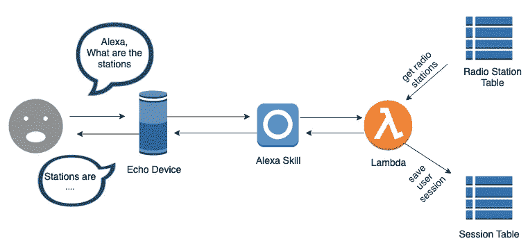
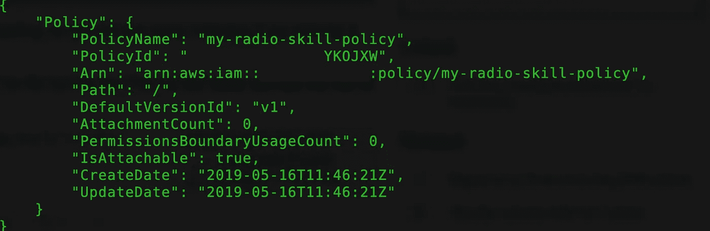
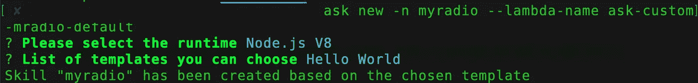
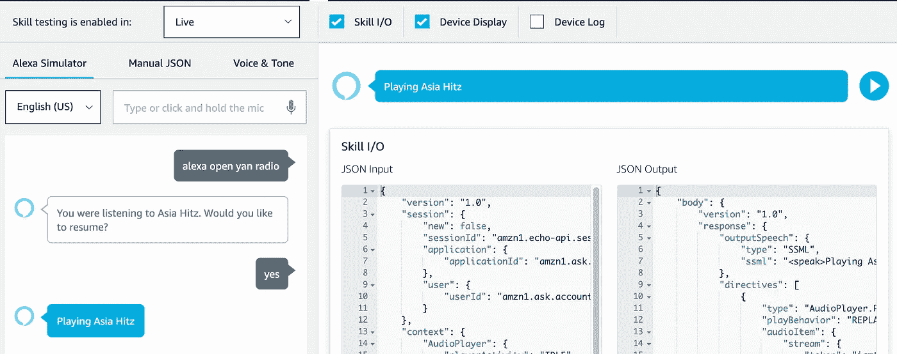

# 建立一个多流 Alexa 技能与 Alexa 技能包

> 原文：<https://medium.com/hackernoon/building-radio-stations-alexa-skill-with-the-alexa-skills-kit-376fc9537047>


我上周得到了我的 Echo 设备，我认为开发一个定制的 Alexa 技能会很酷。因此，我花了整个周六来发展电台技能，当我编程时，让 Alexa 播放我最喜欢的电台是令人兴奋的🙂。

在这篇文章中，我展示了一个使用 Alexa Skills Kit(ASK)v2+for Nodejs 为 Echo 构建自定义技能的示例。该项目由[技能样本 NodeJS 音频播放器](https://github.com/alexa/skill-sample-nodejs-audio-player)派生修改而来。

# 用例

我的无线电技能是收听您的多个电台的方式，您可以说“Alexa，播放<radio station="" name="">”，Alexa 将开始播放电台。您可以添加或删除电台，电台存储在 DynamoDB 中。因此，您将拥有完全个性化的音乐播放体验。</radio>



# 先决条件

我们需要一个 [AWS 账户](https://aws.amazon.com/)和一个[亚马逊开发者账户](https://developer.amazon.com/)来创建一个 Alexa 技能。

1.  我们需要安装带有`npm install -g ask-cli.`的 [AWS CLI](https://aws.amazon.com/cli/)
2.  用`$ ask init`配置 [AWS CLI](https://aws.amazon.com/cli/) 。
3.  我们需要安装并初始化 [ASK CLI](https://developer.amazon.com/docs/smapi/quick-start-alexa-skills-kit-command-line-interface.html) 。

这是一个 Alexa 技能包命令行界面[快速入门](https://developer.amazon.com/docs/smapi/quick-start-alexa-skills-kit-command-line-interface.html)。

# 创建 DynamoDb 表

我们需要 2 个 DynamoDB 表， **MyRadiosSession** 存储用户会话， **MyRadios** 存储电台流 URL。

```
**$**aws dynamodb create-table --table-name MyRadios --attribute-definitions AttributeName=id,AttributeType=S  --key-schema AttributeName=id,KeyType=HASH --provisioned-throughput ReadCapacityUnits=5,WriteCapacityUnits=5**$**aws dynamodb create-table --table-name MyRadiosSession --attribute-definitions AttributeName=id,AttributeType=S  --key-schema AttributeName=id,KeyType=HASH --provisioned-throughput ReadCapacityUnits=5,WriteCapacityUnits=5
```

然后，我们需要将电台流 URL 插入到 MyRadio 表中。

```
aws dynamodb batch-write-item --request-items file://./request-stations.json
```

这里是`request-stations.json`的内容。

# 创建策略

我们需要一个具有 DynamoDb 和 Cloud watch 权限的策略。让我们创造它。

```
**$**aws iam create-policy --policy-name my-radio-skill-policy --policy-document file://./policy.json
```

文件**策略**是当前文件夹中的一个 JSON 文档，授予 Dynamodb 表和 Cloudwatch 日志记录的权限:

*注意，你要把 ACCOUNT_ID 替换成* [*你的 AWS 账户 id*](https://console.aws.amazon.com/billing/home?#/account) *。*

创建策略后，我们从输出中获得策略 ARN，复制 ARN，在最后一步部署技能后，我们需要将其附加到我们的 lambda 函数。



# 创造新技能

随着您的帐户设置，我们现在要建立我们的自定义 Alexa 技能。

```
**$**ask new -n myradios --lambda-name ask-custom-mradio-default
```

选择 Node.js V8 作为运行时，hello world 作为模板。



该命令创建一个包含所有必需文件的项目目录“myradios”。我们还将 lambda 函数的名称配置为“ask-custom-mradio-default”。

`myradios`目录包含以下文件:

*   `skill.json` -技能的配置
*   `models/en-US.json` -英美现场技能的交互模型。
*   `lambda/custom/index.js` -技能的λ函数
*   `lambda/custom/package.json`-NPM 包文件
*   `.ask/config` -部署设置配置文件

# 配置技能清单

技能清单是你的技能的 JSON 表示，为 Alexa 提供所有需要的元数据。让我们开始编辑 **skill.json** ，将**示例短语**更改为:

```
“examplePhrases”: [
 “Alexa, open My Radios”,
 “Alexa, ask My Radios to play ABC NEWS”,
 “Alexa, tell My Radios to play Fox FM”
 ],
```

我们还需要更改查看技能列表时显示的摘要和描述。

接下来，让我们转到[交互模型](https://developer.amazon.com/docs/custom-skills/create-the-interaction-model-for-your-skill.html) `models/en-US.json`，示例模型应该如下所示:

请注意，“电台”是自定义插槽，您可以将任意多的电台名称添加到插槽值中，句子结构的示例话语应该是这样的

```
"begin the {STATION}",            
"begin playing the {STATION}",                   
"start the {STATION}",            
"start playing the {STATION}"
```

> 插槽是构建自定义 Alexa 技能的一个非常强大的附件。例如，语句“告诉我关于{玩家}”意味着用户可以向老虎机玩家询问我们关于任何国际象棋玩家的技能。此外，多个插槽提供了使用对话框的可能性，其中 Alexa 技能提示用户填充所有插槽值，以实现意图。

# 创建 AWS Lambda 函数

一旦交互模型被创建，我们需要创建和配置 AWS lambda 函数`lambda/custom/index.js`。

在文件的顶部，我们正在导入 SDK，并为其分配`Alexa`常量以备后用:

```
**const** Alexa **=** require('ask-sdk');
```

然后移动到文件的底部，我们可以看到下面的代码:

```
const skillBuilder = Alexa.SkillBuilders.standard();
exports.handler = skillBuilder
  .addRequestHandlers(
    CheckAudioInterfaceHandler,
    LaunchRequestHandler,
    HelpHandler,
    SystemExceptionHandler,
    SessionEndedRequestHandler,
    YesHandler,
    NoHandler,
    StationListHandler,
    LoadMoreStationsHandler,
    StartPlaybackHandler,
    NextPlaybackHandler,
    PreviousPlaybackHandler,
    PausePlaybackHandler,
    ExitHandler,
    AudioPlayerEventHandler,
    CanFulfillIntentRequestHandler
  )
  .addRequestInterceptors(LoadPersistentAttributesRequestInterceptor) .addResponseInterceptors(SavePersistentAttributesResponseInterceptor).addErrorHandlers(ErrorHandler)
 .withAutoCreateTable(false)
 .withTableName(constants.skill.dynamoDBTableName)
 .lambda();
```

这是我们注册拦截器的地方，通过使用`.addRequestInterceptors`将 requestHandler 添加到 skillBuilder。`.lambda()`方法将对象序列化为 JSON，准备好供 Alexa 技能读取。

现在，让我们转到意图处理程序，Alexa Skill 的请求和响应拦截器在被调用时被传递一个 HandlerInput 实例，让我们看一下`LaunchRequestHandler`和一个例子:

当客户通过说“Alexa，打开我的收音机”来启动 skill 时，我们的 skill 会收到一个“LaunchRequest”类型的请求。`handlerInput.requestEnvelope.request.type === “LaunchRequest”`在“canHandle”函数中确保它将只处理启动请求。

所有其他意图处理程序都非常相似，有些意图使用`reprompt(speechText)`。这给了 Alexa 等待用户响应的命令，如果麦克风已经打开八秒钟而没有用户输入，Alexa 就会发出重新提示。

既然你已经看到了关于 Alexa 技能发展的所有细节，我们已经准备好部署和测试这项技能了。

# 运用技能

要部署技能，请运行以下命令。

```
$ask deploy
```

ask deploy 命令自动启用您部署技能，它创建 lambda 函数、IAM 角色并将它们链接在一起。

# 将策略附加到 IAM 角色

Alexa 技能工具包将在技能部署后为我们的 lambda 函数创建一个默认的 IAM 角色“ask-lambda-myradio”。现在，我们可以将上一步中创建的策略附加到 lambda 函数的 IAM 角色。

```
**$**aws iam attach-role-policy --role-name ask-lambda-myradio --policy-arn "arn:aws:iam::ACCOUNT_ID:policy/my-radio-skill-policys"
```

差不多就是这样！我们现在可以从你的设备或模拟器上使用我们的技能。



希望这篇文章对你有用，你可以在我的 [**GitHub repo**](https://github.com/yai333/AlexaRadiosSkill) **中找到完整的项目。**