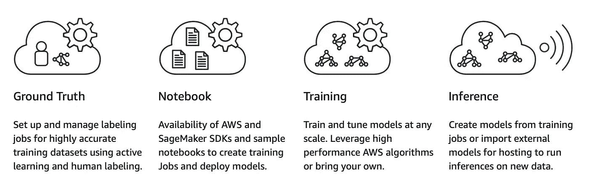
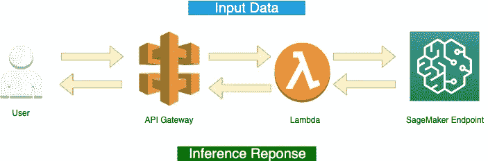
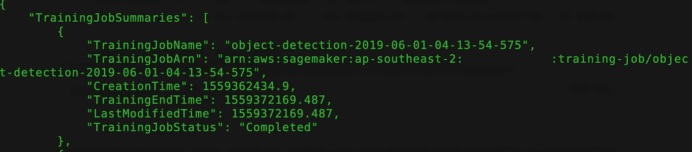
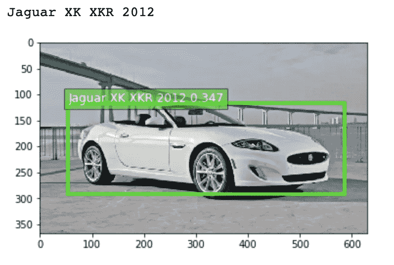
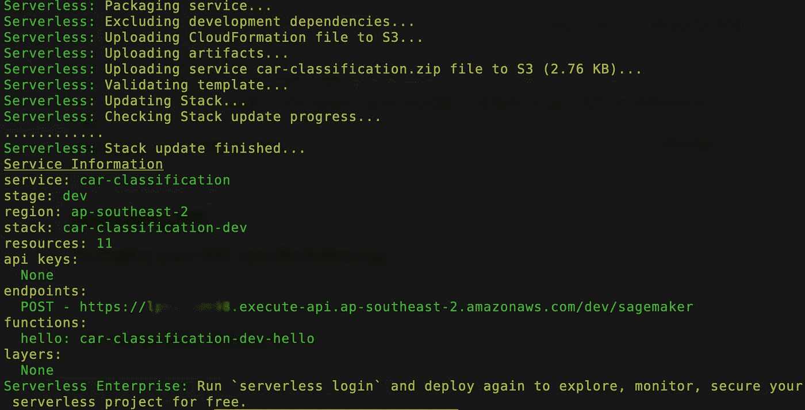
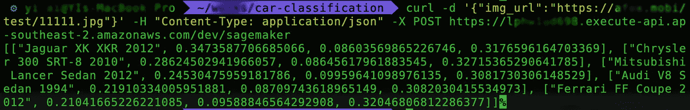

# 使用 Amazon SageMaker 和 Amazon API Gateway 的实时对象检测 API

> 原文：<https://medium.com/hackernoon/building-realtime-object-detection-api-with-amazon-sagemaker-and-amazon-api-gateway-c9f62a9fd69a>


亚马逊 SageMaker 是一个端到端的机器学习(ML)平台。它支持在云端训练和托管机器学习模型。以下是 SageMaker 程序的概述。



通过使用 SageMaker 的内置算法，我们可以用一行简单的代码部署我们的模型。

在这篇文章中，我将使用 SageMaker 部署一个汽车分类模型，并使用 API Gateway 和 AWS Lambda 调用模型端点。



# 创建一个 Amazon SageMaker 笔记本实例

我们需要使用 notebook 实例来创建和管理 Jupyter notebook，以便我们能够准备和处理数据，并训练和部署机器学习模型。欲了解更多详情，请点击查看文档[。](https://docs.aws.amazon.com/sagemaker/latest/dg/gs-setup-working-env.html)

# 准备培训数据

您可以使用 AWS 地面实况工具来标注您自己的数据集。在这个例子中，我使用了来自 Stanford 的[汽车数据集。](http://ai.stanford.edu/~jkrause/cars/car_dataset.html)

> 汽车数据集包含 196 类汽车的 16，185 张图像。数据被分成 8，144 个训练图像和 8，041 个测试图像，其中每个类别被大致分成 50-50 个部分。类别通常是品牌、型号、年份，例如 2012 款特斯拉 Model S 或 2012 款宝马 M3 coupe。

## 下载数据

让我们创建一个新的 notebook 实例并打开 Jupyter，然后下载数据集，

```
import os
import urllib.requestdef download(url):
    filename = url.split("/")[-1]
    if not os.path.exists(filename):
        urllib.request.urlretrieve(url, filename)download('[http://imagenet.stanford.edu/internal/car196/cars_train.tgz'](http://imagenet.stanford.edu/internal/car196/cars_train.tgz'))
download('[https://ai.stanford.edu/~jkrause/cars/car_devkit.tgz'](https://ai.stanford.edu/~jkrause/cars/car_devkit.tgz'))
```

…然后打开包装。

```
%%bash
tar -xzf car_devkit.tgz
tar -xzf cars_train.tgz
```

请注意，注释位于”。mat "格式(Matlab 文件)。我们必须用以下值将它转换成一个数组:图片名称、图片类别 ID、训练/验证标签。

```
**import** **scipy.io** **as** **sio****def** readClasses(matFile):   
    content = sio.loadmat(matFile)
    classes = [(_[0]) **for** _ **in** content['class_names'][0]]
    **return** classes    

**def** readAnnotations(matFile):   
    content = sio.loadmat(matFile)
    **return** content['annotations'][0]
```

## 准备注释数据

Amazon SageMaker 对象检测算法支持 RecordIO 和 Image & JSON 格式，我使用下面的脚本将数组转换为 JSON 文件作为注释输入:

```
**from** **imageio** **import** imread

categories = readClasses("devkit/cars_meta.mat")
annotations = readAnnotations("devkit/cars_train_annos.mat")

**for** img **in** images :
    shape = imread('cars_train/**{}**'.format(img)).shape
    jsonFile = img.split('.')[0]+'.json'

    line = {}
    line['file'] = img
    line['image_size'] = [{
        'width':int(shape[1]),
        'height':int(shape[0]),
        'depth':3
    }]

    line['annotations'] = []
    line['categories'] = [] 
    *#print(annotations)*
    **for** anno **in** annotations:
         **if**(anno[5][0]==img):
            *#print(anno)* 
            line['annotations'].append({
                    'class_id':int(fix_index_mapping(anno[4][0][0])),
                    'top':int(anno[1][0][0]),
                    'left':int(anno[0][0][0]),
                    'width':abs(int(anno[2][0][0])- int(anno[0][0][0])),
                    'height':abs(int(anno[3][0][0]) -int(anno[1][0][0])),
                })
            class_name = ''
            **for** ind,cat **in** enumerate(categories, start=1):
                **if** int(anno[4][0][0]) == ind:
                    class_name = str(cat)
            **assert** class_name **is** **not** ''
            line['categories'].append({
                'class_id':int(anno[4][0][0]),
                'name':class_name
            })

    **if** line['annotations']:
        **with** open(os.path.join('car-generated', jsonFile),'w') **as** p:
            json.dump(line,p)
```

下面是一个. json 文件的示例。

```
{"file": "00001.jpg", "image_size": [{"width": 600, "height": 400, "depth": 3}], "annotations": [{"class_id": 13, "top": 116, "left": 39, "width": 530, "height": 259}], "categories": [{"class_id": 14, "name": "Audi TTS Coupe 2012"}]}
```

# 上传到 S3

亚马逊 SageMaker 预计该数据集将在 S3 桶中可用。我们需要上传图像和注释 JSON 文件到 S3 桶。

```
%%timeprefix = "prefix = 'car-Detection'"**train_channel** = prefix + '/car-train'
**validation_channel** = prefix + '/car-validation'
**train_annotation_channel** = prefix + '/train_annotation'
**validation_annotation_channel** = prefix + '/validation_annotation'sess.upload_data(path='car-train', bucket=bucket, key_prefix=train_channel)
sess.upload_data(path='car-validation', bucket=bucket, key_prefix=validation_channel)
sess.upload_data(path='car-train_annotation', bucket=bucket, key_prefix=train_annotation_channel)
sess.upload_data(path='car-validation_annotation', bucket=bucket, key_prefix=validation_annotation_channel)**s3_train_data** = 's3://{}/{}'.format(bucket, train_channel)
**s3_validation_data** = 's3://{}/{}'.format(bucket, validation_channel)
**s3_train_annotation** = 's3://{}/{}'.format(bucket, train_annotation_channel)
**s3_validation_annotation** = 's3://{}/{}'.format(bucket, validation_annotation_channel)
**s3_output_location** = 's3://**{}**/**{}**/output'.format(bucket, prefix)
```

现在我们有了一些可以被培训工作使用的标记数据，我们准备好进行下一步了。

# 训练和建立模型

在这个例子中，我们使用内置算法对象检测来训练我们的模型。你可以在这个 [Github 库](https://github.com/yai333/SageMakerCarClassification/blob/master/CarClassification.ipynb)里看到整个笔记本。训练数据的相关代码如下:

如果训练过程进展顺利，我们将有我们的模型，它将被上传到输出 s3 桶。该模型可以在 AWS 控制台和 AWS 命令行中看到:

```
**$**aws sagemaker list-training-jobs --region ap-southeast-2
```



# **部署模型**

一旦培训完成，我们就可以将经过培训的模型部署为 Amazon SageMaker 实时托管端点。

```
**object_detector** = od_model.deploy(initial_instance_count = 1,                                  instance_type = 'ml.m4.xlarge')
```

您可以通过导航到 Amazon SageMaker 控制台中的“端点”选项卡来检查端点配置和状态。

# 创建一个无服务器 REST API

一旦创建了 Sagemaker 端点，就可以使用该端点从 notebook 进行推理。AWS 团队提供了一个样本脚本，以便于可视化检测输出。通过使用以下脚本过滤掉低可信度检测，您可以使用边界框来可视化高可信度预测:



太好了——这很有效！我想让它对外界可用，所以我们必须创建一个 API。这可以通过使用[无服务器框架](https://serverless.com/)轻松实现

## 开始使用无服务器框架

首先，您需要安装无服务器框架

```
**$**sls create --template aws-python3 --path car-classification
```

创建的目录包括两个文件——handler . py 是 Lambda 函数。serverless.yml 文件，需要该文件来配置我们的应用程序的行为方式:

请注意，允许策略资源是一个 SSM (AWS Systems Manager 代理)参数。要在 SSM 中存储一个值，我需要运行以下命令:

```
**$**aws ssm put-parameter --name sagemakerarn --type String --value arn:aws:sagemaker:ap-southeast-2:YOUR_ACCOUNT_ID:endpoint/object-detection-2019-06-01-04-13-54-575 --region ap-southeast-2D
```

## 添加 Lambda 函数

现在，让我们更新 handler.py 来调用 SageMaker 端点。handler.py 文件如下所示:

## 部署 API

要部署您的 API，请运行以下命令:

```
$ serverless deploy -v
```



# 测试 API

我们已经到了旅程的终点！我们现在可以使用 CURL 调用已部署的无服务器 API 端点:

```
**$**curl -d '{"img_url":"[https://bit.ly/2IbFF70](https://bit.ly/2IbFF70)"}' -H "Content-Type: application/json" -X POST [https://xxxx.execute-api.ap-southeast-2.amazonaws.com/dev/sagemaker](https://lphw1ud698.execute-api.ap-southeast-2.amazonaws.com/dev/sagemaker)
```



差不多就是这样！希望你觉得这篇文章有用，你可以在我的 [**GitHub repo**](https://github.com/yai333/SageMakerCarClassification/blob/master/README.md) 中找到完整的项目。