# 用 AWS Glue DynamoDB 和 Athena 构建无服务器数据湖

> 原文：<https://medium.com/hackernoon/building-serverless-data-lake-with-aws-glue-dynamodb-and-athena-85699fd61caa>


State Library of Victoria

在本帖中，我们将使用 AWS Glue、DynamoDB、S3 和 Athena 构建一个无服务器的数据湖解决方案。

因此，结合一切，我们做以下步骤:

*   创建发电机表并插入数据。
*   创建一个读取 Dynamo 表的 crawler。
*   创建 Glue ETL 作业，读取数据并将其存储在 S3 桶中。
*   创建读取 S3 桶的数据目录表。
*   使用 Athena 通过上一步中创建的 crawler 查询信息。


# 我们开始吧

首先我们需要创建 DynamoDB 表并插入数据。在我们的例子中，我们将使用 [AWS CLI](https://aws.amazon.com/cli/) :

让我们创建示例表:论坛、主题和回复。

```
**$**aws dynamodb create-table --table-name Forum --attribute-definitions AttributeName=Name,AttributeType=S --key-schema AttributeName=Name,KeyType=HASH --provisioned-throughput ReadCapacityUnits=5,WriteCapacityUnits=1 --region ap-southeast-2**$**aws dynamodb create-table --table-name Thread --attribute-definitions AttributeName=ForumName,AttributeType=S AttributeName=Subject,AttributeType=S --key-schema AttributeName=ForumName,KeyType=HASH AttributeName=Subject,KeyType=RANGE --provisioned-throughput ReadCapacityUnits=5,WriteCapacityUnits=1 --region ap-southeast-2**$**aws dynamodb create-table --table-name Reply --attribute-definitions AttributeName=Id,AttributeType=S AttributeName=ReplyDateTime,AttributeType=S --key-schema AttributeName=Id,KeyType=HASH AttributeName=ReplyDateTime,KeyType=RANGE --provisioned-throughput ReadCapacityUnits=5,WriteCapacityUnits=1 --region ap-southeast-2
```

现在，使用 BatchWriteItem 将示例数据插入到创建的表中

```
**$**aws dynamodb batch-write-item --request-items file://forum.json --region ap-southeast-2**$**aws dynamodb batch-write-item --request-items file://thread.json --region ap-southeast-2**$**aws dynamodb batch-write-item --request-items file://reply.json --region ap-southeast-2
```

# AWS 胶水爬行器

现在我们有了表和数据，让我们创建一个爬虫来读取 Dynamo 表。

打开 AWS Glue 控制台，创建一个新数据库`demo`。

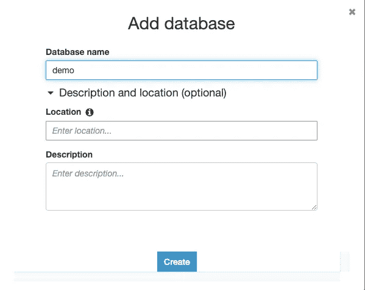

然后创建一个新的 Glue Crawler，将 S3 的拼花地板和丰富数据添加到 AWS Glue 数据目录中，以便 Athena 查询。

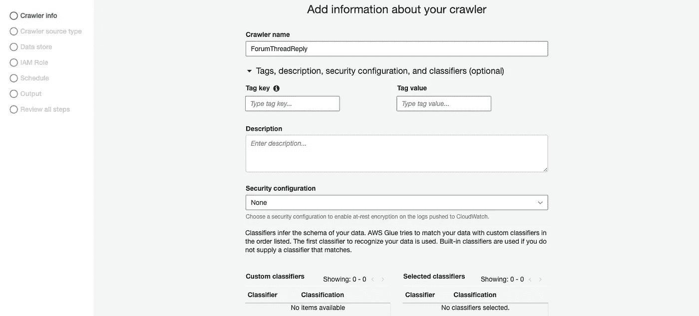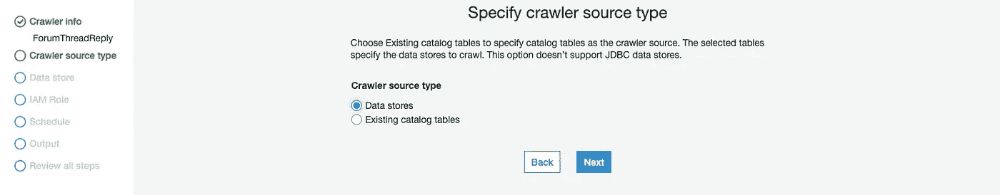

在数据存储步骤中，选择 DynamoDB 作为数据源，并选择论坛表:

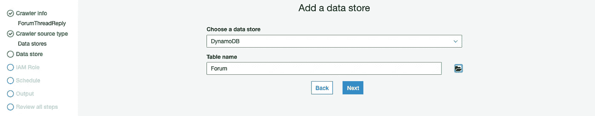

一个 crawler 可以在一次运行中搜索多个数据存储，在我们的例子中，我们需要添加三个表作为数据存储:

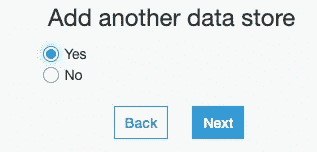

接下来，选择创建 IAM 角色，并在 IAM 角色步骤中命名 IAM 角色:

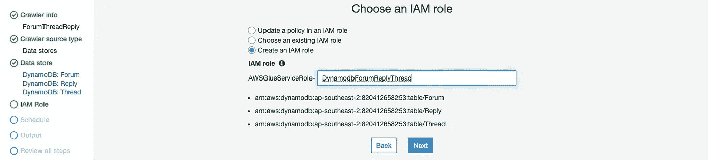

然后为爬虫设置时间表，在我们的例子中，我设置为`Run on demand`:

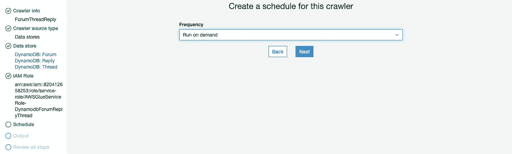

选择`demo`作为数据库，选择`dynamodb`作为下一步的前缀表:

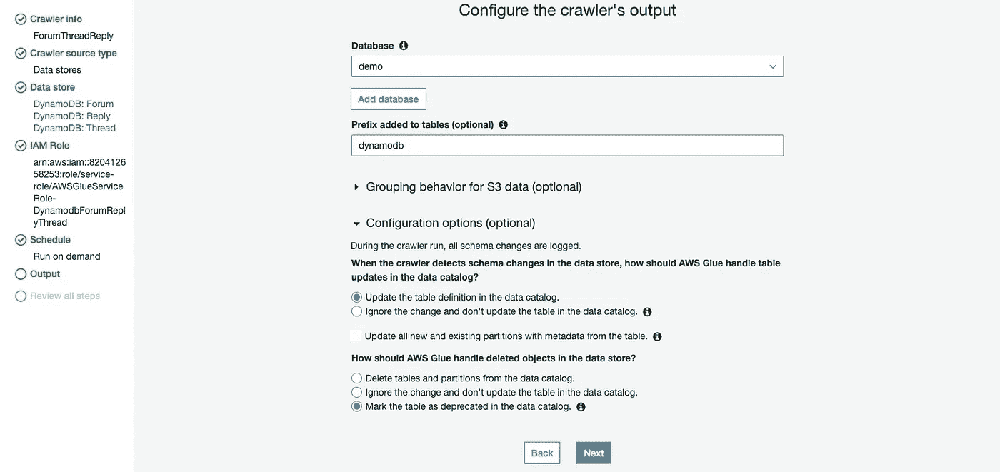

添加 crawler 后，我们应该会看到在 AWS Glue 控制台中创建的 Crawler，让我们运行 Crawler:

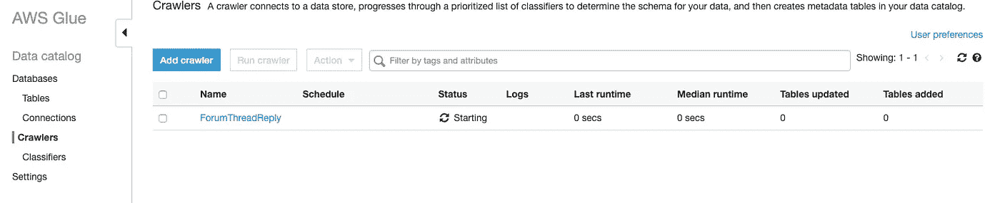

完成后，crawler 在我们的数据目录中创建或更新一个或多个表，我们应该看到创建的表如下:

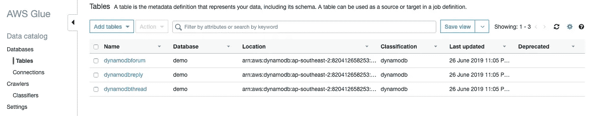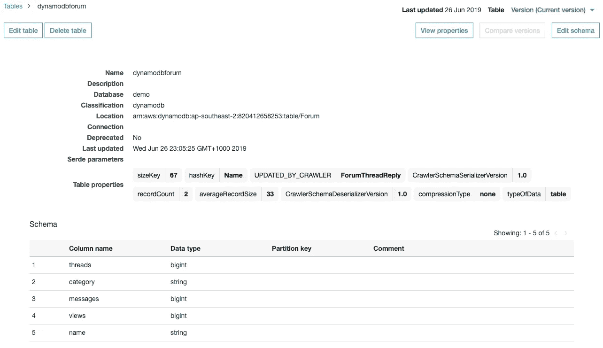

# AWS 粘合 ETL 作业

> AWS Glue 提供了一个受管理的 Apache Spark 环境来运行您的 ETL 作业，而不需要维护任何具有随用随付模型的基础设施。

AWS Glue ETL 作业从我们的源数据中提取数据，并将结果写入 S3 存储桶，让我们使用 CLI 创建一个 S3 存储桶:

```
**$**aws s3api create-bucket --bucket aws-glue-forum.reply.thread.demos --create-bucket-configuration LocationConstraint=ap-southeast-2 --region ap-southeast-2
```

打开 AWS Glue 控制台，选择 ETL 部分下的 Jobs，开始创建 AWS Glue ETL 作业:

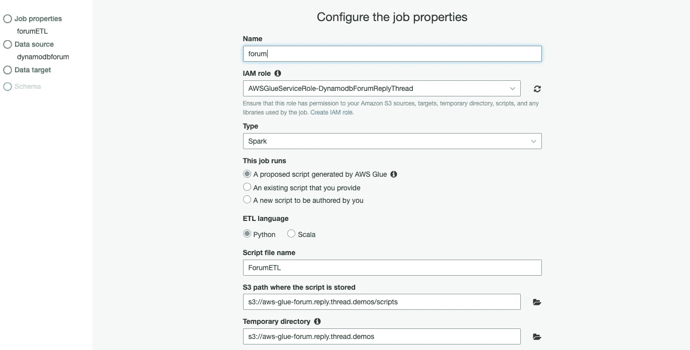

在数据源步骤中选择`dynamodbforum`数据源:

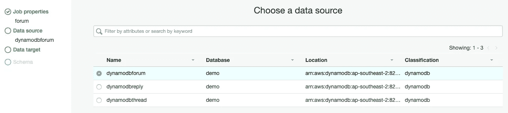

下一步，选择原始的亚马逊 S3 存储桶作为数据源，然后选择 next。在 Data target 页面上，选择 processed Amazon S3 bucket 作为数据目标路径，选择 Parquet 作为格式。

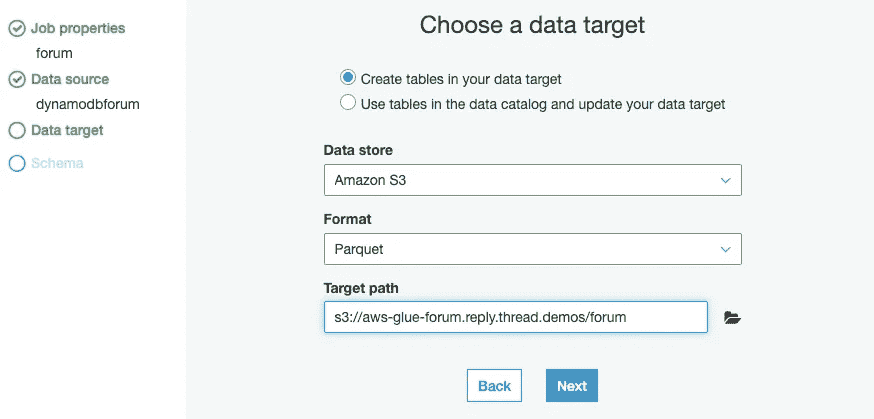

最后，检查您的作业参数，并选择保存作业和编辑脚本，如下所示。

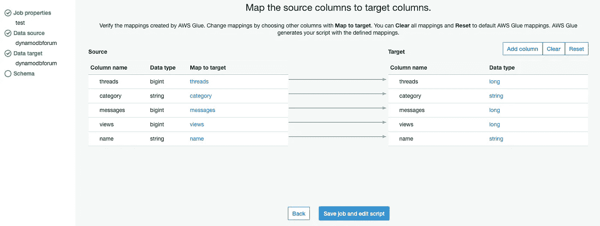

在下一页，我们将需要修改脚本以防止每次作业执行时生成重复数据，将以下代码添加到作业脚本中:

```
import boto3s3 = boto3.resource('s3')
bucket = s3.Bucket('aws-glue-forum.reply.thread.demos')
bucket.objects.filter(Prefix="forum/").delete()
```

完整的脚本应该如下所示:

现在，我们已经创建了我们的论坛 ETL 作业，重复上述步骤来创建其他 2 个作业。一旦创建了三个作业，我们就可以从作业触发器自动执行该 ETL 作业，在我们的示例中，我们将手动运行所有作业:

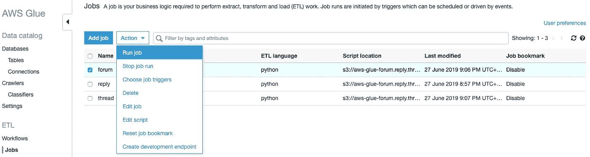

好了，完成了！这就是乐趣的开始！让我们在 AWS Glue 中为 Amazon S3 中的结果表数据创建表条目，这样您就可以使用标准 SQL 通过 Athena 分析这些数据。

# AWS 雅典娜

打开 AWS Athena 控制台，选择`demo`数据库，我们应该在一个类似于如下截图所示的页面上:

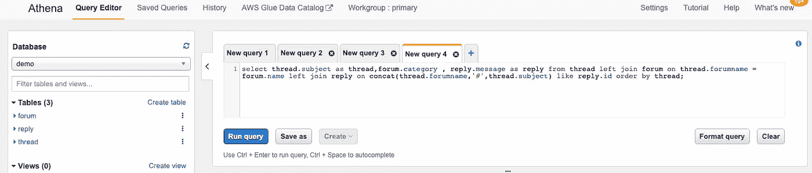

粘贴以下查询以在查询编辑器中创建三个表:

```
**CREATE EXTERNAL TABLE IF NOT EXISTS demo.forum** (
`threads` bigint,
`category` string,
`messages` bigint,
`views` bigint,
`name` string
)
ROW FORMAT SERDE 'org.apache.hadoop.hive.ql.io.parquet.serde.ParquetHiveSerDe'
WITH SERDEPROPERTIES (
'serialization.format' = '1'
) LOCATION 's3://aws-glue-forum.reply.thread.demos/forum/'
TBLPROPERTIES ('has_encrypted_data'='false');**CREATE EXTERNAL TABLE IF NOT EXISTS demo.reply** (
`replydatetime` string,
`message` string,
`postedby` string,
`id` string
)
ROW FORMAT SERDE 'org.apache.hadoop.hive.ql.io.parquet.serde.ParquetHiveSerDe'
WITH SERDEPROPERTIES (
'serialization.format' = '1'
) LOCATION 's3://aws-glue-forum.reply.thread.demos/reply/'
TBLPROPERTIES ('has_encrypted_data'='false');**CREATE EXTERNAL TABLE IF NOT EXISTS demo.thread** (
`views` bigint,
`message` string,
`lastposteddatetime` bigint,
`forumname` string,
`lastpostedby` string,
`replies` bigint,
`answered` bigint,
`tags` array<string>,
`subject` string
)
ROW FORMAT SERDE 'org.apache.hadoop.hive.ql.io.parquet.serde.ParquetHiveSerDe'
WITH SERDEPROPERTIES (
'serialization.format' = '1'
) LOCATION 's3://aws-glue-forum.reply.thread.demos/thread/'
TBLPROPERTIES ('has_encrypted_data'='false');
```

现在，针对这些数据尝试以下分析查询。选择“运行查询”来运行每个查询，并在“结果”下查看输出。

示例查询:

```
select thread.subject as thread,forum.category , reply.message as reply from thread left join forum on thread.forumname = forum.name left join reply on concat(thread.forumname,'#',thread.subject) like reply.id order by thread;
```

示例结果:

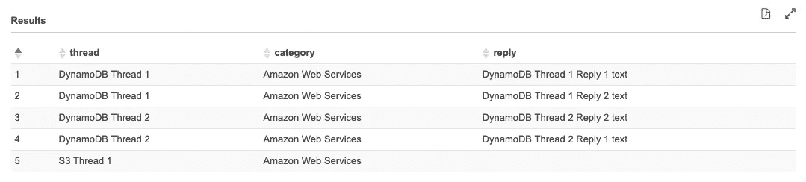

> 亚马逊雅典娜查询引擎基于 Presto。关于这些函数的更多信息，参见 [Presto 0.172 函数和操作符](https://prestodb.io/docs/0.172/functions.html)。

差不多就是这样！感谢阅读！我希望这篇文章对你有用，你可以在我的 [GitHub repo](https://github.com/yai333/DynamoDB-S3-Glue-Athena) 中找到完整的项目。