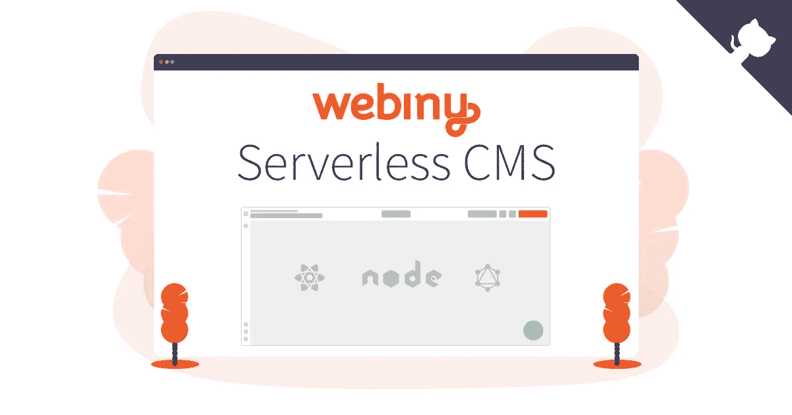
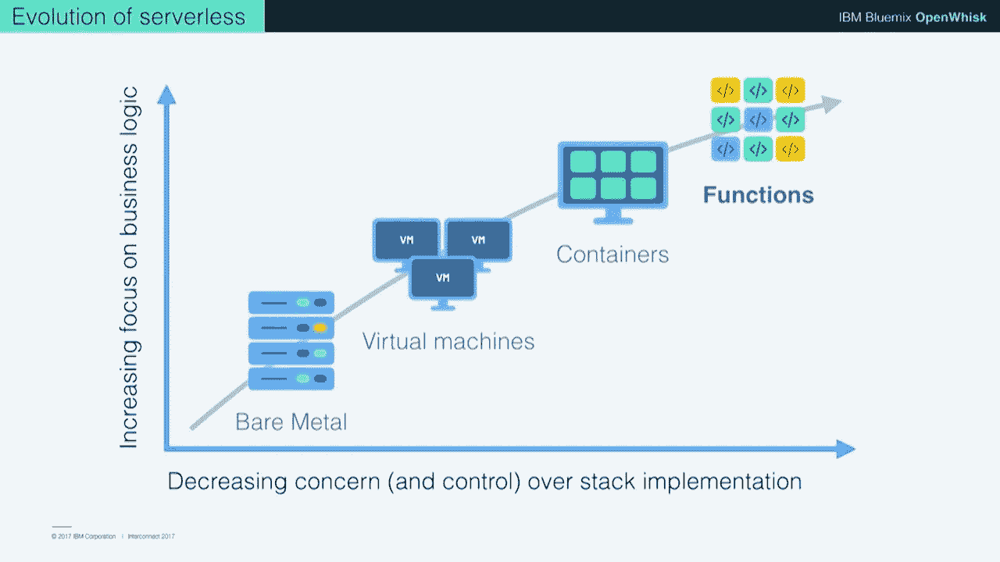
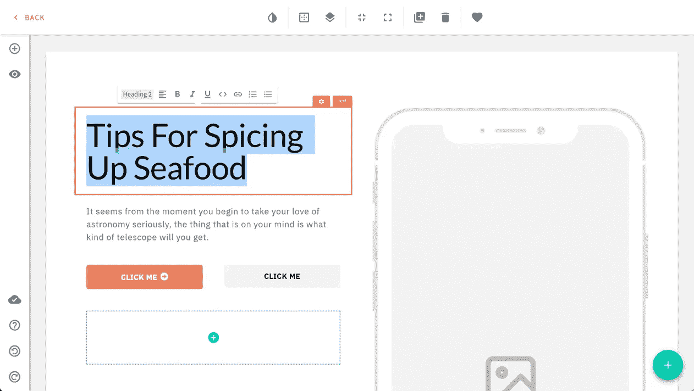
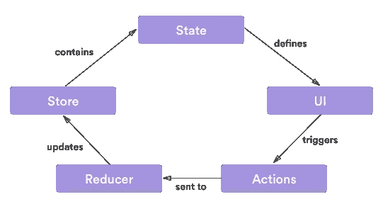
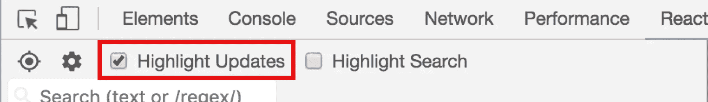
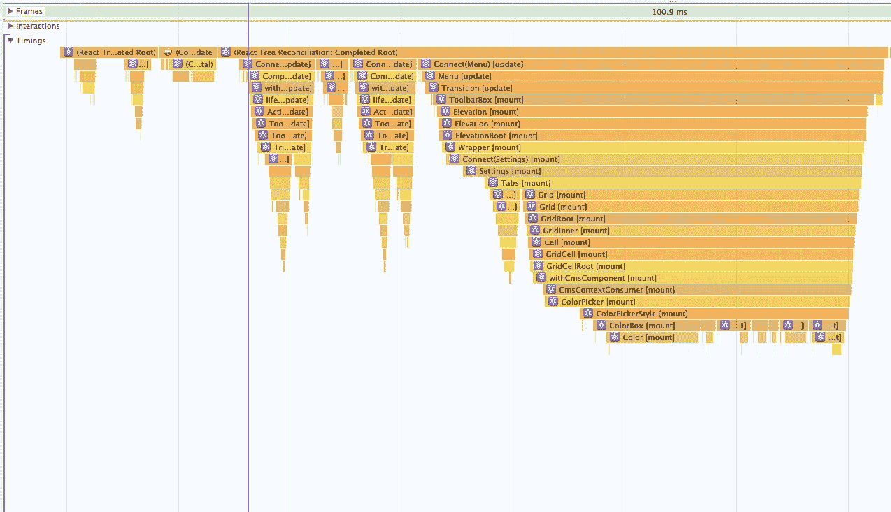
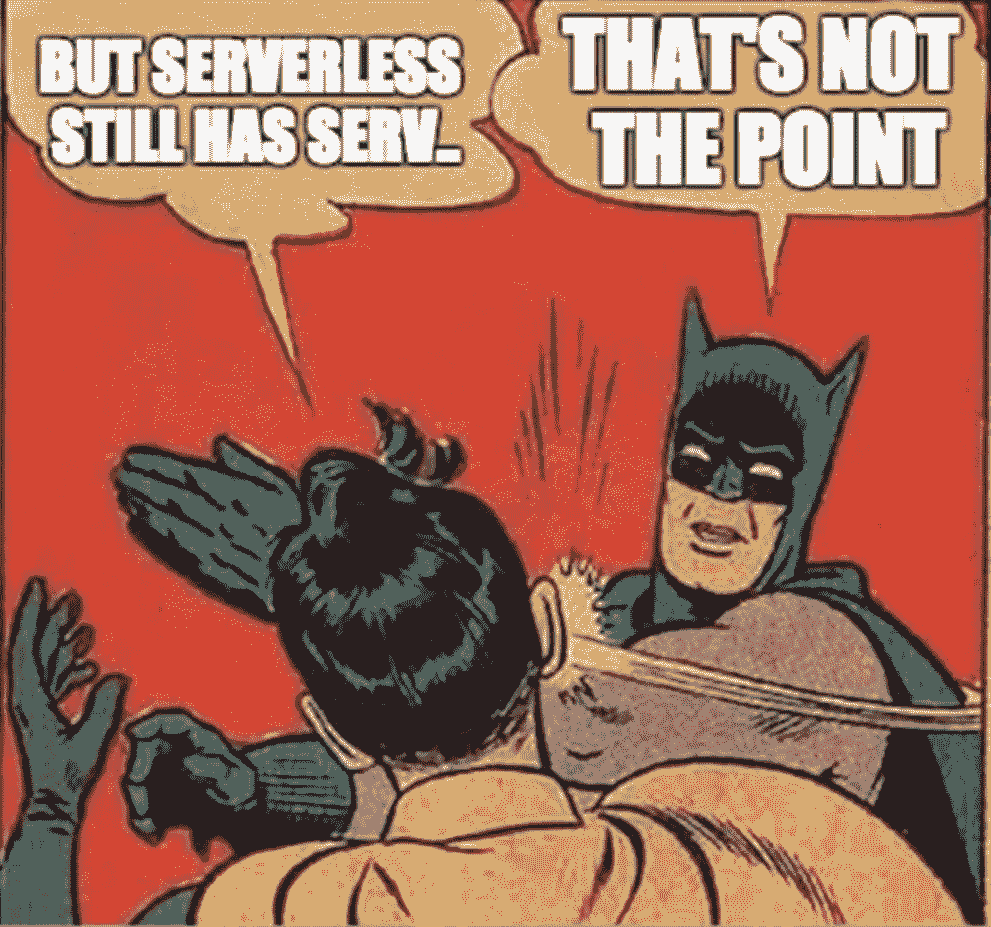

# 构建 Webiny——无服务器的内容管理系统

> 原文：<https://medium.com/hackernoon/building-webiny-a-serverless-cms-51bde9b5b3bf>

## 过去 12 个月的挑战和经验教训



[Webiny — Serverless CMS](https://www.webiny.com/)

首先，我们有了金属，然后一切都虚拟化了，最后，我们转向了容器。现在，一个“服务器”的新时代正在出现(如果我们甚至可以这样称呼它们的话)；它诞生在云中，并为云而设计。



Evolution of serverless — Jason McGee

亚马逊首席技术官沃纳·威格尔说:

> “无服务器是发展的未来”

——我完全同意。

然而，并不是一切都很美好。无服务器环境还很年轻，并不是我们今天使用的所有系统都针对它进行了优化，尤其是内容管理系统。让我解释一下。

# **革命战胜进化**

我们仍然在追逐更快的马，而不是思考如何瞬间移动。


如果前一句话让你困惑了，我来给你打个比方。

把你的 Wordpress 版本 4 升级到版本 5 就是进化；你刚刚得到了一匹更快的马。这匹马可以跳得更高，走得更远，甚至可以倒着走——但它仍然是一匹马。它仍然是 15 年前发明的那个堆栈(初始版本:2003 年 5 月 27 日)。

与此同时，聪明的新头脑发明了无服务器技术、新的 API 标准(如 [GraphQL](https://graphql.org/) )、用库构建 UI 的酷的新方法(如 [React](https://reactjs.org/) )。今天，我们甚至有了一个[无服务器数据库](https://aws.amazon.com/rds/aurora/serverless/)。所有这些技术的不存在是以前的 CMS 是如何设计的，这些限制仍然存在于它们之中。

革命的道路要求我们用更强大、更快速、更安全、更可扩展的技术(和思维模式)来创造新事物。这是关于其中一次旅行的故事。

# **为什么要构建无服务器 CMS？**

答案很简单——我心里痒痒了:)

玩笑归玩笑，如果您正在寻找一个用 React、Node 和 GraphQL 等技术构建的 CMS，并且也是为无服务器环境设计的——那么，您很幸运！

截至目前，目前只有一个选项可用— [Webiny](https://www.webiny.com/) 。

Webiny 是无服务器时代的 CMS。它是开源的，由麻省理工学院授权，它还有一个托管版本，你只需点击几下鼠标就可以得到你自己的无服务器环境。

Webiny 有许多很酷的特性，主要面向开发者。你可以在前面提到的网站上了解更多。现在，让我们回到本帖的原标题上来。

# **一路上的挑战**

我们面临的挑战可以分为三类:

1.  CMS 相关
2.  建筑相关
3.  商业/金融相关

我们将更详细地讨论每个类别，然后分享一些有用的提示，尤其是关于业务/财务方面的提示。现在，让我们潜入更深的地方。

# **CMS 挑战**

CMS 是一组相当复杂的功能，需要协同工作。这里有一些例子。

## **页面生成器**

你不能只创建一个带有标题输入字段和页面内容的[编辑器](https://ckeditor.com/)的表单，然后称之为 CMS。这远远不够。您需要一个全功能的页面生成器，而我们已经构建了一个！

但是男孩，创造一个实际工作和优化的需要的努力肯定是难以描述的。



Webiny Page Builder

第一个主要挑战是管理页面生成器中的数据。界面很复杂——每个页面项目都有 20 多个不同的属性可以调整。在一个页面中，您可以轻松地拥有超过 100 个元素，使您需要管理、存储和检索的道具总量达到数千个。

我们使用了 [Redux](https://redux.js.org/) 来控制这一切，这不仅仅是 Redux 作为一个数据层为您节省了大量麻烦，它还附带了调试器。没有它这是不可能的。您可以在事件堆栈中上下移动，实时查看整个数据结构的样子，以及许多其他事情，如果没有这些事情，事情会变得更加困难。



Redux flow

## 渲染性能

我们的 CMS 有超过 100 个不同的移动部分——一些保持状态，一些在每次你做改变时进行主要的状态更新。

通过 UI 传播有时会导致界面滞后，感觉不够“快”。一开始，一切都很顺利。

你开发了一个元素，你测试了它，你继续下一个。一切似乎都在工作，直到你最终开始用大量的元素构建真正的页面。缓慢但肯定的是，一切都变得越来越慢。

一个显而易见的第一想法是 **React 开发者工具。它有“高亮显示更新”选项，这将帮助您识别重新渲染的元素。**

[](https://chrome.google.com/webstore/detail/react-developer-tools/fmkadmapgofadopljbjfkapdkoienihi?hl=en) [## React 开发人员工具

### 将 React 调试工具添加到 Chrome 开发者工具中。

chrome.google.com](https://chrome.google.com/webstore/detail/react-developer-tools/fmkadmapgofadopljbjfkapdkoienihi?hl=en) 

不幸的是，这只能帮助你实现一个非常简单的 UI 层次。在我们的例子中，这仅仅触及了表面。

因此，我们不得不求助于 Chrome 开发工具，特别是性能快照。在 React 应用程序中调试渲染性能时，这个工具是无价的。记录的快照让您可以准确地看到渲染应用层次结构中的每个特定元素花费了多少时间(不要忘记打开**计时**部分)。然后，您可以直接进入特定组件的代码并开始优化:



Chrome Dev Tools — Performance Snapshot

这仍然是一个非常手动的过程，因为你必须考虑输出以及为什么某些组件被重新渲染，但你可以快速找到你的应用程序中的不同问题，在某些情况下，解决一个问题可以修复许多地方的渲染性能( **shouldComponentUpdate** 和 Redux 的 **connect** 将是你最好的朋友来完成这项工作)。

一开始很让人望而生畏，这个过程最后会让你开心。

## CSS 库

这里有一个有用的提示，它并不十分明显:

如果你使用的是 CSS 库，比如 [Emotion](https://github.com/emotion-js/emotion) ，确保不要过于频繁地更新控制 CSS 的组件上的道具，因为这样会在每次更新时创建并插入一个新样式的 DOM 元素。

一个典型的例子是调整元素大小的工具:元素的大小在任何情况下都不能是一个情绪道具——它必须是一个简单的 React 元素样式值。否则，在调整大小时，你会用新的样式元素轰炸你的 DOM(这就是 Emotion 的工作方式)。

## **用户界面**

构建 UI 是一个充满挑战的故事，即使没有几本书，也足以写满一整本书。幸运的是，当我们开始时，谷歌刚刚推出了[材料设计](https://material.io/)，并且有几个 react 库已经准备好使用这些组件。我们使用的那个叫做 [RMWC](https://github.com/jamesmfriedman/rmwc) ，和 [material.io](https://material.io/) 网站上的[设计部分](https://material.io/design/)一起，教你如何正确使用他们的组件，我们设法为我们的 CMS 创建了一个相当不错的 UI。

[](https://material.io/) [## 主页

### 更快地构建美观、可用的产品。材料设计是一个适应性强的系统——由开源代码支持——有助于…

material.io](https://material.io/) 

## **主题和插件**

如果你不能建立你自己的主题，或者用你自己的插件和附件定制它，那么 CMS 是什么？

我们希望我们的主题系统超级简单。由于页面生成器实际上是你构建内容和生成 HTML 的地方，我们设法创建了一个主题库，在那里你拥有的只是一个小的 JSON 配置，其他的一切都是通过 CSS 完成的。你可以在我们的[文档网站](https://docs.webiny.com/docs/developer-tutorials/new-theme-overview)上了解更多关于我们的主题设置。

```
{
    layouts: [
        // defines a list of layouts
    ],
    fonts: {
        // defines font faces
    },
    colors: {
        // defines a list of default colors
    },
    elements: {
        // defines element settings
    },
    typography: {
        // defines typography styles
    }
}
```

至于插件系统，很难找到任何关于如何制作插件系统的好建议或最佳实践。所以，我们实际上做的是把整个 CMS 做成一套插件。每个按钮、菜单项和表单元素实际上都是一个插件。

这让我们对插件的可扩展性和可能性感到很舒服。另一方面，这使得我们的代码非常模块化和分离。最后，这对开发者体验(DX)有很大的影响，因为当[构建他们自己的插件](https://docs.webiny.com/docs/developer-tutorials/plugins-crash-course)时，为系统“核心”编写代码的方式与其他开发者编写代码的方式没有区别。

# 建筑挑战

无服务器应用程序的架构相当简单，对吗？你有一个 API 网关，一些 Lambdas，另一端有一个数据库，一个装有静态文件的 S3 桶。

但是，这里有一个问题要问你—多租户无服务器应用程序怎么样？基本上，每个用户可以有自己的域名，自己的 SSL 证书，静态文件托管，和一个数据库。

Webiny 的托管版本正是如此。

而且，我可以告诉你，今天，没有一个云提供商允许你在一个 API 网关上拥有 10.000 个不同的 SSL 证书，或者使用多个域名从同一个桶中提供静态资产。CloudFront 和类似的 cdn 对它们可以服务的 SSL 证书和域名的数量有硬性限制。我们和几家云提供商谈过，他们都不支持。

因此，尽管无服务器很棒，但它也有其局限性。是吗？！；)

我们认为这个问题是一个挑战，为了解决这个问题，我们使用了 OpenResty Nginx 分支，为 AWS Lambda 编写了自己的 API 网关，在前端设计了自己的 SSL 证书管理系统，创建了 S3 桶的代理，还添加了一系列使用和性能监控代理，*et voila*——我们现在可以支持任意多的无服务器租户。

OpenResty 很棒；用 Lua 编码只需要一点练习。


[https://github.com/openresty/lua-nginx-module](https://github.com/openresty/lua-nginx-module)

你可能会说这不是一个真正的无服务器 CMS，因为它使用代理形式的“服务器”来工作。



从技术上讲，代理是不需要的；只有具有多个租户的托管环境才需要它。但是，为了便于讨论，如果你在你的无服务器页面前使用 CDN，像 [Cloudflare](https://www.cloudflare.com/) ，这些在技术上是开放的反向代理。

不要误解我，这肯定是 AWS、Google 和 Azure 等大型云提供商需要改进的领域，因为这些平台目前不支持多租户无服务器架构。

## **业务挑战**

至此，您有望了解构建无服务器 CMS 所需的努力，但故事并没有真正结束——我还有一件事要分享。

Webiny 是开源的，但是它花费了大量的时间、精力和金钱来创建 Webiny。当我们开始这个项目时，我们知道做这个兼职从来都不是一个选项；我们的尝试很可能会失败。所以，建造如此庞大复杂的东西的唯一方法就是需要财政支持。但是，没有投资者会给你钱，如果你去找他，用电梯推销来建立一个 CMS，没有用户，没有收入——它永远不会有足够的说服力来筹集投资。

此外，10 年前创建 CMS 要容易得多，因为进入这个市场的门槛要低得多，但现在情况不同了。几个人告诉我们——“嘿，造个 MVP 就行了。”

好吧，你去试着做一个 MVP，比如说，一个电动汽车，然后让我知道你会遗漏掉哪些你的竞争对手今天已经有的东西。

让我来帮你回答这个问题:你不会遗漏任何一件事！您的汽车将拥有竞争对手拥有的一切，甚至更多——这就是您发布的时间！否则没人会买。

无论你在生活中做什么，如果你想在某件事上变得伟大，你需要达到“当前伟大”的水平，然后比那个水平稍微好一点。

那么，我们如何解决我们的财务问题呢？

这个团队最初是作为一个小的网络代理开始的。我们通过做标准的网络代理工作赚了一些钱，然后，有一次，我们决定停止接受新的工作，所有留在银行账户上的钱都被用作投资，以确保团队的工资，这样我们就可以完全投入到这个项目中。如果是其他方式，Webiny 将永远不会看到天日。

这方面有个小提示。

AWS 有激活程序，您可以应用它并获得 1000 美元的 AWS 信用，这对于在开发过程中覆盖基础设施的成本来说是非常棒的。

另一个需要探索的是像 ProductHunt Ship 这样的东西。如果你订阅了年度会员资格(600-1500 美元)，你可以获得 5000-7500 美元，也是 AWS 积分，还有[其他福利](https://www.producthunt.com/ship)。请注意，如果您申请 AWS 激活，初始点数可能会从您从 ProductHunt Ship 获得的点数中扣除。

[](https://aws.amazon.com/activate/) [## AWS 激活

### AWS Activate 是一个旨在为初创公司提供所需的低成本、易于使用的云计算资源的计划…

aws.amazon.com](https://aws.amazon.com/activate/) 

**接下来是什么**

如果你走到了这一步…我钦佩你的专注。我把这篇文章的长度归咎于我的长途飞机飞行。

无论如何，希望你喜欢这本书。如果你能试一试，并让我知道你的想法，我将不胜感激。你可以通过推特 [@SvenAlHamad](https://twitter.com/svenalhamad) 联系我。

【https://www.webiny.com 