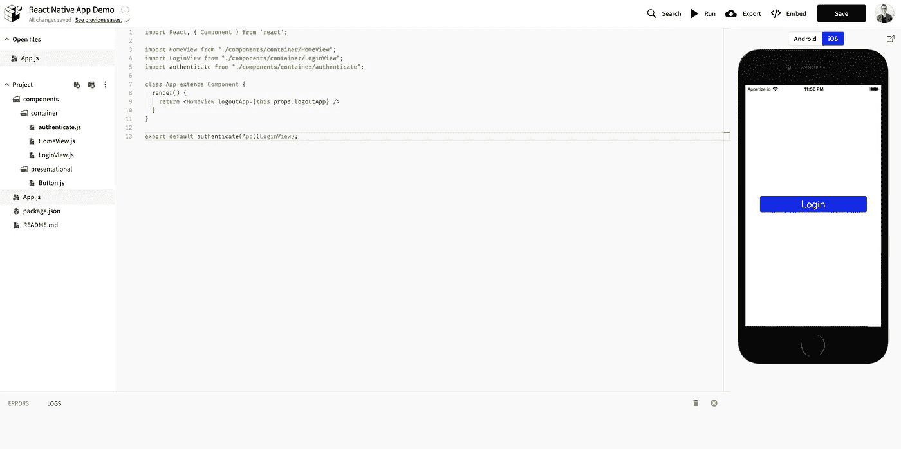

# 构建您的第一个 React 原生应用

> 原文：<https://medium.com/hackernoon/building-your-first-react-native-app-77a192734ff1>

Image by [Hilthart Pedersen](https://unsplash.com/@h3p) on [Unsplash](https://unsplash.com/)

(这篇文章是 Nathan Thomas 正在进行的关于技术和软技能的系列文章的一部分，他是一位在硅谷 Lambda 学校学习和工作的全栈软件工程师。点击 [*此处*](https://blog.usejournal.com/the-pursuit-of-persistence-and-grit-c13ad37743c4?sk=a77aba0333ab82b2369d46a97715f3c1) *为该系列的第 5 部分，一篇关于“追求坚持和毅力”的文章点击* [此外，请注意我们不再有`onClick`事件。相反，我们使用的是`onPress`,如果我们停下来想一想，这看起来非常明显。毕竟我们用的是智能手机！](/@nwthomas/the-pursuit-of-personal-fulfillment-c5c82994c028#0E30F050</code>的最后两个数字是不透明度百分比)。如果我们不提供这一点，当我们按下按钮时，颜色会变得超级时髦(在这里阅读为什么)。

的最后两个数字是不透明度百分比)。如果我们不提供这一点，当我们按下按钮时，颜色会变得超级时髦(在这里阅读为什么)。

的最后两个数字是不透明度百分比)。如果我们不提供这一点，当我们按下按钮时，颜色会变得超级时髦(在这里阅读为什么)。

的最后两个数字是不透明度百分比)。如果我们不提供这一点，当我们按下按钮时，颜色会变得超级时髦(在这里阅读为什么)。

的最后两个数字是不透明度百分比)。如果我们不提供这一点，当我们按下按钮时，颜色会变得超级时髦(在这里阅读为什么)。

的最后两个数字是不透明度百分比)。如果我们不提供这一点，当我们按下按钮时，颜色会变得超级时髦(在这里阅读为什么)。

的最后两个数字是不透明度百分比)。如果我们不提供这一点，当我们按下按钮时，颜色会变得超级时髦(在这里阅读为什么)。
<p id=) [Alfred Twj](https://unsplash.com/@alfredtwj) on [Unsplash](https://unsplash.com/)

# 请原谅我亲吻天空

首先，点击`package.json`文件。删除那里的所有代码，并将下面的依赖列表粘贴到:

很高兴知道我们有叶老和我们在一起，一起兜风，不是吗？

接下来，转到`HomeView.js`并更新代码，如下所示:

我们只是随`Button.js`组件一起导入了`axios`依赖项，添加了一个类`constructor`函数，实现了一个`componentDidMount()`生命周期方法，但是在我们的组件代码中添加了一些新的文本和一个按钮，并且在我们的`StyleSheet`代码中添加了一个`weatherText`样式。在我们的生命周期方法中发生的`axios`调用目前编码为旧金山，但是您可以使用 MetaWeather API 文档[中的信息在这里](https://www.metaweather.com/api/)调整它。

咻。😰

工作量很大，但我们都完成了！在应用程序中摸索，你会发现你可以登录，从`HomeView.js`中拖动`ScrollView`页面，将当前天气渲染到屏幕上，然后使用主屏幕上的按钮注销。

# 您旅途中的其他资源

1.  [React 原生官方文档](https://facebook.github.io/react-native/)——这些都写得很好，你基本上可以通过构建一个应用程序来搜索你的路(有一些轻微的堆栈溢出)。
2.  [Expo](https://docs.expo.io/versions/latest/) —这是构建 React 本地应用程序的主要方式。我们在本文中使用的零食软件就是他们开发的。我在上一个项目中使用了苹果的原始 Xcode，因为 Expo 不支持 React 钩子，相信我，你应该使用 Expo。有一些不错的 CLI 工具可以在你的电脑上本地工作，这样你以后就不用再用点心了。
3.  [React Router Native](https://reacttraining.com/react-router/native/guides/quick-start)——React Native 中有许多导航选项，但这个选项很棒，因为它使用了与 React Router 完全相同的语法(除了它没有`NavLink`)。
4.  [样式组件](https://www.styled-components.com/) —你可以在 React Native 中使用这个惊人的样式库，方法是安装依赖项`styled-components`，然后在你的应用程序中的任何地方导入`styled-components/native`。
5.  [React Native Shadow Generator](https://ethercreative.github.io/react-native-shadow-generator/)—为您的应用程序生成酷炫投影的绝佳资源。在本文的演示应用程序中，我用它来生成欢迎卡上的阴影。

感谢阅读。

南森(男子名)

( [GitHub](https://github.com/nwthomas) 、 [LinkedIn](https://www.linkedin.com/in/nwthomas-profile/) 、 [Twitter](https://twitter.com/nwthomas_) 、 [Instagram](https://www.instagram.com/nwthomas/) 、[作品集网站](https://nathanthomas.dev/))