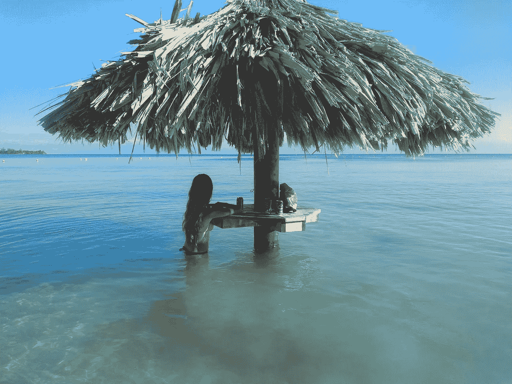
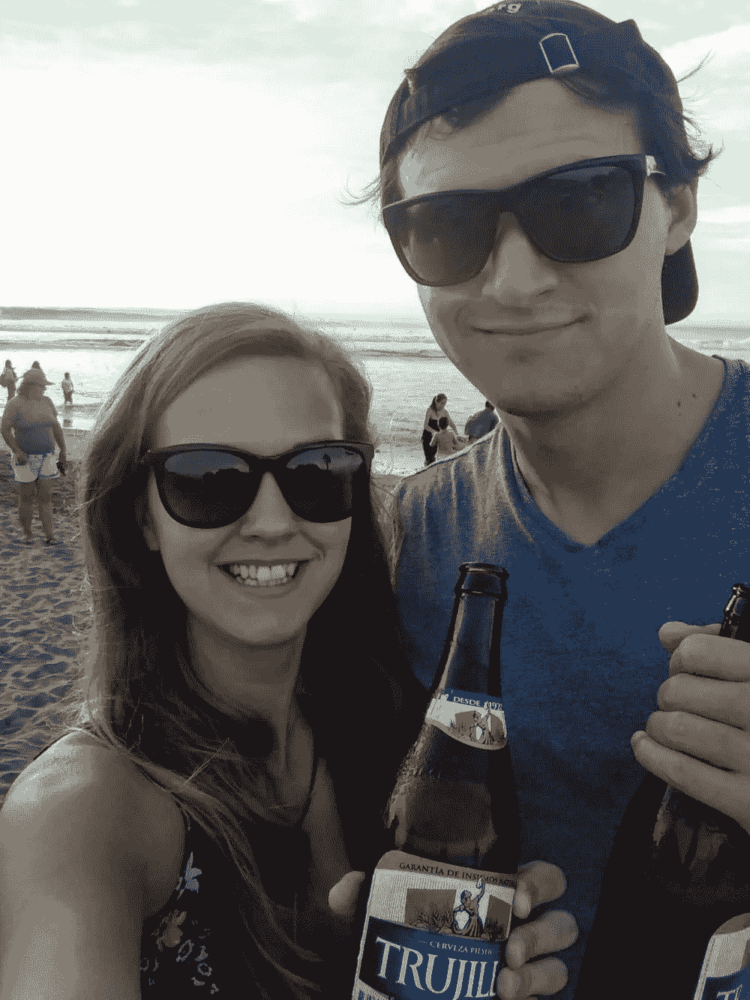
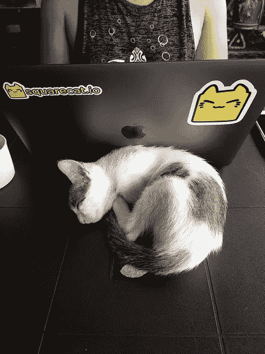
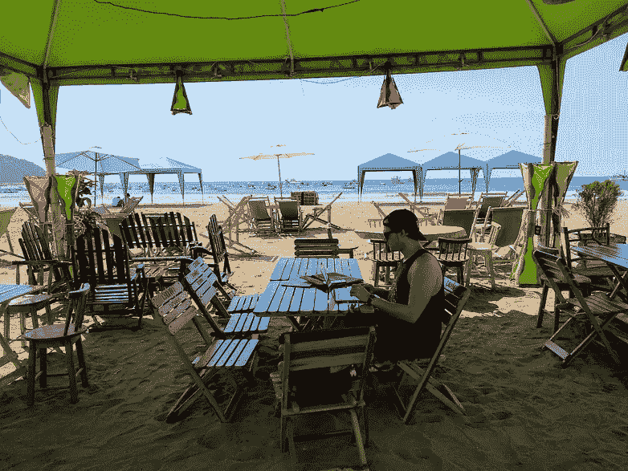
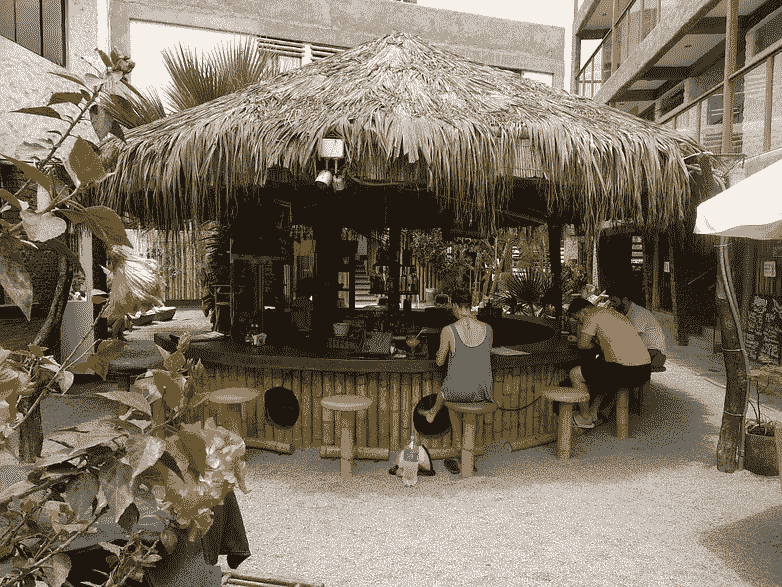
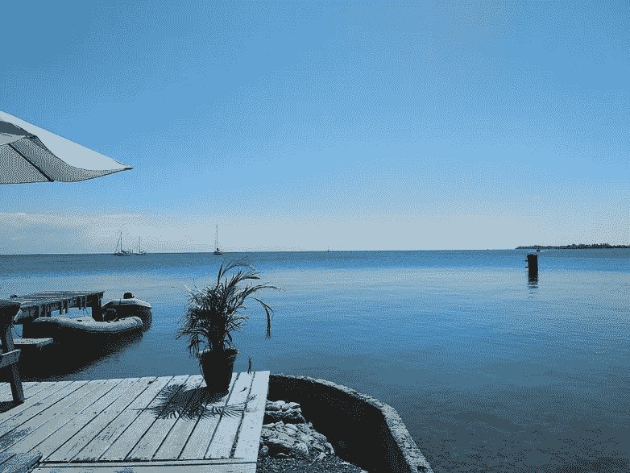
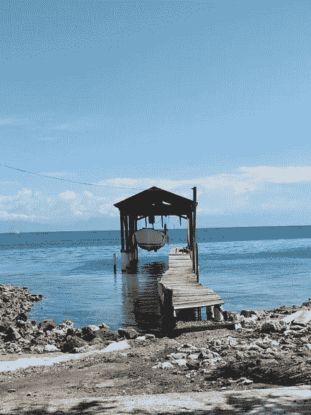
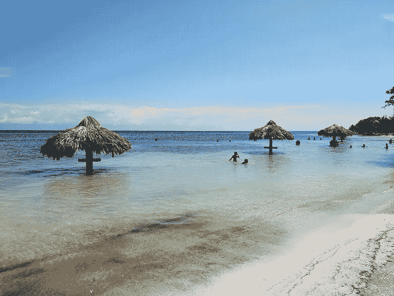
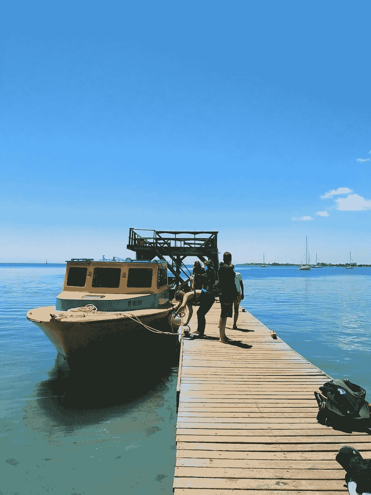
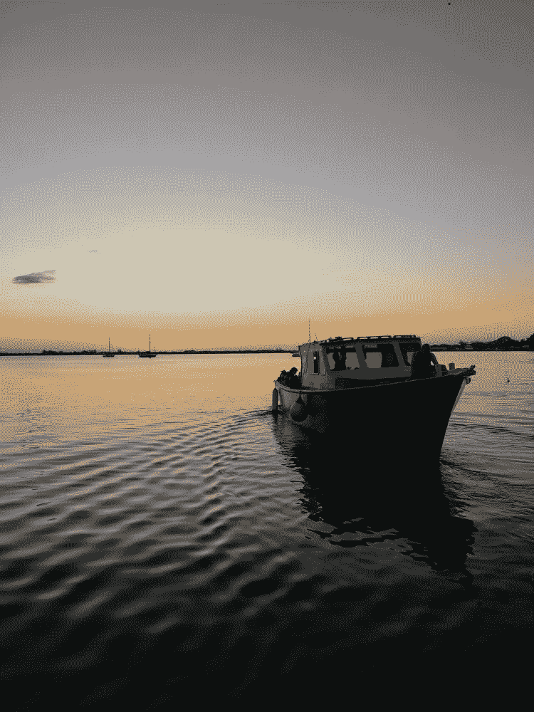

# 筋疲力尽，预算混乱，你不能给家里打电话

> 原文：<https://medium.com/hackernoon/burnout-budget-smudget-and-you-cant-phone-home-9867533249f9>

## 几个游牧者

## 本文是由三部分组成的系列文章的最后一篇。看前面一个 [*这里*](https://hackernoon.com/a-couple-of-nomad-makers-finding-friends-and-side-project-profits-e9a22b05a265) *(还有第一个* [*这里*](https://hackernoon.com/a-couple-of-nomad-makers-finding-friends-and-side-project-profits-e9a22b05a265) *)。*

我们现在已经上路两年了，2018 年的大部分时间都在寒冷的国家和气候中度过。终于厌倦了每天穿五层衣服，我们前往秘鲁的冲浪小镇万卡乔。

海滩很脏，只有一家咖啡馆有很好的 wifi，但天气热得可以穿短裤，我们有重要的事情要做。我们**终于**推出了我们的副业项目[别管我](https://leavemealone.xyz)——一项轻松退订垃圾邮件的服务，关于产品搜索！

你可以在这里[https://blog.squarecat.io/successful-product-launch](https://blog.squarecat.io/successful-product-launch/)读到我们紧张的发布会和从中吸取的教训。

Celebration beach beers!

# 勉强避免倦怠

《让我一个人呆着》的成功推出令人难以置信(T21)，但随着该项目的启动，我们仍在做客户工作以继续旅行。我们计算了一下，如果我们承担额外的工作，那么到三月份，我们将会赚到足够的钱来维持我们今年剩下的日子。工作三个月，然后休息九个月，听起来棒极了！

我们完成了工作，但不是没有牺牲我们的身心健康。我们没有承担超出我们实际完成能力的工作，我们也有足够的时间，但是从事如此多的项目影响了我们的生产力和理智，甚至对我们的关系产生了一点影响。

我们必须记住每个项目的大量信息，并经常在它们之间切换，这需要时间和精力，这不是一种有效的工作方式。我们也比平时工作更长时间，在周末做客户工作，这通常是为激情项目保留的。这意味着我们都精神疲惫，对逃避工作或“让我一个人呆着”感到烦躁，对彼此的耐心也越来越少。没什么太严重的，但是我们脾气比较暴躁，没有时间去享受我们正在参观的地方。

Desert oasis work vibes | Fluffy office guests | Sea views

除了成堆的工作之外，我们第一次有了一个必须遵守的旅行期限，这增加了压力。我们需要在 4 月的第一个周末回到欧洲(参加一个婚礼)，现在必须决定去哪些地方，哪些地方要去，还要计划好我们的回程费用。

我们的转折点出现在二月底。我们给自己施加了很大的压力来实现我们的 2019 年目标，詹姆斯有自己的目标，即每月推出一款产品。我们真的没有时间，但是詹姆斯想推出 [MakerAds](https://makerads.xyz) ，所以我们制定了一个发布计划，创建了资产，并于 2 月 28 日开始在[寻找产品](https://www.producthunt.com/posts/makerads)！

发布会进行得非常顺利，我们被积极的回应所淹没。发布令人疲惫不堪，在随后的日子里，广告提交量激增，变得难以应付。我还担心“让我一个人呆着”销量的下降会影响我们的收入目标，并且很难找到时间写两篇博客和读两本书。即使我们超级忙，我们都没有做足够的体育活动，我们都在努力睡觉！

我们认识到，如果不跟随最近令人遗憾的制造商精疲力竭的趋势，我们就无法继续这么多或这么努力地工作。你应该聪明地工作，而不是努力地工作，而我们在这方面失败了。如果我们没有后退一步，那么我们的工作和心理健康会受到更大的影响。如果我们不接受治疗(治疗可以简单到休息一下)，可能会影响我们更长时间的工作能力，导致错失机会，并进一步影响我们的整体健康。

我们想在飞回来之前在洪都拉斯潜水，并决定在开始去欧洲的长途旅行之前，花整整两周的时间休息、恢复和反思。我们的客户理解我们的休息时间，很容易忘记即使是远程员工也会休假。

在乌蒂拉的大量潜水让我们几乎没有时间去思考工作，而且互联网太糟糕了，即使我们想工作也不可能！

我们的假期是非常必要的，它帮助我们侥幸避免了可怕的[倦怠。我们离开了 Utila，感觉神清气爽，兴奋地再次编码。](https://hackernoon.com/tagged/burnout)

今年有几个制造商已经筋疲力尽了，退一步注意你的健康真的很重要。我们都在 2018 年的最后一个季度努力推动自己，并为 2019 年设定了很多目标，包括我自己。目标是伟大的，但是只有当你不想伤害自己的时候，它们才值得你去追求。

我发现我成功的关键是设定可衡量和可实现的目标。我在 Airtable 上有一个 [2019 目标仪表盘，它让我可以看到我的进展，当我看到我已经完成了一些目标时，它会给我动力，并鼓励我继续前进。最重要的是要意识到，如果在年底我还没有完成所有的事情，我并没有失败。拥有有意义的目标，朝着你真正想要实现的目标前进，这本身就是有价值的。](https://airtable.com/shrenq7YfHWPgIv9W)

很容易在社交媒体上看到其他创客的成功，并进行比较。我在推特上谈论另一次成功的发射，发布博客，似乎一切都在掌控之中。我试着保持开放，分享沮丧和糟糕的日子，以避免成为问题的一部分。你的健康比航运更重要。如果你休息一下，这个项目、目标和社区仍然会存在。另外，当你回来的时候，你会更加专注和有效率！从现在开始，我会更多地采纳自己的建议！

引用——“拥有有意义的目标，朝着你真正想要实现的目标前进，这本身就是有价值的。”

开发商开始认识到健康的重要性。[maker log](https://getmakerlog.com)的创造者塞尔吉奥·马泰最近在平台上增加了健康功能，鼓励制造商休息一下，不必担心失去连胜。安妮-劳雷·勒康夫创造了一个浏览器扩展 [Teeny Breaks](https://teenybreaks.com/) 它提供了正念技巧并鼓励休息。

在一个联系越来越紧密、要求越来越高的世界里，我们都在努力保持工作与生活的平衡，努力为我们喜欢的事情找到时间，同时还能从一些我们不喜欢的事情中赚钱，如果能看到更多这样的态度就太好了。

😍

# 这是你和我，宝贝

詹姆斯和我不仅一起旅行，还一起工作。我们是彼此的慰藉，是酒友，是情感的支撑，是共鸣板。我们同意，我们每个人都要对自己的幸福负责，尽管我们仍然为彼此提供身体和精神健康各个方面所需的几乎所有支持。

我非常感激能遇到这样一个人，我可以和他分享我的方方面面，并体验这种奇妙的生活方式。有些人认为，因为我性格外向，声音大，所以旅行是我的主意，我拉着詹姆斯一起去兜风。

事实恰恰相反。在我们开始约会之前，詹姆斯就开始质疑他的生活，并开始总结如何变得更快乐。当我们见面时，他和我分享了他的想法，而我立即转向了黑暗面。我们不想要抵押贷款或攀登职业阶梯，我们想卖掉我们拥有的一切去旅行和为自己工作。

和你的另一半一起旅行会带来一系列的挑战。我们很少争吵，争吵只会在我们都饿的时候发生，尤其是吃早餐的时候！詹姆斯对去哪里吃饭变得举棋不定，我产生了这种需要，让我们在进餐馆前达成一致。这导致我们在不同的地方徘徊，在不太完美的菜单选择上互相指责，并增加了饥饿的愤怒。这是一个致命的循环！我们现在已经学会识别这种情况的发生，我们不看菜单就冲进我们找到的第一个地方。一旦我们喝了些咖啡和鸡蛋，我们俩都会高兴起来！

理解和识别彼此的需求和情感是我们关系成功的关键。这听起来很老套，但是我们真的会在问题变成问题之前谈论它们。

现在，这不是一个关系自助书(订阅通知我即将发布的电子书哈哈 jk)，但它真的是那么简单。由于缺乏更好的描述，詹姆斯是一个外向内向的人，而我是一个非常外向的人。我会大声说出很多想法，但大量的社交活动会让詹姆斯疲惫不堪，他需要一些时间充电。意识到这一点并给他空间对我来说很重要，因为否则我会无意识地对他说出我的想法，这会导致我们之间的紧张。

相反，我确实需要能够发泄我的一些想法。当詹姆斯的电池充满电时，他会给我额外的时间和注意力，这样我就可以感到满意，因为我已经分享了我大脑中发生的事情。

更好地理解彼此提高了我们的情商，增强了我们的感知能力，并对我们的社交能力产生了积极的影响——在那些罕见的场合，我们与其他人共度时光！

# 随着年龄的增长，你会明白的

两年半的旅途教会了我们很多关于世界的事情，让我们体验了不同的文化，并提供了很多自我反思和实现的机会。以下是我觉得值得分享的几件事。

# 去他妈的其他人

不是字面上的意思，但是做你感兴趣的事情，而不是其他人感兴趣的事情，这很重要。有数以百计的旅游博客、孤独星球指南和旅舍里的人会向你保证，如果你不去那个城市/国家的 x、y 和 z，你就错过了。

推荐是找到令人敬畏的事情做的极好的方法，或者是参观昂贵的旅游景点的最便宜的方法，但是如果你对博物馆不感兴趣，不要仅仅因为有人告诉你它很棒就去博物馆。

詹姆斯和我不喜欢徒步旅行，也不喜欢寒冷，所以尽管照片上的美景令人难以置信，许多人也推荐我们去，但我们没有去阿根廷南部的巴塔哥尼亚，因为我们知道不会喜欢那里。出于同样的原因，我们坐公共汽车去了马丘比丘，而不是五天的徒步旅行，因为我们讨厌露营，住不起沿途的酒店，而且当时是秘鲁的雨季——不，谢谢！

这个建议也适用于我们的游牧和偏远的工作生活。我们在几个地方尝试了共同工作空间，每次的体验都证明我们更喜欢不断变化的环境——这有助于我们保持高效。

做自己喜欢的事，而不是自己觉得应该喜欢的事！

# 你不必是一个游客

我们参观了很多地方，在那里我们呆了几天到一个月，却没有参观任何旅游景点。没关系。有时我们会呆上一个月，住在漂亮的公寓里，从旅行中恢复过来，完成一些工作。

这是我们旅行方式的重要组成部分。不停地移动可能会很累，所以为了对抗旅行疲劳，我们慢慢地旅行，我们喜欢“住”在某个地方，买杂货，做饭，看电视，喝一些便宜的酒。如果可能的话，我们会利用空闲时间来学习和发展我们的技能，但有时需要整个周六看《网飞》或玩电子游戏来充电。

做你需要做的事情，让长期旅行对你来说可行和可持续——即使这意味着你要像“回家”一样在沙发上呆一天！

# 预算污点

坚持预算对于让你的钱持续很重要，这样你就能知道在你真正需要采取激烈行动之前还有多少时间——比如飞回家找一份“真正的工作”！

我有一个非常受欢迎的电子表格，在里面我记录了我们所有的日常开支，以确保我们没有超出每天 50€的预算。有时我们会多花一点，但只要月底收支平衡就没关系。

如果你和我一样对电子表格感到兴奋，或者只是想了解一下我们的费用，你可以在这里看到我们目前的 [2019 年预算](https://docs.google.com/spreadsheets/d/1uDzVbKU0wfmZSbhrgwN1Rk42LUSGSurm06DFjInadw0/edit?usp=sharing)，如果你有兴趣，也可以查看 [2018](https://docs.google.com/spreadsheets/d/15_qo6s_wdo_rq_aQtmdt7aQ-tcN6vhxGtrWSxC8Oges/edit?usp=sharing) 和 [2017](https://docs.google.com/spreadsheets/d/1RkHua-poldtJ3RbNbFbSLhtvTtBzxa9NyCeAK2agP5c/edit?usp=sharing) ！由于南美的生活成本更高，昂贵的航班和大量的潜水，我们今年的预算已经超出了很多，但是当我们很快回到东南亚时，我们会控制住它的！

也就是说，偶尔犒劳一下自己，超预算消费，或者大采购，肯定是没问题的。毕竟，如果你有时不能花掉一部分现金，那么努力工作又有什么意义呢？

南美旅游和短途旅行的费用比我们预期的要高得多(高出几百美元)，但我们认为这一次的体验是值得的。参观亚马逊和马丘比丘是我们可能没有机会再次体验的经历，所以我们决定接受高昂的费用。

我们绝对不吝惜花钱的一件事是水肺潜水。在我们去乌蒂拉的假期中，我们做了大量的潜水，并完成了我们的救援潜水员证书！我们了解到，我们更乐意花数百美元在热带岛屿的海底，并且将来会花更多的钱去潜水:)。

Dive by day… and night!

# 你不能打电话回家

即使是最长的背包旅行，长期旅行或远程工作的生活方式也是一种不同的心态。你不是在为旅行打包行李，而是在为你的生活打包行李。

人们很容易忘记那些你认为理所当然的小事，比如每个城市的亚马逊和优步的次日送达！每次我们回到欧洲，我都会在网上订购一堆东西，并从廉价服装店进货，但如果我们不在欧洲，我们会幸存下来，并在我们所在的国家找到同样的东西。不管你在哪里，你几乎总能得到你需要的东西，或者足够近的东西。

我们准备把我们的两个包缩减为每人一个包。我们厌倦了背着背包和旅行包到处跑——我兴奋极了！为了迎接这一变化，我在 YouTube 上看了大量极简主义打包视频。虽然这些都是很好的灵感，但重要的是要记住，你可以打包任何你想要的东西，只要它能装进一个你能舒服地随身携带的包里。

最佳装箱单在纸面上很棒，但我们知道没有它我们就无法生活。我肯定美利奴羊毛很棒，但我更喜欢我的 2 美元 t 恤，尤其是当越南洗衣店似乎很喜欢丢掉我的衣服的时候。

还有，谁会老老实实地只带一两条内裤去旅行呢？！

这里的教训是，为了生活得舒适和快乐，打包你需要的任何东西。

# 节约用水，喝啤酒(适量)

詹姆斯和我喜欢通过品尝食物和喝啤酒来体验当地文化。有时我们喝太多啤酒。这种情况在我身上发生的次数比詹姆斯多得多。

这里没什么教训！宿醉肯定会随着年龄的增长而变得越来越严重，如果有人有解决方法，请告诉我！

# 下一步是什么？

只要我们还有钱、能力和愿望，我们就打算旅行。我们将继续致力于我们的激情项目，发布新功能，并向新市场开放它们。我们的拉面还没有盈利，但我们上个月(2019 年 3 月)赚了 470 美元，今年到目前为止，我们平均超过了每月 1000 美元的目标。

当我们离开欧洲时，奶酪和精酿啤酒是我们最想念的消费品，所以我们非常兴奋能在布达佩斯度过一个月。我们才来了两天，冰箱里已经有六种不同的奶酪了！

我们的计划从来没有确定，但我们不顾一切地回到东部，去享受更便宜的价格、我们最喜欢的食物和最好的潜水。今年夏天你可能会在泰国和巴厘岛看到我们。我们很想和你一起喝杯啤酒，所以[给我们发个 DM](https://twitter.com/dinkydani21) ！

我真的希望你喜欢阅读这个系列，就像我喜欢写它一样。回想我们的整个旅程真的很有趣。记住好的和坏的部分，以及旅行对我们身体和精神的影响是很有价值的。

我们所做的最好的事情是加入创客和远程工作社区，与一群像我们一样充满热情的人分享我们的经历！我们期待着更多年的旅行，并希望有足够的兴奋来写另一个博客系列！

## 本文是三部分系列的最后一部分。这里看上一部[(这里](https://hackernoon.com/a-couple-of-nomad-makers-finding-friends-and-side-project-profits-e9a22b05a265)看第一部[)。](https://hackernoon.com/a-couple-of-nomad-makers-finding-friends-and-side-project-profits-e9a22b05a265)

有兴趣了解更多关于我们的旅行吗？在 Twitter 上关注我们，地址是 [@dinkydani21](https://twitter.com/dinkydani21) 和 [@JamesIvings](https://twitter.com/jamesivings) ！

*原载于 2019 年 4 月 12 日*[*makermag.com*](https://makermag.com/2019/04/12/couple-nomad-makers-3/)*。*