# 用数据打破 4 个关于科技职业的常见神话

> 原文：<https://medium.com/hackernoon/busting-4-common-myths-about-tech-careers-with-data-7f50b61f8dd4>

([Source](https://unsplash.com/photos/HJENWbX4t-Q))

我们都认识一个在技术部门工作的朋友。他们通常为自己做得很好，可能从一开始就开始编码，并且经常被职业选择宠坏。或者他们是？

以下是一些关于科技职业的常见神话，以及它们与数据的对比。这里使用的数据来自于一个开发者经常访问的网站 StackOverflow 的开发者调查。这是一项非常全面的调查，有来自世界各地的 10 万多份回复。我们开始吧！

# 1.要想进入科技行业，你要么必须拥有计算机科学大学学位，要么从小就是个编程天才

近年来，在全球范围内，计算机科学专业的入学人数在 T2 激增。与此同时，到处都有大量的训练营[如雨后春笋般涌现](https://www.coursereport.com/reports/2018-coding-bootcamp-market-size-research)，承诺你只需几个月就能进入这个领域，费用只是大学费用的一小部分。但是，要成为一名软件开发人员，你真正需要什么样的教育呢？让我们看看我们的受访者，感受一下他们来自什么样的教育背景。

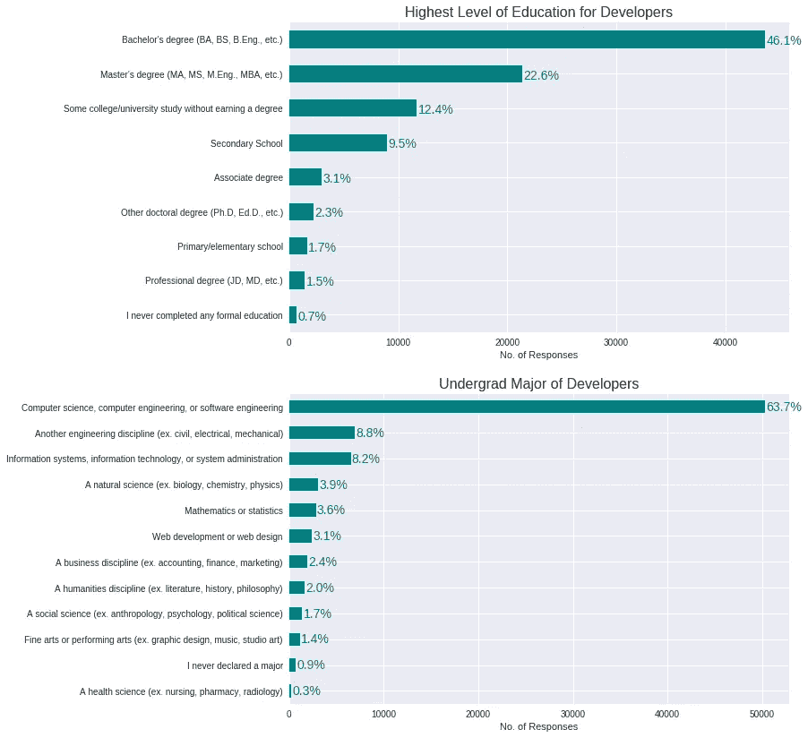

看起来调查中很大一部分开发人员至少拥有学士学位。看看他们的学士的专业类型，他们中的大多数来自**计算机科学/工程**背景就不足为奇了。那么其他教育背景的呢？有趣的是，9.5%的开发者只有中等学校教育。甚至更高的百分比， **12.4%** 的开发者是大学辍学生。

让我们探索一下训练营，看看毕业后找到一份工作通常需要多长时间:

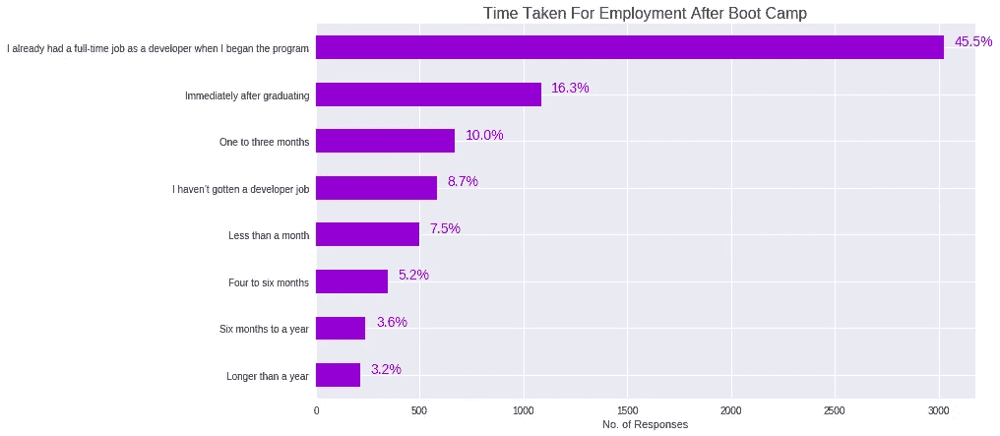

回答 bootcamp 问题的人的百分比相当低 **6%** ，可以得出的一个有趣的观察结果是，几乎一半的人**在他们开始这个项目的时候**已经有了一份全职开发人员的工作。但是好消息是，几乎所有的另一半都在毕业后的 6 个月内(T21)找到了工作。

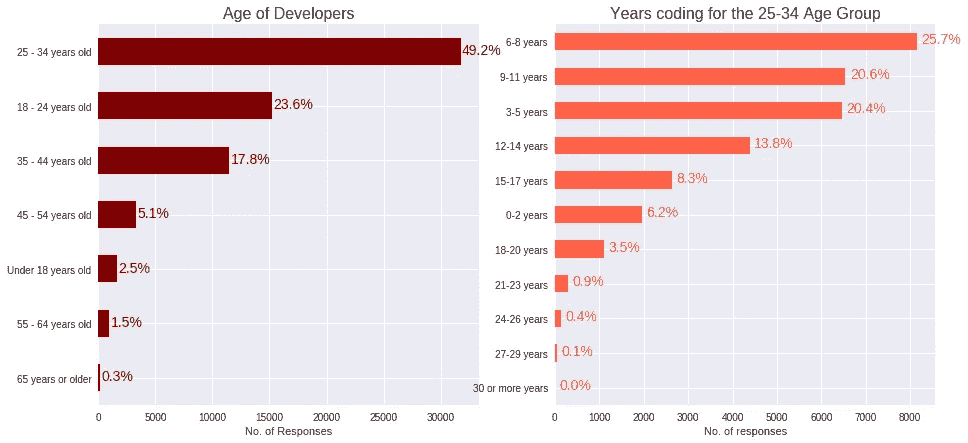

分析我们调查中最大的开发人员年龄组，即 25-34 岁的 T2 年龄组，他们中的四分之一在 T4 6-8 岁的 T7 年前开始编写代码。由于我们不知道确切的年龄，做一些假设，在最坏的情况下，我们可以有把握地说他们中至少有四分之一的人直到 17 岁才开始编码。

**他们中的 20%**3–5****年**一直在编码，这也有助于揭穿你必须从十几岁就开始编码的理论。**

****神话还是事实？****

**尽管该行业的大多数开发人员至少拥有大学学位，但仍有很多人没有。所以说你从 10 岁开始就已经是计算机专业的学生或者开始编程并不完全正确。**

****裁决:**神话**

# **2.你可以轻松赚到六位数的薪水**

**对获得六位数收入的迷恋也是另一件让投身软件行业变得相当有利可图的事情。但是赚这么多钱到底有多容易呢？**

**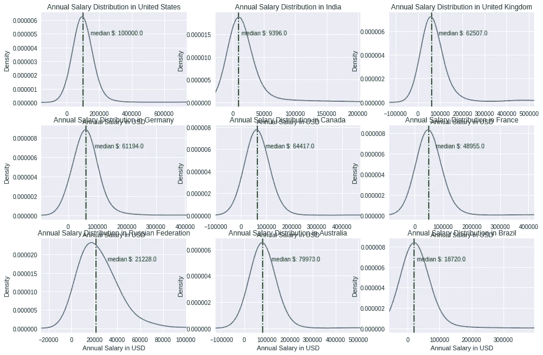**

**从上面的情节来看，如果你在美国，期待 10 万英镑并不是完全不合理的。根据汇率调整，我们可以看到，在其他国家，比如澳大利亚，挣六位数仍然很普遍。加拿大位居第二，中位数约为 8.5 万加元。**

**但是不同的开发人员类型工资相差多少呢？还是经历？**

**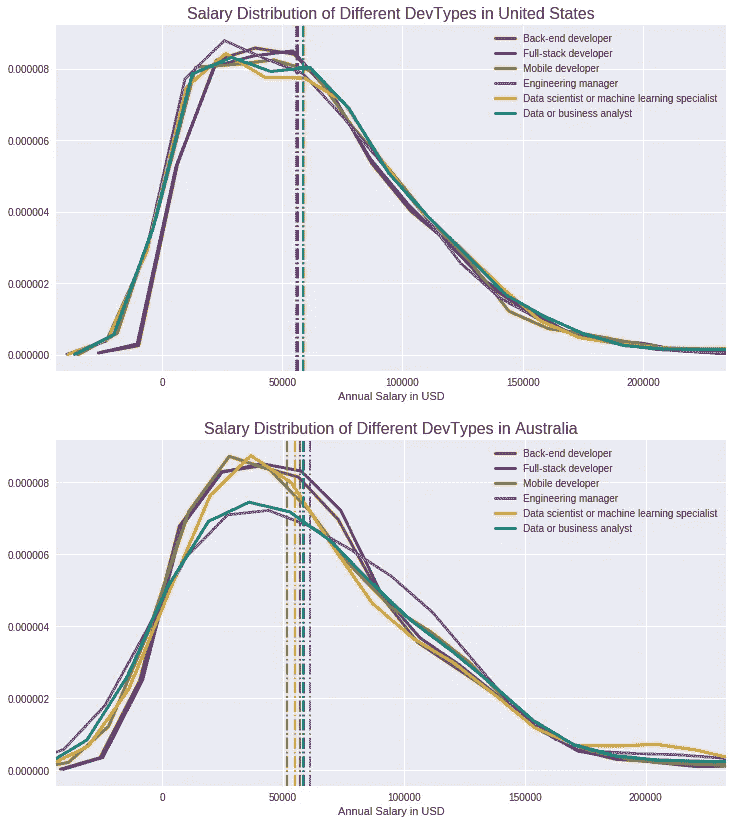**

**如果你在美国，不同类型的开发人员的薪资分布实际上非常相似。不同类型的开发人员的平均工资有很大的重叠。例如，**移动开发者**和**全栈开发者**享受着几乎相同的薪水。**

**事情在*略微*的不同下进行着。虽然不同专业的中位数都在一个狭窄的范围内徘徊，但与美国相比，差异更加明显。工程经理似乎享受着其他人当中最高的工资中位数。**

**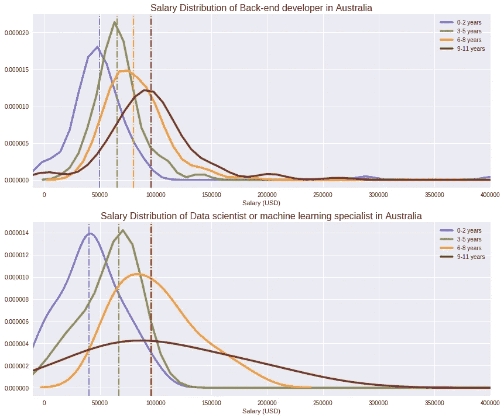**

**当考虑经验时，我们可以看到一个非常明显的趋势，随着经验的增加，中位数稳步增加。在澳大利亚，**数据科学家或机器学习专家**比**后端开发人员**的跳跃似乎更大，尽管一旦你有了**十年**的经验，他们会徘徊在相同的范围内。**

****神话还是事实？****

**如果你在美国，做软件开发赚 100k 绝对不是不合理的期望。即使在其他国家，比如澳大利亚，拿到六位数的工资仍然很常见。虽然你开始时的薪水可能会低得多，但数据告诉我们，你很快就会赚到六位数！**

****判决:**事实**

# **3.工作岗位比人多，所以软件开发人员可以经常跳槽**

**如果有这么多工作，开发人员可能会随时从一个工作换到下一个工作。为了了解这一点，让我们来看看他们最后一次加入新工作是什么时候:**

**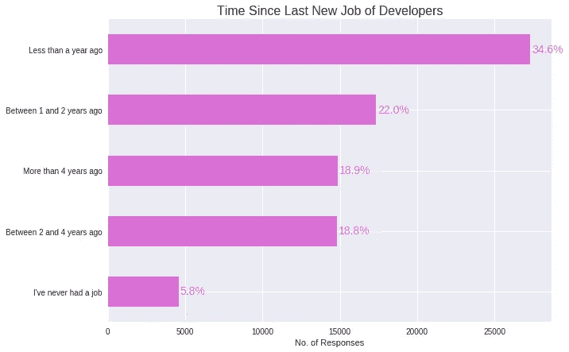**

**看起来调查中的大多数开发人员都刚刚加入了一家新公司。这真的证明了我们的理论吗？让我们来看看这些新雇佣的开发人员中有多少人已经在寻找他们的下一份工作:**

**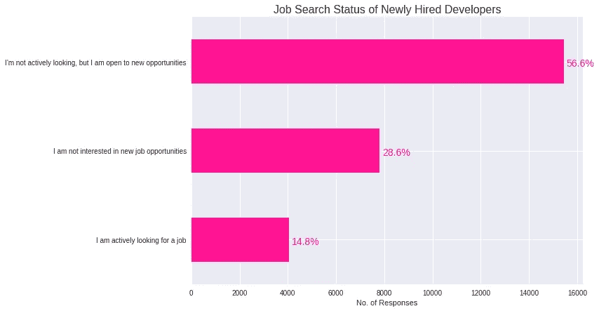**

**尽管**超过一半的**新雇佣的开发者并不积极寻找，但**仍然对这个想法持开放态度。****

**神话还是事实？**

**虽然本次调查中的大部分开发人员似乎在不到一年前刚刚加入一个新的角色，但他们仍然愿意寻找更好的东西。虽然这告诉了我们很多关于开发人员的求职行为，但它并没有真正帮助我们证明工作比人多。**

**结论:也许吧**

# **4.科技馆里全是男人**

**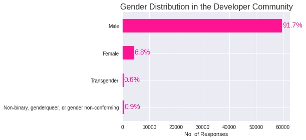**

**看来 tech 确实全是男的！在我们的调查中，超过 90%的回答来自男性，而女性的比例略低于 7%，其他人的比例加起来只有 1.5%。虽然这是世界范围内的现状，但性别多样性的缺乏在世界某些地区甚至更令人震惊。**

**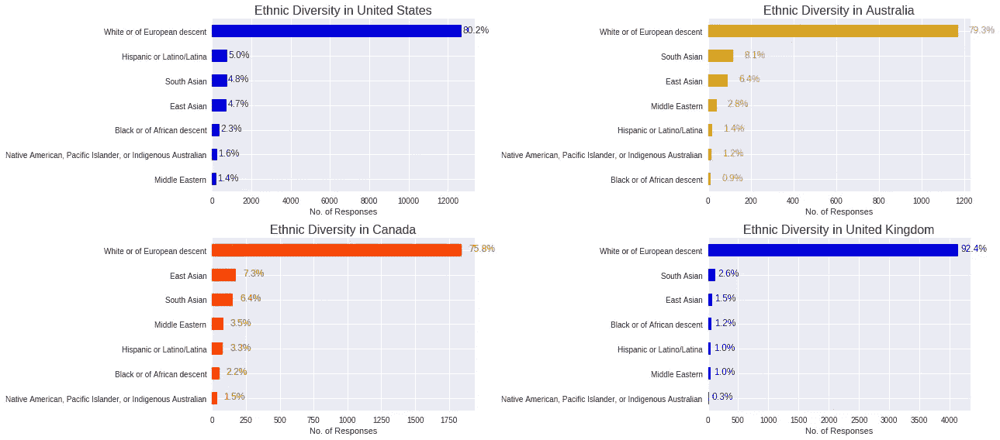**

**就种族多样性而言，在加拿大、美国、英国和澳大利亚中，**加拿大**领先，其次是澳大利亚、美国和英国。**

**说到多样性，人们可能会想，男女之间的薪酬是否有很大差异:**

**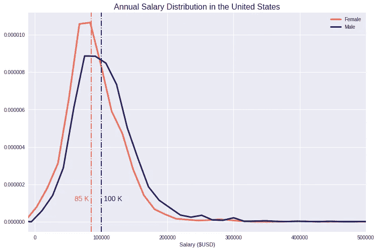**

**不足为奇的是(不幸的是),在美国，男性和女性的平均工资相差近 15000 美元。在确保男女同工同酬方面，我们还有很长的路要走。**

**神话还是事实？**

**男性确实构成了全球开发者群体的大多数。不仅科技行业充斥着男性，在像美国这样的国家，男女之间在经济补偿上也有很大的差异。**

**判决:事实**

**如果你仍然对科技职业感兴趣，还有很多可以探索！你可以在 GitHub 上浏览我的知识库[这里](https://github.com/ashiquem/data-stories/tree/master/stack_overflow)来自己处理数据。或者，你可以在 Stack Overflow [这里](https://insights.stackoverflow.com/survey/2018/)从令人惊叹的团队那里获得大量真知灼见。**