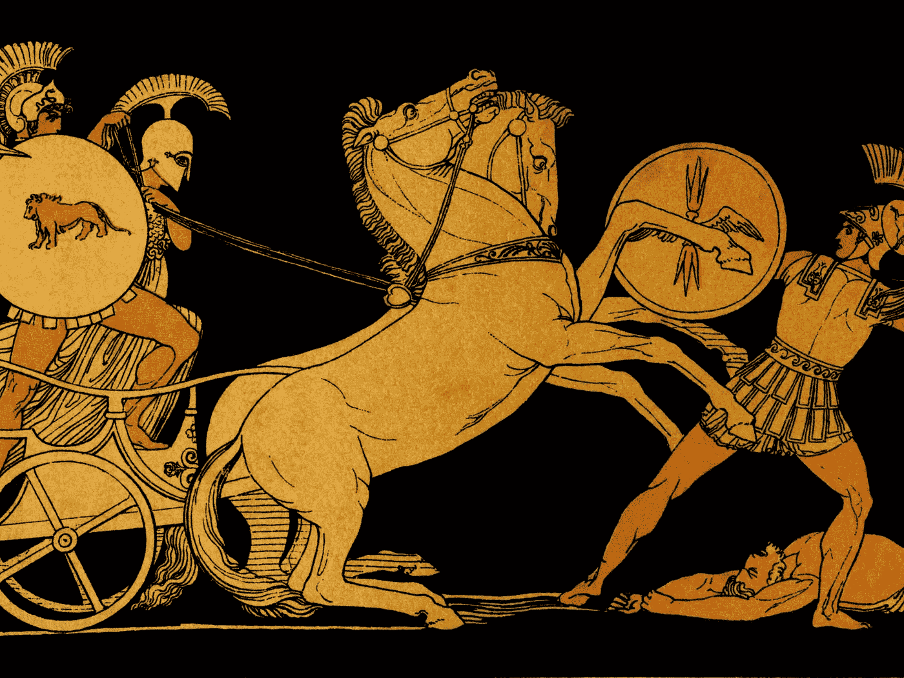

# 打破交易神话

> 原文：<https://medium.com/hackernoon/busting-trading-myths-e43b67e102fc>

## 想要生存和成功的交易者必须控制损失。

随着[加密货币](https://es.tradingview.com/markets/cryptocurrencies/prices-all/)的出现，大量没有经验的投资者开始交易。因此，骗子们认为这是他们闪光的时刻一点也不奇怪。结果，成百上千的电报组被创建，承诺一种秘密算法，让我们称之为奇迹 2.0，将一个人的回报乘以 10。

听起来可能很疯狂，许多新手实际上相信成功的交易者有一些秘密知识，不管市场发生什么，他们都可以保持下去。在现实中，这种幻想只是通过增加咨询服务和现成交易系统和机器人的销售，帮助“肮脏的玩家”在简单的男人身上赚钱。

正如美籍俄罗斯职业交易者和交易者教师亚历山大·埃尔德在他的书《T2》中所说，“他可能会给一个骗子 3000 美元的经过回溯测试的计算机化交易系统。当这种自我毁灭时，他又寄了一张“科学手册”的支票，解释他如何通过凝视月亮、土星甚至天王星，不再是失败者，而成为真正的圈内人和成功者。

许多新手也认为，如果他们有一个更大的账户，他们会交易成功。真正的问题是过度交易和草率的资金管理。

想要生存和成功的交易者必须控制损失。在任何一笔交易中，你只拿你的一小部分资产去冒险。

不管怎样，人们应该永远记住，市场总是在变化的。

"昨天的硬性规定今天不太管用，明天可能就失效了."

不要让骗子愚弄你。把你的空闲时间投入到了解你计划经营的市场中去。