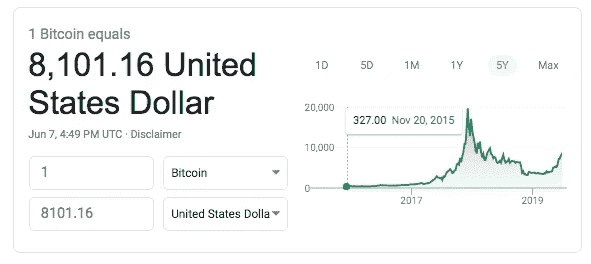

# 在高峰期购买比特币，而不是把钱存在银行

> 原文：<https://medium.com/hackernoon/buying-bitcoin-at-its-peak-vs-money-in-the-bank-e4b195b3fc08>

*嘿，*[*ut sav Jaiswal*](https://hackernoon.com/@utsavjaiswal1)*此处，* [*黑客正午的新(-ish)区块链编辑。*](https://hackernoon.com/meet-the-new-hacker-noon-editors-b37508a3e771)

*在深入讨论之前，我们想提醒您的是* [*任何人都可以在社区*](https://community.hackernoon.com/c/Crypto) *或* [*发起一个加密讨论主题，提交一个区块链或加密故事供审核*](https://contribute.hackernoon.com/) *(由我或其他编辑之一)在黑客中午* *发表。*

随着比特币在似乎是最长的间隔后突破 8000 美元，关于其效用、鲸鱼操纵价格以及合法性的讨论重新流行起来。

**虽然大部分的叙述和传播都是在** [**英文媒体出版物**](https://hackernoon.com/5-must-watch-ted-talks-on-bitcoin-blockchain-77f6d418c392) **上进行的，但有一股巨大的潜流，对比特币持有强烈的信念**。

如果你是阿根廷人、津巴布韦人或委内瑞拉人，比特币的表现会好于这些国家的货币。假设你在比特币价格见顶的当天——2017 年 12 月 17 日——购买了 1 枚比特币，你支付了 19783 美元(以美元计算)。

同一天，

1 美元= 17.45 里亚尔

1 美元= 9.97 VEF

快进到 2019 年，让我们看看图片显示了什么—

1 BTC = 8，741 美元

虽然，

1 美元= 44.71 里亚尔

1 美元= 248，488 VEF

考虑到截至 2018 年底，比特币钱包(不是用户)的总数量为 3200 万，大致相当于委内瑞拉的总人口。

> **因此，从技术上讲，比那些购买比特币的人更多的人遭受了委内瑞拉玻利瓦尔通货膨胀的影响，即使是在比特币的高峰期**。

客观地看，在比特币的巅峰时期购买比特币是比把它放在阿根廷银行收取利息更好的选择。比特币因波动性损失了约三分之一的价值，而阿根廷比索则因通胀损失了一半以上的购买力。

> 你们中的很多人可能会想到津巴布韦元，从长远来看，他们以前的 100 万亿美元纸币在停止流通时只值 40 美分。

尼日利亚是世界上人口第七多的国家，在这方面是一个奇怪的例子。由于频繁的价格操纵，他们的货币奈拉在国外很少有人问津。因此，为了从国外购买商品和服务，许多尼日利亚人发现使用比特币代替本国货币更快、更容易，最重要的是，更有利可图。尽管如此，作为价值储存手段，大多数政府货币在此期间的波动性都低于比特币。但不是全部。请记住，[比特币](https://hackernoon.com/tagged/bitcoin)是一场比价值储存更广泛的运动。

因此，如果你着眼于不久的将来，思考什么是比特币，你可以用它做什么，**看看我们关于比特币的一些顶级故事，作者是世界上最多产的比特币作家**:

# 金钱、不平等和匿名

从 17 世纪开始，随着金钱开始取代宗教成为权力的图腾， [**金钱的演变。第三集:罗斯柴尔德银行的幽灵威胁**](https://hackernoon.com/the-evolution-of-money-the-phantom-menace-of-the-rothschild-banking-episode-3-4f4bb8c812e1)【11 分钟阅读】作者 [**CryptoMedics 官方**](https://hackernoon.com/@cryptomedics) 带我们在导游的带领下，了解罗斯柴尔德家族的传奇历史及其对现代银行机构的影响。

作为现代银行体系的先驱之一——美第奇家族，比特币的崛起有一条熟悉的道路。查看 [**比特币的共同起源&美第奇家族**](https://hackernoon.com/bitcoin-medici-family-similarities-4096fa0ae3c9)**【6 分钟阅读】作者[**汤姆·尚特**](https://hackernoon.com/@tomchanter) 看看这两个实体是如何通过多样化和去中心化建立在现有基础设施上的。**

**如果比特币真的是匿名的，那么为什么人们会在每次交易前后混合他们的持有量。阅读 [**比特币与匿名:什么是比特币混合？为什么人们会使用它？**](https://hackernoon.com/anonymity-and-bitcoin-what-is-bitcoin-mixing-and-why-do-people-use-it-84c62ccb20c2)**【9 分钟阅读】通过 [**克拉克·韦恩**](https://hackernoon.com/@cryptomagis) 了解更多信息并了解原因。****

# ****比特币经济和技术****

****想知道比特币在经历和其他资产一样的考验和磨难后表现如何吗？阅读 [**这是我们的两个 Satoshis:比特币是风险资产还是避风港？**](https://hackernoon.com/thats-our-two-satoshis-is-bitcoin-a-risk-asset-and-a-safe-haven-7838856be526)【10 分钟阅读】作者 [**杰夫·多尔曼，CFA**](https://hackernoon.com/@jdorman81) 了解比特币如何在几乎所有方面都比其他货币表现更好。****

****[**神话&关于比特币的误解(最终)揭穿**](https://hackernoon.com/myths-misconceptions-about-bitcoin-finally-debunked-8eb33a90be9)**【6 分钟阅读】by**[**Crypterium**](https://hackernoon.com/@crypterium)是一个完整的流言终结者式的分析，分析了围绕比特币的最普遍和一些鲜为人知的误解。********

****在 [**比特币——不能被查封的资产**](https://hackernoon.com/bitcoin-the-unseizable-asset-ee108edcfe6e)**【5 分钟阅读】作者 [**雷恩·斯坦伯格**](https://hackernoon.com/@raynester) 中，我们读到了我们在比特币中的资产和所有权是如何被保护起来，以免被专制政府和独裁政权查封，从而减少对独裁者的经济诱惑。******

# ****是什么阻碍了比特币的发展？****

****三个 r—*监管、风险和认可*是比特币使用率仍低于 1%的主要原因。查看 [**人们仍然不买比特币的 6 个原因**](https://hackernoon.com/6-reasons-why-people-still-arent-buying-bitcoin-27c40f646617)【3 分钟阅读】by [**Oscar W**](https://hackernoon.com/@mywaymywei) 详细了解一下。****

****长期以来，可扩展性这个词一直是比特币和区块链的诋毁者的专用词。阅读 [**克里斯蒂安·德克尔——闪电网络介绍**](https://hackernoon.com/christian-decker-an-introduction-to-the-lightning-network-7041eaa4d0f8)【25 分钟阅读】，这是彼得·麦科马克 **关于让比特币变得可扩展的**播客的音频抄本。点击查看[彼得比特币访谈的其他文字记录。](https://hackernoon.com/@whatbitcoindid)****

****在 [**现在是 2019 年。哪里是我们的全球点对点电子现金系统？**](https://hackernoon.com/where-the-f-ck-is-our-peer-to-peer-electronic-cash-system-c8f43f5ad8b0)**【15 分钟阅读】， [**汤姆霍华德**](https://hackernoon.com/@_TomHoward) 回忆他与全球银行业的问题，比特币的主要反对者。阅读他对全球银行系统的爆笑咆哮，真正理解比特币面临的问题，以及为什么比特币的采用不是为什么的问题，而是何时的问题。******

# ****比特币驱动的未来会是什么样子？****

****[**亿万富翁离婚期间可以用比特币屏蔽财富吗？**](https://hackernoon.com/can-billionaires-use-bitcoin-to-shield-their-fortunes-during-divorce-92a3f6b8307b)**【3 分钟阅读】作者 [**维罗妮卡·帕穆卡莲·维耶拉**](https://hackernoon.com/@veronicapamoukaghlianviera) 想象着在备受关注的离婚案件中会发生什么，比如备受关注的杰夫·贝索斯离婚案，如果他投资的是比特币而不是法定储备。******

****[**比特币的未来会怎样？**](https://hackernoon.com/what-does-future-hold-for-bitcoin-4b193cbcebb7)【5 分钟阅读】作者 [**丹尼尔·阿尔卡尼亚**](https://hackernoon.com/@danielalcanja) 深入探讨了生活在一个比特币在全球范围内被普遍接受并且在 5 分钟内超越汇款的世界里会是什么样子。****

****[**比特币期货的幻影牛**](https://hackernoon.com/the-phantom-bull-of-bitcoin-futures-d18063a69974)**【5 分钟阅读】作者 [**杰西·劳勒**](https://hackernoon.com/@Lawlerpalooza) 可以用这个故事本身的一句话来概括，“如果你买苹果股票的期货，你就是在赌电脑、连接性、yada yada。如果你购买通用汽车的期货，你就是在赌汽车。有了比特币，你只是在赌市场越来越认识到固定供应的数字商品是一种魔法。这就是全部赌注。”******

# ******海盗 Beachbum 的比特币熊市日记******

****[**黑客 Noon 自己的海盗 Beachbum**](https://hackernoon.com/@piratebeachbum) 每周采访比特币最大化主义者和不信者。点击这里查看[摘录](https://hackernoon.com/excerpts-from-the-bitcoin-bear-market-diaries-2ccc213a74e6)【3 分钟阅读】。他的一些被广泛阅读的采访是:****

****[**《比特币熊市日记》第 23 卷**](https://hackernoon.com/bitcoin-bear-market-diaries-volume-23-with-ben-perrin-665521e69b6a)【8 分钟阅读】****

****[**【比特币熊市日记】第二十卷**](https://hackernoon.com/bitcoin-bear-market-diary-volume-20-with-jeremy-74f79f5b610)**【7 分钟阅读】******

******[**比特币熊市日记第 14 卷【同漩涡】**](https://hackernoon.com/bitcoin-bear-market-diaries-volume-14-with-vortex-b71c3c4aebf3)【6 分钟阅读】******

*****我们，在*[*hacker noon*](http://hackernoon.com)*，很高兴能为那些参与区块链解决方案开发的人提供一个讨论的平台。您可以通过查看我们的* [*投稿人在区块链科技*](https://hackernoon.com/blockchain/home) *上的故事来成为讨论的一部分，并且记住* [*任何人都可以在社区*](https://community.hackernoon.com/c/Crypto) *或* [*中发起一个加密讨论主题，提交一个区块链或加密故事供审核*](https://contribute.hackernoon.com/) *(由我或其他编辑之一)在黑客中午* [*发表*](https://contribute.hackernoon.com/)****